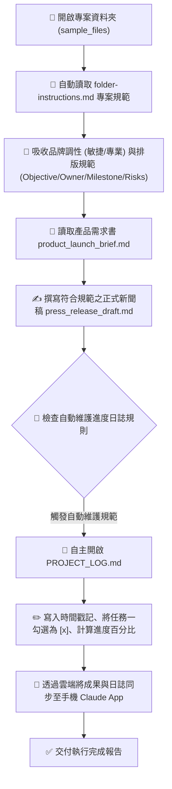

# 🎯 範例 5：資料夾指令規範、專案日誌自主維護與跨裝置無縫接續

> 🔴 **難度等級**：**Level 5（終極代理・專案自治中樞）**  
> 💻 **適用平台**：Claude 全平台（Desktop / Web / Mobile / Chrome 側邊欄）  
> 💼 **適用角色**：專案總監 (PMO)、產品行銷主管 (PMM)、品牌公關總監、創業團隊負責人。  
> 🎯 **核心體驗**：
> - 🎯 **資料夾專屬指令 (Folder Instructions)**：賦予特定資料夾「永久靈魂與記憶」，自動約束品牌語氣、排版規章，無需在每次對話重複贅述。
> - 📝 **專案進度日誌自主維護 (Self-Maintaining Project Log)**：**極具自主性的 Agent 特徵！** 每次任務完成後，Claude 會自主開啟並更新 `PROJECT_LOG.md`，自動打勾完成里程碑、記錄時間戳記與摘要。
> - 📱 **跨裝置無縫接續 (Work from Anywhere)**：在辦公室電腦啟動專案，出門在手機 App 檢視進度與給予回饋，回家打開筆電一鍵收成。

---

## 🎭 職場痛點劇場：重複說明的疲憊與版本混亂

> *「每次為了新產品上線發布打開 AI，你都得把同一段話打一次：『我們是 B2B 科技品牌、調性要敏捷專業不可浮誇、章節要有 Owner 和風險評估……』」*  
> *更崩潰的是，一個多星期的專案跑下來，產生了十幾份檔案，你根本記不清哪一份是最新版、哪一項任務已經完成，還得花額外時間手動維護 Excel 專案進度表。*  
> *下班搭車時，主管突然傳訊追問進度，你只能乾等回家開筆電……*

**現在，讓 Claude Cowork 將你的專案資料夾升級為「具備長效記憶與自主維護能力的智慧中樞」！**

---

## 🔄 執行前後視覺化對比 (Before vs. After)

```
【執行前：只有規範與初始需求】
sample_files/
├── folder-instructions.md     (定義品牌語氣、四章節排版、自動更新日誌規則)
├── product_launch_brief.md    (新產品上線需求書)
└── PROJECT_LOG.md             (初始狀態：進度 0%，里程碑皆為 [ ])

                ⬇️ 透過 Claude Cowork 自主理解並執行 ⬇️

【執行後：產出符合規範之公關草案，並自主更新專案日誌】
sample_files/
├── folder-instructions.md
├── product_launch_brief.md
├── press_release_draft.md     ⭐【新生成！完全符合 4 大章節與專業語氣】
└── PROJECT_LOG.md             ⭐【自動更新！進度提升至 33%，自動勾選已完成】
    ├── 紀錄歷史：新增 2026-09-12 執行紀錄與產生 press_release_draft.md
    └── 里程碑狀態：
        - [x] 任務一：新聞稿草案撰寫 (由 Claude 自主打勾完成！)
        - [ ] 任務二：社群推廣規劃
        - [ ] 任務三：Sales Battlecard 製作
```

---

## 🧠 Cowork 代理執行管線 (Agent Execution Pipeline)



---

## 🖥️ Cowork 擬真執行面板預覽 (What You Will See)

```console
🤝 [Claude Cowork] Target: SmartFlow AI 產品發布專案
────────────────────────────────────────────────────────
➜ 🎯 Applied folder-instructions.md:
  • Tone: Professional, B2B Agile (No clickbait)
  • Structure: Must include Objective, Owner, Risks
  • Auto-Log: Enabled
➜ 📄 Reading product_launch_brief.md...
➜ ✍️ Writing press_release_draft.md (4 sections)...
➜ 📝 Auto-Maintaining PROJECT_LOG.md:
  • Appended timestamp: 2026-09-12 10:15
  • Marked [x] 任務一：新聞稿草案撰寫
  • Updated Overall Progress: 0% -> 33%
✨ Completed! Files synced to Cloud & Mobile.
────────────────────────────────────────────────────────
Status: Task completed successfully.
```

---

## 🤖 Cowork 實戰 Prompt（RTCCF 結構）

在 **Cowork 模式** 下開啟此資料夾（或上傳本範例練習檔案），輸入以下極簡 Prompt——請特別留意：**我們完全不需要在 Prompt 裡重複說明品牌語氣與排版規定，因為資料夾指令已全權代勞！**

```text
【Role】
你是一名資深科技產品行銷經理 (PMM) 與公關策略總監。

【Task】
請讀取 product_launch_brief.md，並嚴格遵循 folder-instructions.md 中的專案規範執行以下任務：
1. 為 SmartFlow AI 撰寫一份正式對外發布的新聞稿草稿，命名為 press_release_draft.md 存入本目錄中。
2. 新聞稿架構與語氣必須百分之百符合 folder-instructions.md 的 4 大核心結構（包含 🎯 Objective、👥 Owner、⏱️ Milestone 與 ⚠️ Risks & Mitigations）。
3. 任務完成後，務必落實自動維護規範：主動開啟並更新 PROJECT_LOG.md，將【任務一：新聞稿草案撰寫】標記為已完成 [x]，更新進度百分比，並追加一筆包含時間戳記與執行摘要的歷史記錄。

【Context】
- 資料夾指令：folder-instructions.md
- 專案需求書：product_launch_brief.md
- 專案進度表：PROJECT_LOG.md

【Constraint】
- 語氣必須精準符合 folder-instructions.md 規定之「專業、敏捷、充滿前瞻感，嚴禁浮誇」。
- 必須主動落實自動維護進度筆記規則，更新 PROJECT_LOG.md。
- 使用繁體中文輸出。

【Format】
完成後，產出 press_release_draft.md 草稿，並展示更新後的 PROJECT_LOG.md 內容。
```

---

## 🚀 終極代理實戰動手做 3 步驟

### 步驟 1：親眼見證「自主維護日誌」的震撼
- 貼上 Prompt 送出後，觀察進度串流。
- 任務結束後，親自點開 [`sample_files/PROJECT_LOG.md`](./sample_files/PROJECT_LOG.md)：
  你會發現 Claude **完全不需要你第二次指令提醒**，就自動在表格末尾追加了剛剛執行的紀錄，並將任務一打上了漂亮的 `[x]`！這就是自主代理人（Agentic Workflow）的強大魅力！

### 步驟 2：體驗「原地反白微調 (Edit Drafts in Place)」
- 點開產出的 `press_release_draft.md`：
  1. 反白選取「⚠️ 潛在風險與防禦對策 (Risks & Mitigations)」段落；
  2. 點擊浮現的 **「Edit with Claude」** 按鈕；
  3. 輸入指令：*「補充一條防禦措施：若公有雲服務延遲超過 200ms，系統自動降級至邊緣快取節點」*；
  4. 觀察 Claude 原地完成文字重構，其餘段落絲毫不受影響！

### 步驟 3：體驗「跨裝置無縫接續 (Work from Anywhere)」
1. 在辦公室電腦啟動任務後，闔上筆電；
2. 走出門搭車時，打開手機上的 **Claude App**；
3. 點進同一個 Cowork Session，你會看到剛剛在電腦上產出的草案與日誌已經完整呈現在手機畫面上；
4. 在手機直接語音輸入：「*請接著幫我準備任務二的社群推廣文案大綱*」；
5. 回到家打開另一台電腦的瀏覽器，任務已自動推進，專案日誌也同步累積！

---

## 💡 避坑指南與核心收穫 (Tips & Takeaways)

> [!TIP]
> 1. **什麼是 Folder Instructions 的最佳實踐？**  
>    將不常變動的「團隊協作規範、品牌調性、禁止使用的敏感字、日誌更新格式」寫在 `folder-instructions.md` 中。這相當於為該專案建立了長期的 **System Prompt**。
> 2. **日誌是長效記憶庫**：  
>    隨著專案時間拉長（2 週至 1 個月），每次開啟新任務時，Claude 只要先看一眼 `PROJECT_LOG.md`，就能立即掌握過去所有同仁或自己的執行背景，杜絕上下文丟失。
> 3. **與 Cursor / Git 協同工作**：  
>    這些由 Cowork 產出的 Markdown 檔案與日誌，皆為乾淨的標準文字檔，可以直接納入 Git 進行版本控制或在任何 Markdown 編輯器中無縫使用。

---

[← 上一篇：範例 4 每日情報監測與定時排程](../04_Daily_News_Brief/) ｜ [返回 Cowork 主頁](../../README.md) ｜ 🏠 [返回專案總首頁](../../../README.md)
