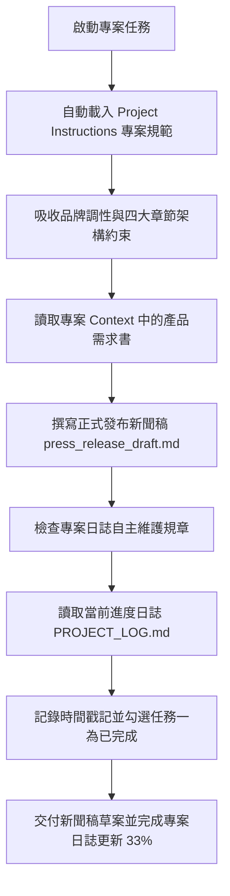

# 🎯 範例 5：雲端專案規範、日誌自主維護與跨裝置自治中樞

> 🔴 **難度等級**：**Level 5（終極代理・專案自治中樞）**  
> 💻 **適用平台**：Claude 全平台（Desktop / Web / Mobile / Chrome 側邊欄）  
> 💼 **適用角色**：專案總監 (PMO)、產品行銷主管 (PMM)、品牌公關總監、創業團隊負責人。  
> 🎯 **核心體驗**：
> - 🏢 **雲端專案自治體系 (Claude Projects)**：徹底搞懂「專案 (Project)」與「對話 (Chat)」的階層關係，打造具備規範約束與資產管理的智慧中樞。
> - 🎯 **永久專案指示 (Project Instructions)**：將品牌調性、四章節排版與自動日誌規章注入專案大腦，專案下的所有對話自動繼承，告別每次重複貼 Prompt 的疲憊。
> - 📝 **專案進度日誌自主維護 (Self-Maintaining Project Log)**：**極具自主性的 Agent 特徵！** 每次任務完成後，Claude 自主讀取並更新 `PROJECT_LOG.md`，自動打勾完成里程碑、記錄時間戳記。
> - 📱 **跨裝置無縫接續 (Work from Anywhere)**：在辦公室電腦啟動專案，出門在手機 App 檢視進度與給予回饋，隨時隨地無縫推進。

---

## 🔍 觀念釐清：搞懂 Claude「專案 (Project)」與「對話 (Chat)」的關係

許多人在初次使用 Claude Projects 時常會感到困惑：「為什麼左邊的專案底下又有一個縮排項目？那是不是子專案？為什麼下面又有一個 Chats and tasks？」

請看以下結構圖，一次搞懂階層關係：

```
左側導覽列架構解析
┌────────────────────────────────────────────────────────┐
│ Projects                                             ➕│  👈 專案分類區
│ 🗃️ SmartFlow AI 上線發布專案（母專案空間）               │  👈 專案工作站（共享 Instructions 與 Context）
│    ⚪ SmartFlow AI 新聞稿草案                           │  👈 這是「專案底下的對話」，不是子專案！
│    ⚪ 社群貼文排程規劃                                 │  👈 同專案下的第二個對話（未來任務）
│    ⚪ 業務銷售簡報製作                                 │  👈 同專案下的第三個對話（未來任務）
├────────────────────────────────────────────────────────┤
│ Chats and tasks                                      🔍│  👈 全域最近對話歷史（Recent History）
│ ⚪ SmartFlow AI 新聞稿草案                             │  👈 按「最近使用時間」排列，方便快速切換
│ ⚪ 每日產業情報簡報                                     │
│ ⚪ Q3 財務營運分析報告                                 │
└────────────────────────────────────────────────────────┘
```

* **專案 (Project)**：就像一間「專屬辦公室」，負責保管專案專屬的 **Instructions（工作規範）** 與 **Context（參考文件）**。
* **縮排的項目**：是您在這間辦公室裡開立的**「各項任務對話 (Chat / Task)」**。一個專案底下可以開立多個對話，它們都會自動繼承這間辦公室的規範！
* **下方的 `Chats and tasks`**：則是所有對話的**「時間軸歷史清單」**，依最新使用時間排列，方便快速切換。

---

## 🏛️ 專案管理面板的四大支柱

進入專案後，右側管理面板為專案提供了四大核心功能：

```
┌────────────────────────────────────────────────────────┐
│ Instructions                                         ➕│
│ 專案憲法：定義角色、品牌語氣、排版格式與自動日誌規章   │
├────────────────────────────────────────────────────────┤
│ Memory                                       🔒Only you│
│ 專案記憶：Claude 隨對話累積的互動偏好與背景資訊        │
├────────────────────────────────────────────────────────┤
│ Context                                              ➕│
│ 專案知識庫：包含專案連結的資料夾、需求書與進度日誌檔案 │
├────────────────────────────────────────────────────────┤
│ Scheduled                                            ➕│
│ 專案定時排程：設定定時自動觸發的任務                   │
└────────────────────────────────────────────────────────┘
```

> [!WARNING]
> ⚠️ **常見新手坑：為什麼 Claude 會說「專案文件列表是空的 (0 份文件)」？**  
> 如果您剛建立好專案就直接發送任務，Claude 找不到檔案是因為**右側的 `Context` 還是空的**！  
> 只要在建立專案時按 **`+ Use a folder`**（或在右側 Context 點擊 **`+`** 加入檔案），讓專案具備 `product_launch_brief.md` 與 `PROJECT_LOG.md`，Claude 就能順利讀取並執行！

---

## 📦 快速開始：下載練習素材壓縮檔 (Quick Download)

> [!TIP]
> 💡 **免手動建立！已為您打包完整測試素材壓縮檔**：  
> 本範例已在目錄中預先準備好打包好的壓縮檔：[`sample_files.zip`](./sample_files.zip)  
> - **直接下載**：學員可直接下載此 `sample_files.zip`，解壓縮後即可獲得包含 `sample_files/` 完整測試目錄：
>   - `folder-instructions.md`（定義品牌語氣、四章節排版、自動更新日誌規則）
>   - `product_launch_brief.md`（新產品上線需求書）
>   - `PROJECT_LOG.md`（初始狀態：進度 0%，里程碑皆為 `[ ]`）
> - **一鍵還原環境**：在練習完公關稿撰寫與日誌自動打勾後，若想重新演練，只需再次解壓縮 `sample_files.zip` 覆蓋，即可秒速重置至最乾淨的初始狀態！

---

## 🔄 執行前後視覺化對比 (Before vs. After)

```
【執行前：只有初始需求與空白進度】
sample_files/
├── folder-instructions.md        (定義品牌語氣、四章節排版、自動更新日誌規則)
├── product_launch_brief.md       (新產品上線需求書)
└── PROJECT_LOG.md                (初始狀態：進度 0%，里程碑皆為 [ ])

            ⬇️ 透過 Claude 專案指示約束與 Cowork 自主執行 ⬇️

【執行後：產出符合專案規範之公關草案，並自主更新專案進度日誌】
├── press_release_draft.md        ⭐【新生成！完全符合 4 大章節與專業語氣】
└── PROJECT_LOG.md                ⭐【自動更新！進度提升至 33%，自動勾選已完成】
    ├── 紀錄歷史：新增執行紀錄與產生 press_release_draft.md
    └── 里程碑狀態：
        - [x] 任務一：新聞稿草案撰寫 (由 Claude 自主打勾完成！)
        - [ ] 任務二：社群推廣規劃
        - [ ] 任務三：Sales Battlecard 製作
```

---

## 🧠 專案代理執行管線 (Project Agent Execution Pipeline)



---

## 🤖 專案實戰 Prompt（RTCCF 結構）

在專案內發起任務對話時，輸入以下極簡 Prompt——**我們完全不需要在 Prompt 裡重複說明品牌語氣與排版規定，因為專案指示已全權代勞！**

```markdown
## Role
你是一名**資深科技產品行銷經理 (PMM)** 與**公關策略總監**。

## Task
請讀取專案內的 **`product_launch_brief.md`**，並嚴格遵循專案規範執行以下任務：
1. 為 SmartFlow AI 撰寫一份正式對外發布的新聞稿草稿，命名為 **`press_release_draft.md`**。
2. 新聞稿架構與語氣必須百分之百符合專案規範的 4 大核心結構（包含 🎯 Objective、👥 Owner、⏱️ Milestone 與 ⚠️ Risks & Mitigations）。
3. 任務完成後，務必落實自動維護規範：主動開啟並更新專案內的 **`PROJECT_LOG.md`**，將 **任務一：新聞稿草案撰寫** 標記為已完成 **`[x]`**，進度更新為 **33%**，並追加一筆包含時間戳記與執行摘要的歷史記錄。

## Context
- 專案需求書：`product_launch_brief.md`
- 專案進度表：`PROJECT_LOG.md`

## Constraint
- 語氣必須精準符合規範規定之 **專業、敏捷、充滿前瞻感，嚴禁浮誇**。
- 必須 **主動落實自動維護進度筆記規則**，更新 `PROJECT_LOG.md`。
- 使用**繁體中文**輸出。

## Format
完成後，交付 **`press_release_draft.md`** 草稿，並展示更新後的 **`PROJECT_LOG.md`** 內容。
```

---

## 🚀 專案實戰動手做：四步建立專案自治中樞

跟隨以下四個步驟，一步步完成專案建立與自動日誌打勾演練：

### 步驟 1：下載練習素材
1. 下載並解壓縮 [`sample_files.zip`](./sample_files.zip)。
2. 確認解壓出的 `sample_files/` 資料夾內包含：
   - `folder-instructions.md`
   - `product_launch_brief.md`
   - `PROJECT_LOG.md`

### 步驟 2：建立專案並加入資料夾
1. 在 Claude 輸入框下方點擊 **`Project or folder`**（預設顯示 `Auto`）。
2. 在選單底部點選 **`+ New project`**，彈出 **「Create a project」** 對話框：
   - **What are you working on?**：填入專案名稱 `SmartFlow AI 上線發布專案`。
   - **What are you trying to achieve?**：填入簡要宗旨（例如：`SmartFlow AI 產品發布與專案日誌自治維護`）。
   - ⭐ **重要一步（加入檔案）**：點擊對話框下方的 **`+ Use a folder`** 按鈕，選取解壓縮後的 `sample_files` 資料夾！
   - 點擊 **`Create project`** 建立。

### 步驟 3：設定專案長效指示 (Instructions)
1. 進入建立好的專案首頁，檢視右側面板頂部的 **`Instructions`**。
2. 點擊 **`+`**（或 Add instructions），將 `sample_files/folder-instructions.md` 中的內容貼入並儲存：
   - **品牌調性**：敏捷、專業、前瞻、嚴禁浮誇。
   - **排版架構**：必須包含 🎯 Objective、👥 Owner、⏱️ Milestone、⚠️ Risks & Mitigations 四大章節。
   - **日誌規章**：任務完成後必須主動更新 `PROJECT_LOG.md`，打勾任務並記錄時間戳記。
3. 儲存後，該專案下的每一個對話都將永久受此約束！

### 步驟 4：在專案內發起任務，驗證自治成果
1. 在專案首頁的對話輸入框中，切換為 **Cowork** 模式。
2. 貼上上述 **RTCCF 實戰 Prompt** 送出。
3. **驗證專案自治成果**：
   - **公關新聞稿**：嚴格遵循四大章節架構，自動產出 `press_release_draft.md`。
   - **進度日誌自動打勾**：Claude 主動更新 `PROJECT_LOG.md`，將「任務一：新聞稿草案撰寫」勾選為 `[x]`，進度升為 **33%**，並記錄了執行時間戳記！

---

## 💡 專案自治的核心價值與避坑總結 (Tips & Takeaways)

> [!IMPORTANT]
> 1. **專案 (Project) vs. 對話 (Chat)**：  
>    一個專案就像一個專案工作小組，裡面可以針對不同任務開啟很多個對話。所有對話共享同一份 Instructions 與 Context 資料，再也不用每次開新對話都重新教育 AI！
> 2. **為什麼要建立專案進度日誌 (Self-Logging)？**  
>    讓 AI 自動在產出成果後主動更新進度日誌（Self-reflection & Self-logging），是現代自主代理（Agentic AI）與傳統單次對話機器人最大的差別。團隊隨時打開 `PROJECT_LOG.md`，就能對專案當前進度與里程碑一目了然。
> 3. **隨時一鍵還原演練環境**：  
>    若在多次演練日誌打勾後想重新演練或重設進度為 0%，只需再次解壓縮目錄內的 [`sample_files.zip`](./sample_files.zip) 覆蓋，即可秒速還原初始狀態！

---

[← 上一篇：範例 4 產業情報監測與定時晨報](../04_Daily_News_Brief/) ｜ [返回 Cowork 主頁](../../README.md)
