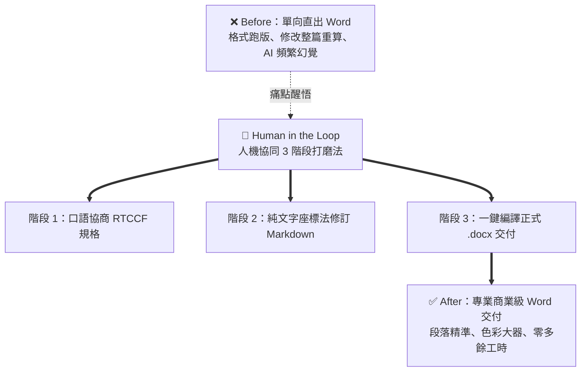

# 🟢 Level 1 實戰：Word (DOCX) 商業企劃書與 SOP 矩陣 📄

> **學習階段**：🟢 Level 1（新手小白友善）　|　**預計實作時間**：15 分鐘  
> **核心目標**：告別叫 AI 直出 Word 導致的「格式死板、修一處整篇重寫」痛點；掌握「先協商 RTCCF ➔ 中間打磨 Markdown ➔ 定稿一鍵編譯正式 .docx」的人機協同工作流。

---

## 📥 學生課堂實作檔案下載區

在開始前，請點擊下方連結預覽並下載本次練習所需的模擬檔案（右鍵「另存連結為...」或點開後複製）：

| 檔案類型 | 檔案名稱（點擊直接下載/檢視） | 檔案說明與用途 | 在協作流程中的角色 |
| :---: | :---| :---| :---|
| 📝 **Markdown** | [**企劃需求口語草稿_打磨前.md**](./sample_files/企劃需求口語草稿_打磨前.md) | 行銷主管錄音記錄的口語發想草稿與雜訊需求。 | 階段一：口語提供給 AI 協商 RTCCF |
| 📋 **Markdown** | [**發表會企劃書定稿_Markdown打磨後.md**](./sample_files/發表會企劃書定稿_Markdown打磨後.md) | 經 3 輪標題座標法局部微調後的高結構化定稿。 | 階段二：確認無誤之最終純文字底稿 |
| 📄 **Word (.docx)** | [**星橋科技_2026年度旗艦新品發表會企劃書.docx**](./sample_files/星橋科技_2026年度旗艦新品發表會企劃書.docx) | 透過 Python 程式碼執行動態編譯產出之高質感 Word 成品。 | 階段三：正式對外交付之高階排版成果 |
| 📜 **Prompt** | [**HITL_Prompt_Workflow.md**](./HITL_Prompt_Workflow.md) | 本單元一鍵複製之完整提示詞與對話話術庫。 | 全程對照貼入使用 |

---

## 📖 情境故事

行銷總監志偉要在兩週後籌備星橋科技年度旗艦「OmniFlow 3.0」線上直播發表會。他需要向執行長與全體跨部門專案小組提交一份正式的**商業企劃書**。

過去志偉的使用習慣是直接在 AI 輸入框丟一句：  
*「請幫我寫一份新品發表會企劃書，直接給我 Word 檔。」*  
結果 AI 產出的 Word 檔：開場廢話連篇、塞滿無趣的硬體參數、完全沒有安排直播互動，最慘的是當志偉要求「幫我把流程改短一點」，AI 竟然整篇打掉重新生成，原本寫得好的受眾分析直接消失！

現在，志偉導入 **Human-in-the-Loop（人機協同）工作流**：
1. **口語協商**：先用平易近人的對話，讓 Claude 幫忙梳理出包含 Role/Task/Context/Constraint/Format 的 RTCCF 提示詞。
2. **純文字打磨**：要求 Claude 先以 Markdown 輸出至 Artifacts 獨立畫布。志偉扮演「機長」，運用**標題座標法**下指令精修流程、追加 SOP 應變表格。
3. **一鍵編譯成檔**：純文字打磨完美後，下達轉檔指令，Claude 自動啟動程式碼執行，產出具備企業海軍藍配色、斑馬紋表格與頁首頁尾的高質感 `.docx` 檔案！

---

## 🛠️ Step-by-Step 人機協作流程

### 第一步：口語協商 RTCCF（自然語言發想）
1. 打開 Claude 聊天室（Chats）或專案（Projects）。
2. 打開 [企劃需求口語草稿_打磨前.md](./sample_files/企劃需求口語草稿_打磨前.md)，複製文字或直接貼入以下指令：
   ```text
   我們品牌預計在 2026 年 4 月舉辦一場「OmniFlow 3.0 線上新品發表會」，時長約 75 分鐘，目標是解決職場人士「使用 AI 報告改到崩潰」的痛點。
   這份企劃書最後需要產出為一份正式的高階 Word 文件（.docx）呈報給執行長。
   請先不要急著寫企劃書內文，請先用繁體中文扮演資深活動總監，幫我整理出一份專業的 RTCCF (Role, Task, Context, Constraint, Format) 提示詞架構，並在 Format 中要求先輸出結構化 Markdown。
   ```
3. Claude 會主動拆解出五大要素。你可以在對話中微調受眾設定與關鍵指標。

### 第二步：純文字多輪打磨（標題座標法精修）
1. 將確認好的 RTCCF Prompt 送出，Claude 會在右側 Artifacts 畫布展開結構化 Markdown 初稿。
2. **標題座標法微調時程**：在左側對話框輸入：
   ```text
   企劃初稿架構很棒！請保持其他章節完全不變，專門針對【三、 75 分鐘活動流程與節目時序】進行微調：
   開場 5 分鐘後立刻安排抽獎送前 100 名早鳥折扣券；技術主題演講濃縮在 15 分鐘內；中間加入 20 分鐘無劇本實機 Live Demo 展示 5 分鐘出報表，最後保留充足 15 分鐘線上問答。請只更新該時序表格即可。
   ```
3. **追加實用 SOP 模組**：接著在對話框輸入：
   ```text
   很好！為了確保現場執行萬無一失：
   請在企劃書文末新增【四、 現場突發狀況應變 SOP 矩陣】，以 Markdown 表格呈現，列出「主串流斷線（高危）」、「Live Demo 伺服器逾時（中危）」與「音訊雜音爆音（輕度）」三種情況的徵兆判斷、立即 SOP 處置流程與緊急權責窗口。
   ```
4. 右側畫布原地更新，若對修改不滿意，隨時點擊畫布右上角的版本紀錄（Version History）無損回退。

### 第三步：定稿一鍵編譯為排版級 Word (.docx)
當 Markdown 內容確認無誤後，輸入最後交付指令：
```text
這份企劃書的 Markdown 內容已經過我們討論定稿，架構與細節非常完美！
請啟用 Python 程式碼執行（或文件產出能力），將我們剛才定稿的 Markdown 內容，製作成一份排版精美的高階 Word 檔案（.docx）供我下載：
1. 包含精美封面標題與副標題，採用沉穩科技海軍藍（#1E3A8A）主題配色。
2. 表格表頭需有深色底色與白色粗體字，交替列加入淺色斑馬紋。
3. 頁首註明「星橋科技股份有限公司 | 內部機密商業企劃書」，頁尾居中顯示「機密等級：內部限閱」。
4. 核心原則處設計為淺藍色帶邊框的重點引言方塊（Callout Box）。
```
點擊 Claude 產生的下載連結，即可下載與 [星橋科技_2026年度旗艦新品發表會企劃書.docx](./sample_files/星橋科技_2026年度旗艦新品發表會企劃書.docx) 完全一致的高品質 Word 檔案！

---

## 🧪 學生實測三部曲成果驗收



### 成果驗收檢核表
- [ ] **是否經歷規格對齊**：是否在正式產出前，先由 AI 協助產出 RTCCF 框架，而不是一句話丟給模型瞎猜？
- [ ] **是否落實純文字打磨**：是否在 Markdown 階段完成時序流程微調與 SOP 矩陣追加，避免在二進位 Word 檔上改到抓狂？
- [ ] **成品品質查驗**：打開下載的 `.docx`，是否有海軍藍標題階層、帶背景色的表格與專業頁首頁尾？

---

← [返回討論方式的內容生成總覽](../../README.md) ｜ [下一課：🔵 Level 2 Excel 財務損益試算表 →](../02_Xlsx_Financial_Budget_Model/README.md)
