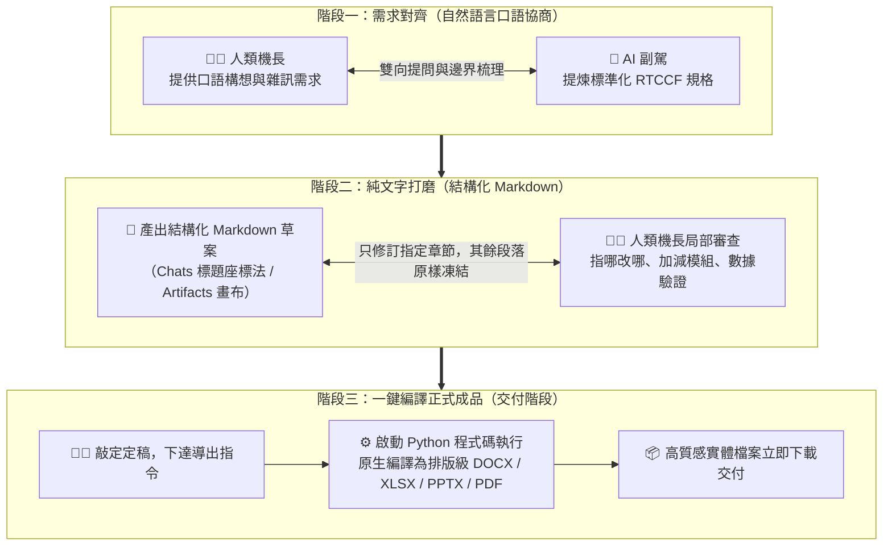
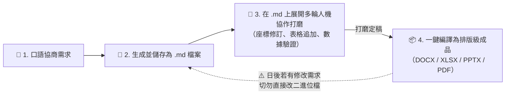

# 01. 人機協作 (Human-in-the-Loop) 核心心法：告別黑箱通靈，機長與副駕協同模型

> 💡 **學習目標**：理解為什麼傳統「單向一次性生成」必然在職場翻車，掌握「人是機長、AI 是副駕」的雙向對齊心法，以及為什麼「中間打磨純文字 Markdown、最後一鍵出成品」是最高效的生產力法則。

---

## 🧐 為什麼「單向一次性生成」在職場必然翻車？

許多職場學員在接觸生成式 AI 時，最常採取的心態是「把 AI 當通靈神仙」：

```text
❌ 單向黑箱模式（Black-box Generation）：
你：「請幫我寫一份新產品發表會企劃書，直接做成 Word 檔給我。」
AI ➔ （在黑箱中自行猜測所有背景、受眾、時程、預算與格式）
AI ➔ 產出一份二進位 .docx 檔案。
結果：你打開一看，方向完全偏離，你要求它修改，它整篇打掉重新生成，原本滿意的段落全被洗掉！
```

### 痛點剖析：黑箱生成的四大致命傷
1. **意圖鴻溝 (Intent Gap)**：自然語言本身具有歧義性。在未對齊角色、限制與受眾的情況下，AI 只能按機率採樣，往往給出放諸四海皆準的「廢話官套」。
2. **二進位檔案不可在線局部審查**：Word、Excel、PowerPoint、PDF 是編譯後的封閉二進位或富文本格式，大型語言模型無法在畫面上讓你反白某句話即時局部重算。
3. **Token 與上下文雪崩**：二進位檔案包含大量 XML 標籤與樣式元數據，每次叫 AI 修改，整個上下文視窗就被無意義的標籤塞滿，迅速觸發 Rate Limit。
4. **挫折感與信任崩潰**：改三次之後，使用者常會感嘆「算了，改它的時間我不如自己寫」，AI 淪為只能查字典的玩具。

---

## 🧠 人機協作 (Human-in-the-Loop, HITL) 的思維躍遷

真正的高手把 AI 當作**「極具天賦但缺乏你公司內部背景的資深實習生（副駕）」**，而**你自己則是掌握最終方向與決策的「機長」**。



---

## 🚨 核心鐵律：為什麼「只有儲存成為 Markdown (.md) 檔案，才可以人機協作」？

> 📣 **「只有儲存成為 Markdown 格式的檔案（.md 檔案），才可以進行人機協作！」**

很多新手經常問：*「既然 Claude 能夠直接產出 Word 檔或 Excel 檔，那我能不能請它直接把修改意見寫進那份 Word 或 Excel 裡？」*

**答案是：絕對不可能！** 這是由生成式 AI 與檔案格式的物理特性決定的：

### 1. 二進位檔案（.docx / .xlsx / .pptx / .pdf）是「不可協作的單向終端」
- **二進位黑箱封閉性**：Word 或 PDF 是高度編譯後的封裝格式，裡面包含上千行壓縮的 XML 樣式標籤、二進位字型與繪圖指標。大模型無法在畫面上讓你反白某句話即時局部重算。
- **改一處整份重跑**：如果你要求 Claude 修改已經產出的 Word 檔，Claude 唯一的做法是「重新執行一次 Python 腳本重新生成全新檔案」——它根本無法對著二進位檔案逐行溝通，原本寫得好的內容極高機率被洗掉。
- **無版本歷史與協同介面**：Claude 無法在畫布中展示二進位檔案的即時差異，只能給你一個下載按鈕。

### 2. 只有 Markdown（.md 檔案）具備「人機雙向對齊」的基因
1. **純文字透明性與原子結構**：Markdown 的段落、標題（`#`、`##`）、表格與清單邊界清晰，具備天然的語意錨點，人類與 AI 都能一眼看清結構。
2. **極致省 Token 與防止上下文污染**：Markdown 沒有雜亂的 XML 樣式標籤，只傳輸純文字，對話運行極度輕快且絕不浪費 Token。
3. **支援 Chats 標題座標法（指哪改哪）**：你可以明確指示「保持其他段落不變，只優化【第三節：活動流程】」，AI 就能精準進行原地抽換。
4. **支援 Artifacts 原生雙欄與無損版本回溯 (Version History)**：只有 `.md` 檔案能被 Artifacts 即時視覺渲染，左邊下指令、右邊畫布原地更新；每一次修改皆有 Version 1, 2, 3，改壞了一鍵還原！
5. **支援 Projects 專案沙盒長期沉澱**：只有 `.md` 檔案可以被加入 Project Knowledge，讓跨對話的 AI 永久繼承最新共識。

---

## 🔄 人機協作的生命週期閉環



> ⚠️ **工作流安全鐵則**：  
> **一旦匯出成 Word/Excel/PPT/PDF 後，若老闆或客戶提出修改意見，千萬不要嘗試對二進位檔硬改！永遠必須「回到那份打磨好的 .md 檔案中繼續人機協作」，修訂完成後再重新一鍵導出！**

---

## 💡 總結

Human-in-the-Loop 不是浪費時間的來回閒聊，而是**在資訊成本最低、協作彈性最高的介質（.md 檔案）上，把邏輯、數據與結構打磨到 100 分**；當內容完美之後，再交由 AI 內建的程式碼編譯器瞬間完成排版，達成「零返工、高品質」的職場交付神話！

---

← [返回討論方式的內容生成總覽](../README.md) ｜ [下一篇：02. 標題座標法與雙欄畫布工藝 →](./02_Coordinate_Method_and_Artifacts.md)
