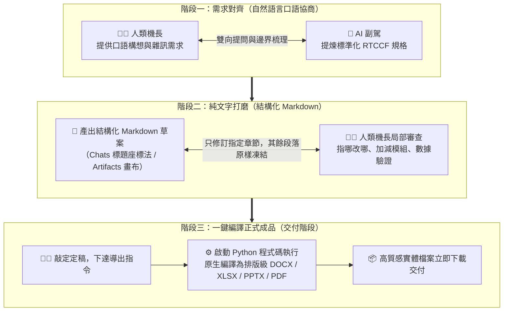

# 01. 人機協作 (Human-in-the-Loop) 核心心法：告別黑箱通靈，機長與副駕協同模型

> 💡 **學習目標**：理解為什麼傳統「單向一次性生成」必然在職場翻車，掌握「人是機長、AI 是副駕」的雙向對齊心法，以及為什麼「中間打磨純文字 Markdown、最後一鍵出成品」是最高效的生產力法則。

---

## 🧐 為什麼「單向一次性生成」在職場必然翻車？

許多職場學員在接觸生成式 AI 時，最常採取的心態是「把 AI 當通靈神仙」：

```text
❌ 單向黑箱模式（Black-box Generation）：
你：「請幫我寫一份新產品發表會企劃書，直接做成 Word 檔給我。」
AI ➔ （在黑箱中自行猜測所有背景、受眾、時程、預算與格式）
AI ➔ 產出一份二進位 .docx 檔案。
結果：你打開一看，方向完全偏離，你要求它修改，它整篇打掉重新生成，原本滿意的段落全被洗掉！
```

### 痛點剖析：黑箱生成的四大致命傷
1. **意圖鴻溝 (Intent Gap)**：自然語言本身具有歧義性。在未對齊角色、限制與受眾的情況下，AI 只能按機率採樣，往往給出放諸四海皆準的「廢話官套」。
2. **二進位檔案不可在線局部審查**：Word、Excel、PowerPoint、PDF 是編譯後的封閉二進位或富文本格式，大型語言模型無法在畫面上讓你反白某句話即時局部重算。
3. **Token 與上下文雪崩**：二進位檔案包含大量 XML 標籤與樣式元數據，每次叫 AI 修改，整個上下文視窗就被無意義的標籤塞滿，迅速觸發 Rate Limit。
4. **挫折感與信任崩潰**：改三次之後，使用者常會感嘆「算了，改它的時間我不如自己寫」，AI 淪為只能查字典的玩具。

---

## 🧠 人機協作 (Human-in-the-Loop, HITL) 的思維躍遷

真正的高手把 AI 當作**「極具天賦但缺乏你公司內部背景的資深實習生（副駕）」**，而**你自己則是掌握最終方向與決策的「機長」**。



---

## 🔑 人機協同黃金定律

> 📣 **「中間打磨純文字（Markdown），最後定稿出成品（Word/PPT/Excel/PDF）！」**

### 為什麼 Markdown 是極致人機協作的最佳介質？
1. **純文字透明度**：段落、標題（`#`、`##`）、表格與清單邊界清晰，人類一目了然。
2. **極致省 Token**：Markdown 沒有雜亂的 XML 樣式標籤，只消耗正文 Token，對話運行極度輕快。
3. **指哪改哪，絕不洗版**：搭配「標題座標法」，AI 可以精確替換第 3 節，其他章節完全不受干擾。
4. **無損版本回溯**：在 Claude Artifacts 畫布中，每一次人機修訂都會自動記錄為一個 Version，改壞了隨時可一鍵切回上一版。

---

## 💡 總結

Human-in-the-Loop 不是浪費時間的來回閒聊，而是**在資訊成本最低的階段（純文字階段）把邏輯、數據與結構打磨到 100 分**；當內容完美之後，再交由 AI 內建的程式碼編譯器瞬間完成排版，達成「零返工、高品質」的職場交付神話！

---

← [返回討論方式的內容生成總覽](../README.md) ｜ [下一篇：02. 標題座標法與雙欄畫布工藝 →](./02_Coordinate_Method_and_Artifacts.md)
