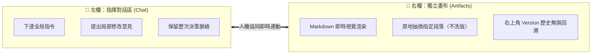

# 02. 標題座標法與雙欄畫布版本回溯的精準修訂工藝

> 💡 **學習目標**：學會在一般聊天室（Chats）使用「標題座標法」精準操控 AI 只修訂單一小節；以及在成品畫布（Artifacts）如何運用左右雙欄介面與右上角版本歷史，實現原地抽換與無損回溯。

---

## 🎯 什麼是「標題座標法」？

在長篇報告、合約或企劃書產出後，如果你直接對 AI 說：  
*「那個預算寫得太貴了，幫我改便宜一點。」*  
AI 往往不知道「那個預算」在哪裡，結果就是通篇重新輸出一次，甚至洗掉其他已經寫好的精美段落。

**「標題座標法」就是給 AI 一個明確的地理導航座標**：
1. **宣告錨定保護**：明確指出「其餘段落請原封不動保留」。
2. **指明標題座標**：精確叫出段落名稱（例如：`【三、 75 分鐘活動流程與節目時序】`）。
3. **下達量化或具體修正**：提出精確的增刪或調整指令。

```text
💡 標準標題座標法公式：
「企劃初稿架構很棒！【其餘章節請原封不動保留】，專門針對【精確章節名稱】進行微調：
【具體修改內容與條件】，請只輸出該小節修訂後的內容。」
```

---

## 🎨 Artifacts 雙欄協同環境全解構

當你在指令中指定「以 Markdown 輸出至 Artifacts 獨立畫布」時，桌面端與網頁端會展開極致舒適的雙欄介面：



### 畫布協作三大實戰技巧：
1. **原地抽換 (In-place Replacement)**：你在左側下達修改指令，右側畫布會即時更新對應章節，聊天對話窗不會被冗長的整篇文章洗版。
2. **版本歷史無損回退 (Version History)**：點擊畫布右上角的版本下拉選單（例如 `Version 1`, `Version 2`, `Version 3`），你可以隨時切回先前的版本；若 AI 越改越差，直接點擊回溯，零任何風險！
3. **隨時複製與導出**：畫布右下角具備一鍵複製純 Markdown 按鈕，隨時可將純文字帶走。

---

## 🗣️ 五大高頻人機微調偷懶話術

| 協作需求 | 推薦話術語句 | 原理與目的 |
| :--- | :--- | :--- |
| **局部精簡** | *「【第三節：活動預算】寫得太繁瑣，請幫我濃縮為 3 點重點即可。」* | 座標定位 ➔ 量化精簡 |
| **追加表格** | *「在『活動時序』後，請幫我追加一份 Markdown 表格：【突發狀況應變 SOP】。」* | 指定插入點 ➔ 指定表格欄位 |
| **語氣切換** | *「這一段很棒，但請改為寫給董事會成員看的高階穩健商務語氣。」* | 座標定位 ➔ 設定受眾口吻 |
| **公式核對** | *「請保持其他工作表不變，確認【綜合損益表】毛利欄位公式為營業收入減去算力成本。」* | 錨定保護 ➔ 檢查計算邏輯 |
| **備忘追加** | *「請為【投影片 2：痛點】追加講者演講備忘稿，語氣要自信且具說服力。」* | 投影片定位 ➔ 擴展 Notes 欄位 |

---

← [上一篇：01. 人機協作核心心法](./01_HITL_Human_In_The_Loop_Core.md) ｜ [下一篇：03. 四大格式導出工程學 →](./03_Multi_Format_Export_Engineering.md)
