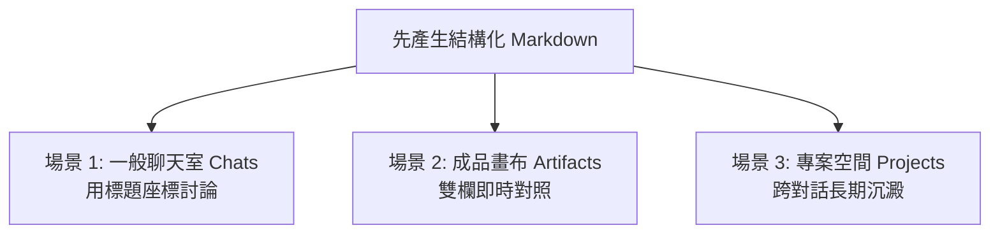

# 討論方式的內容生成：人機協作實戰指南（新手秒懂版）

> 🟢 **適用對象**：想用 AI 產出高品質企劃、報告、公文的一般學生與上班族  
> 💡 **核心觀念**：**不需要進入 Artifacts 也可以使用！** 不論是一般聊天室（Chats）、側欄畫布（Artifacts）還是專案空間（Projects），只要先產出 **Markdown 格式**，就能展開流暢的人機協商與修改！

---

## 🧐 為什麼你跟 AI 協作總是覺得「卡卡」的？

先來看一個 90% 的新手都會踩的「翻車現場」：

```text
❌ 新手常見做法：
你：「請幫我寫一份 2,000 字的年度春酒活動企劃書，直接給我 Word 檔。」
AI：（霹靂啪啦產出了一份 Word 檔...）
你打開一看：主題不對、預算太高、活動流程太老套...想叫它改，AI 卻整篇重新生成，原本寫得好的地方全不見了！
```

### 💡 觀念大翻轉：AI 是你的「實習生」，不是「通靈神仙」
想像你請實習生做專案：
- 如果你叫他「直接做好投影片交上來」，他猜錯你的心意，整份投影片就作廢了。
- 聰明的主管會說：「**你先用便條紙把大綱列給我（Markdown），我們一起討論修改，確認滿意了，你再去排版做投影片！**」

這就是**「討論方式的內容生成（人機協作）」**的精髓！

---

## 🔑 實作第一定律：為什麼「先產生 Markdown 檔案」才能人機協作？

> 📣 **請把這句話背起來：「中間純文字（Markdown），最後出成品（Word/PPT/PDF）！」**

```text
  第 1 步：拿草稿             第 2 步：挑毛病與討論           第 3 步：一鍵出成品
┌──────────────────┐        ┌──────────────────┐        ┌──────────────────┐
│  先要 Markdown   │ ───>   │ 人與 AI 來回修訂 │ ───>   │  轉成 Word/PPT   │
│ （有標題/條列/表格）│        │ （指哪改哪，不洗版） │        │ （正式排版直接下載）│
└──────────────────┘        └──────────────────┘        └──────────────────┘
```

1. **二進位檔案（Word/PDF）無法在線上「劃記修改」**：AI 沒辦法在對話框裡打開 Word 讓你圈選第二行改字；但 Markdown 是純文字，字字句句都在畫面上，一眼就看清。
2. **極致省 Token、速度飛快**：純文字傳輸最省資源，你可以跟 AI 連續討論 10 輪、20 輪，把每個細節磨到最完美。
3. **分工清楚**：**先管內容好不好（文字大綱），再管外表漂不漂亮（檔案排版）**。

---

## 🚀 三大介面實戰：在哪裡都能「討論式生成」！

很多同學以為一定要打開側欄的 Artifacts 才能修改，**其實完全不用！** 在 Claude 的任何角落都能用：



### 場景 1：在【一般聊天室（Chats）】── 最簡單、免開畫布就能用
不需要任何特殊設定，只要在提問時加一句：「**請先用 Markdown 格式列出大綱**」。
- **討論話術（座標修改法）**：
  - 👉 *「第 2 點的預算太高了，請幫我縮減到 5,000 元以內，其他段落不要動。」*
  - 👉 *「請在表格第三欄後面，幫我多加一欄『負責窗口』。」*
  - 👉 *「第三段的語氣太嚴肅，請用幽默活潑的口吻重寫該段。」*
  - **AI 就能精準只修改該段落，不會全部重噴一次！**

### 場景 2：在【成品畫布（Artifacts）】── 雙欄對照超舒服
當你要處理超過 1,000 字的長篇文章時，告訴 Claude：「**請在 Artifacts 中用 Markdown 產出**」。
- **優勢**：
  - 左邊是你的聊天視窗，右邊是文章畫布。
  - 你在左邊說：「把結尾改溫馨一點」，右邊的畫布就**原地自動換掉**，聊天紀錄乾乾淨淨！
  - 右上角還有「版本歷史」，改壞了隨時能一秒點回前一版。

### 場景 3：在【專案空間（Projects）】── 團隊多人長期協作
當你在做一個長達一個月的大專案時：
- 在 Claude Project 裡，把討論定稿的 Markdown 存進專案文件庫。
- 往後在這個 Project 開新對話，Claude 永遠記得這份定稿內容，全體同仁步調一致！

---

## 🏃 學生手把手演練：4 步驟帶你走一遍完整人機協作

請打開 Claude，跟著以下步驟親自操作一次，體驗「指哪打哪」的快感：

### 步驟 1：索取純文字 Markdown 草案（不急著要 Word）
> 💬 **你輸入**：
> ```text
> 我們部門下個月想辦一場「春季一日健行與野餐活動」，人數約 20 人，地點在台北近郊。
> 請先用 Markdown 格式幫我列出一份企劃大綱，包含：活動主題、時間行程表、預算粗估與攜帶裝備清單。
> ```

---

### 步驟 2：挑毛病、提出局部修改（展開討論）
> 💬 **你看完後輸入**：
> ```text
> 行程表的安排太累了，大家平常沒在爬山。
> 請維持其他部分不變，專門針對【時間行程表】進行修改：
> 改為走平緩步道（約 1 小時以內），下午多留 2 個小時讓大家在草地野餐和玩桌遊。
> ```

---

### 步驟 3：補充特殊限制或追加表格（深化內容）
> 💬 **你輸入**：
> ```text
> 很好！另外考量到當天可能會下雨：
> 請在文末加上一個 Markdown 表格：【雨天備案措施】，列出下雨時的室內替代場地與雨天活動建議。
> ```

---

### 步驟 4：確認滿意，一鍵導出正式檔案（大功告成）
> 💬 **你輸入**：
> ```text
> 這份企劃內容我很滿意！
> 請將剛才我們定稿的 Markdown 內容，直接轉換成一份正式美觀的 Word 檔案（.docx）供我下載。
> ```
> 🚀 **結果**：Claude 在對話中直接送出下載按鈕，一份完全符合你想法的完美 Word 企劃書到手！

---

## 🎓 學生必備「人機討論」偷懶話術指南

不知道怎麼跟 AI 討論修改？直接套用這四種句型：

| 你想達到的效果 | 推薦話術句型 |
| :--- | :--- |
| **想要改短** | *「第 3 點寫得太囉唆，請幫我精簡成 2 句重點即可。」* |
| **想要補充細節** | *「在『預算分析』後面，請幫我補充一份詳細的花費預估表格。」* |
| **想要換口吻** | *「整篇大綱很棒，但請把第一段改成寫給公司總經理看的高階商務語氣。」* |
| **指定不動的地方** | *「除了第 2 節之外，其餘段落請原封不動保留，只優化第 2 節。」* |

---

## 📝 本課結語小卡

1. **先 Markdown，後出檔案**：中間討論全用純文字，敲定後再出 docx/pptx。
2. **不用開畫布也能討論**：在一般 Chat 中用「第 X 點」、「某某小節」作為座標，AI 就能精準局部修訂。
3. **人是機長，AI 是副駕**：不要期待 AI 第一次就完美，學會用討論把想法逐步磨出來，才是真正的 AI 高手！

---

← [返回 Claude 講義首頁](../README.md)
