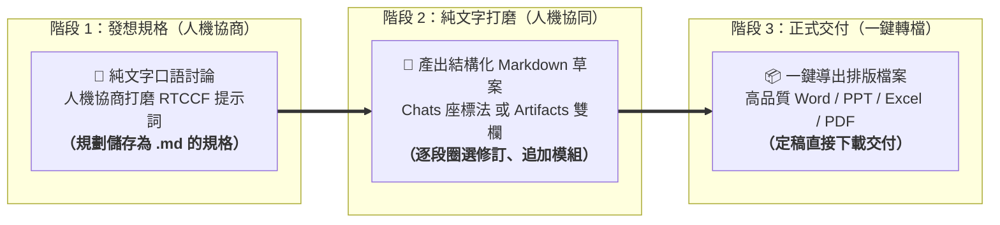
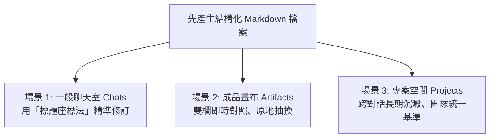

# 討論方式的內容生成：Claude 人機協同打磨與多格式交付實戰

> 🟢 **適用方案**：Free / Pro / Team / Enterprise 全方案適用（Claude 核心必學工作流）  
> 💡 **核心工作流**：在職場正式工作中，**先在對話中用自然語言人機協商出專業的 RTCCF 提示詞**；**關鍵心法：「中間打磨純文字（Markdown），最後定稿出成品（Word/PPT/Excel/PDF）」**！無論是在一般聊天室（Chats）使用「標題座標法」、在成品畫布（Artifacts）使用雙欄即時對照與版本歷史，還是在專案空間（Projects）沉澱為長期知識，都能讓你指哪改哪、絕不整篇洗版！

---

## 🧐 為什麼你跟 AI 協作總是覺得「改得很痛苦」？

先來看一個 90% 新手都會踩中的「職場翻車現場」：

```text
❌ 新手常見做法：
你：「請幫我寫一份新產品線上發表會企劃書，直接做成 Word 檔給我。」
Claude：（霹靂啪啦產出了一份 .docx 檔...）
你打開一看：開場太死板、流程拖太長、缺少互動抽獎...
你叫它改，Claude 卻整篇重新生成一次，原本寫得好的段落反而全被洗掉了！
```

### 💡 觀念大翻轉：把 AI 當「實習生」，別當「通靈神仙」
想像你帶領實習生做專案：
- **通靈心態**：一開始就叫他「去把手冊排版印刷出來」，他一旦猜錯方向，整本手冊就報銷了。
- **高手思維**：聰明的主管會說：「**你先在白板上把大綱條列寫給我（Markdown），我們逐條討論修改，確認滿意了，你再去轉成正式 Word 或簡報！**」

這就是**「討論方式的內容生成（人機協同）」**的靈魂所在！

---

## 🔑 職場兩大實作定律：RTCCF 協商與 Markdown 協作

### 📌 定律一：正式產出前，先用自然語言讓 AI 陪你打磨「RTCCF 提示詞」！
在面對複雜任務時，千萬不要一上來就丟一句模糊的指令：
- **❌ 隨性盲猜**：「幫我寫活動企劃，要專業一點。」（結果 AI 只能通篇猜測，品質參差不齊）
- **✅ 人機協商**：先用最簡單的白話，請 Claude 扮演顧問，幫你產出包含 **Role（角色）、Task（任務）、Context（背景）、Constraint（限制）、Format（格式）** 的 RTCCF 提示詞規格。雙方確認需求與邊界無誤後，再正式執行產出！

---

### 📌 定律二：為什麼「中間打磨純文字（Markdown）」才能極致人機協作？

> 📣 **請把這句話背起來：「中間打磨純文字（Markdown），最後定稿出成品（Word/PPT/PDF）！」**



1. **二進位檔案無法在線上逐行圈選**：Word、PDF 是編譯後的封閉格式，AI 無法在畫面上讓你反白某句話即時修改；而 Markdown 是標準結構化純文字，段落與標題邊界分明。
2. **極致省 Token 與防止洗版**：純文字協作反應極快，只替換被修改的句子或小節，不影響其他已經寫好的滿意段落。
3. **Artifacts 畫布的原生載體**：Claude 的獨立雙欄 Artifacts 畫布原生支援 Markdown 即時渲染，能提供獨立側欄展示、原地版本覆蓋與歷史回溯。

---

## 🎨 Claude 人機協作三大場景與雙欄環境解構

很多同學以為一定要切換特定模式才能協作，**其實 Claude 在任何介面都能展開討論式生成**：



### 1. 三大協作場景分工

| 協作場景 | 適用時機 | 核心操作手法與優勢 |
| :--- | :--- | :--- |
| **💬 場景 1：一般聊天室 (Chats)** | 日常快問快答、短中篇企劃草擬（免開畫布） | **標題座標法**：指定「第 2 節預算太高，縮減為 5000 元，其餘段落不動」，AI 即精確抽換，乾淨俐落。 |
| **📝 場景 2：成品畫布 (Artifacts)** | 超過 800 字的長篇企劃、技術方案、規格書 | **雙欄獨立畫布**：左邊對話下指令，右邊畫布原地更新；支援右上角「版本歷史」隨時無損回退。 |
| **📁 場景 3：專案空間 (Projects)** | 跨週跨月長期專案、品牌全系列文件打造 | **專案知識庫沉澱**：將定稿 Markdown 加入 Project Knowledge，後續開新對話皆繼承該定稿共識。 |

---

### 2. Artifacts 雙欄協同環境解構

當你在指令中要求 Claude 將內容以 Markdown 放入 Artifacts 產出時，桌面與網頁端即會展開左右雙欄協同介面：

| 雙欄區域 | 介面角色 | 核心協作功能與操作手法 |
| :--- | :--- | :--- |
| **💬 左欄：指揮對話區 (Chat)** | **宏觀指揮台** | <ul><li>**下達全局指令**：提出宏觀修改意見、設定語氣與對象。</li><li>**模組擴充要求**：例如「在文末新增突發狀況應變 SOP 表格」。</li><li>**保留決策脈絡**：完整記錄每一次人機討論與修訂原因。</li></ul> |
| **📝 右欄：獨立畫布 (Artifacts)** | **實體打磨工坊** | <ul><li>**Markdown 即時渲染**：標題、時序清單與表格立體視覺呈現。</li><li>**原地即時替換**：左側提出修改後，右側直接更新對應段落，不污染聊天視窗。</li><li>**右上角版本歷史**：點擊版本下拉選單，隨時能無損回溯至任一歷史修訂版。</li><li>**一鍵複製與導出**：右下角提供直接複製純文字或下載按鈕。</li></ul> |

---

## 🏃 學生手把手演練：從自然語言協商到高質感 Word 交付

請打開 Claude（網頁版或桌面版皆可），跟著以下兩大階段親自操作一次：

### 階段一：在【對話（Chat）】中——自然語言人機協作，產出最佳 RTCCF 規格

很多同學面對空白輸入框，不知道 RTCCF 該怎麼下筆。**記住：先讓 AI 陪你寫 Prompt！**

#### 步驟 1-1：用白話自然語言，讓 AI 產出 RTCCF 提示詞範本
用最平易近人的口語把任務告訴 Claude：

> 💡 **核心心法**：在第一輪，我們只專注於「討論、構思與打磨 RTCCF 提示詞」；先不急著產出正文，等規格敲定後再正式執行！

> 💬 **你在 Chat 輸入（白話自然語言）**：
> ```text
> 我們品牌下週要舉辦一場「夏季新品線上直播發表會」，預計時長 60 分鐘，我想寫一份簡潔的活動企劃大綱。
> 請用繁體中文幫我產出一份專業的 RTCCF (Role, Task, Context, Constraint, Format) 提示詞範本，並且在 Format 中指定要先輸出為 Markdown 格式（以利後續人機協同討論）。
> ```

#### 步驟 1-2：在對話中展開人機協作，微調修訂出最完美的 RTCCF 格式
Claude 產出初步範本後，你在對話裡進一步補充限制，**並落實職場協作關鍵：明確指定輸出為 Markdown 結構化文字**：

> 💬 **你看完範本後在 Chat 回覆微調**：
> ```text
> 這個範本架構很好！請幫我進行最後微調：
> 1. 在 Context 補充：受眾為 20 至 35 歲追求工作效率與生活質感的科技數位愛好者，核心要推動首波線上預購。
> 2. 在 Format 明確指定：整體內容必須以結構清晰的 Markdown 格式產出（可放在 Artifacts 中），包含層級標題、時序流程清單與重點表格，方便我稍後進行人機協同修改。
> 請直接輸出修訂後的完整 RTCCF Prompt，讓我可以直接複製使用。
> ```

🚀 **此時 Claude 會輸出打磨完成的正式 RTCCF Prompt（複製它，準備正式產出 Markdown 草案）**：

```markdown
## Role
你是一位具備 10 年活動策劃經驗的資深品牌企劃總監與商業文案顧問。

## Task
請為即將舉辦的「夏季新品線上直播發表會」撰寫一份完整且具實務執行力的活動企劃大綱。

## Context
- 活動長度：整場直播預計 60 分鐘。
- 目標受眾：20 至 35 歲追求工作效率與生活質感的科技數位愛好者。
- 核心目標：展示年度旗艦新機三大創新亮點，並在直播中推動首波線上預購轉換率。

## Constraint
- 前半段避免冗長無趣的單向技術規格說教，必須設計吸睛互動環節。
- 全文以繁體中文撰寫，語氣保持專業、熱情且節奏明快。

## Format
- 請務必將產出內容整理為結構清晰的 Markdown 格式（建議放在 Artifacts 獨立畫布中呈現）。
- 必須包含：清晰層級標題（#、##）、精確時序流程清單、重點規劃表格，以便我們後續進行雙欄人機協同打磨與逐段精修。
```

---

### 階段二：輸入 RTCCF 正式產出 Markdown 草案並展開雙欄人機協作

#### 步驟 2-1：貼上打磨完成的 RTCCF Prompt 正式執行
1. 在輸入框貼上剛才打磨定稿的完整 RTCCF Prompt 並送出！
2. **🚀 效果**：Claude 辨識到 Markdown 結構化內容與詳細規格要求，會自動在右側展開 **Artifacts 獨立畫布**，渲染出結構嚴謹的活動企劃 Markdown 初稿！

#### 步驟 2-2：在對話中展開局部精修（標題座標法，絕不洗版）
此時**不需要**讓 Claude 整篇重寫，直接使用「標題座標法」針對特定小節提出具體修改：

> 💬 **你在對話輸入**：
> ```text
> 企劃架構非常棒！但【時間流程規劃】的前半段講了太多硬體參數，觀眾容易分心。
> 請保持其他段落完全不變，專門針對【時間流程規劃】進行微調：
> 開場 5 分鐘後立刻安排一輪抽獎吸睛，技術說明濃縮為 15 分鐘，最後多保留 20 分鐘讓觀眾進行線上即時 Q&A。
> ```
> 🚀 **協作成效**：Claude 會在右側 Artifacts 畫布中精準替換該小節內容，或在對話中給出局部修訂，其他章節完全不受洗版干擾！

#### 步驟 2-3：深化內容或追加實用表格（持續打磨）
你可以隨時在對話中追加新模組，讓企劃書更加完善：

> 💬 **你在對話輸入**：
> ```text
> 很好！另外考量到直播現場可能會有設備斷線或網路延遲風險：
> 請在文末加上一個 Markdown 表格：【直播突發狀況應變 SOP】，列出斷訊、爆音、展示機故障 3 種情況的具體備案處置。
> ```
> 🚀 **協作成效**：右側畫布即時新增結構化 Markdown 表格；若改得不滿意，隨時點擊右上角「Version 歷史紀錄」無損回溯至前一個版本！

#### 步驟 2-4：確認滿意，一鍵導出正式排版檔案（大功告成）
當 Markdown 內容在對話或畫布中完全打磨滿意，進入正式交付階段：

> 💬 **你在輸入框輸入**：
> ```text
> 這份企劃內容已經討論定稿，非常完美！
> 請將剛才我們討論定稿的 Markdown 內容，直接製作成一份排版精美的正式 Word 檔案（.docx）供我下載。
> ```
> 🚀 **結果**：Claude 透過內建程式碼執行能力，自動將定稿的 Markdown 轉換為樣式漂亮的 Word 文件並產生下載連結；你也可以隨時直接複製 Markdown 原始碼備用！

---

## 🎓 學生必備「人機討論」偷懶話術指南

在進行內容微調時，直接套用這五種高頻職場話術：

| 你想達到的效果 | 推薦話術句型 | 操作手法與原則 |
| :--- | :--- | :--- |
| **局部精簡** | *「【第三節：活動預算】寫得太囉唆，請幫我濃縮為 3 點重點即可。」* | 指名章節名稱 ➔ 提出量化精簡要求 |
| **追加表格** | *「在『預算分析』小節後，請幫我補充一份詳細的花費預估 Markdown 表格。」* | 指定插入位置 ➔ 指定表格欄位與項目 |
| **切換語氣** | *「這一段很棒，但請改為寫給高階主管看的高階商務穩健語氣。」* | 指名對象受眾 ➔ 指定口吻風格 |
| **錨定保護** | *「除了【活動時程】之外，其餘段落請原封不動保留，只優化【活動時程】。」* | 先宣告保護其餘章節 ➔ 避免 AI 洗版 |
| **深度擴展** | *「請針對【行銷宣傳渠道】展開深入說明，補充線上廣告與 KOL 合作的執行細節。」* | 針對單一要點 ➔ 要求增加執行維度 |

---

## 🎯 職場延伸實戰案例庫

學會了討論式生成的邏輯後，你可以輕鬆將這個心法套用到更多真實職場任務中：

### 📚 現代職場三大實戰情境

1. **情境 01：實體與線上旗艦發表會活動企劃**（建議工具：Chats / Artifacts 雙欄）
   - **協作亮點**：先由口語人機協商出 60 分鐘活動流程與預算架構；指定以 Markdown 產出後，針對流程爭議點進行 3 輪微調，最後追加「現場突發 SOP 表格」，定稿後一鍵導出 Word 交付。
   - **關鍵話術**：「維持前言與預算不變，專門針對【活動時程】將開場互動比例拉高。」

2. **情境 02：全通路社群行銷多格式內容包**（建議工具：Chats / Projects 專案空間）
   - **協作亮點**：一次產出 IG 圖文腳本、FB 品牌故事長文、短影音分鏡腳本（15s/30s）與 EDM 主旨。在 Markdown 階段逐一校對品牌 Tone & Manner 與禁忌詞，確保多平台一致性。
   - **關鍵話術**：「社群長文已定稿，請參考這份定稿內容，將重點提煉成 3 篇 IG 輪播圖文的文案與視覺設計指示。」

3. **情境 03：專案立項書與風險管理檢核矩陣**（建議工具：Projects 雲端知識沙盒）
   - **協作亮點**：涉及跨部門資源調配與驗收標準。在 Project 中將討論成熟的 Markdown 規格文件存入專案文件庫，往後新開對話皆以此共識為底稿，確保專案長期協作步調完全一致。
   - **關鍵話術**：「請將我們定稿的專案規格書整理為 Markdown，並為其設計一份包含『風險等級、潛在影響、預防措施、負責窗口』的風險檢核矩陣。」

---

## 📝 本課結語小卡

1. **職場工作先立 RTCCF**：正式工作交付絕不單句瞎猜，先在對話中用自然語言人機協商出清晰的五要素 Prompt。
2. **中間打磨純文字，敲定後一鍵出成品**：請牢記「中間 Markdown、最後出檔案」，在 Markdown 階段把邏輯、架構與細節磨到最好，定稿後再轉出排版精美的 Word/PPT/PDF，徹底告別整篇洗版的痛苦！
3. **不用開畫布也能討論**：在一般 Chat 中善用「標題座標法」（如指名章節、小節名稱），Claude 就能精準局部修訂，無需整篇重寫。
4. **人是機長，AI 是副駕**：不要期待 AI 第一次就能「通靈」，學會透過有來有回的討論把想法逐步打磨具現，才是職場最強的 AI 協作力！

---

← [上一章：🟢 Artifacts 成品畫布](../Artifacts/README.md) ｜ [下一章：🟢 Projects 雲端知識沙盒 →](../Projects/README.md)
