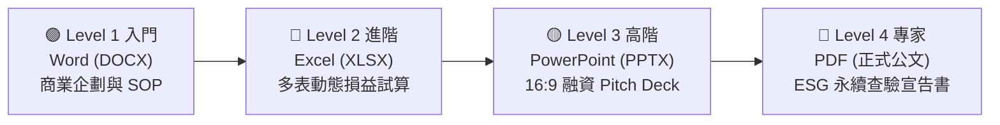

# 討論方式的內容生成：Claude 人機協作 (Human in the loop) 與多格式交付實戰 🚀

> 🟢 **適用方案**：Free / Pro / Team / Enterprise 全方案適用（Claude 核心必學工作流）  
> 💡 **核心心法**：在職場正式工作中，**先在對話中用自然語言人機協商出專業的 RTCCF 提示詞**；牢記黃金法則：**「中間打磨純文字（Markdown），最後定稿出成品（Word / Excel / PPT / PDF）」**！無論是在一般聊天室（Chats）使用「標題座標法」、在成品畫布（Artifacts）使用雙欄即時對照與版本歷史，還是在專案空間（Projects）沉澱為長期知識，都能讓你指哪改哪、絕不整篇洗版！

---

## 💡 為什麼你需要「人機協作 (Human in the Loop)」？

如果你直接叫 AI 產出二進位檔案，你一定常經歷這些「職場翻車現場」：
- **一次性盲猜大翻車**：「請幫我寫一份新產品發表會企劃書，直接給我 Word 檔。」結果 AI 噴出了一份死板、廢話連篇的 .docx。
- **改一個小地方，整篇重新洗版**：你叫它「流程改短一點」，Claude 卻整篇重寫，原本寫得極好的受眾分析直接被洗掉！
- **二進位檔案無法在線上局部圈選**：Word、PDF 是封閉格式，AI 無法在畫面上讓你反白某句話即時局部重算。

```mermaid
graph LR
    subgraph ❌ 傳統黑箱單向生成
        A1["💬 一句話隨意提問<br/>（叫 AI 直接產出 Word/Excel）"] -.->|AI 自行腦補盲猜| X1["📦 產出死板二進位檔"]
        X1 -.->|要求局部修改| X2["💥 整篇打掉重寫<br/>（原有滿意內容全被洗掉）"]
    end

    subgraph ✅ 人機協作 Human in the Loop (HITL)
        P1["💬 階段 1：自然語言協商<br/>（人機對話打磨 RTCCF 規格）"]
        P2["📝 階段 2：純文字原地打磨<br/>（Markdown 雙欄畫布／標題座標法）"]
        P3["📦 階段 3：定稿一鍵編譯<br/>（排版級 DOCX / XLSX / PPTX / PDF）"]
        P1 ==> P2
        P2 ==>|人類機長局部微調／加減模組| P2
        P2 ==>|100% 滿意定稿| P3
    end
```

| 比較維度 | 傳統黑箱單向生成 | 人機協作 (Human-in-the-Loop) |
| :--- | :--- | :--- |
| **角色關係** | 把 AI 當通靈神仙，期待一步到位 | **人是機長、AI 是副駕**，雙向對齊與把關 |
| **協作介質** | 一開始就產出封閉的二進位檔案 (.docx/.xlsx) | **中間打磨純文字 Markdown**，標題分明、極致省 Token |
| **修訂方式** | 一改動就整篇打掉重寫，洗版嚴重 | **標題座標法**，精確抽換指定段落，其餘章節原樣凍結 |
| **交付品質** | 排版死板、公式常寫錯、缺乏設計感 | **定稿後一鍵編譯**，具備大廠出版品等級的高質感成品 |

---

## 🧠 人機協作三位一體現代架構

一個專業的高階 AI 人機協作工作流由三大階段構成：

```text
🔄 Human-in-the-Loop 人機協作工作流
├── 階段 1：口語協商 RTCCF 規格（自然語言對齊）
│   └── 告別隨意盲猜，由 AI 主動梳理 Role, Task, Context, Constraint, Format
├── 階段 2：純文字結構化打磨（Markdown 雙欄協同）
│   └── 透過 Chats「標題座標法」或 Artifacts 畫布原地修訂、加減表格、無損回溯
└── 階段 3：多格式一鍵編譯交付（Python 程式碼執行）
    └── 定稿後原生導出高品質 Word (.docx)、動態公式 Excel (.xlsx)、16:9 簡報 (.pptx) 與防偽簽核 PDF (.pdf)
```

---

## 📚 人機協作核心技術深度指南

在正式動手實作前，建議先閱讀以下深度指南，幫助您建立正確的協同架構思維：

* 🧠 **[01. 人機協作 (Human-in-the-Loop) 核心心法：告別黑箱通靈，機長與副駕協同模型](./Guide/01_HITL_Human_In_The_Loop_Core.md)**  
  *深入解密為什麼傳統單向生成必然翻車？為什麼 Markdown 是極致人機協作的最佳介質。*
* 🎯 **[02. 標題座標法與雙欄畫布版本回溯的精準修訂工藝](./Guide/02_Coordinate_Method_and_Artifacts.md)**  
  *學會用「標題座標法」精準操控 AI 只修訂單一小節；雙欄畫布原地抽換與右上角 Version 歷史無損回退。*
* ⚙️ **[03. 四大格式（DOCX, XLSX, PPTX, PDF）Prompt 驅動導出工程學與程式碼執行解析](./Guide/03_Multi_Format_Export_Engineering.md)**  
  *拆解 Claude 後台 Python 沙盒如何將 Markdown 編譯為帶公版樣式的 Word、帶動態公式的 Excel、16:9 簡報與帶簽核章的 PDF。*

---

## 🧪 10 分鐘快速實作：親眼見證人機協作打磨的威力

本實作以「**星橋科技年度旗艦發表會企劃**」為例，透過 Before / After 的直接對照，讓你在 10 分鐘內親身感受人機協作如何徹底解決「改一處洗整篇」的痛點。

---

### 📥 步驟 0：下載實測練習檔案

請先下載課堂模擬檔案（點擊連結即可另存或預覽）：

| 檔案名稱 | 類型 | 用途說明 |
| :--- | :---: | :--- |
| 📝 [**企劃需求口語草稿_打磨前.md**](./Examples/01_Docx_Product_Launch_Plan/sample_files/企劃需求口語草稿_打磨前.md) | 測試輸入檔 | 行銷主管錄音記錄的口語發想草稿與雜訊需求。 |
| 📋 [**發表會企劃書定稿_Markdown打磨後.md**](./Examples/01_Docx_Product_Launch_Plan/sample_files/發表會企劃書定稿_Markdown打磨後.md) | 協作定稿檔 | 經 3 輪標題座標法局部微調後的高結構化定稿。 |
| 📄 [**星橋科技_2026年度旗艦新品發表會企劃書.docx**](./Examples/01_Docx_Product_Launch_Plan/sample_files/星橋科技_2026年度旗艦新品發表會企劃書.docx) | 成品對照檔 | 最終由 Python 程式碼執行動態編譯產出之高質感 Word 成品。 |

---

### ❌ 步驟 1：傳統單向直出 Word（Before 翻車現場）

1. 開啟一個全新的 Claude 普通對話。
2. 貼入以下口語指令：
   ```text
   請幫我寫一份 OmniFlow 3.0 線上新品發表會企劃書，時長 75 分鐘，直接做成 Word 檔案給我。
   ```
> 📉 **執行結果（痛點體驗）**：  
> Claude 吐出了一份死板的文字檔，充滿冗長的技術規格說教，完全沒有安排互動與抽獎。當你要求「把流程改短一點」時，Claude 竟然整篇打掉重新生成，原本寫得好的段落反而全不見了！

---

### ⚙️ 步驟 2：人機協作三階段打磨（After 震撼見證）

1. **第一階段：口語協商 RTCCF 規格**  
   貼入指令請 Claude 梳理規格：
   ```text
   我們品牌預計在 2026 年 4 月舉辦一場「OmniFlow 3.0 線上新品發表會」，時長約 75 分鐘，目標是解決職場人士「使用 AI 報告改到崩潰」的痛點。這份企劃書最後需要產出為一份正式的高階 Word 文件（.docx）呈報給執行長。
   請先不要急著寫企劃書內文，請先用繁體中文扮演資深活動總監，幫我整理出一份專業的 RTCCF 提示詞架構，並在 Format 中要求先輸出結構化 Markdown。
   ```
2. **第二階段：純文字局部打磨（標題座標法）**  
   送出 RTCCF 後，Claude 在畫布展開結構化 Markdown 初稿。使用「標題座標法」精準調整：
   ```text
   企劃初稿架構很棒！請保持其他章節完全不變，專門針對【三、 75 分鐘活動流程與節目時序】微調：
   開場 5 分鐘後立刻安排抽獎送前 100 名早鳥折扣券；技術主題演講濃縮在 15 分鐘內；中間加入 20 分鐘無劇本實機 Live Demo 展示 5 分鐘出報表，最後保留充足 15 分鐘線上問答。請只更新該時序表格。
   ```
   *（Claude 在右側畫布精準替換該小節，其餘章節完全不受洗版干擾！）*
3. **第三階段：定稿一鍵編譯正式 Word (.docx)**  
   確認滿意後，下達轉檔指令：
   ```text
   這份企劃書的 Markdown 內容已經過我們討論定稿，非常完美！
   請啟用 Python 程式碼執行，將我們剛才定稿的 Markdown 內容，製作成一份排版精美的高階 Word 檔案（.docx）供我下載：
   包含科技海軍藍（#1E3A8A）封面標題、斑馬紋表格、頁首「內部機密商業企劃書」與重點引言方塊。
   ```

> 🚀 **執行結果（交付奇蹟）**：  
> 點擊下載，一份具備大企業專業排版、階層清晰、表格大器的 `.docx` 檔案瞬間完成，完全不需要手動重新排版！

---

## 🚀 四大格式實戰教學矩陣（讓學生超有感！）

本教學設計遵循職場最高頻的四大交付格式，涵蓋由淺入深的四個層級，每個模組皆自帶獨立資料夾、詳細操作指引、一鍵複製的 `HITL_Prompt_Workflow.md` 與**真實可下載的實體範例檔案**：


```mermaid
graph LR
    L1["🟢 Level 1 入門<br/>Word (DOCX)<br/>商業企劃與 SOP"] --> L2["🔵 Level 2 進階<br/>Excel (XLSX)<br/>多表動態損益試算"]
    L2 --> L3["🟡 Level 3 高階<br/>PowerPoint (PPTX)<br/>16:9 融資 Pitch Deck"]
    L3 --> L4["🔴 Level 4 專家<br/>PDF (正式公文)<br/>ESG 永續查驗宣告書"]
```

| 階梯層級 | 實戰範例模組 | 格式類型 | 配套實體檔案（點擊下載/檢視） | 核心學習亮點 |
| :---: | :---| :---: | :---| :---|
| **🟢 Level 1**<br/>入門實戰 | [📄 **Word 商業企劃書與 SOP 矩陣**](./Examples/01_Docx_Product_Launch_Plan/README.md) | **.docx** | 📝 [口語草稿.md](./Examples/01_Docx_Product_Launch_Plan/sample_files/企劃需求口語草稿_打磨前.md)<br>📋 [定稿草案.md](./Examples/01_Docx_Product_Launch_Plan/sample_files/發表會企劃書定稿_Markdown打磨後.md)<br>📄 [**發表會企劃書.docx**](./Examples/01_Docx_Product_Launch_Plan/sample_files/星橋科技_2026年度旗艦新品發表會企劃書.docx) | 解決直出 Word 格式死板痛點；**標題座標法局部抽換**、斑馬紋表格與企業海軍藍排版。 |
| **🔵 Level 2**<br/>進階應用 | [📊 **Excel 動態損益與跨表預算模型**](./Examples/02_Xlsx_Financial_Budget_Model/README.md) | **.xlsx** | 📝 [財務假定筆記.md](./Examples/02_Xlsx_Financial_Budget_Model/sample_files/營運財務指標與假定筆記.md)<br>📋 [模型欄位規格.md](./Examples/02_Xlsx_Financial_Budget_Model/sample_files/財務模型結構與欄位規格書.md)<br>📊 [**動態損益預算表.xlsx**](./Examples/02_Xlsx_Financial_Budget_Model/sample_files/星橋科技_2026年度營運預算與動態損益試算表.xlsx) | 解決 AI 算公式錯誤與單頁塞爆痛點；**4 個獨立 Sheets、跨表連鎖公式 (`=SUM`)**、會計雙底線與情境敏感度分析。 |
| **🟡 Level 3**<br/>高階視覺 | [📽️ **PowerPoint 商業融資簡報分鏡**](./Examples/03_Pptx_Pitch_Deck_Master/README.md) | **.pptx** | 📝 [創辦人口語逐字.md](./Examples/03_Pptx_Pitch_Deck_Master/sample_files/創辦人融資口語訪談逐字稿.md)<br>📋 [10頁分鏡與Notes.md](./Examples/03_Pptx_Pitch_Deck_Master/sample_files/簡報10頁分鏡架構與演講備忘稿.md)<br>📽️ [**商業融資計畫書.pptx**](./Examples/03_Pptx_Pitch_Deck_Master/sample_files/星橋科技_Series_A商業融資計畫書.pptx) | 解決 AI 做簡報像貼 Word 小字痛點；**16:9 寬螢幕、暗黑科技卡片風**、自帶演講備忘稿 (Speaker Notes)。 |
| **🔴 Level 4**<br/>專家審查 | [📜 **PDF 永續查驗報告暨高階簽核公文**](./Examples/04_Pdf_ESG_Audit_Report/README.md) | **.pdf** | 📝 [碳排查核原始數據.md](./Examples/04_Pdf_ESG_Audit_Report/sample_files/碳排查核原始數據與缺失紀錄.md)<br>📋 [宣告書定稿.md](./Examples/04_Pdf_ESG_Audit_Report/sample_files/永續查驗宣告書定稿_Markdown.md)<br>📜 [**ESG永續查驗宣告書.pdf**](./Examples/04_Pdf_ESG_Audit_Report/sample_files/星橋科技_2026年度ESG永續發展查驗宣告書.pdf) | 解決 AI 直出 PDF 跑版缺字痛點；**ISO 14064-1 條文對齊**、無亂碼中文字型、企業深綠色帶與雙方法定簽章印章區。 |

---

## 🎓 學生必備「人機討論」偷懶話術指南

在進行內容微調時，直接套用這五種高頻職場話術：

| 你想達到的效果 | 推薦話術句型 | 操作手法與原則 |
| :--- | :--- | :--- |
| **局部精簡** | *「【第三節：活動預算】寫得太繁瑣，請幫我濃縮為 3 點重點即可。」* | 指名章節名稱 ➔ 提出量化精簡要求 |
| **追加表格** | *「在『預算分析』小節後，請幫我補充一份詳細的花費預估 Markdown 表格。」* | 指定插入位置 ➔ 指定表格欄位與項目 |
| **切換語氣** | *「這一段很棒，但請改為寫給董事會看的高階商務穩健語氣。」* | 指名對象受眾 ➔ 指定口吻風格 |
| **錨定保護** | *「除了【活動時程】之外，其餘段落請原封不動保留，只優化【活動時程】。」* | 先宣告保護其餘章節 ➔ 避免 AI 洗版 |
| **公式核對** | *「請保持其他工作表不變，確認【綜合損益表】毛利欄位公式為營業收入減去算力成本。」* | 檢查公式連鎖 ➔ 確保計算正確 |

---

## 📝 本課結語小卡

1. **職場工作先立 RTCCF**：正式工作交付絕不單句瞎猜，先在對話中用自然語言人機協商出清晰的五要素 Prompt。
2. **中間打磨純文字，敲定後一鍵出成品**：請牢記「中間 Markdown、最後出檔案」，在 Markdown 階段把邏輯、架構與細節磨到最好，定稿後再轉出排版精美的 Word/Excel/PPT/PDF，徹底告別整篇洗版的痛苦！
3. **不用開畫布也能討論**：在一般 Chat 中善用「標題座標法」（如指名章節、小節名稱），Claude 就能精準局部修訂，無需整篇重寫。
4. **人是機長，AI 是副駕**：不要期待 AI 第一次就能「通靈」，學會透過有來有回的討論把想法逐步打磨具現，才是職場最強的 AI 協作力！

---

← [上一章：🟢 Artifacts 成品畫布](../Artifacts/README.md) ｜ [下一章：🟢 Projects 專案沙盒 →](../Projects/README.md)
