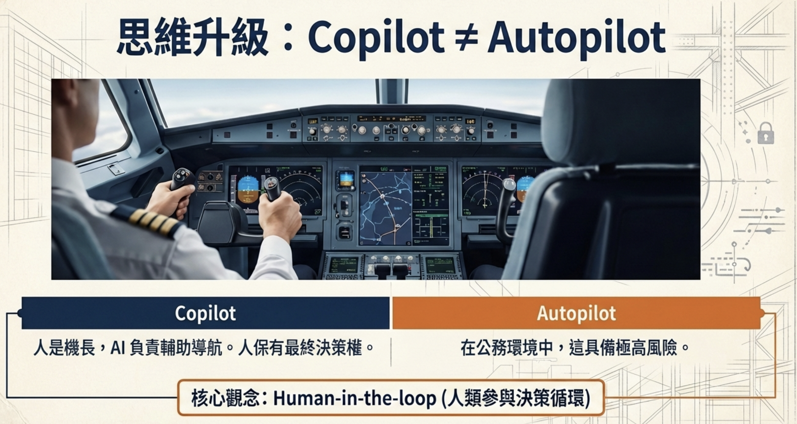

# 生成式AI全面探索:技術、應用與未來趨勢

## 🎯 目標

### 思維升級：Copilot ≠ Autopilot

> **核心觀念：Human-in-the-loop（人類參與決策循環）**  
> **Copilot**：人是機長，AI 負責輔助導航與草稿，**人保留最終決策權**。  
> **Autopilot**：在公務與職場情境中，若**完全放手**交給 AI、不審閱、不負責，將帶來**極高風險**。

✔ 把 AI 當成**每天並肩工作的副駕（Copilot）**，而不是取代你思考的「全自動」

✔ 用 AI **減少重複、瑣碎、低價值工作**（AI 協助約 80%，你聚焦約 20% 的方針、取捨與責任）

✔ 知道如何把 AI **嵌入既有流程，而不是額外負擔**

✔ 具備 AI 素養：**會下指令、會檢核、會修正**，不被新工具牽著走

✔ **使用免費方案**，零成本學習 AI 應用（有大量**需求**可再訂閱付費方案）

---

## 80/20 原則的應用（仍由人類負責最後一哩）

1. **讓 AI 做可重複、可驗證的基礎工作**：格式、結構、初稿與彙整
2. **你負責創意與決策**：方向、風格、合規與風險判斷、**最終品質與交付責任**
3. **持續優化 Prompt**：指令越清楚，副駕越能對齊你的意圖；產出後仍要**人類審閱**再對外使用

---
## 簡單AI應用

- [生成式AI模型基本概念](./生成式AI模型基本概念/README.md)  
  了解 LLM 從「模型」到「應用程式」的演進，掌握 AI 工具的本質與能力邊界

- [prompt工程指南](./prompt/README.md)   
  輸入格式、系統提示詞、ROSES 框架與 4 要素，學會正確下指令讓 AI 產出更好

- [討論方式的內容生成](./討論方式的內容生成/README.md)  
  善用 Canvas、畫布、Artifacts 與 AI 反覆討論，產出docx,xlsx,pptx,pdf,markdown,網頁等格式 

## 中階AI應用

- [個人知識庫](./RAG的應用/README.md)  
  檢索增強生成（RAG）與知識庫實作；範例素材見 [知識庫原始檔](./RAG的應用/知識庫原始檔/README.md)

- 簡報和資訊圖表  
  - [簡報和資訊圖表的差異](./簡報和資訊圖表/簡報和資訊圖表的差異.md) 
  - [簡報的生成](./簡報和資訊圖表/簡報的生成.md) 
  - [全自動資訊圖表的生成](./簡報和資訊圖表/全自動資訊圖表的生成.md) 
 
- [儲存與重複使用 AI 提示詞](./儲存與重複使用AI提示詞/README.md)  
  Gemini Gem、ChatGPT 自訂、Claude 專案 — 建立可重複使用的 AI 助手

- [連結應用程式](./連結應用程式/README.md)  
  連結應用程式的生成

- [影音生成應用程式](./影音生成/README.md)  
  影音生成的生成

## 進階AI應用-需配合MCP,SKILL,TOOLS,ACTIONS等

  - ChatGPT的應用程式(Connection,Action,Tool)
  - Claude(MCP,SKILL,Action)

## [Claude.AI](./Claude_ai/README.md)
  AI應用程式

---

- [實作任務](./實作任務/README.md)  
  15 個任務導向工作流：會議紀錄、簡報、資料分析、郵件、企劃書、知識庫等

---

### 免費方案使用技巧
1. **分散使用**：不同工具用於不同場景，避免單一工具額度耗盡
2. **批次處理**：累積多個任務一次處理，提高效率
3. **本地優先**：敏感資料使用 Ollama，一般資料用雲端工具
4. **善用額度**：定期檢查各工具的免費額度使用狀況

### 資料安全提醒
- ⚠️ **敏感資料**：使用 Ollama 本地處理，不上傳雲端
- ✅ **一般資料**：可使用 ChatGPT、Claude、Gemini 免費版

---

[**docx,xlsx,pptx測試**](./docx_xlsx_pptx測試/README.md)

---

## 其它
 [台北市勞動局本部課程](./others/勞動局本部課程/README.md)

 ---

