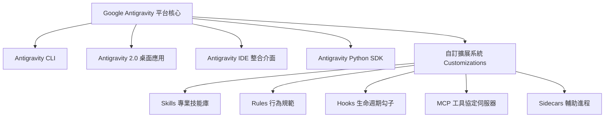

# Google Antigravity 自主代理平台實戰全指南

> **核心釐清**：很多人容易將 Antigravity 誤認為只是一款類似 VS Code 的 AI 編輯器（Antigravity IDE）。事實上，**Antigravity 是 Google DeepMind 團隊打造的新一代「AI-First 自主代理平台與執行引擎生態系」（Agentic Platform & Ecosystem）**。IDE 僅是眾多操作介面（Surfaces）之一，其核心威力在於具備自主規劃、工具調用、子代理排程與閉環執行的完整代理人生態。

---

## 🎯 什麼是 Google Antigravity？（平台架構 vs IDE 介面）

傳統 AI 工具（如單純對話網頁或行內代碼補全插件）大多停留在「問答式（Chat-based）」或「被動補全」。Antigravity 則是從底層為**高度自主代理人（Autonomous Agent）**設計的系統，能夠理解龐大專案脈絡、拆解長任務、自主呼叫系統工具並持續自我修正驗證。

### 🌟 Antigravity 的多元表面（Surfaces）

1. **Antigravity CLI (`agy`)**：
   輕量、極速的終端機文字介面（TUI）。工程師可直接在 Terminal 中呼叫代理人，透過鍵盤快捷指令驅動多步驟工程任務，無需繁重圖形介面。
2. **Antigravity 平台核心（Agentic Core）**：
   驅動整個系統的心臟。包含規劃模式（Planning Mode）、任務管理（Task Manager）、背景長時任務（Background Tasks / Daemon）、反應式喚醒（Reactive Wakeup）與上下文記憶管理。
3. **Antigravity Python SDK**：
   允許開發者以程式碼調用與租賃代理人（Agent Leasing），編排多代理人協作系統（Multi-Agent Orchestration），並將自訂業務邏輯暴露為代理人工具。
4. **Antigravity 2.0 獨立工作桌面**：
   具備對話畫布、輔助視窗（Auxiliary Pane: Subagents、Background Tasks、Artifacts、Files Changed、Terminals）的平行桌面生產力環境。
5. **Antigravity IDE**：
   針對開發者打造的編輯器介面，將代理人側邊欄、行內 Code Lens 與即時程式碼調試深度結合。

---

## ⚖️ 三大主流生態系本質差異對比

| 維度 | 🟣 Claude.AI | 🟢 ChatGPT | 🔵 Google Antigravity |
| :--- | :--- | :--- | :--- |
| **主要定位** | 頂級長文推理與商務公務副駕 | 多模態全能助手與大眾日常生產力 | **高自主級 AI Agent 與工程自動化平台** |
| **核心互動模式** | 單輪/多輪對話、Artifacts 互動畫布 | 對話、Canvas 畫布、語音、Custom GPTs | **規劃模式（Plan -> User Approval -> Execute -> Verify）** |
| **工具執行能力** | 雲端 Python 容器沙盒執行 | 雲端沙盒（Advanced Data Analysis） | **原生本機 Shell、檔案讀寫搜尋、瀏覽器自動化操作** |
| **任務執行架構** | 循序單一對話流 | 循序對話、多步驟調研（Deep Research） | **平行子代理（Subagents）、背景守護進程（Daemons）、定時排程** |
| **擴充與客製機制** | Projects 知識庫、Connectors、Skills | Custom GPTs、Actions、Connectors、MCP | **Skills、Rules、Hooks、Plugins、Sidecars、MCP 全模組生態** |
| **成果呈現載體** | Artifacts 預覽視窗 | Canvas 側欄、生成檔案下載 | **專業 Markdown Artifacts、Diff 視覺化、瀏覽器錄影動畫** |

---

## 🧩 核心功能架構與工作機制

### 1. 規劃模式（Planning Mode）與閉環執行
傳統 AI 容易「拿到指令立刻盲目改代碼」，往往造成混亂。Antigravity 導入標準工程規劃規範：
- **研究（Research）**：深入分析工作區目錄、相依套件、現有架構與潛在風險，不提前做破壞性變更。
- **產出實施計劃（Implementation Plan）**：建立 `implementation_plan.md`，詳列改動檔案、架構調整、開放性決策與驗證清單。
- **使用者審核確認（User Approval）**：停下等待使用者確認設計方向。
- **執行與自我驗證（Execute & Verify）**：自主調用終端機執行編譯、單元測試或瀏覽器截圖測試，並產出改動導覽（`walkthrough.md`）。

### 2. 強大且安全的工具體系（Tool Ecosystem）
Antigravity 具備現代代理人最齊全的本機與雲端操作工具集：
- **檔案操作與差異檢視**：支援精準範圍替換（`replace_file_content` / `multi_replace_file_content`），防止破壞專案結構。
- **本機終端機命令執行（`run_command`）**：在受控環境下執行 build、test、lint 等指令，支援同步等待與背景非同步任務（Background Tasks）。
- **無頭瀏覽器自動化（`browser_subagent`）**：可自主開啟網頁、點擊按鈕、填寫表單、截圖並自動錄製操作為 WebP 動畫。
- **Model Context Protocol（MCP）**：無縫掛載企業內部資料庫、GitHub、Jira 或第三方 API 服務。

### 3. 子代理人與平行任務排程（Subagents & Scheduling）
- **Subagents 派工**：主代理人可將耗時繁重（如大批檔案重構、網頁資料爬取）的研究拆解，派送給獨立的子代理人平行執行，結果自動回傳彙整。
- **定時器與 Cron 排程（`schedule`）**：內建一次性定時器與標準 5-field Cron 表達式，支援背景長效監控（Liveness / Heartbeat）或定期巡檢報告。
- **反應式喚醒（Reactive Wakeup）**：背景任務完成或收到通知時自動喚醒代理人，完全無需手動輪詢（No Polling）。

### 4. 模組化自訂生態（Customizations）
Antigravity 的行為可透過階層式目錄隨需定義與擴充：
- **Skills**：包含 `SKILL.md` 的專案知識與操作 SOP，按需動態載入，極省 Token。
- **Rules**：全域或專案層級的強制規則（如繁體中文回覆、程式碼風格限制、資安規範）。
- **Hooks**：在代理人生命週期關鍵節點（啟動、發送請求、工具調用前）自動觸發的腳本。
- **Knowledge Items（KI）**：沉澱團隊過往除錯歷史、架構決定與踩坑經驗，加速後續開發。

---

## ⚡ 常用斜線快捷指令（Slash Commands）

在 Antigravity 介面中，可運用特化斜線指令觸發進階工作流：

- `/goal`：目標導向長時任務模式，指示代理人進行深度探索與不達目的不中止的持續驗證。
- `/schedule`：設定一次性提醒或週期性背景定時任務（Cron Job）。
- `/grill-me`：互動式訪談模式，由代理人對使用者進行提問以收斂需求與架構決策。
- `/learn`：快速將解決方案或校正指引固化為可長久留存的行為知識庫（Rule / Skill）。

---

## 🚀 實務應用場景

1. **大型專案代碼遷移與重構**：主代理人盤點整體架構，規劃實施路線，派發子代理人分頭修改多個模組並執行整合測試。
2. **端到端功能驗證與除錯**：代理人修改代碼後，自動啟動本機開發伺服器，啟動無頭瀏覽器模擬使用者點擊登入、錄製操作動畫並確認無報錯。
3. **客製化企業內部自動化 Agent**：透過 MCP 串接內部知識庫與 ERP，搭配自訂 Skills，打造符合企業資安規範的高權限自動化流水線。

---

> 💡 **進一步探索**：
> - 欲深入客製自訂規範，可參考專案內的 Skills 與 Rules 架構。
> - 欲結合特定外部工具，可透過 MCP 伺服器配置（`mcp_config.json`）進行擴充。
