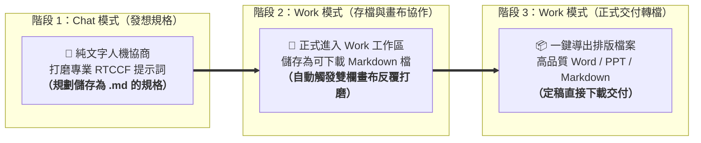

# 03. 討論方式的內容生成：Canvas 雙欄畫布與人機協作實戰

> 🟢 **適用方案**：Free / Plus / Team / Pro / Enterprise 全方案適用（已全面開放）  
> 💡 **核心工作流**：在職場正式工作中，**先在「對話（Chat）」模式用自然語言人機協商出專業的 RTCCF 提示詞**；**關鍵原則：在 ChatGPT 中只要有「儲存檔案（或下載檔案）」的動作，最好都在「工作（Work）」模式內進行！**在 Work 模式中只要指定「儲存為 Markdown 檔案（.md，可供下載）」（無需刻意寫 `canvas`），系統便會自動觸發右側雙欄畫布展開人機協同打磨，定稿後再一鍵導出為正式 Word/PPT 交付！

---

## 🧐 為什麼你跟 AI 協作總是覺得「改得很痛苦」？

先來看一個 90% 新手都會踩中的「職場翻車現場」：

```text
❌ 新手常見做法：
你：「請幫我寫一份新產品線上發表會企劃書，直接做成 Word 檔給我。」
AI：（霹靂啪啦產出了一份 .docx 檔...）
你打開一看：開場太死板、流程拖太長、缺少互動抽獎...
你叫它改，AI 卻整篇重新生成一次，原本寫得好的段落反而全被洗掉了！
```

### 💡 觀念大翻轉：把 AI 當「實習生」，別當「通靈神仙」
想像你帶領實習生做專案：
- **通靈心態**：一開始就叫他「去把手冊排版印刷出來」，他一旦猜錯方向，整本手冊就報銷了。
- **高手思維**：聰明的主管會說：「**你先在白板上把大綱條列寫給我（Markdown），我們逐條討論修改，確認滿意了，你再去轉成正式 Word 或簡報！**」

這就是**「討論方式的內容生成（人機協同）」**的靈魂所在！

---

## 🔑 職場兩大實作定律：Work 模式與 Markdown 協作

### 📌 定律一：只要有「儲存檔案」的動作，最好都在【工作（Work）模式】內進行！
在 ChatGPT 中，模式分工非常明確：
- **💬 對話（Chat）模式**：適合前期腦力激盪、即時快問快答，以及**用自然語言人機協商打磨 RTCCF 提示詞**。
- **💼 工作（Work）模式**：**只要指令包含「儲存檔案、產生可下載文件（.md, .docx, .pptx）」或需要實體產出，強烈建議一律在 Work 模式下執行！**
  Work 模式是專門為「檔案生命週期」打造的工作環境，能穩定維持檔案狀態、提供直接下載按鈕，並在存為 Markdown 時自動觸發右側雙欄 Canvas 畫布，大幅降低在普通 Chat 中程式碼區塊被截斷或檔案無法正確下載的風險。

---

### 📌 定律二：為什麼「先存成 Markdown」才能極致人機協作？

> 📣 **請把這句話背起來：「中間打磨純文字（Markdown），最後定稿出成品（Word/PPT/PDF）！」**



1. **二進位檔案無法在線上逐行圈選**：Word、PDF 是編譯後的封閉格式，AI 無法在畫面上讓你反白某句話即時修改；而 Markdown 是標準結構化純文字，段落與標題邊界分明。
2. **Canvas 畫布的原生載體就是 Markdown**：ChatGPT 的獨立畫布功能專為 Markdown 設計，在 Work 模式中只要存成 Markdown 檔，就能自動激活行內編輯、反白劃記與字數縮放。
3. **極致省 Token 與防止洗版**：純文字協作反應極快，只替換被修改的句子，不影響其他滿意段落。

---

## 🎨 ChatGPT 桌面版 Canvas 雙欄環境解構

只要在指令中指定儲存為可下載的 Markdown 檔案（無需特別寫出 `canvas` 關鍵字），桌面端即會自動展開左右雙欄協同介面：

| 雙欄區域 | 介面角色 | 核心協作功能與操作手法 |
| :--- | :--- | :--- |
| **💬 左欄：指揮對話區 (Chat)** | **宏觀指揮台** | <ul><li>**下達全局指令**：提出宏觀修改意見、設定語氣口吻。</li><li>**模組擴充要求**：例如「在文末新增突發狀況 SOP 表格」。</li><li>**保留協同脈絡**：完整記錄所有指令與人機決策歷程。</li></ul> |
| **📝 右欄：獨立畫布 (Canvas)** | **實體打磨工坊** | <ul><li>**Markdown 即時渲染**：標題、時序清單與表格立體視覺呈現。</li><li>**滑鼠劃記修改**：反白圈選特定句子，指哪改哪、絕不洗版。</li><li>**直接打字增刪**：如同 Word 般隨時雙擊輸入手動修改字句。</li><li>**右下角快捷工具**：一鍵縮放篇幅（變長/變短）、調整閱讀深度。</li><li>**右上角版本歷史**：修訂歷程全程記錄，改壞了隨時無損回溯。</li></ul> |

---

## 🏃 學生手把手演練：桌面版「Chat 發想 ➔ Work 落地」實戰

請打開 ChatGPT 桌面版應用程式，跟著以下兩大階段親自操作一次：

### 階段一：在【對話（Chat）模式】下——自然語言人機協作，產出最佳 RTCCF 規格

很多同學面對空白輸入框，不知道 RTCCF 該怎麼下筆。**記住：先讓 AI 陪你寫 Prompt！**

#### 步驟 1-1：用白話自然語言，讓 AI 產出 RTCCF 提示詞範本
在 ChatGPT 桌面版頂部點選 **「對話（Chat）」** 分頁，用最平易近人的口語把任務告訴它：

> 💡 **核心心法**：在 Chat 模式下，我們只專注於「討論、構思與打磨 RTCCF 提示詞」；**先不在 Chat 裡面存檔**，等規格敲定後，再帶去 Work 模式正式執行存檔與協作！

> 💬 **你在 Chat 輸入（白話自然語言）**：
> ```text
> 我們品牌下週要舉辦一場「夏季新品線上直播發表會」，預計時長 60 分鐘，我想寫一份簡潔的活動企劃大綱。
> 用繁體中文幫我產出一份專業的 RTCCF (Role, Task, Context, Constraint, Format) 提示詞範本，並且規格要指定能儲存為 1 份可下載的 markdown 檔案。
> ```

#### 步驟 1-2：在 Chat 模式展開人機協作，微調修訂出最完美的 RTCCF 格式
AI 產出初步範本後，你在 Chat 裡進一步補充限制，**並落實職場協作關鍵：指定儲存為結構化、可下載的 Markdown 檔案（.md，無需特別寫 canvas）**：

> 💬 **你看完範本後在 Chat 回覆微調**：
> ```text
> 這個範本架構很好！請幫我進行最後微調：
> 1. 在 Context 補充：受眾為 20 至 35 歲追求工作效率與生活質感的科技數位愛好者，核心要推動首波線上預購。
> 2. 在 Format 明確指定：整體內容必須儲存為一份結構清晰、可供下載的「Markdown 檔案（.md）」，方便我稍後在右側雙欄畫布進行人機協同修改。
> 請直接輸出修訂後的完整 RTCCF Prompt，讓我可以直接複製。
> ```

🚀 **此時 AI 會輸出打磨完成的正式 RTCCF Prompt（複製它，準備產生 Markdown 檔案進入 Canvas 模式）**：

```markdown
## Role
你是一位具備 10 年活動策劃經驗的資深品牌企劃總監與商業文案顧問。

## Task
請為即將舉辦的「夏季新品線上直播發表會」撰寫一份完整且具實務執行力的活動企劃大綱。

## Context
- 活動長度：整場直播預計 60 分鐘。
- 目標受眾：20 至 35 歲追求工作效率與生活質感的科技數位愛好者。
- 核心目標：展示年度旗艦新機三大創新亮點，並在直播中推動首波線上預購轉換率。

## Constraint
- 前半段避免冗長無趣的單向技術規格說教，必須設計吸睛互動環節。
- 全文以繁體中文撰寫，語氣保持專業、熱情且節奏明快。

## Format
- 請務必將產出內容儲存為結構清晰、可供下載的 **Markdown 檔案（.md）**（無需刻意指定 canvas，存為 .md 即可自動啟用畫布與下載，包含層級標題、時序流程清單與重點表格），以便我們後續在右側畫布進行雙欄人機協同打磨與逐段精修。
```

---

### 階段二：切換至【工作（Work）模式】——輸入 RTCCF 正式存檔並在 Canvas 展開雙欄協作

#### 步驟 2-1：進入 Work 模式，輸入打磨完成的 RTCCF Prompt 正式存檔
> 💡 **為什麼一定要切換到 Work 模式？**  
> 在 ChatGPT 中，**只要有「儲存檔案」（如存成 `.md` 檔案、導出 `.docx` 等可下載文件）的動作，最好都在【工作（Work）】模式內工作！**  
> Work 模式擁有獨立的專案空間與檔案管線，不僅能確保檔案穩定產出並提供直接下載連結，還能自動在右側開啟 Canvas 雙欄畫布，避免一般對話中程式碼區塊中斷或無法下載的問題。

1. 點擊桌面版頂部的 **「工作（Work）」** 分頁，建立專屬交付任務。
2. 貼上剛才在 Chat 模式人機打磨定稿的完整 RTCCF Prompt 並送出！
3. **🚀 效果**：ChatGPT 辨識到儲存為 Markdown 檔案（.md）的要求，在 Work 模式下會自動產生結構化的 Markdown 草案、提供檔案下載按鈕，並在桌面版右側自動展開獨立的 **Canvas 雙欄畫布**！

#### 步驟 2-2：在 Canvas 雙欄畫布展開人機協作（反白劃記、局部精修）
此時**不需要**讓 AI 整篇重寫，直接用滑鼠在右側畫布中圈選反白【時間流程表】段落：

> 💬 **你在右側畫布反白圈選【時間流程表】，在浮動修改框或左側對話輸入**：
> ```text
> 流程前半段講太多技術細節，觀眾會睡著。
> 請維持其他段落不變，專門針對選取的【時間流程表】進行修改：
> 開場 5 分鐘後立刻安排一輪抽獎吸睛，技術說明濃縮為 15 分鐘，多留 20 分鐘讓觀眾線上即時 Q&A。
> ```
> 🚀 **協作成效**：右側 Canvas 畫布中的 Markdown 內容只針對該區塊精確替換，其他章節完全不受洗版干擾！

#### 步驟 2-3：在 Canvas 中深化內容或追加表格（持續打磨）
你可以隨時在右側畫布直接打字微調，或在對話中追加新模組：

> 💬 **你在對話中輸入**：
> ```text
> 很好！另外考量到直播現場可能會有設備斷線風險：
> 請在文末加上一個 Markdown 表格：【直播突發狀況應變 SOP】，列出斷訊、爆音、展示機故障 3 種情況的備案處置。
> ```
> 🚀 **協作成效**：右側畫布即時新增結構化 Markdown 表格；若改得不滿意，隨時點擊右上角「版本歷史」按鈕無損回溯。

#### 步驟 2-4：確認滿意，一鍵導出正式檔案（大功告成）
當 Markdown 內容在 Canvas 畫布中完全打磨滿意，進入正式交付階段：

> 💬 **你在輸入框輸入**：
> ```text
> 這份企劃內容在 Canvas 上已經討論定稿，非常完美！
> 請將剛才我們在 Canvas 討論定稿的 Markdown 內容，直接製作成一份排版精美的正式 Word 檔案（.docx）供我下載。
> ```
> 🚀 **結果**：ChatGPT 在背景自動將定稿的 Markdown 轉為格式漂亮的 Word 檔案並產生下載連結；你也可以隨時點擊 Canvas 視窗右上角選單直接複製或導出檔案！

---

## 🎓 學生必備「人機討論」偷懶話術指南

在 Canvas 畫布微調時，直接套用這四種高頻話術：

| 你想達到的效果 | 推薦話術句型 | 操作方式 |
| :--- | :--- | :--- |
| **局部精簡** | *「選取的這段寫得太囉唆，請幫我濃縮為 2 句重點即可。」* | 滑鼠反白劃記該段 ➔ 輸入話術 |
| **追加表格** | *「在『預算分析』後面，請幫我補充一份詳細的花費預估 Markdown 表格。」* | 在左欄 Chat 指示追加 |
| **切換語氣** | *「這一段很棒，但請改為寫給高階主管看的高階商務穩健語氣。」* | 反白該段 ➔ 或點右下角工具調整 |
| **錨定保護** | *「除了【活動時程】之外，其餘段落請原封不動保留，只優化【活動時程】。」* | 指名修改標題座標 |

---

## 📝 本課結語小卡

1. **職場工作先立 RTCCF**：正式工作交付絕不單句瞎猜，依循 [AI 提示詞工程指南](../../prompt/AI提示詞工程指南/README.md) 在 Chat 模式人機協商出清晰的五要素 Prompt。
2. **只要有儲存檔案動作，最好都在【工作（Work）】模式內**：在 ChatGPT 中，**凡是牽涉到「產生檔案、儲存檔案或下載檔案（.md / .docx / .pptx 等）」的任務，最好都在 Work 模式內工作**，確保檔案保存完整、穩定提供下載連結，並自動觸發畫布協作！
3. **指定存成 Markdown 檔即可（無需刻意寫 canvas）**：在 Work 模式下**不需要明確指名 `canvas`，只要指定儲存為可供下載的 Markdown 檔（.md）**，系統便會自動觸發雙欄畫布，啟用滑鼠反白劃記、局部抽換與版本回溯的人機協作能力！
4. **中間打磨純文字，敲定後一鍵出成品**：在 Canvas 雙欄畫布中反覆微調定稿後，再請 AI 導出排版精美的 Word/PPT 交付，徹底告別整篇洗版的痛苦！

---

← [上一章：02. Personalization 個人化設定與長期記憶](../02_Personalization/README.md) ｜ [下一章：04. Chats 對話思維與提問心法 →](../04_Chats/README.md)
