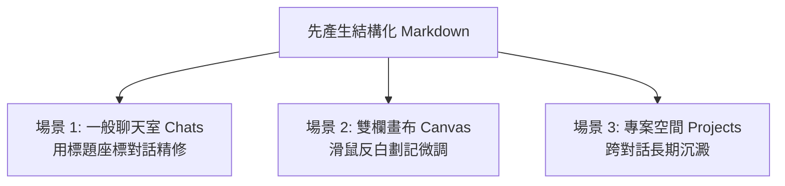

# 03. 討論方式的內容生成：人機協作實戰（ChatGPT 學生秒懂版）

> 🟢 **適用方案**：Free / Plus / Team / Enterprise 全方案適用（現已全面開放）  
> 💡 **核心觀念**：**不需要進入 Canvas（畫布）也可以使用！** 不論是一般聊天室（Chats）、畫布編輯區（Canvas）還是專案空間（Projects），只要先產出 **Markdown 格式**，就能展開高效率的人機協商與逐步精修！

---

## 🧐 為什麼你跟 AI 協作總是覺得「改得很痛苦」？

先來看一個 90% 的同學都會踩的「翻車現場」：

```text
❌ 新手常見做法：
你：「請幫我寫一份新產品線上發表會企劃書，直接做成 Word 檔給我。」
AI：（霹靂啪啦產出了一份 Word 檔...）
你打開一看：流程太長、活動主題太老套、缺乏抽獎環節...
你想叫它改，AI 卻整篇重新生成一次，原本寫得好的段落反而被洗掉了！
```

### 💡 觀念大翻轉：把 AI 當「實習生」，別當「通靈神仙」
想像你請實習生幫忙企劃：
- 如果你一開始就叫他「直接去排版印成精美手冊」，他一旦猜錯方向，整本手冊就報銷了。
- 聰明的主管會說：「**你先在白板上把大綱條列寫給我（Markdown），我們逐條討論修改，確認滿意了，你再去轉成正式 Word 或簡報！**」

這就是**「討論方式的內容生成（人機協作）」**的精髓！

---

## 🔑 實作第一定律：為什麼「先產生 Markdown 檔案」才能人機協作？

> 📣 **請把這句話背起來：「中間純文字（Markdown），最後出成品（Word/PPT/PDF）！」**

```text
  第 1 步：拿草稿             第 2 步：挑毛病與討論           第 3 步：一鍵出成品
┌──────────────────┐        ┌──────────────────┐        ┌──────────────────┐
│  先要 Markdown   │ ───>   │ 人與 AI 來回修訂 │ ───>   │  轉成 Word/PPT   │
│ （有標題/條列/表格）│        │ （指哪改哪，不洗版） │        │ （正式排版直接下載）│
└──────────────────┘        └──────────────────┘        └──────────────────┘
```

1. **二進位檔案（Word/PDF）無法在線上「逐行圈選修改」**：AI 沒辦法在對話框裡打開 Word 讓你反白改字；但 Markdown 是結構化純文字，每一段都看得清清楚楚。
2. **極致省 Token、反應超快**：純文字傳輸最省系統資源，你可以跟 ChatGPT 連續討論 10 輪、20 輪，深入雕琢每個細節都不會卡死。
3. **分工清楚**：**先管內容好不好（文字大綱），再管外表漂不漂亮（排版美化）**。

---

## 🚀 三大介面實戰：在哪裡都能「討論式人機協作」！

很多同學以為一定要打開 Canvas（畫布）才能修改，**其實完全不用！** 在 ChatGPT 的任何介面都能展開協作：



### 場景 1：在【一般聊天室（Chats）】── 最簡單、免開畫布就能用
不需要任何特殊開關，只要在提問時加一句：「**請先用 Markdown 格式列出完整大綱**」。
- **討論話術（座標修改法）**：
  - 👉 *「第 2 點的流程太緊湊，請幫我縮減為 30 分鐘，其他段落不要動。」*
  - 👉 *「請在第二個表格後面，幫我多加一欄『主責工作同仁』。」*
  - 👉 *「第四段寫得太生硬，請用熱情活潑的口吻重寫該段。」*
  - **ChatGPT 就能精準只修改該段落，不會整篇重噴一次！**

### 場景 2：在【雙欄畫布（Canvas）】── 視覺化反白修改神器
當 ChatGPT 偵測到長篇文件，或你在對話時主動要求：*「請在 Canvas 中為我撰寫一份企劃」* 時，介面會切換為左右雙欄：
- **左欄**：對話區（下達宏觀指令）。
- **右欄**：Markdown 畫布（學員可像用 Word 一樣**直接打字修改**）。
- **四大快捷修訂小幫手（右下角）**：
  1. **劃記修改**：用滑鼠反白想要改的特定句子，浮出小框框告訴它怎麼改，AI 只替換那一句！
  2. **調整長度**：一秒變短（精簡版）或變長（擴充版）。
  3. **調整閱讀層級**：從幼稚園大白話一路切換到研究生專業論文深度。
  4. **版本歷史（右上角箭頭）**：隨時點擊回溯，改壞了無損復原！

### 場景 3：在【專案空間（Projects）】── 團隊多人長期協作
當你在經手長達數週的重要企劃時：
- 在 ChatGPT Project 專案空間中，把討論定稿的 Markdown 大綱加入專案知識庫。
- 往後在這個 Project 裡開啟的任何新對話，ChatGPT 全部自動記得這份大綱，協同毫無斷層！

---

## 🏃 學生手把手演練：4 步驟帶你走一遍完整人機協作

請打開 ChatGPT，跟著以下步驟親自操作一次，體驗「指哪打哪」的快感：

### 步驟 1：索取純文字 Markdown 草案（不急著要 Word）
> 💬 **你輸入**：
> ```text
> 我們品牌下週要舉辦一場「夏季新品線上直播發表會」，預計時長 60 分鐘。
> 請先用 Markdown 格式幫我列出一份企劃大綱，包含：活動主題、時間流程表、早鳥購機優惠與互動抽獎機制。
> ```

---

### 步驟 2：挑毛病、提出局部修改（展開討論）
> 💬 **你看完後輸入**：
> ```text
> 流程前半段講太多技術細節，觀眾會睡著。
> 請維持其他部分不變，專門針對【時間流程表】進行修改：
> 開場 5 分鐘後立刻安排一輪抽獎吸睛，技術說明濃縮為 15 分鐘，多留 20 分鐘讓觀眾線上即時 Q&A。
> ```

---

### 步驟 3：補充特殊限制或追加表格（深化內容）
> 💬 **你輸入**：
> ```text
> 很好！另外考量到直播現場可能會有設備斷線風險：
> 請在文末加上一個 Markdown 表格：【直播突發狀況應變 SOP】，列出斷訊、爆音、展示機故障 3 種情況的備案處置。
> ```

---

### 步驟 4：確認滿意，一鍵導出正式檔案（大功告成）
> 💬 **你輸入**：
> ```text
> 這份企劃內容非常完美！
> 請將剛才我們討論定稿的 Markdown 內容，直接製作成一份排版精美的正式 Word 檔案（.docx）供我下載。
> ```
> 🚀 **結果**：ChatGPT 在背景自動產生下載按鈕，一份完全對齊你想法的高品質 Word 企劃書直接到手！

---

## 🎓 學生必備「人機討論」偷懶話術指南

不知道怎麼跟 AI 討論修改？直接套用這四種句型：

| 你想達到的效果 | 推薦話術句型 |
| :--- | :--- |
| **想要改短** | *「第 3 點寫得太囉唆，請幫我精簡成 2 句重點即可。」* |
| **想要補充細節** | *「在『預算分析』後面，請幫我補充一份詳細的花費預估表格。」* |
| **想要換口吻** | *「整篇大綱很棒，但請把第一段改成寫給公司總經理看的高階商務語氣。」* |
| **指定不動的地方** | *「除了第 2 節之外，其餘段落請原封不動保留，只優化第 2 節。」* |

---

## 📝 本課結語小卡

1. **先 Markdown，後出檔案**：中間討論全用純文字，敲定後再出 docx/pptx。
2. **不用開畫布也能討論**：在一般 Chat 中用「第 X 點」、「某某小節」作為座標，AI 就能精準局部修訂；進入 Canvas 則享有滑鼠反白劃記的極致體驗。
3. **人是機長，AI 是副駕**：不要期待 AI 第一次就完美，學會用討論把想法逐步磨出來，才是真正的 AI 高手！

---

← [上一章：02. Personalization 個人化設定與長期記憶](../02_Personalization/README.md) ｜ [下一章：05. Advanced Data Analysis 數據分析與產檔 →](../05_Advanced_Data_Analysis/README.md)
