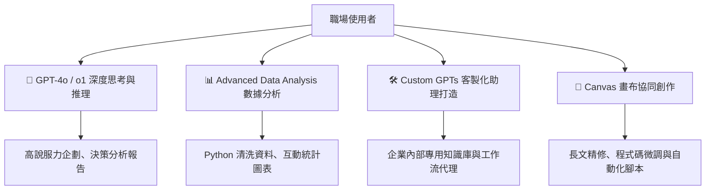

# ChatGPT & OpenAI 生態系實戰指南

本指南涵蓋 OpenAI 旗下最具生產力的兩大核心應用模組：**ChatGPT 智慧對話助理** 與 **Codex / Advanced Data Analysis 程式碼與數據分析**，幫助學員掌握從日常行政、商務決策到資料自動化的全方位應用。

---

## 🎯 核心學習模組

---

## 📚 學習重點單元

### 1. 🧠 GPT-4o / o1 深度思考與邏輯推理
- **多模態輸入辨識**：同時處理照片、報表截圖、手繪草圖與長篇 PDF。
- **深度推理 (Reasoning)**：針對複雜商業決策、合約條款陷阱分析與多步驟邏輯推導。

### 2. 📊 Advanced Data Analysis（進階資料分析）
- **免裝環境的 Python 運算**：直接上傳 `.csv` 或 `.xlsx`，由 AI 在沙盒中自動寫程式分析。
- **自動化圖表製作**：繪製專業長條圖、趨勢折線圖、熱力圖，並提供洞察解讀。

### 3. 🛠️ Custom GPTs 客製化助理
- **零程式碼建置**：透過自然語言對話設定專屬 Instructions 與 Knowledge 檔案。
- **Actions API 串接**：讓 GPTs 呼叫外部 API，自動查詢內部資料庫或發送工作通知。

### 4. 🎨 Canvas 畫布協作
- **文字與程式專屬畫布**：在雙欄分割視窗中，針對特定段落要求 AI 改寫、擴充或修復 Bug。
- **一鍵快捷調整**：微調閱讀難易度、文章長度、語氣風格，達到人類副駕（Copilot）的高效協同。

---

[← 返回專案首頁](../README.md)