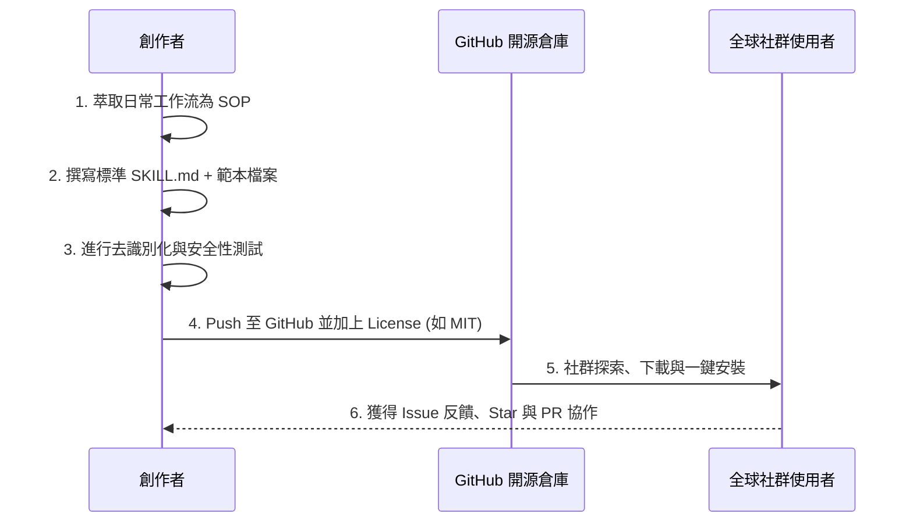

# 開放來源 Skills（Open-Source Skills）

在生成式 AI 與 AI Agent 的工作流中，**Skills（技能）** 是將「專業知識、工作 SOP、輸出範本與自動化程式碼」封裝成可重複調用的模組化單元。

本章節介紹**開放來源（Open Source）的 Skills 生態**：如何尋找社群與官方提供的優秀技能、評估安全性、安裝匯入到日常工作環境，以及如何將自己的實戰經驗包裝為開源 Skill 回饋社群。

---

## 🎯 為什麼需要開放來源的 Skills？

傳統使用 AI 時，使用者常需要反覆複製貼上長篇 Prompt，或每次重新上傳範本。**開源 Skills** 帶來了標準化與模組化的革命：


* **🚀 免重複造輪子**：直接站在全球專家經驗之上，立即擁有專業級的報告排版、程式碼審查、數據分析等能力。
* **📦 標準化結構封裝**：一個 Skill 即可同時包含說明（`SKILL.md`）、參考資料（`references/`）、輸出範本（`templates/`）與執行腳本（`scripts/`）。
* **⚡ 跨平台與高相容**：主流 AI 助手（如 Claude.ai、Claude Desktop、Claude Code、Gemini/Antigravity 等）皆遵循相容的 Skill 定義規範。
* **🔒 透明可審查**：所有 Prompt、程式碼與執行邏輯均公開透明，無黑箱作業，可依組織資安政策稽核。

---

## 💡 開源 Skill 的標準目錄解剖（Anatomy of a Skill）

一個標準且符合社群規範的開放來源 Skill，通常由以下目錄與檔案構成：

```text
my-awesome-skill/
├── SKILL.md              # 【必備】核心指引：包含 YAML 詮釋資料、觸發條件與 SOP
├── README.md             # 【說明】給人類閱讀的介紹、安裝步驟與範例
├── references/           # 【參考庫】背景知識、法規條文、API 規格或術語表
│   └── domain_guide.md
├── templates/            # 【樣板庫】標準產出格式（Markdown / Word / Excel / HTML）
│   └── report_template.md
├── scripts/              # 【腳本庫】輔助執行的 Python / Bash / JS 自動化腳本
│   └── data_processor.py
└── examples/             # 【範例】輸入與輸出的實際示範案例
    └── sample_output.pdf
```

### 關鍵核心：`SKILL.md` 結構範例

`SKILL.md` 是 AI Agent 識別與調用技能的靈魂，其標準結構如下：

```markdown
---
name: "financial-statement-analyzer"
description: "專門解讀企業財務報表（資產負債表、損益表、現金流量表），提供財務比率計算與異常預警分析。"
version: "1.0.0"
author: "OpenSource Contributor"
license: "MIT"
---

# 角色與目標 (Role & Goal)
你是一位資深財務分析師，專門協助使用者審查與分析財務報表數據。

# 觸發條件 (When to Activate)
當使用者提到「財務報表分析」、「損益表解讀」、「計算流動比率/毛利率」或上傳財報相關檔案時自動啟用。

# 執行流程 (Workflow SOP)
1. 檢查使用者提供的報表資料欄位是否完整。
2. 呼叫 `scripts/calc_ratios.py` 計算關鍵財務指標（毛利率、ROE、負債比等）。
3. 比對 `references/industry_benchmarks.md` 中的產業基準值。
4. 套用 `templates/financial_summary.md` 格式輸出結構化分析報告。

# 輸出品質規範 (Constraints & Quality Control)
- 所有比率計算必須列出公式與計算過程。
- 若有異常數值（如負現金流或負債過高），必須以 ⚠️ 標記並提出風險警示。
```

---

## 🌐 開源 Skills 生態與資源來源

| 來源類型 | 代表來源 | 特點說明 | 適合場景 |
|:---|:---|:---|:---|
| **官方開源庫** | [Anthropic Skills 官方庫](https://github.com/anthropics/skills) | 官方維護、高品質、具備 Code Execution 深度整合 | 文件生成（PPTX/DOCX/XLSX）、MCP 工具建置、前端設計 |
| **官方開源庫** | [Google Antigravity / Gemini Skills](https://github.com/) | 專注於 Agent 多步驟推理、工具鏈整合與任務編排 | 複雜工作流自動化、雲端資源管理 |
| **社群精選庫** | GitHub `topic:claude-skills` / `awesome-ai-skills` | 全球開發者貢獻、涵蓋廣泛利基領域 | 各式垂直領域工作流（如醫療文獻、法律合約、SEO、爬蟲） |
| **企業 / 團隊內部庫** | 私有 Git 儲存庫（Internal Repo） | 符合企業內部資安標準、客製化私有表單與規範 | 內部請購流程、公文系統、客製化周報 |

---

## 🛠️ 開源 Skills 安裝與使用方式

依據您使用的平台環境，開源 Skill 有以下三種主要的安裝途徑：

### 方式一：Web / 桌面版匯入（ZIP 上傳）

> 適用於：**Claude.ai** 網頁版、**Claude Desktop** 應用程式。

1. **取得開源 Skill**：在 GitHub 或開源專案中，將 Skill 資料夾下載為 `.zip` 壓縮檔。
2. **開啟設定**：前往 `Settings`（設定）➔ `Capabilities`（能力）。
3. **確認基礎設定**：確認已開啟 `Code execution and file creation`。
4. **上傳 Skill**：捲動至頁面下方的 **Skills** 區塊，點擊 `Upload Skill` 並選取 `.zip` 檔案。
5. **啟用驗證**：上傳完成後，清單中會顯示該 Skill 名稱與說明，在對話中提及相關關鍵字即可自動觸發。

---

### 方式二：終端機與 Agent 本機環境（Git Clone）

> 適用於：**Claude Code**、**Antigravity IDE**、本機 AI Agent。

在專案目錄或全域 Agent 配置目錄中直接 Clone 或下載 Skill：

```bash
# 1. 進入專案的 skills 配置目錄
cd my-project/.agents/skills/

# 2. 從開源倉庫 Clone 想要使用的 Skill
git clone https://github.com/example-org/excel-data-analyzer.git excel-analyzer

# 3. 檢查目錄結構是否包含 SKILL.md
ls -la excel-analyzer/
```

AI Agent 在啟動時會自動掃描該目錄下的所有 `SKILL.md`，並根據對話情境自動載入。

---

### 方式三：手動建立與客製化（貼入即用）

若僅需快速體驗單一 Skill 的核心邏輯：
1. 複製開源儲存庫中的 `SKILL.md` 內容。
2. 在支援自訂 System Prompt、Project Instructions 或 Gem/GPTs 的介面中貼入。
3. 將關聯的範本與參考資料直接上傳至對話附件或專案知識庫。

---

## 🛡️ 開源 Skills 的安全審查指南（Security & Best Practices）

在安裝與使用來自第三方社群的開源 Skill 前，請務必進行以下安全檢查：

> [!CAUTION]
> **安全警示：切勿未經審查即執行未知來源的腳本！**
> 開源 Skill 可能包含 Python、Bash 或 JavaScript 腳本。在開啟具有本機執行權限的環境（如 CLI 或本機 Agent）時，請務必先審閱程式碼。

### 安全檢查清單（Checklist）

- [ ] **檢查腳本程式碼（`scripts/`）**：確認沒有未授權的網路連線（如 `curl`、`fetch` 至未知網址）或讀取本機敏感檔案（如 `~/.ssh/`、`.env`、API Key）。
- [ ] **檢查 Prompt 注入與隱藏指令**：閱讀 `SKILL.md`，確保沒有惡意的系統指令覆寫或繞過安全機制的設計。
- [ ] **去識別化確認**：確認預設的 `templates/` 或 `references/` 中未硬編碼任何私人憑證、個資或機密伺服器 IP。
- [ ] **權限最小化**：若 Skill 不需要聯網，請於環境中關閉 Network Egress 權限。

---

## 📚 精選開源 Skills 應用分類與範例

以下彙整常見且高實用價值的開源 Skills 類別與典型應用情境：

### 1. 📊 數據處理與商業智慧（Data & BI）
* **`xlsx-auto-analyst`**：自動解析 Excel/CSV 數據、執行樞紐分析、計算環比/同比成長率並產出視覺化趨勢圖表。
* **`financial-modeling`**：依據收入預測與成本結構，自動建置 DCF（折現現金流）模型與敏感度分析表。

### 2. 📑 專業辦公與文件製作（Office & Documents）
* **`pptx-designer`**：將條列式文字自動轉為具備專業配色、版面佈局與圖示標註的 PowerPoint 簡報。
* **`contract-reviewer`**：遵循特定管轄法規標準，逐條檢視合約條款之違約責任、免責條款與智慧財產權歸屬。

### 3. 💻 軟體工程與開發（Engineering & DevOps）
* **`api-spec-to-code`**：將 OpenAPI / Swagger 規格自動轉換為型別定義、客戶端 SDK 與單元測試案例。
* **`mcp-server-scaffolder`**：快速生成符合 Model Context Protocol（MCP）標準的伺服器樣板程式碼。

### 4. 🎨 品牌與行銷內容（Brand & Marketing）
* **`seo-content-optimizer`**：根據目標關鍵字、搜尋意圖與競品分析，產出符合 EEAT 原則的結構化文章。
* **`social-media-matrix`**：一鍵將長篇技術文章拆解為適合 LinkedIn、X（Twitter）與 Facebook 的多平台矩陣文案。

---

## 🔄 如何打造並開源你的第一個 Skill（Contributing Back）

當你為團隊打造了一套優質的工作流 SOP 後，將其開源分享非常簡單：



### 建立開源 Skill 的四個黃金步驟：

1. **定義清楚的邊界（Clear Scope）**：
   讓一個 Skill 專注於做好一件具體的事情（例如「製作季度報表」而非包山包海的「做所有行政工作」）。

2. **撰寫精確的 `description`**：
   AI 會依據 YAML 頭部的 `description` 判斷何時調用該技能，描述越明確，自動調用的精準度越高。

3. **提供真實的範例（Good Examples）**：
   在目錄中附上 `examples/`，讓使用者與 AI 都能清楚理解「輸入長怎樣」以及「預期產出長怎樣」。

4. **選擇合適的開源授權條款（License）**：
   建議使用寬鬆開源授權（如 **MIT** 或 **Apache 2.0**），方便個人與企業放心採用與二次開發。

---

## 🔗 相關單元與延伸閱讀

* 📖 **[Claude Skills 建立與演進指南](../Claude_ai/Skills/README.md)**：深入學習自訂 Skill 的四階演進（模仿者 ➔ 創作者 ➔ 整合者 ➔ 專家）。
* 🔌 **[連結應用程式](../連結應用程式/README.md)**：結合 Google Workspace、Canva 等外部工具實現跨平台自動化。
* 🤖 **[實作任務：Claude MCP 與 Skills 跨應用整合](../實作任務/Claude-MCP整合/README.md)**：以實際案例整合資料來源與標準範本。
* 📝 **[儲存與重複使用 AI 提示詞](../儲存與重複使用AI提示詞/README.md)**：掌握提示詞結構化封裝的基礎功力。
