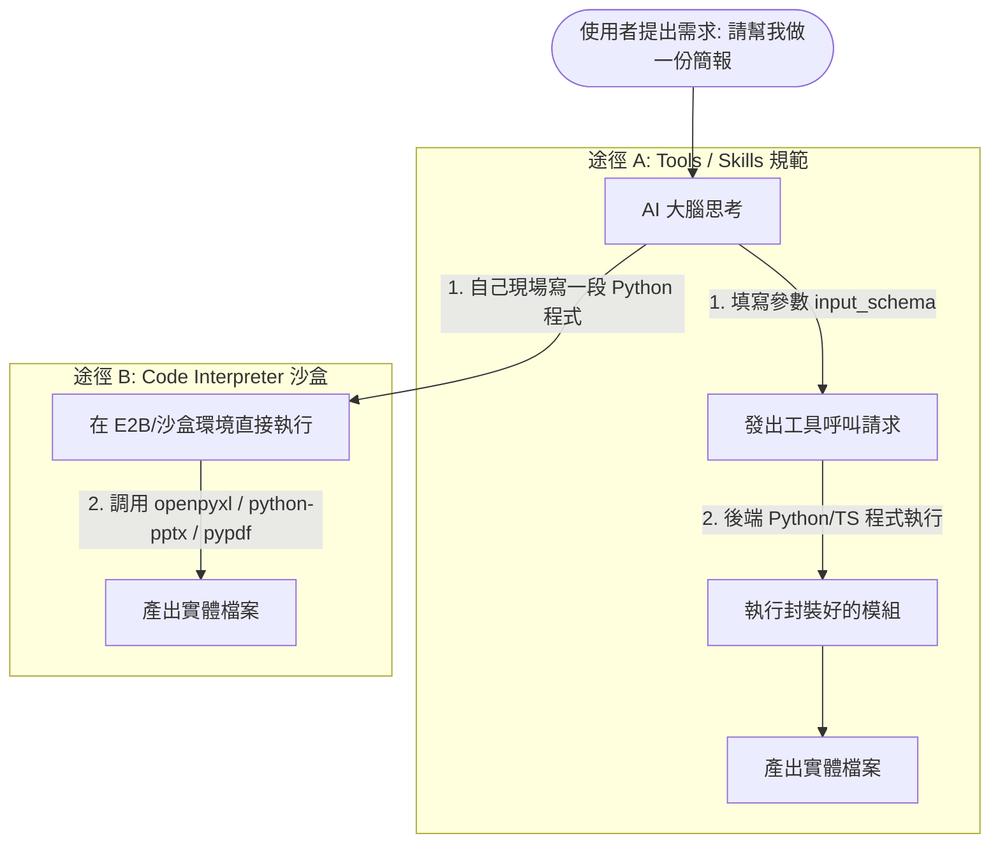

# 開放來源 Skills（4 大主流文件處理技能）

在生成式 AI 與 AI Agent 工作流中，**辦公文件處理（試算表、投影片、Word、PDF）** 是最常見且高價值的應用場景。以下整理開源社群中最主流的 4 大類 Skills 及其所屬生態庫：

---

## 📊 4 大開源文件 Skills 快速總覽

| Skill 類別 | 對應主流 Repo / 模組名稱 | 所屬主要生態庫（Star 數） | 核心功能與特點 |
|:---|:---|:---|:---|
| **📊 open-sheet** | `xlsx` / `spreadsheet-skill` | • [`anthropics/anthropic-quickstarts`](https://github.com/anthropics/anthropic-quickstarts) (~8k+) • [`e2b-dev/code-interpreter`](https://github.com/e2b-dev/code-interpreter) (~6k+) | 讀取、編輯與計算 `.xlsx` / `.csv` 表格，支援結構化資料萃取與公式填寫。 |
| **📽️ open-slide** | `pptx-generator` / `slide-maker` | • [`anthropics/anthropic-tools`](https://github.com/anthropics) / [`microsoft/autogen`](https://github.com/microsoft/autogen) (~35k+) | 建立與修改 `.pptx` 投影片、自動排版投影片主題、套用範本與插入圖表。 |
| **📝 open-docx** | `docx-manipulator` / `word-skill` | • [`run-llama/llama_index`](https://github.com/run-llama/llama_index) (~37k+) • [`langchain-ai/langchain`](https://github.com/langchain-ai/langchain) (~95k+) | 完整支援 Word (`.docx`) 文件的內容生成、段落/樣式修改及格式轉換。 |
| **📄 open-pdf** | `pdf-parser` / `pdf-reader` | • [`langchain-ai/langchain`](https://github.com/langchain-ai/langchain) (~95k+) • [`run-llama/llama_index`](https://github.com/run-llama/llama_index) (~37k+) | 解析 PDF 文字與表格、表單填寫、文字萃取與多頁分割/合併。 |

---

## 🔍 詳細介紹與應用場景

### 1. 📊 open-sheet（試算表 / 表格處理）
* **模組名稱**：`xlsx` / `spreadsheet-skill`
* **主流生態庫**：[`anthropics/anthropic-quickstarts`](https://github.com/anthropics/anthropic-quickstarts)、[`e2b-dev/code-interpreter`](https://github.com/e2b-dev/code-interpreter)
* **核心能力**：
  * 解析與讀取 Excel (`.xlsx`, `.xls`) 與 `.csv` 資料。
  * 自動計算統計數據、生成資料透視表與財務比率。
  * 支援將 AI 分析結果自動回寫至試算表儲存格，並建立動態公式與欄位格式。

---

### 2. 📽️ open-slide（投影片 / 簡報處理）
* **模組名稱**：`pptx-generator` / `slide-maker`
* **主流生態庫**：[`microsoft/autogen`](https://github.com/microsoft/autogen)、[`anthropics/skills`](https://github.com/anthropics/skills)
* **核心能力**：
  * 將結構化的大綱或講義文字，一鍵轉換為 `.pptx` 簡報檔案。
  * 自動選用合適的投影片版面配置（Title, Content, Two-Column 等）。
  * 支援企業品牌配色方案套用、圖表插入與字型樣式設定。

---

### 3. 📝 open-docx（Word 文件處理）
* **模組名稱**：`docx-manipulator` / `word-skill`
* **主流生態庫**：[`run-llama/llama_index`](https://github.com/run-llama/llama_index)、[`langchain-ai/langchain`](https://github.com/langchain-ai/langchain)
* **核心能力**：
  * 自動生成標準格式的公文、企劃書、會議紀錄與合約草稿。
  * 精準控制 Word 文件的標題層級、段落行距、表格框線與頁首/頁尾。
  * 支援範本（Template）變數取代與批次文件產出。

---

### 4. 📄 open-pdf（PDF 解析與處理）
* **模組名稱**：`pdf-parser` / `pdf-reader`
* **主流生態庫**：[`langchain-ai/langchain`](https://github.com/langchain-ai/langchain)、[`run-llama/llama_index`](https://github.com/run-llama/llama_index)
* **核心能力**：
  * 高精準度擷取 PDF 中的純文字與結構化表格資料（常用於 RAG 知識庫前處理）。
  * 支援掃描檔 OCR 辨識、表單欄位讀取與填寫。
  * 提供 PDF 檔案的分割、頁面重排、多檔合併與浮水印加註。

---

## ⚙️ 如何整合至 Agent / 助理工作流？

AI 模型本身本質上只是「文字生成大腦」，它**無法直接生出實體的 `.xlsx` 或 `.docx` 二進位檔案**。要讓 AI 擁有實際建立檔案的能力，主流有以下兩種整合方式：

### 1. 🔹 Anthropic Tools / Claude Skills 規範（外掛工具模式）
* **白話比喻**：就像給 AI 一張**「家電遙控器」**。遙控器上面有按鈕（例如「按此製作投影片」），並規定按按鈕時要輸入投影片標題、頁數等資訊（這就是 `input_schema`）。
* **運作原理**：
  1. 開發者先定義好工具規範（`input_schema`），告訴 AI 有這個能力。
  2. 當使用者要求產出簡報時，AI 填好參數並呼叫該工具。
  3. 後端的 Python 或 TypeScript 程式接收到參數後，在背景將檔案建好並回傳給使用者。
* **優點**：流程高度標準化、安全可控、適合固定格式的企業表單與流程。

---

### 2. 🔹 通用 Code Interpreter 方案（虛擬小電腦模式）
* **白話比喻**：就像給 AI 一台**「具備隔離安全機制的虛擬小電腦（沙盒 Sandbox）」**，裡面已經預先裝好了 `openpyxl`（試算表）、`python-pptx`（簡報）、`python-docx`（Word）、`pypdf`（PDF）等底層套件。
* **運作原理**：
  1. 當使用者說「請幫我畫一個銷售趨勢 Excel」，AI 會**現場自己寫一段 Python 程式碼**。
  2. AI 把這段程式碼送到沙盒環境（如開源的 [E2B](https://github.com/e2b-dev/code-interpreter) 或自建 Docker 容器）中即時執行。
  3. 執行完成後，直接將沙盒中產生的實體檔案提供給使用者下載。
* **優點**：極度靈活自由，AI 能處理各種複雜的計算、圖表繪製與客製化排版需求。

---

## 🔗 相關延伸閱讀

* 📖 **[Claude 官方 Skills 指令包](../Claude_ai/Skills/README.md)**：包含 PPTX、DOCX、XLSX、PDF 的即用實戰指令。
* 🔌 **[連結應用程式](../連結應用程式/README.md)**：Google Workspace、Canva 整合指南。
* 📝 **[儲存與重複使用 AI 提示詞](../儲存與重複使用AI提示詞/README.md)**：自訂提示詞與 AI 助手。
