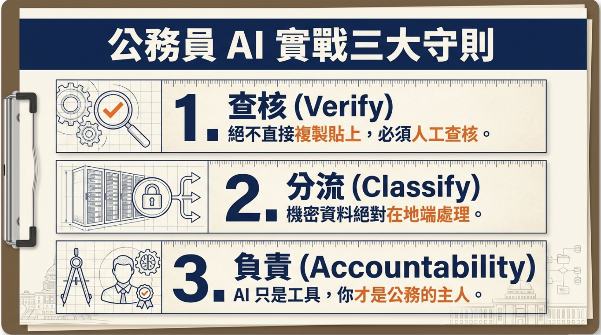

# 勞動局本部課程

## 課程大綱

- [**行政效率翻倍與資安實戰攻略.pdf下載**](./assets/行政效率翻倍與資安實戰攻略.pdf)

- [**課程大綱.pdf下載**](./assets/課程大綱.pdf)

## 🎯 目標

### 思維升級：Copilot ≠ Autopilot

> **核心觀念：Human-in-the-loop（人類參與決策循環）**  
> **Copilot**：人是機長，AI 負責輔助導航與草稿，**人保留最終決策權**。  
> **Autopilot**：在公務與職場情境中，若**完全放手**交給 AI、不審閱、不負責，將帶來**極高風險**。

✔ 把 AI 當成**每天並肩工作的副駕（Copilot）**，而不是取代你思考的「全自動」

✔ 用 AI **減少重複、瑣碎、低價值工作**（AI 協助約 80%，你聚焦約 20% 的方針、取捨與責任）

✔ 知道如何把 AI **嵌入既有流程，而不是額外負擔**

✔ 具備 AI 素養：**會下指令、會檢核、會修正**，不被新工具牽著走

✔ **使用免費方案**，零成本學習 AI 應用（有大量**需求**可再訂閱付費方案）

---

## 80/20 原則的應用（仍由人類負責最後一哩）

1. **讓 AI 做可重複、可驗證的基礎工作**：格式、結構、初稿與彙整
2. **你負責創意與決策**：方向、風格、合規與風險判斷、**最終品質與交付責任**
3. **持續優化 Prompt**：指令越清楚，副駕越能對齊你的意圖；產出後仍要**人類審閱**再對外使用

---

- [**提示詞:**](../../prompt/AI提示詞工程指南/README.md)  
  提示詞（Prompt）是與 AI 溝通的指令或描述，能夠決定 AI 的回覆內容與品質。撰寫清晰、具體的提示詞是有效運用 AI 的關鍵，包含角色設定、任務描述、格式要求與風格規範等，能讓 AI 更精確對齊使用者的需求。

- [**提示詞:不知道如何寫**](../../prompt/提示詞不知道怎麼寫/README.md)  
  如果不知道該如何撰寫有效的提示詞，可以參考這份指南，裡面提供了具體的寫作策略、常見問題以及範例，幫助你快速學會如何下達清晰、精確的指令，讓 AI 更容易理解與產出符合你期待的內容。

- [**公文與文案生成**](公文與文案的生成.md)  
  以迭代方式撰寫與修訂公文、函文與對外文宣，對齊機關語氣、格式與審閱責任；涉及法令文義時請搭配 [法規參考與下載說明](法規參考與下載說明.md) 取得並上傳法規 PDF。

- [**視覺化輔助**](視覺化輔助.md)  
  以 **Gemini**（**Nano Banana Pro** 等圖像／視覺能力）為主，說明視覺化 Prompt 技巧與兩則勞動局情境小範例；格式與 [公文與文案的生成](公文與文案的生成.md) 對齊。

- [**會議紀錄與摘要**](./會議紀錄與摘要/README.md)
  以勞動局**工務／工程業務**情境為例：**兩段錄音**→完整逐字稿→與簽到／紀錄表 **PNG 整合**並另存**完整會議記錄**→**ChatGPT Canvas** 一次上傳 **Word 模板**與該檔、產出對齊欄位之 Markdown 以利貼上；格式與 [公文與文案的生成](公文與文案的生成.md) 對齊。

- [**雲端vs地端AI**](./雲端vs地端AI/README.md)  
  比較雲端與地端運算差異；涉及敏感或機密資料時，宜採**地端模型**處理，降低外洩風險。

### 公務員AI實戰3大法則

在機關與公務情境使用生成式 AI 時，建議將下列三點內化為**日常操作習慣**（與下方圖卡對照）：

1. **查核**：**不**將 AI 產出直接當成定稿；須經人工審閱、事實查證與格式確認後，再對外或歸檔。
2. **分流**：涉及**機密、個資或依規不得外流**之資料，應依機關資安與個資規範，於**地端或核定環境**處理，避免不當上傳雲端。
3. **負責**：AI 僅為輔助工具；**承辦、覆核與決行者**仍須對內容正當性、法遵與對外說法負起責任。

