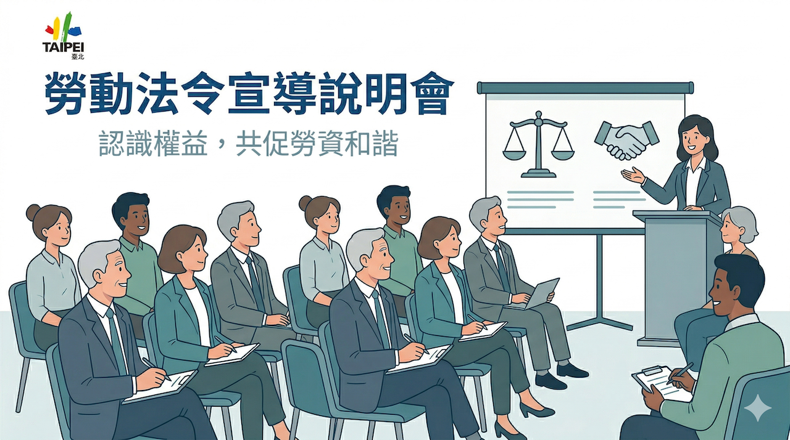
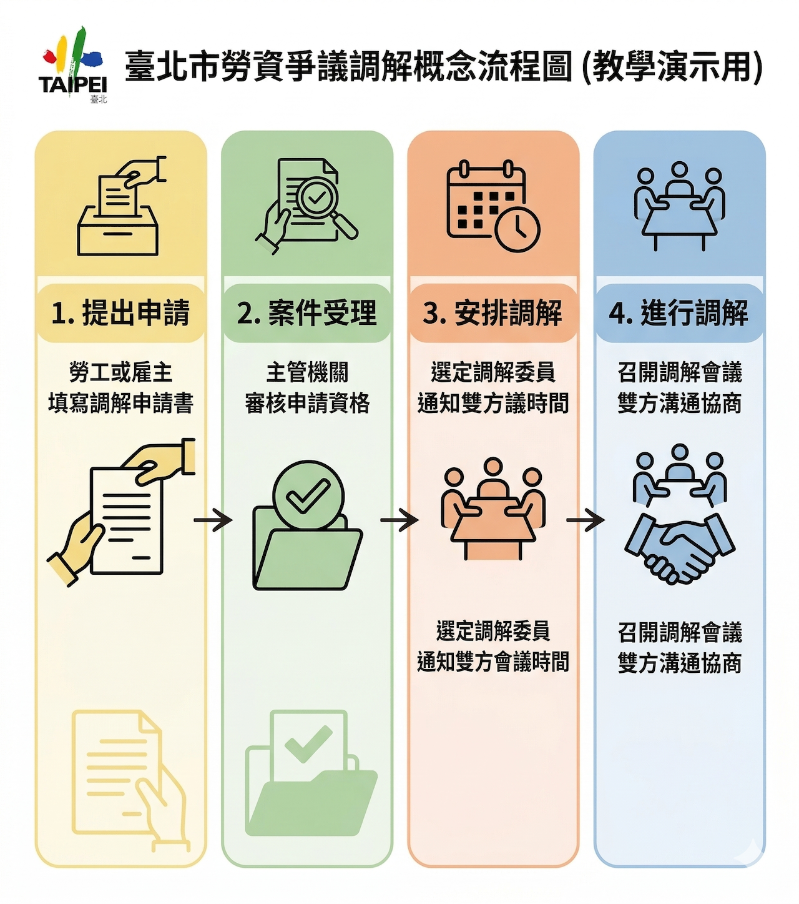

# 視覺化輔助

本單元對象為**臺北市政府勞動局**同仁。以下範例均為**教學用虛構情境**，實際對外圖像、海報與宣導素材仍須依**機關視覺識別規範、個資／資安規範、著作權與肖像權**，並經人工審閱後始得發布。

> 📌 **先講重點**：指令怎麼寫，可翻 [AI 提示詞工程指南](../../prompt/AI提示詞工程指南/README.md)。做圖也一樣，把 **RTCCF**（角色、做什麼、給誰看、不要什麼、要長怎樣）**分幾行講清楚**就好。

> **用哪套**：這裡以 **Gemini** 出圖、改圖為主（畫面上有時會看到 **Nano Banana Pro** 這類名稱，**以你用的版本跟機關規定為準**）。下指令的習慣可跟 [公文與文案的生成](./公文與文案的生成.md) 對著看。

> **設計元素**：可上傳**色票、參考圖、機關標誌**等檔案，讓模型對齊構圖或風格。本倉庫 `assets/` 已附 **臺北市市徽** 與**勞動局教學用組合示意**（見 [設計元素說明](./assets/設計元素_README.md)）；正式對外仍須用**機關核定**標誌與版型。

---

## 索引

- [公部門視覺素材：注意事項](#section-visual-policy)
- [設計元素：上傳與本倉庫附檔](#section-design-assets)
- [如何撰寫視覺化 Prompt（技巧）](#section-prompt-tips)
- [生成內容](#section-content)
  - [小範例一：宣導主視覺（海報構圖）](#section-ex1)
  - [小範例二：資訊圖表（流程／概念）](#section-ex2)
- [附錄：與「公文與文案的生成」格式對照](#section-appendix)

---

<a id="section-visual-policy"></a>

## 公部門視覺素材：注意事項

- **機關識別**：不請 AI **捏造**機關全銜、徽標、字號或與實際不符之標章；若需標示機關名稱，請於**後製**使用核定之標誌與版型，或於提示詞中明確寫「**不顯示**具體機關標誌，僅教學用構圖」。
- **個資與肖像**：圖中勿出現真實姓名、可識別個資之畫面；人物宜為**示意、非特定個人**。
- **法規文字**：若圖面需含**法令用語**，請**僅依上傳之法規 PDF** 或機關核可文案，與 [公文與文案的生成](./公文與文案的生成.md) 相同原則。
- **人類審閱**：生成圖像為**草稿**，須經承辦、核示後再對外使用。

---

<a id="section-design-assets"></a>

## 設計元素：上傳與本倉庫附檔

在 **Gemini** 對話若支援**附件／圖片參考**，建議先上傳與畫面相關的**設計元素**，再在 Prompt 裡寫清楚要怎麼用（例如：「左上角留白放標誌」「整體風格參考上傳圖的色調」）。常見可上傳內容包括：

| 類型 | 用途（舉例） |
|------|----------------|
| **機關標誌、組合字** | 構圖位置、比例參考（**勿**要 AI 任意改寫機關全稱或臆造徽標） |
| **色票／品牌色截圖** | 主色、輔色、背景色一致 |
| **參考海報或簡報截圖** | 版型、字級層級、留白節奏 |
| **法規或標語 PDF** | 圖上若印出文字，與 [公文與文案的生成](./公文與文案的生成.md) 相同，**僅依附件** |

**本倉庫附檔**（路徑：`others/勞動局本部課程/assets/`）：

| 檔案 | 說明 |
|------|------|
| [臺北市市徽_Emblem_of_Taipei_City.svg](./assets/臺北市市徽_Emblem_of_Taipei_City.svg) | 臺北市市徽向量檔（來源：Wikimedia Commons，詳見 [設計元素_README](./assets/設計元素_README.md)） |
| [臺北市政府勞動局_教學用組合示意.svg](./assets/臺北市政府勞動局_教學用組合示意.svg) | **市徽＋局名**之**教學用**橫式排法示意，**非**機關唯一指定版型；正式文宣請依核定 VI 辦理 |

完整說明與授權備註請見 [設計元素_README.md](./assets/設計元素_README.md)。

**Prompt 可一句話帶過**：「我已上傳市徽／組合示意 SVG，請參考版面留白與比例，**不要**自創其他機關標誌或變形標章。」

---

<a id="section-prompt-tips"></a>

## 如何撰寫視覺化 Prompt（技巧）

將需求寫成 **五段分行**（對應 RTCCF 精神），較容易得到穩定結果：

| 要素 | 視覺化時可這樣想 |
|------|------------------|
| **Role** | 誰在產出？（例如「平面設計師」）可選填，強化風格。 |
| **Task** | 要什麼產出？（海報、資訊圖、圖示、一張圖或分格） |
| **Context** | 給誰看？什麼場景？（勞工、事業單位、記者會背板） |
| **Constraints** | **不要**什麼？（不要真實機關標誌、不要可辨識個資、不要臆測法條號碼） |
| **Format** | 比例、色調、是否含繁體中文標題、插畫／照片風格、簡約或資訊量 |

**實務技巧**

1. **先說「用途」再說「風格」**：例如「宣導海報、直式 A4、友善、高對比」比單只寫「好看」清楚。  
2. **迭代修正**：第一輪只要構圖與色調；第二輪再請「加上簡短標題文字（繁體中文）」或「改為橫式」。  
3. **文字與法規**：圖上若需標語，請**先**準備核定稿或上傳 PDF，提示詞寫「**標題文字請使用以下原文：……**」，避免模型亂寫條號。  
4. **工具差異**：Gemini／Nano Banana Pro 之**介面名稱、是否支援多輪改圖**依版本而異，請以當前產品為準。

---

<a id="section-content"></a>

## 生成內容

<a id="section-ex1"></a>

### 小範例一：宣導主視覺（海報構圖）

#### 何時適合使用

* 需要活動或政策宣導之**主視覺草稿**（非正式發布稿）
* 需快速對齊「對象、主題、情緒」再交設計後製

---

#### 教師範例

**主題背景**：為**勞動法令宣導說明會**設計一張**教學用**直式海報構圖。**請先上傳**本倉庫 [臺北市政府勞動局_教學用組合示意.svg](./assets/臺北市政府勞動局_教學用組合示意.svg)（內含市徽與局名之組合示意），再下提示詞；圖面**不寫具體條號**。

<details>
<summary>💬 步驟 0～1：已上傳 SVG → 產生構圖（自然語言分行）</summary>

**前置（請先完成）**：在對話中上傳 [臺北市政府勞動局_教學用組合示意.svg](./assets/臺北市政府勞動局_教學用組合示意.svg)，並確認模型已能讀取附件。

```text
我已上傳「臺北市政府勞動局_教學用組合示意.svg」（教學用：市徽與局名之橫向組合）。請參考附件之標誌比例與留白，不要自創其他政府機關徽標，也不要任意變形附件中之圖形。

角色：你是一位熟悉公共政策宣導的平面設計師。
任務：請產出一張直式海報的視覺構圖描述（若工具支援直接出圖，請依此生成一張示意圖）。
背景：對象為本市市民與事業單位；主題為「勞動法令宣導說明會」；用途為教學演示。
限制：標誌區請與我上傳之 SVG 示意一致或預留相近位置；請勿標示具體法條號碼或金額；人物為示意、非特定個人；風格正向、清晰、無恐怖或歧視意象。
格式：直式 3:4 或 A4 比例感；主題區塊、副標區、主視覺插畫區；色調建議藍綠或藍灰系、留白充足；若圖上需有中文，請用繁體中文，僅寫「勞動法令宣導說明會」及一句簡短副標（例如「認識權益，共促勞資和諧」），勿寫未經核定的法條內文。
```

**產出（示意說明）**

一張可讀性高、分區清楚之宣導海報草稿，主標為「勞動法令宣導說明會」，構圖呼應已上傳之組合示意 SVG，無具體條號。

</details>

<details>
<summary>💬 步驟 2：迭代——調整為橫式或加簡報用標題</summary>

```text
延續同一上傳之「臺北市政府勞動局_教學用組合示意.svg」，請在相同主題下改為橫式 16:9 簡報封面用主視覺；標誌區仍請對照附件，不寫法條號。若圖上有文字，維持繁體中文並只保留主標與一句副標。
```

</details>

---

| 範例 1 | 範例 1（二） |
|--------|-------------|
|  |  |

<a id="section-ex2"></a>

### 小範例二：資訊圖表（流程／概念）

#### 何時適合使用

* 需向民眾說明**流程、步驟或概念關係**（非法律意見）
* 以圖表降低文字門檻，後續可再交美編重製

---

#### 教師範例

**主題背景**：為**勞資爭議調解**之**概念流程**製作一張圖表化草稿（教學用，**非**正式法規或程序說明）。**請先上傳**本倉庫 [臺北市市徽_Emblem_of_Taipei_City.svg](./assets/臺北市市徽_Emblem_of_Taipei_City.svg)，作為圖表角落或頁首之**品牌元素參考**（來源見 [設計元素_README](./assets/設計元素_README.md)）。

<details>
<summary>💬 步驟 0～1：已上傳市徽 SVG → 產生資訊圖（自然語言分行）</summary>

**前置（請先完成）**：在對話中上傳 [臺北市市徽_Emblem_of_Taipei_City.svg](./assets/臺北市市徽_Emblem_of_Taipei_City.svg)。

```text
我已上傳「臺北市市徽_Emblem_of_Taipei_City.svg」。請在流程圖中保留適當之市徽占位（例如左上角或標題旁），比例低調、不搶過主流程；勿自創其他政府徽標。

角色：你是一位熟悉資訊視覺化的設計師。
任務：請產出一張「勞資爭議調解」概念流程圖（若工具支援出圖，請依此生成；若僅能文字，請以條列＋結構說明）。
背景：對象為一般勞工與雇主；目的為教學演示「申請→受理→調解」的概念順序，非個案法律諮詢。
限制：市徽樣式請僅依我提供之 SVG，勿另行繪製與附件不符之圖樣；請勿寫具體法條號碼或承諾法律結果；步驟名稱用一般性描述（如「提出申請」「安排調解」）即可。
格式：由左至右或由上至下之流程；每欄簡短繁體中文標籤；簡約、圖示化、對比清楚；避免超過 5 個主要步驟區塊。
```

**產出（示意說明）**

一張步驟清楚、用語中性之流程圖草稿，角落或頁首含與上傳市徽 SVG 一致之示意，**不含**法條號碼。

</details>

<details>
<summary>💬 步驟 2：迭代——改為「直式懶人包」一張圖</summary>

```text
延續同一上傳之「臺北市市徽_Emblem_of_Taipei_City.svg」，請將同一概念改為「直式懶人包」單張長圖結構；市徽仍置於頂部或第一段旁，維持不寫法條號。每段一句繁體中文短句，最多四段。
```

</details>

| 範例 1 | 範例 1（二） |
|--------|-------------|
|  |  |

---

<a id="section-appendix"></a>

## 附錄：與「公文與文案的生成」格式對照

本教學文件之範例格式儘量與 [公文與文案的生成](./公文與文案的生成.md) 一致：

| 元素 | 用途 |
|------|------|
| **主題背景** | 先說情境與對象，再給提示詞 |
| **`<details>` 摺疊** | 收合長提示詞，版面較不雜亂 |
| **自然語言分行** | 對應 RTCCF 五要素，視覺化任務同樣適用 |
| **法規 PDF** | 圖面若含法令標語或條文，仍須先上傳法規文本或只用核定稿 |
| **設計元素（標誌／色票／參考圖）** | 與 [設計元素：上傳與本倉庫附檔](#section-design-assets) 一節相同；本倉庫附 [市徽 SVG](./assets/臺北市市徽_Emblem_of_Taipei_City.svg)、[勞動局組合示意](./assets/臺北市政府勞動局_教學用組合示意.svg) |

實務上，**Gemini** 圖像功能（含介面所稱之 **Nano Banana Pro** 等）之操作方式與可用性，請以 Google 官方與貴機關核定之環境為準。
