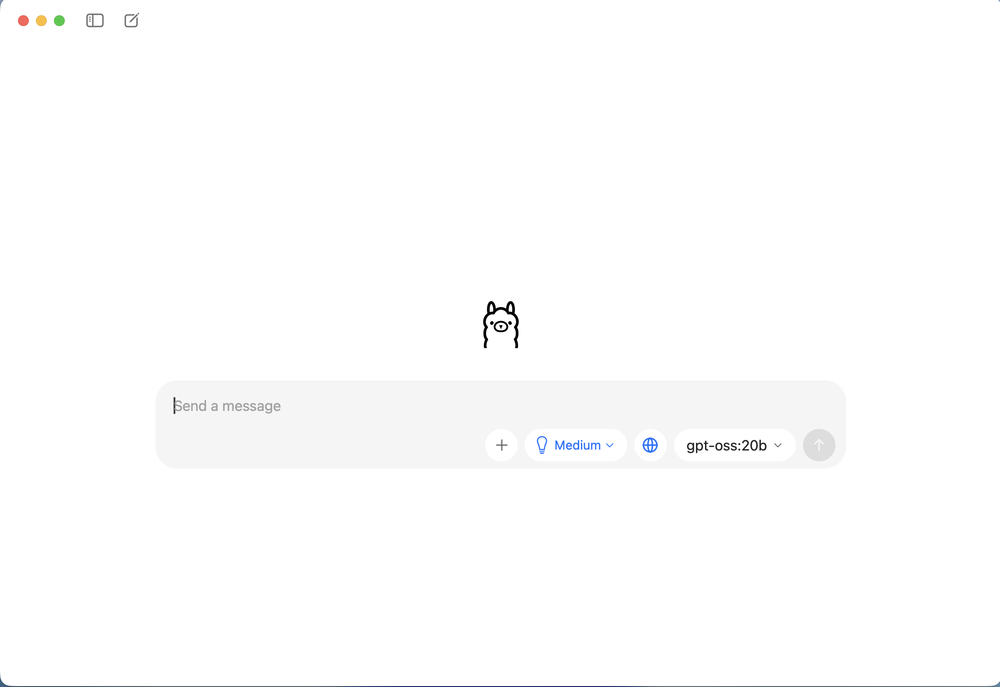
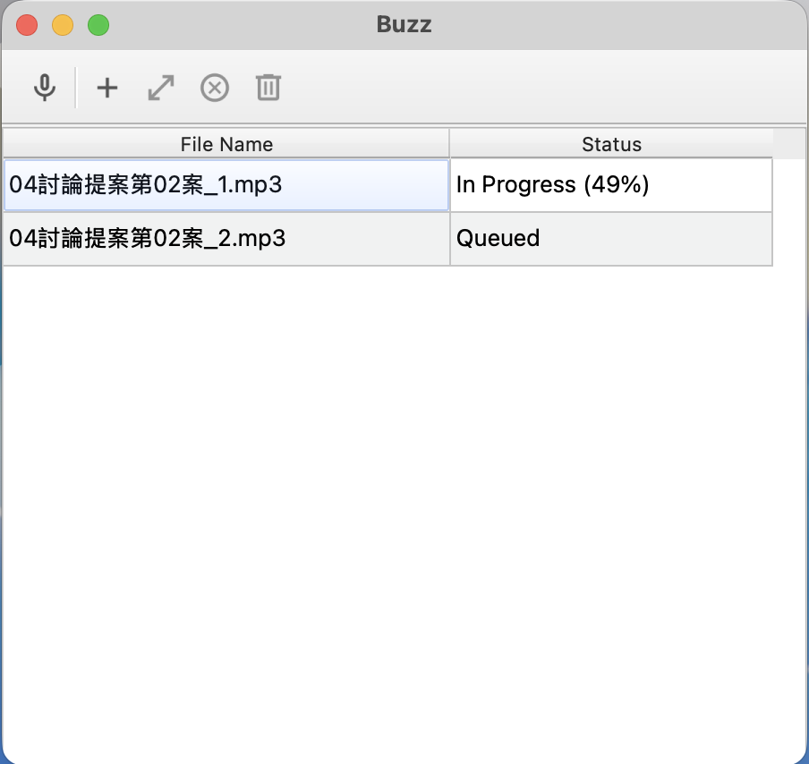

# 雲端vs地端AI

本說明以 **Buzz** 離線轉出逐字稿、**手動合併**字幕檔後，再以 **Ollama（`gpt-oss:20b`）** 產出會議文件為主軸。

---

## 主要的 AI 工具

| 工具 | 用途（本單元） |
|------|----------------|
| **Buzz** | 錄音／影片轉 **SRT 逐字稿**（離線） |
| **Ollama** + **`gpt-oss:20b`** | 依合併後逐字稿產出 **會議記錄、決議、待辦、追蹤**（純文字對話，無附檔） |

---

## 安裝

介面截圖以下列**兩欄並排**顯示（每欄約半頁寬，較利閱讀；若覺得偏小可對圖片右鍵新分頁開啟原檔）。

<table>
  <tr>
    <td width="50%" valign="top" align="center">
      <p><strong>Ollama</strong>（地端 LLM）</p>
      <p></p>
    </td>
    <td width="50%" valign="top" align="center">
      <p><strong>Buzz</strong>（語音轉文字）</p>
      <p></p>
    </td>
  </tr>
</table>

### 一、Ollama（地端 LLM）

- **官方網站**：[https://ollama.com/download](https://ollama.com/download)
- **課程模型 `gpt-oss:20b`**：僅能處理**文字**，**無法解析圖片**（無視覺／多模態）。本單元只用作逐字稿→會議文件；若要讀圖請改用支援視覺的模型或其他工具。

#### macOS

1. **推薦**：官網下載 `.dmg` 安裝；**或**終端機執行：`curl -fsSL https://ollama.com/install.sh | sh`
2. 開啟 Ollama App，於終端機執行：`ollama pull gpt-oss:20b`
3. **驗證**：`ollama run gpt-oss:20b`，可對話即成功

#### Windows

1. 官網下載 `.exe` 安裝
2. 於 CMD／PowerShell 執行：`ollama pull gpt-oss:20b`
3. **驗證**：`ollama run gpt-oss:20b`

---

### 二、Buzz（語音轉文字）

- **官方下載**：[Buzz 於 SourceForge 的檔案頁](https://sourceforge.net/projects/buzz-captions/files/)
- 免費開源、離線，採 Whisper，支援多語系

#### macOS

1. SourceForge 依架構（Intel／Apple Silicon）下載 `.dmg`，裝入「應用程式」
2. 首次於設定下載 **small** 模型（課程建議）
3. **驗證**：匯入音訊，能產生逐字稿即可

#### Windows

1. 下載 `.exe` 安裝（若出現未簽署，選「更多資訊」→「仍要執行」）
2. 首次下載 **small** 模型
3. **驗證**：匯入音訊測試

---

## 作業流程總覽

```text
Buzz 轉 SRT → 編輯器手動合併成單一檔 → 複製全文 + 提示詞 → Ollama 產出四類文件
```

**最終產出（僅能依逐字稿，勿臆測未出現內容）：**

| 產出 | 說明 |
|------|------|
| 會議記錄 | 討論歷程與重點整理 |
| 決議事項 | 會中**明確作成**之決議、結論 |
| 待辦事項 | 須**執行**的具體工作（主責、期限以逐字稿為準） |
| 追蹤事項 | 須**列管或後續確認**者（再行研議、下次報告等） |

定稿依據為 **手動合併後的單一 SRT**（本倉庫範例見下表「手動合併」列，或使用你自己的合併檔）。

### 使用 Ollama 前請知

| 項目 | 說明 |
|------|------|
| 輸入方式 | **無法上傳附件**，僅能**複製貼上**文字 |
| 介面 | 以終端機 `ollama run` 為主，**無** ChatGPT Canvas 類畫布 |
| 圖片 | **`gpt-oss:20b` 不讀圖**，無法以截圖／圖檔當輸入 |
| 長度 | 地端模型有**上下文長度**上限；太長請**分段貼**或換模型 |

---

### 課程範例檔案（[`資料來源`](./資料來源)）

<a id="course-srt-manual-merge"></a>

| 用途 | 檔案 |
|------|------|
| 第一段（Buzz） | [`04討論提案第02案_1_逐字稿.srt`](./資料來源/04討論提案第02案_1_逐字稿.srt) |
| 第二段（Buzz） | [`04討論提案第02案_2_逐字稿.srt`](./資料來源/04討論提案第02案_2_逐字稿.srt) |
| 手動合併（`_1`＋`_2`） | [`手動合併_逐字稿.srt`](./資料來源/手動合併_逐字稿.srt) |

---

## 步驟說明

### 1. Buzz：錄音轉文字

- 模型可選 `tiny`～`large`（範例曾用 **medium**，耗時約**一小時**級距，視硬體與長度而定）
- 建議輸出 **SRT**（含時間碼與台詞）；檔名可對照上表 **[課程範例檔案](#course-srt-manual-merge)**

### 2. 手動合併兩段 SRT

1. **順序**：先 **`_1`**，再 **`_2`**（與錄音分段一致）
2. 於編輯器接成**單一檔**；若須**合法 SRT**（序號、時間軸連續）請自行調整
3. 交給 Ollama 時，重點是**台詞完整、段落銜接合理**（步驟 3 會略過時間碼）
4. 可比對範例：[手動合併_逐字稿.srt](./資料來源/手動合併_逐字稿.srt)

### 3. Ollama：產出會議文件

**操作要點**

1. 終端機執行：`ollama run gpt-oss:20b`
2. 開啟你的**合併檔**，全選複製；與下方**提示詞**一併貼入（太長可**分段貼**，或「先逐字稿、再提示詞」分兩則）
3. 模型應輸出 **`## 會議記錄`～`## 追蹤事項`** 四區；**僅依逐字稿**，勿臆測其他場次或文中未載明事項

**提示詞（貼入 `gpt-oss:20b`，可整段複製）**

```text
角色：你是協助撰寫正式會議文件之助理，輸出繁體中文。

任務：我會貼上會議**逐字稿**（可能為 SRT，含時間碼；無法附檔）。請**只依本次貼上之台詞內容**（略過時間碼與字幕序號），產出以下四部分：
1) **會議記錄**：依討論順序整理重點，包含議題、各方意見要點、共識與歧見（若有）；用語正式、條理清楚，可供存檔備查。
2) **決議事項**：逐條列出逐字稿中**明確作成**之決議與結論（「會議決定」「議決」「通過」等語意者）。著重在**做成什麼決定**，不必在此重複執行細節（細節放待辦）。
3) **待辦事項**：因決議或討論而須**執行**之具體工作；逐條寫清**要做什麼**、**主責**（單位／職稱／姓名，逐字稿有載明者）、**期限或完成節點**（有則寫，無則註「逐字稿未載明」）。逐字稿**未提及**者請勿捏造。
4) **追蹤事項**：須**持續關注、列管、追蹤結果或下次再報**者（例如「再行研議」「續觀察」「下次會議報告」「俟○○回覆後辦理」等語意）；同樣僅列逐字稿有依據者，並簡述**追蹤緣由**與**已知主責／時程**（有則寫）。

限制：勿臆測「上一場次」「其他會議」或逐字稿未載明之外部情境；勿新增逐字稿中未出現之人名、數字、法條或結論。若某區逐字稿完全無依據，該區標題下可寫「（逐字稿未載明相關事項）」。資訊不足處請標註「未明」或「逐字稿未載明」。

格式：Markdown；依序四個二級標題：「## 會議記錄」「## 決議事項」「## 待辦事項」「## 追蹤事項」。待辦、追蹤若條列，建議使用清單並盡量含主責、期限欄位（無則註明未載明）。
```
