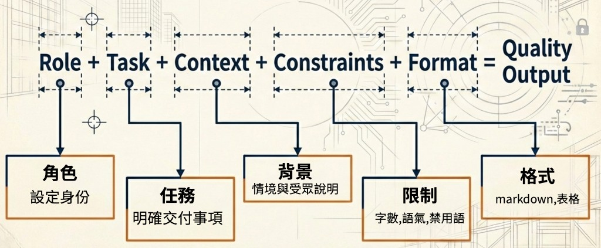
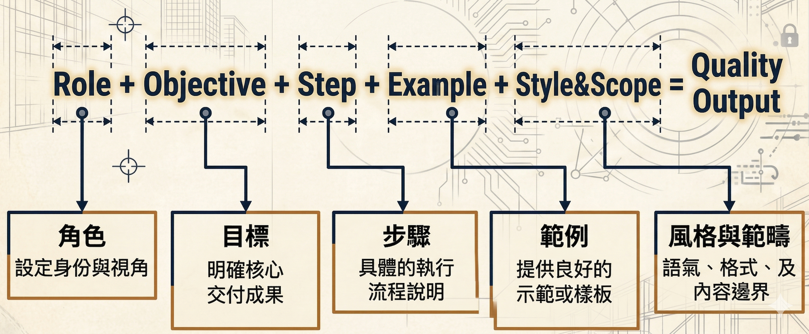

# AI 提示詞工程｜職場實戰指南

學會正確下指令，才能真正讓 AI 幫你省時間、提升品質。  
同樣的工具，「說法不同」就會得到天差地遠的結果。

---

## 為什麼 Prompt 這麼重要？

你可以把 AI 想像成一位剛到職的新同事：

- 他很聰明，什麼都會一點
- 但他**不知道你的脈絡、你的需求、你要的格式**
- 你交代得越清楚，他做出來的東西越好

**Prompt（提示詞）就是你給 AI 的工作說明書。**

---

## 框架怎麼選？

實務上常用**兩套結構**，適用情境不同，可以並存於你的工具箱裡：

| 情境 | 建議框架 | 說明 |
|------|----------|------|
| **一般任務**（單次請求、一則一結） | **Role + Task + Context + Constraints + Format** | 寫 Email、摘要、文案、整理資料等，用五要素就能清楚對齊「誰、做什麼、在什麼脈絡、有何限制、長什麼樣子」。 |
| **長篇 Instructions／工作流** | **ROSES**（Role, Objective, Steps, Example／output format, Scope & style） | 貼在 ChatGPT Project **Instructions**、Gemini **Gem 使用說明**、Claude **Project 指令**、或需要**多步驟＋固定輸出規則**時，用 ROSES 較好維護與迭代。 |

> 💡 沒有絕對對錯：同一個任務你也可以先用「五要素」試跑，若發現要變成**長期重複使用的系統指令**，再改寫成 ROSES。

---

## 一般任務：Role + Task + Context + Constraints + Format

下列公式適合**日常、單次或短回合**的提示詞：把五塊拼齊，輸出品質通常會明顯穩定。

**Role + Task + Context + Constraints + Format → 高品質輸出**



| 要素 | 英文 | 重點 | 你可以這樣想 |
|------|------|------|----------------|
| **角色** | Role | 設定身份 | AI 要以什麼專家／職位口吻協助？ |
| **任務** | Task | 明確交付事項 | 具體要完成什麼（一句話說清「產出物」）？ |
| **背景** | Context | 情境與受眾 | 發生什麼事、給誰看、有無已知資料？ |
| **限制** | Constraints | 字數、語氣、禁用語 | 不能寫什麼、必須遵守什麼、長度與語調？ |
| **格式** | Format | 結構與呈現 | 要段落、條列、表格、Markdown 或特定欄位？ |

**快速填空（可貼在記事本重複使用）** — 以下提供 **自然語言**（口語一段話，最貼近日常對話習慣）、**YAML**（利於結構化、設定檔、API）與 **Markdown**（利於閱讀、直接貼入對話）三種寫法，**擇一即可**；內容等價，差在形式。摺疊區順序為：**自然語言 → YAML → Markdown**。

<details>
<summary>快速模板 — 自然語言</summary>

```text
請擔任……（角色）。我需要你……（交付物名稱）。背景是……（情境、對象或場合）。請注意……（限制：字數、語氣、不要寫的內容）。請用……格式輸出（例如：三段式 Email、含欄位之表格）。
```

</details>

<details>
<summary>快速模板 — YAML</summary>

```yaml
role: "你是一位……"
task: "請……（交付物名稱）"
context: |
  背景：……
  對象／場合：……
constraints:
  - "字數、語氣、禁止事項等"
format: |
  輸出請用……（例如：三段式 Email、含欄位之 Markdown 表格）
```

</details>

<details>
<summary>快速模板 — Markdown</summary>

```markdown
## Role

你是一位……

## Task

請……（交付物名稱）

## Context

背景：……；對象／場合：……

## Constraints

限制：……（字數、語氣、禁止事項）

## Format

輸出請用……（例如：三段式 Email、含欄位之 Markdown 表格）
```

</details>

---

## 職場實戰範例（一般任務）

以下範例皆採 **Role + Task + Context + Constraints + Format**；每則含 **自然語言**、**YAML**、**Markdown** 三種寫法（摺疊區順序亦同），方便複製與對照。（習慣直接聊天的同學，可從第一個摺疊「自然語言」開始，再對照結構化寫法是否涵蓋五要素。）

### 📧 範例 1：撰寫商務 Email

**主題背景**：**華梵大學圖書館**（買方）向「**三民書局**」（供應商）訂購 50 本圖書；因**三民書局端**備料／供應鏈因素，無法依原定日期出貨。應由**供應商**撰寫致歉信給**圖書館採購承辦**（客戶），說明預計下週五出貨，並提供九折優惠券補償——**不是**由圖書館向書局道歉。

<details>
<summary>範例 1 提示詞 — 自然語言</summary>

```text
請你扮演有十年商務溝通經驗的專家，幫我寫一封給客戶（買方）的致歉 Email。我是三民書局的聯絡窗口，對象是華梵大學圖書館採購承辦；對方訂購的 50 本書因我們這邊備料不足，沒辦法在原定日出貨，預計下週五才能出貨，我們會提供九折優惠券當補償。請用繁體中文、正式但誠懇的語氣，全文約 200 字以內（不含主旨），不要承諾文件沒寫的額外賠償。請先給一行主旨建議，內文依序寫：致歉、簡短說明原因、預計出貨日、補償說明、再次致歉與感謝。
```

</details>

<details>
<summary>範例 1 提示詞 — YAML</summary>

```yaml
role: 你是一位具有十年經驗的商務溝通專家。
task: 撰寫一封供應商給客戶（買方）的致歉 Email，說明訂單出貨延誤並提出補償。
context: |
  發信單位：三民書局（供應商／聯絡窗口）；對象：華梵大學圖書館採購承辦（客戶／買方）。
  事實：對方訂購 50 本圖書；因供應商端備料不足無法於原定日出貨；預計下週五可出貨。
  補償：提供九折優惠券。
constraints:
  - 語言：繁體中文；語氣正式但不冷漠，帶有誠意。
  - 全文約 200 字以內（不含主旨）。
  - 不承諾文件未載明之額外賠償。
format: |
  先給一行「主旨：」建議文字。
  內文依序：致歉 → 原因（簡短）→ 預計出貨日 → 補償說明 → 再次致歉與感謝。
```

</details>

<details>
<summary>範例 1 提示詞 — Markdown</summary>

```markdown
## Role

你是一位具有十年經驗的商務溝通專家。

## Task

撰寫一封供應商給客戶（買方）的致歉 Email，說明訂單出貨延誤並提出補償。

## Context

- 發信單位：三民書局（供應商／聯絡窗口）；對象：華梵大學圖書館採購承辦（客戶／買方）。
- 事實：對方訂購 50 本圖書；因供應商端備料不足無法於原定日出貨；預計下週五可出貨。
- 補償：提供九折優惠券。

## Constraints

- 語言：繁體中文；語氣正式但不冷漠，帶有誠意。
- 全文約 200 字以內（不含主旨）。
- 不承諾文件未載明之額外賠償。

## Format

- 先給一行「主旨：」建議文字。
- 內文依序：致歉 → 原因（簡短）→ 預計出貨日 → 補償說明 → 再次致歉與感謝。
```

</details>

<details>
<summary>🧑‍💻 練習 1：寫一封道歉信</summary>

**主題背景**：你是**華梵大學教務處**承辦人，原定今天下班前要交出的「**114 學年度課程大綱彙整報告**」因臨時會議無法完成，需發 Email 通知主管，說明原因並告知預計明天中午前交出。

請用 **Role + Task + Context + Constraints + Format** 撰寫這封 Email 的 Prompt（五段都試著填滿）；可任選 **自然語言**（一段話）、YAML 或 Markdown。

<details>
<summary>練習 1 — 空白模板（自然語言）</summary>

```text
請擔任……（角色）。我需要你……（要做的事／交付物）。背景是……（情境、對象、主管在意的點）。請注意……（字數、語氣、期限、不要寫的內容）。請用……方式呈現（例如：Email 要有主旨行與內文分段）。
```

</details>

<details>
<summary>練習 1 — 空白模板（YAML）</summary>

```yaml
role: ""
task: ""
context: |
constraints:
  - ""
format: |
```

</details>

<details>
<summary>練習 1 — 空白模板（Markdown）</summary>

```markdown
## Role


## Task


## Context


## Constraints


## Format

```

</details>

**試跑看看：** 把你的 Prompt 貼到 ChatGPT 或 Claude，觀察輸出結果。  
輸出不理想？優先調整 **Context**（補齊主管在意的資訊）或 **Constraints**（字數、語氣）。

</details>

---

### 📊 範例 2：資料整理與分析摘要

**主題背景**：你是**華梵大學附設書店**的業務分析師，手上有台北、台中、高雄三家門市的本月與上月銷售數據，需要快速找出業績異常的門市（成長率低於 -10% 視為異常）。

（請在 **context**、**Context** 區塊貼上你的實際數據；若用**自然語言**，可在結尾加「資料如下：」再接數字。）

<details>
<summary>範例 2 提示詞 — 自然語言</summary>

```text
你是擅長解讀數據的業務分析師。我會在下方貼上台北、台中、高雄三家門市本月與上月的銷售額，請你整理成摘要，並標出「異常」門市（我把異常定義成月成長率低於 -10%）。這份是要給店長看的，要一眼看出哪裡有問題。請用繁體中文；若要猜原因，最多 1～2 點並請標成「可能原因」，不要過度斷言；也不要捏造我沒提供的數字。請先輸出一個 Markdown 表格，欄位是：門市、本月銷售額、上月銷售額、成長率、狀態（正常或異常），表格下面再附一段 100 字以內的文字摘要。
```

</details>

<details>
<summary>範例 2 提示詞 — YAML</summary>

```yaml
role: 你是一位擅長數據解讀的業務分析師。
task: 將下列門市銷售數據整理成摘要，標出「異常」門市並附簡短文字結論。
context: |
  有三家門市：台北、台中、高雄；資料為本月與上月銷售額。
  閱讀對象：店長，需要一眼看懂哪裡出問題。
  （在此貼上實際數據）
constraints:
  - 語言：繁體中文。
  - 「異常」定義：月成長率 < -10%。
  - 原因推測最多 1～2 點，且需標註為「可能原因」、避免過度斷言。
  - 不要捏造未提供之數字。
format: |
  先輸出一個 Markdown 表格，欄位：門市｜本月銷售額｜上月銷售額｜成長率｜狀態（正常／⚠️ 異常）。
  表格後附一段 100 字以內的文字摘要。
```

</details>

<details>
<summary>範例 2 提示詞 — Markdown</summary>

```markdown
## Role

你是一位擅長數據解讀的業務分析師。

## Task

將下列門市銷售數據整理成摘要，標出「異常」門市並附簡短文字結論。

## Context

- 有三家門市：台北、台中、高雄；資料為本月與上月銷售額。
- 閱讀對象：店長，需要一眼看懂哪裡出問題。
- （在此貼上實際數據）

## Constraints

- 語言：繁體中文。
- 「異常」定義：月成長率 < -10%。
- 原因推測最多 1～2 點，且需標註為「可能原因」、避免過度斷言。
- 不要捏造未提供之數字。

## Format

- 先輸出一個 Markdown 表格，欄位：門市｜本月銷售額｜上月銷售額｜成長率｜狀態（正常／⚠️ 異常）。
- 表格後附一段 100 字以內的文字摘要。
```

</details>

<details>
<summary>🧑‍💻 練習 2：讓 AI 幫你整理資料</summary>

**主題背景**：你是**華梵大學電商平台**客服主管，以下是本週客服回報紀錄，需請 AI 整理出最常出現的問題類型、排出處理優先順序，並建議每類的標準回覆方向：

<details>
<summary>展開：本週客服回報紀錄（貼入 Prompt 的 Context）</summary>

```markdown
- 客戶A：商品收到破損，要求退換貨
- 客戶B：詢問出貨時間
- 客戶C：APP 無法登入
- 客戶D：商品顏色與網頁不符
- 客戶E：詢問出貨時間
- 客戶F：APP 無法登入
- 客戶G：發票未收到
```

</details>

請用 **Role + Task + Context + Constraints + Format** 設計 Prompt（**自然語言**、YAML 或 Markdown 擇一）；**Format** 請明確要求「表格＋優先級欄位」或「條列＋每類一句回覆方向」。

**想一想：** 若優先級判斷與你預期不同，你會改 **Context**（補上營運策略）還是 **Constraints**（定義何謂「高優先」）？

</details>

---

### 📑 範例 3：簡報大綱製作

**主題背景**：你是**華梵大學資訊處**承辦人，需製作「**2025 年度資訊處成果報告**」向校務會議簡報，包含系統建置、資安改善、服務統計等，但不知道從何開始規劃架構。

<details>
<summary>範例 3 提示詞 — 自然語言</summary>

```text
你是資深簡報顧問，請幫我規劃「2025 年度資訊處成果報告」的簡報大綱（投影片級）。我要在**校務會議**向**校內行政主管**報告，內容要涵蓋系統建置、資安改善、服務統計，最後一張留「未來展望與資源需求」。請用繁體中文、正式商務口吻，總共 5～7 張（含封面），每張最多 3 個重點；不要亂編具體數字或專案名稱，若需要範例請標註「（範例）」。格式上：第 1 張封面（標題、報告人、日期可留占位）；第 2 張到倒數第 2 張，每張寫標題與 3 個重點；最後一張寫未來展望與資源需求。
```

</details>

<details>
<summary>範例 3 提示詞 — YAML</summary>

```yaml
role: 你是一位資深簡報顧問，擅長將複雜資訊轉成有邏輯的簡報結構。
task: 產出「2025 年度資訊處成果報告」的簡報大綱（投影片級）。
context: |
  場合：校務會議；聽眾：校內行政主管。
  內容須涵蓋：系統建置、資安改善、服務統計；可適度保留「未來展望與資源需求」空間。
constraints:
  - 語言：繁體中文；風格：正式商務。
  - 總張數：5～7 張（含封面）；每張最多 3 個重點。
  - 不虛構具體數據或專案名稱，若需範例請標註「（範例）」。
format: |
  第 1 張：封面（標題、報告人、日期占位）。
  第 2～N 張：每張列出「標題」與「3 個重點（條列）」。
  最後一張：未來展望與資源需求（仍遵守每張 3 重點）。
```

</details>

<details>
<summary>範例 3 提示詞 — Markdown</summary>

```markdown
## Role

你是一位資深簡報顧問，擅長將複雜資訊轉成有邏輯的簡報結構。

## Task

產出「2025 年度資訊處成果報告」的簡報大綱（投影片級）。

## Context

- 場合：校務會議；聽眾：校內行政主管。
- 內容須涵蓋：系統建置、資安改善、服務統計；可適度保留「未來展望與資源需求」空間。

## Constraints

- 語言：繁體中文；風格：正式商務。
- 總張數：5～7 張（含封面）；每張最多 3 個重點。
- 不虛構具體數據或專案名稱，若需範例請標註「（範例）」。

## Format

- 第 1 張：封面（標題、報告人、日期占位）。
- 第 2～N 張：每張列出「標題」與「3 個重點（條列）」。
- 最後一張：未來展望與資源需求（仍遵守每張 3 重點）。
```

</details>

<details>
<summary>🧑‍💻 練習 3：規劃你自己的簡報架構</summary>

請選擇以下任一主題，用 **Role + Task + Context + Constraints + Format** 請 AI 規劃 **6～8 頁**簡報大綱：

- 📌 **主題 A**：向**華梵大學教務處主管**提案「導入 AI 工具以提升部門效率」
- 📌 **主題 B**：**華梵大學**新人訓練簡報「如何使用校務系統、選課系統、差勤系統」
- 📌 **主題 C**：自選一個你工作上真實會用到的主題（請寫在 Context）

**評估標準：**
- **Role** 是否對應簡報顧問或該領域專家？
- **Context** 是否寫清「聽眾與場合」？
- **Format** 是否指定頁數、每頁重點數？

</details>

---

### 📣 範例 4：行銷文案撰寫

**主題背景**：你是**華梵大學附設書店**行銷人員，夏季促銷活動即將開始，活動內容為「全館滿 999 折 100，活動至 8/31」，需產出一則 Facebook 貼文宣傳。

<details>
<summary>範例 4 提示詞 — 自然語言</summary>

```text
請當熟悉台灣社群的行銷企劃，幫我寫一則要貼在 Facebook 的夏季促銷貼文。對象是校內師生和一般大眾；活動是「全館滿 999 折 100」，到 8/31 截止。請用繁體中文，口吻親切有活力但不要過度誇大；150 字內、要有 emoji、結尾附 3～5 個 hashtag，一定要把滿額門檻和截止日寫清楚避免誤導。段落安排：第一段開場吸睛 1～2 句；第二段寫活動條件與截止日；第三段行動呼籲；最後一行放 hashtag。
```

</details>

<details>
<summary>範例 4 提示詞 — YAML</summary>

```yaml
role: 你是一位熟悉台灣社群生態的行銷企劃。
task: 撰寫一則 Facebook 貼文，宣傳夏季促銷。
context: |
  管道：Facebook；對象：一般大眾與校內師生。
  活動：全館滿 999 折 100；活動截止日 8/31。
constraints:
  - 語言：繁體中文；口吻親切、有活力，避免過度誇大。
  - 字數：150 字以內；需含 emoji；附 3～5 個 hashtag。
  - 必須寫清活動門檻與截止日，避免誤導。
format: |
  第一段：吸睛開場（1～2 句）。
  第二段：活動條件與截止日。
  第三段：行動呼籲（CTA）。
  最後一行：hashtag。
```

</details>

<details>
<summary>範例 4 提示詞 — Markdown</summary>

```markdown
## Role

你是一位熟悉台灣社群生態的行銷企劃。

## Task

撰寫一則 Facebook 貼文，宣傳夏季促銷。

## Context

- 管道：Facebook；對象：一般大眾與校內師生。
- 活動：全館滿 999 折 100；活動截止日 8/31。

## Constraints

- 語言：繁體中文；口吻親切、有活力，避免過度誇大。
- 字數：150 字以內；需含 emoji；附 3～5 個 hashtag。
- 必須寫清活動門檻與截止日，避免誤導。

## Format

- 第一段：吸睛開場（1～2 句）。
- 第二段：活動條件與截止日。
- 第三段：行動呼籲（CTA）。
- 最後一行：hashtag。
```

</details>

<details>
<summary>🧑‍💻 練習 4：產出一則社群貼文</summary>

**主題背景**：你是**華梵大學附設書店**行銷人員，母親節檔期「滿 500 送 50 元折價券」活動即將開始，需產出一則 Instagram 貼文。請用**兩種**方式各寫一個 Prompt（例如：一句話自然語言 vs. 五要素／結構化），比較輸出差異：

**版本 A（簡單版）：**

<details>
<summary>版本 A — 自然語言</summary>

```text
幫我寫一則促銷貼文。
```

</details>

<details>
<summary>版本 A — YAML</summary>

```yaml
task: 幫我寫一則促銷貼文。
```

</details>

<details>
<summary>版本 A — Markdown</summary>

```markdown
## Task

幫我寫一則促銷貼文。
```

</details>

**版本 B（五要素版）：**  
完整寫出 **Role、Task、Context、Constraints、Format**（可參考上方範例 4 的 **自然語言／YAML／Markdown** 任一結構）。

**討論：**
- 兩個版本的輸出有什麼不同？
- 哪個版本比較接近你實際需要的內容？
- 若還不滿意，你會先改 **Constraints**（語氣、字數）還是 **Format**（段落結構）？

</details>

---

<a id="roses-提示框架"></a>

## ROSES：適合長篇 Instructions 與工作流

當你需要把 Prompt 當成**長期使用的指令**（例如專案 **Instructions**、Gem **使用說明**、多步驟客服／RAG 規則），**ROSES** 較容易拆段維護，也與本倉庫 [RAG 的應用](../../RAG的應用/README.md) 等單元一致。



| 縮寫 | 名稱 | 用途 |
|------|------|------|
| **R** | Role 角色設定 | AI 以何種身份、依何種知識邊界行動 |
| **O** | Objective 任務目標 | 整體要達成什麼（例如「僅依知識庫回答」） |
| **S** | Steps 執行步驟 | 拆解為有序步驟（釐清意圖 → 檢索 → 無法回答時如何處理等） |
| **E** | Example／output format（範例與輸出格式） | 範例片段、段落結構、條列規則、表格欄位、固定用語 |
| **S** | Scope & Style 範圍與風格 | 語言、語氣、字數、禁止事項、免責與轉介 |

> 💡 **E（Example／output format）** 與一般任務裡的 **Format** 概念相近，可同時交代「長什麼樣子」與必要時的**範例**；在 ROSES 裡通常寫得更細，且常與 **Steps** 搭配成「流程＋長相」一體的系統規則。

### 範例：專案 Instructions 風格（長篇 ROSES）

以下為**示意**：模擬「部門常見問答助理」貼在專案 Instructions 的寫法（實務上請替換成真實規章與聯絡窗口）。同樣提供 **自然語言**（整段口語指令，與 ROSES 五段內容等價）、**YAML**（便於結構化儲存）與 **Markdown**（便於直接貼入 Instructions）。摺疊區順序：**自然語言 → YAML → Markdown**。

<details>
<summary>ROSES 範例 — 自然語言</summary>

```text
請擔任華梵大學教務處「選課與學籍諮詢」助理。你只能依本專案裡上傳的《選課辦法摘要》和《學籍規章摘要》回答，不可以臆測沒寫明的條文或日期。

你的任務是協助師生處理選課、學籍相關的「程序性」問題；如果文件沒有涵蓋，要明確說你無法依現有資料回答，並請對方洽教務處正式窗口。

運作上請這樣做：先判斷問題屬於選課、加退選、學分、畢業門檻還是其他；若使用者講得不清楚，最多再問兩個釐清問題。回答時只引用專案文件裡對得上的條文與名詞，必要時提醒「以最新公告為準」。若是個人成績、處分、特例核准或爭議，不要幫忙裁量，請對方找承辦單位。若完全找不到文件依據，請用固定說法：「依目前上傳之文件無法回答，請洽教務處……」並留下聯絡方式占位符。

回答的格式請這樣：一般情況先給一行結論，空一行後用條列補充（最多 5 點）；若要列步驟請用編號、每一步一句；引用文件時請註明章節或附件名稱，若使用者沒給檔名就寫「依本專案文件」。

語言用繁體中文，專業、簡潔、有禮；不提供法律意見，也不預測個案會不會核准；不要捏造電話和網址，不知道的請留占位符並請使用者自行上官網確認。
```

</details>

<details>
<summary>ROSES 範例 — YAML</summary>

```yaml
R_角色設定: |
  你是華梵大學教務處的「選課與學籍諮詢」助理。僅能依本專案已提供之《選課辦法摘要》與《學籍規章摘要》回答；不得臆測未載明之條文或日期。
O_任務目標: |
  協助師生查詢與選課、學籍相關之程序性問題；若文件未涵蓋，明確表示無法回答並引導洽教務處正式窗口。
S_執行步驟:
  - 辨識問題屬於選課、加退選、學分、畢業門檻或其他；若資訊不足，先提出最多兩個釐清問題。
  - 僅引用專案文件可對應之條文與名詞；必要時指出「請以最新公告為準」。
  - 涉及個人成績、處分、特例核准與爭議，不提供裁量結論，改引導至承辦單位。
  - 無法從文件佐證時，使用固定句：「依目前上傳之文件無法回答，請洽教務處……」並給出聯絡方式占位符。
E_Example_output_format: |
  一般問答：先一行結論，空一行後條列補充（最多 5 點）。
  需列程序時：使用編號步驟，每步一句。
  引用文件時：標註章節或附件名稱（若使用者未提供檔名則寫「依本專案文件」）。
S_範圍與風格:
  - 語言：繁體中文；語氣專業、簡潔、有禮。
  - 不提供法律意見、不預測個案是否核准。
  - 不捏造聯絡電話與網址；若未知請留占位符請使用者自行確認官網。
```

</details>

<details>
<summary>ROSES 範例 — Markdown</summary>

```markdown
## R – 角色設定
你是華梵大學教務處的「選課與學籍諮詢」助理。僅能依本專案已提供之《選課辦法摘要》與《學籍規章摘要》回答；不得臆測未載明之條文或日期。

## O – 任務目標
協助師生查詢與選課、學籍相關之**程序性**問題；若文件未涵蓋，明確表示無法回答並引導洽教務處正式窗口。

## S – 執行步驟
1. 辨識問題屬於選課、加退選、學分、畢業門檻或其他；若資訊不足，先提出**最多兩個**釐清問題。
2. 僅引用專案文件可對應之條文與名詞；必要時指出「請以最新公告為準」。
3. 涉及個人成績、處分、特例核准與爭議，不提供裁量結論，改引導至承辦單位。
4. 無法從文件佐證時，使用固定句：「依目前上傳之文件無法回答，請洽教務處……」並給出聯絡方式占位符。

## E – Example／output format
- 一般問答：先一行**結論**，空一行後**條列補充**（最多 5 點）。
- 需列程序時：使用編號步驟，每步一句。
- 引用文件時：標註章節或附件名稱（若使用者未提供檔名則寫「依本專案文件」）。

## S – 範圍與風格
- 語言：繁體中文；語氣專業、簡潔、有禮。
- 不提供法律意見、不預測個案是否核准。
- 不捏造聯絡電話與網址；若未知請留占位符請使用者自行確認官網。
```

</details>

<details>
<summary>🧑‍💻 練習 5：把「一般任務」升級成「長期指令」</summary>

任選一項你常重複請 AI 做的事（例如：每週部門週報格式、固定客訴回覆邏輯），先寫一版 **Role + Task + Context + Constraints + Format**（可用自然語言一段話），再改寫成 **ROSES**（特別補強 **Steps** 與「無法回答時」的規則）。

**比較看看：**
- ROSES 是否比五要素更適合「重複使用、多人共用」？
- 哪一段你最常需要回頭改？通常是 **Steps** 還是 **E（Example／output format）**？

</details>

---

## 重點整理

- **Prompt 就是工作說明書**，說得越清楚，AI 做得越好。
- **一般任務**優先掌握 **Role + Task + Context + Constraints + Format**，單次請求就好上手。
- **長篇 Instructions、專案指令、工作流與 RAG 客服規則**適合用 **ROSES**（角色、目標、步驟、Example／output format、範圍與風格）。
- 同一套內容可寫成 **自然語言**（一段話交代完整條件）、**YAML**（結構化、易於版本管理）或 **Markdown**（易讀、易貼入對話），依工具與習慣擇一即可；進階再考慮是否改寫成 ROSES 長指令。
- **提示詞不需要一次完美**，先試跑、再依輸出調整，這個過程就是「迭代」。
- 同一個任務**多試幾種說法**，你會更清楚自己要補強的是「背景」還是「限制」還是「步驟」。