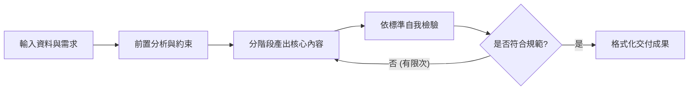
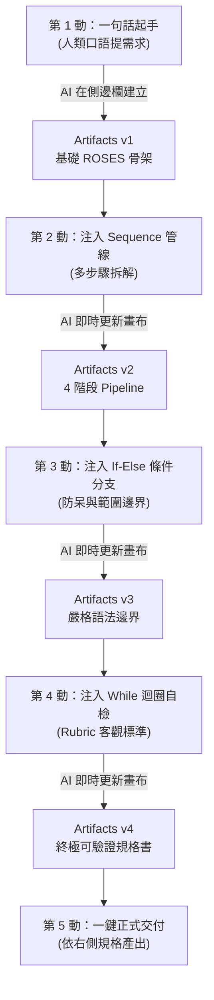

[← 返回專題總覽](../README.md) ｜ [下一章：02 多步驟拆解 →](../02_多步驟拆解_循序規劃與分階段交付/README.md)

---

# 01｜思維轉變：從單一指令到工作規格

> 📁 **本單元學員實作練習檔（偽資料）**：
> - [`sample_files/python_course_syllabus.md`](./sample_files/python_course_syllabus.md)：學生已學語法與禁止超綱清單（供出題範例演練）。
> - [`sample_files/course_promotion_brief.md`](./sample_files/course_promotion_brief.md)：職場自動化課程資訊與受眾痛點（供文案範例演練）。


在開始學習更複雜的 AI Agent、自動化工作流或客製化 Skill（技能包）之前，我們必須先完成最關鍵的一步思維躍遷：**從「跟 AI 聊天」轉變為「向 AI 交付一份可執行的工作規格書」**。

---

## 為什麼單一句指令不夠？

許多人剛接觸 AI 時，習慣把對話框當作搜尋引擎或隨興的語音助理：

```text
幫我設計一份 Python 小考。
```

這類「單一句指令」最大的問題在於：**它只表達了最終渴望，卻省略了達成該渴望所需的全部專業判斷。**

當你沒有交代過程與標準時，AI 只能自行猜測：
- **猜程度**：這是給國小生、大學資工系、還是轉職上班族？
- **猜時間與題型**：是 5 題選擇題，還是 3 題程式實作題？
- **猜範圍**：可以使用哪些語法？物件導向可以出嗎？
- **猜標準**：需要附詳解與測試測資嗎？

結果往往是：第一次產出不滿意，你花了 10 次對話來回修正（「不要太難」、「加點詳解」、「改成繁體中文」），花費的時間反而比自己出題還多。

---

## 核心概念：用自然語言寫演算法

在軟體工程中，**演算法（Algorithm）** 是一組明確定義的有限步驟，用以解決特定問題。

在 Prompt Engineering 領域，我們不需要真的撰寫 Python 或 C++，而是運用程式設計的思維，**用自然語言為 AI 規範出清楚的執行演算法**：



當你的 Prompt 具備了這樣的架構，它就不再只是一句臨時的話語，而是一份**具備高度可重現性（Reproducible）的工作規格書（Specification）**。

---

## 框架回顧：從 RTCCF 到 ROSES

在《AI 提示詞工程指南》中，我們介紹了兩套重要框架：

1. **RTCCF（Role + Task + Context + Constraints + Format）**：
   適合**單回合、一次性**的日常任務（如潤飾 Email、重點摘要）。
2. **ROSES（Role + Objective + Steps + Example/Format + Scope & Style）**：
   專門為**多步驟、需要長篇規則與固定流程**的任務而生。

當我們要設計「可驗證的工作流程」以銜接未來的 Agent Skill 時，**ROSES** 是最合適的起點。我們更進一步在 ROSES 內強化了兩個靈魂要素：**驗證機制（Verification）** 與 **停止條件（Stop Criteria）**。

---

## 💡 實戰破局：別自己手打！透過 Artifacts 側邊欄，用自然語言逐步疊加出最佳工作規格

> ⚠️ **學員最常提出的質疑**：  
> *「老師，這份 ROSES 規格書寫了快 50 行，格式那麼嚴謹，我平常根本背不起來、也沒時間手打，這根本是 AI 自己寫的吧？」*  
> 
> **沒錯！真實職場中的高手與架構師，本來就不是在空白對話框徒手敲出整篇 ROSES！**  
> 
> 正確且高效的人機協同心法是：  
> **「人類負責出核心構想與決策邏輯，AI 負責架構化與規格化；透過 Claude 的右側 Artifacts（側邊欄畫布），我們只需用簡單的自然語言發出指令，就像工程師在寫程式一樣，一步一步將程式的 Statement（陳述句）注入右側的規格中，迭代出最完美的流程！」**

---

## 🎯 實戰演練 1：設計 Python 隨堂測驗（Artifacts 漸進式演進實錄）

讓我們透過這個經典案例，親自體驗如何用 **4 輪簡短的自然語言對話**，在右側 Artifacts 側邊欄中生長出頂級的 ROSES 工作規格書：



---

### 🟢 第 1 動：一句話起手（建立規格骨架）

- **🧑 人類在對話框輸入（日常白話）**：
  ```text
  我想為初學者設計一個 20 分鐘的 Python 隨堂實作測驗。
  請在右側 Artifacts 側邊欄為我建立一份標準的 ROSES 工作規格書草案。
  ```
- **🤖 Claude 的反應**：
  在右側側邊欄開啟一個名為 `python_quiz_spec.md` 的 Artifact，產出初階骨架（包含基礎的 Role、Objective、Steps、Example、Scope）。

---

### 🟢 第 2 動：注入 Sequence 管線化陳述句（要求多步驟拆解）

學生審閱右側 v1 骨架後，發現 AI 打算直接一口氣出題，此時在對話框發出指令：

- **🧑 人類在對話框輸入（加入程式順序邏輯）**：
  ```text
  請修改右側 Artifact 中的 S（執行步驟）：
  不能直接出題目，我要改成分階段管線（Pipeline）——
  1. 先列出本次測驗評量的 3 個核心觀念
  2. 依序設計 2 題閱讀程式題與 1 題填空題
  3. 為每一題附上官方標準解答與易犯錯誤提示
  4. 最後檢查所有題目是否符合初學者程度
  ```
- **🤖 Claude 的反應**：
  右側側邊欄的 Artifact 即時切換為 **Version 2**，`## S – 執行步驟` 原地更新為清晰的 4 階段 Pipeline！

---

### 🟢 第 3 動：注入 If-Else 條件分支陳述句（劃定防呆邊界）

學生接著考慮到學生程度，繼續在左側對話框下達邊界邏輯：

- **🧑 人類在對話框輸入（加入條件與禁用規則）**：
  ```text
  請更新右側 Artifact 的 S（範圍與風格）：
  加入嚴格的語法限制規則——
  學生只學過變數命名、基本型別（int, str, float）和基礎 if/else；
  嚴格禁止出現 for/while 迴圈、函式（def）或串列（list）。
  若題目設計時發現不小心用到這些語法，必須強制換題！
  ```
- **🤖 Claude 的反應**：
  右側側邊欄的 Artifact 即時切換為 **Version 3**，在 `## S – 範圍與風格` 中精準加入了先備知識約束與禁止語法條件分支！

---

### 🟢 第 4 動：注入 While 迴圈自檢陳述句（加入驗證規準 Rubric）

最後，為了防止 AI 粗心超綱，人類下達最後一道品質保證指令：

- **🧑 人類在對話框輸入（加入驗證迴圈與上限）**：
  ```text
  請在右側 Artifact 的結尾加入【自我檢驗 Rubric 清單】（包含：是否超綱、題目是否具備引導性、程式碼是否合法）；
  並在執行步驟中明確規定：AI 產出題目後必須對照這張表逐項檢查，若發現超綱語法最多自我修正 2 次才可交付。
  ```
- **🤖 Claude 的反應**：
  右側側邊欄的 Artifact 即時切換為 **Version 4（終極完成版）**！

---

### 📄 右側側邊欄最終生成的完美規格書（Artifacts 成果）

經過上面 4 輪極為輕鬆的白話對話，右側畫布已經自動組裝出一份極高水準的工作規格：

```markdown
## R – 角色設定
你是一位經驗豐富的 Python 程式設計講師。

## O – 任務目標
請為初學者設計一份 20 分鐘的隨堂程式實作測驗卷。

## S – 執行步驟
1. **觀念盤點**：先列出本次測驗預計評量的 3 個核心觀念。
2. **階梯出題**：依序設計 2 題閱讀程式題（預測輸出）與 1 題小型程式填空題。
3. **解答與詳解**：為每一題提供官方標準解答與學生易犯錯誤解析。
4. **迴圈自檢（上限 2 次）**：對照下方 Rubric 表逐項自檢，若違反範圍限制立即重新出題（最多修正 2 次）。

## E – Example／output format
請依序分段輸出：
- 【A. 測驗核心指標清單】
- 【B. 試卷題目卷】（供學生直接列印作答）
- 【C. 教師解答與易錯提醒】
- 【D. 自我檢核確認報告】（標記各項 Rubric 檢查結果）

## S – 範圍與風格
- 學生先備知識：僅學過變數命名、基本型別（int, str, float）以及 if/else 條件判斷。
- 嚴格禁用語法（If-Else 分支）：尚未學過 for/while 迴圈、函式（def）、串列（list），題目絕對不能出現這些語法；若生成時包含上述語法，一律視為不合格並重出。
- 語言與風格：繁體中文，題目敘述清晰生活化，難度適中。
- 自我檢驗標準（Rubric 清單）：
  - [ ] 檢核 1：所有題目是否均未超出先備知識？
  - [ ] 檢核 2：程式碼語法是否 100% 正確可執行？
  - [ ] 檢核 3：是否包含清晰的防呆解答與易錯分析？
```

---

### 🟢 第 5 動：一鍵正式交付！

此時規格已經完美確定，你只需要在對話框送出最後一句話：

- **🧑 人類在對話框輸入**：
  ```text
  太棒了！請完全依照右側 Artifact 中的這份規格書，正式幫我產出測驗卷！
  ```
- **🤖 Claude 的交付產物**：
  AI 就會嚴格依照步驟 1 ➔ 步驟 2 ➔ 步驟 3 ➔ 自我檢查，交付出零失誤、無超綱語法的極致測驗成果！

---

## 🎯 實戰演練 2：產生社群行銷宣傳文案（3 動迭代法）

不僅是程式教學，任何非程式的職場文案任務，也能完全複製這套**「自然語言 ➔ 側邊欄 Artifact 演進」**模式：

1. **第 1 動（白話起手）**：  
   *「我要為新開的『零基礎 Python 職場自動化工作坊』寫一篇 Facebook 宣傳貼文。請在右側 Artifacts 為我建立 ROSES 規格草案。」*  
   ➔ **Artifact v1** 產生文案撰寫規範骨架。
2. **第 2 動（注入步驟與痛點）**：  
   *「請修改 S（步驟）：先列出目標上班族每天處理 Excel 加班的 3 大痛苦場景，構思 3 組 Hook，挑選最痛的一組撰寫 400 字主體文案。」*  
   ➔ **Artifact v2** 具備明確敘事策略。
3. **第 3 動（注入邊界與自檢標準）**：  
   *「請在 S（範圍）加入限制：嚴禁使用艱深技術術語說教，強調『第一週學會合併 10 個 Excel 檔案』；結尾必須包含清晰的 CTA 與自我檢核清單。」*  
   ➔ **Artifact v3** 完成終極文案規格書！

---

## 💡 學習反思：程式 Statement 與自然語言的完美對應

請對照下表，這就是為什麼你能用自然語言當好「規格架構師」的秘密：

| 程式語言概念 (Code Statements) | 你在對話框說的自然語言 | 右側 Artifacts 中對應的 ROSES 區塊 |
|:---|:---|:---|
| **主函式進入點 (Main Goal)** | 「我想為初學者出 20 分鐘測驗」 | `## O – 任務目標` |
| **循序執行 (Sequential Pipeline)** | 「先列觀念，再出題，最後給詳解」 | `## S – 執行步驟 (Step 1 -> 2 -> 3)` |
| **條件判斷 (If-Else Branch)** | 「如果題目用到迴圈或函式，就強制換題」 | `## S – 範圍與風格中的決策規則` |
| **迴圈與中斷 (While Loop & Limit)** | 「對照 Rubric 自檢，未達標最多修正 2 次」 | `## S – 執行步驟中的自檢迴圈` |
| **輸出契約 (Return Schema)** | 「請依序輸出題目卷、解答與自檢報告」 | `## E – Example／output format` |

---

## 本章重點小結

1. **千萬別手打 ROSES**：人類的優勢在於定義商業意圖與驗收標準，結構化的苦工交給 AI。
2. **善用 Artifacts 側邊欄**：左側聊天溝通、右側沉澱規格；看著規格一版一版進化，掌控感 100%。
3. **自然語言就是你的程式碼**：透過「加步驟、加條件、加自檢」，你已經在用自然語言編寫高品質的演算法工作流！

---

[← 返回專題總覽](../README.md) ｜ [下一章：02 多步驟拆解 →](../02_多步驟拆解_循序規劃與分階段交付/README.md)
