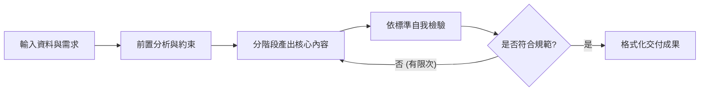

[← 返回專題總覽](./README.md) ｜ [下一章：02 多步驟拆解 →](./02_多步驟拆解：循序規劃與分階段交付.md)

---

# 01｜思維轉變：從單一指令到工作規格

在開始學習更複雜的 AI Agent、自動化工作流或客製化 Skill（技能包）之前，我們必須先完成最關鍵的一步思維躍遷：**從「跟 AI 聊天」轉變為「向 AI 交付一份可執行的工作規格書」**。

---

## 為什麼單一句指令不夠？

許多人剛接觸 AI 時，習慣把對話框當作搜尋引擎或隨興的語音助理：

```text
幫我設計一份 Python 小考。
```

這類「單一句指令」最大的問題在於：**它只表達了最終渴望，卻省略了達成該渴望所需的全部專業判斷。**

當你沒有交代過程與標準時，AI 只能自行猜測：
- **猜程度**：這是給國小生、大學資工系、還是轉職上班族？
- **猜時間與題型**：是 5 題選擇題，還是 3 題程式實作題？
- **猜範圍**：可以使用哪些語法？物件導向可以出嗎？
- **猜標準**：需要附詳解與測試測資嗎？

結果往往是：第一次產出不滿意，你花了 10 次對話來回修正（「不要太難」、「加點詳解」、「改成繁體中文」），花費的時間反而比自己出題還多。

---

## 核心概念：用自然語言寫演算法

在軟體工程中，**演算法（Algorithm）** 是一組明確定義的有限步驟，用以解決特定問題。

在 Prompt Engineering 領域，我們不需要真的撰寫 Python 或 C++，而是運用程式設計的思維，**用自然語言為 AI 規範出清楚的執行演算法**：



當你的 Prompt 具備了這樣的架構，它就不再只是一句臨時的話語，而是一份**具備高度可重現性（Reproducible）的工作規格書（Specification）**。

---

## 框架回顧：從 RTCCF 到 ROSES

在《AI 提示詞工程指南》中，我們介紹了兩套重要框架：

1. **RTCCF（Role + Task + Context + Constraints + Format）**：
   適合**單回合、一次性**的日常任務（如潤飾 Email、重點摘要）。
2. **ROSES（Role + Objective + Steps + Example/Format + Scope & Style）**：
   專門為**多步驟、需要長篇規則與固定流程**的任務而生。

當我們要設計「可驗證的工作流程」以銜接未來的 Agent Skill 時，**ROSES** 是最合適的起點。我們更進一步在 ROSES 內強化了兩個靈魂要素：**驗證機制（Verification）** 與 **停止條件（Stop Criteria）**。

---

## 由淺入深實戰範例對照

### 範例 1：設計 Python 隨堂測驗

#### ❌ 傳統口語指令（品質隨機）
```text
幫我出一份 Python 初學者的測驗卷，大概 20 分鐘。
```

#### ✅ 規格化提示詞（結果穩定、可複製）
```markdown
# 角色與目標
你是一位經驗豐富的 Python 程式設計講師。請為初學者設計一份 20 分鐘的隨堂程式實作測驗。

## 學生程度與限制
- 先備知識：學生僅學過變數命名、基本型別（int, str, float）以及 if/else 條件判斷。
- 嚴格禁用：尚未學過 for/while 迴圈、函式（def）、串列（list），題目絕對不能出現這些語法。

## 執行步驟
1. 先列出本次測驗預計評量的 3 個核心觀念。
2. 依序設計 2 題閱讀程式題（預測輸出）與 1 題小型程式填空題。
3. 為每一題提供官方標準解答與易犯錯誤提示。
4. 檢查所有題目是否均遵守「未教語法禁用限制」。

## 輸出格式
請依序輸出：
- 測驗核心指標
- 試卷題目卷（供學生作答）
- 教師解答與評分標準（含自我檢查確認報告）
```

---

### 範例 2：產生社群行銷宣傳文案

#### ❌ 傳統口語指令
```text
幫我們的新線上 Python 課程寫一篇 Facebook 宣傳貼文，要吸引人。
```

#### ✅ 規格化提示詞
```markdown
# 角色與目標
你是一位專注於成人程式轉職培訓的資深社群文案策略師。請為即將上線的「零基礎 Python 職場自動化工作坊」撰寫一篇高轉化率的社群貼文。

## 背景資訊
- 目標受眾：每天重複處理大量 Excel、耗費時間且經常加班的行政與行銷人員。
- 課程核心賣點：不需要懂艱深演算法，第一週就學會自動合併 10 個 Excel 檔案。
- 痛點共鳴點：下班前主管臨時要報表、手動複製貼上容易出錯。

## 執行步驟
1. 列出目標受眾在日常工作中最痛苦的 3 個具體場景。
2. 根據痛苦場景，構思 3 組不同的開頭吸睛 Hook（問題式、驚人事實、情境帶入）。
3. 選擇共鳴最強的一組，撰寫 400 字以內的完整貼文主體。
4. 檢查文案是否避免過多艱澀專有名詞，是否清楚標示行動呼籲（CTA）。

## 輸出格式
請以 Markdown 呈現：
- 受眾痛點清單
- 3 組 Hook 候選與挑選理由
- 最終完整貼文（含 Hashtag 與排版 emoji）
- 自我檢核確認項目
```

---

## 本章重點小結

1. **拒絕一次性猜測**：複雜任務絕不能只寫一句話，必須交代先後步驟與品質規範。
2. **規格化思維**：把 Prompt 當作演算法，有輸入、有處理邏輯、有檢查機制、有標準輸出。
3. **邁向 Skill 的第一步**：未來的 AI Agent Skill 本質上就是將這些工作規格標準化、檔案化。先學會寫清楚自然語言規格，才能駕馭更進階的 AI 自動化！

---

[← 返回專題總覽](./README.md) ｜ [下一章：02 多步驟拆解 →](./02_多步驟拆解：循序規劃與分階段交付.md)
