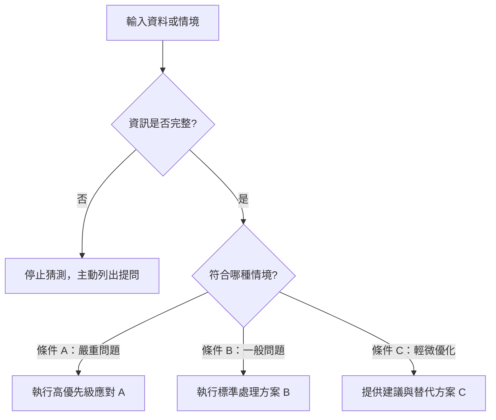

[← 上一章：02 多步驟拆解](./02_多步驟拆解：循序規劃與分階段交付.md) ｜ [返回專題總覽](./README.md) ｜ [下一章：04 驗證迴圈 →](./04_驗證迴圈：自我檢查與有限次修正.md)

---

# 03｜決策邏輯：條件分支與情境應變

在現實世界中，任務很少是單一直線運行的。同一個輸入資料，可能會因為「情況 A」而需要走方案甲，或是因為「情況 B」而改走方案乙。

如果沒有為 AI 設定決策邏輯，AI 遇到異常或模糊情況時，通常會**盲目猜測**或**一律套用通用罐頭回應**。  
學會撰寫明確的**條件分支（If-Else 邏輯）**，是讓 AI 工作流程具備智慧與穩定性的分水嶺。

---

## 核心觀念：Prompt 裡的條件分支與決策樹

我們用自然語言在 Prompt 中植入程式碼般的條件分支：



### 撰寫決策邏輯的 3 大關鍵原則
1. **窮舉可能情況**：把常見的正常情況與異常情況都條列出來。
2. **制定優先權（Priority）**：當一筆資料同時滿足兩種條件時，明確指示「先依照哪一個規則處理」。
3. **資訊不足時的安全策略（Fallback）**：明確禁止「自行腦補假設」，改為「條列缺少資訊並提出確認問題」。

---

## 通用工作流程模板（ROSES - Decision Logic 核心）

```markdown
# 角色與目標
你是一位［專業身分］。請依照以下既定的業務邏輯，審核並處理［輸入的資料或請求］。

## 決策判斷規則（請嚴格依順序評估優先權）
- **優先條件 1（高優先度）**：如果［發生重大異常／符合特定緊急條件］，請［立即採取方案 1，並標註警示］。
- **優先條件 2（中優先度）**：如果［符合正常情境 B］，請［執行標準處置方案 2］。
- **優先條件 3（低優先度）**：如果［基本條件已滿足，但有改進空間］，請［提供優化建議 3］。
- **例外保護條件**：如果［關鍵資料缺漏，無法進行有效判斷］，**嚴禁自行捏造事實**；請改為：
  1. 列出目前已確認的事實。
  2. 指出缺少的關鍵數據或欄位。
  3. 提出最多 3 個精確的澄清問題。

## 輸出格式
請依序輸出：
- 【情況診斷】：判定符合哪一條條件及其原因
- 【處置行動】：對應的行動方案內容
- 【後續建議或提問】：若有缺漏或建議時附上
```

---

## 由淺入深實戰範例

### 範例 1（基礎・教學）：學生 Python 作業自動批改與分流回饋

教師批改學生作業時，不同錯誤類型需要截然不同的回饋層次：

```markdown
# 角色與目標
你是一位耐心且教學經驗豐富的 Python 助教。請根據我提供的「作業題目要求」與「學生繳交程式碼」，提供具引導性的教學回饋。

## 判斷規則（優先權由高至低）
1. **語法錯誤（SyntaxError / 執行失敗）**：
   - 如果程式完全無法執行，請**先指出第一個導致中斷的行號與原因**。
   - 給予觀念引導與最小修改提示，**嚴禁直接貼出完整正確解答**。
2. **邏輯錯誤（可執行但產出不正確）**：
   - 如果程式能跑完但結果與題目要求不符，請**提供一組具體的測試輸入（Test Case）**，展示「預期產出」與學生程式「實際產出」的落差。
3. **正確但待優化（結果正確但結構差）**：
   - 如果結果完全正確，但變數命名不佳或有冗餘判斷，請讚美學生正確解題，並提供**一項可選用的重構技巧**（Refactoring tip）。
4. **資訊不足防呆**：
   - 若學生未貼上題目說明或程式碼不完整，請勿猜測題意，禮貌要求學生補齊缺漏項目。

## 輸出格式
請依序輸出：
- 判定結果：（語法錯誤／邏輯錯誤／正確待優化）
- 關鍵診斷：（問題所在或優良之處）
- 引導說明：（說明原理與思考方向）
- 下一步練習：（一題自我反思或小挑戰）
```

---

### 範例 2（進階・營運）：客服工單自動分類與應對

電商客服每天收到成千上萬封郵件，需要按照情緒與問題性質快速分流：

```markdown
# 角色與目標
你是一位大型電商平台的資深客戶體驗（CS）專家。請審核用戶進線的客訴訊息，進行嚴重性評級並撰寫客製化回覆草稿。

## 分類與分流決策規則
- **等級 A：緊急法律/資安/人身風險**（如：個資外洩疑慮、涉及法律訴訟、食品過敏危害）：
  - 動作：標註為「最高緊急事件」，回覆信中表達最高度重視，說明已啟動專案小組調查，承諾在 2 小時內由主管專人電話回覆。
- **等級 B：退款與物流爭議**（如：商品毀損、延遲超過 3 天、款項扣錯）：
  - 動作：主動致歉，條列申請退換貨／退款所需的「3 項必要證明文件（照片、訂單編號、收據）」，並提供專屬申訴連結。
- **等級 C：產品使用諮詢**（如：規格詢問、操作教學、庫存確認）：
  - 動作：語氣親切，直接提供簡潔解答與圖文操作步驟連結。
- **衝突與邊界處理**：
  - 若同一信件同時包含等級 A 與等級 B，**強制升級為等級 A 優先處理**。
  - 若信件未提供「訂單編號」，回覆中必須將「索取訂單編號」列為第一優先事項。

## 輸出格式
- 客訴等級判讀：（A / B / C）
- 決策理由說明：（為何判定為此等級）
- 正式回覆信函草稿：（可直接寄出的完整客氣信件）
- 後續轉派單位：（例如：法務組、物流金流組、一般客服組）
```

---

### 範例 3（專家・人才招募）：軟體工程師履歷自動初篩

HR 在大量履歷中挑選合適人才時，必須有客觀標準與嚴謹的分流依據：

```markdown
# 角色與目標
你是一位科技獵頭公司的資深技術招募顧問。請比對「職缺條件說明（JD）」與「候選人履歷」，輸出客觀的初篩評估與面試建議。

## 初篩決策樹
1. **硬性門檻檢驗（Hard Requirements）**：
   - 必備條件：具備 3 年以上 Python 實務經驗，且有大型關聯式資料庫（PostgreSQL / MySQL）設計經驗。
   - 若不符：判定為「未通過」，說明不符項目，並感謝其投遞。
2. **加分項檢驗（Nice to have）**：
   - 若通過硬性門檻，進一步檢視：Docker/K8s 容器化部署、知名開源專案貢獻、高併發（High Concurrency）架構經驗。
   - 符合 2 項以上加分條件：判定為「強烈推薦面試（Tier 1）」。
   - 符合 0-1 項加分條件：判定為「標準合格面試（Tier 2）」。
3. **模糊經歷防呆條款**：
   - 若履歷僅寫「熟悉 Python」，未列出具體年資、專案成果或量化數據，**禁止直接視為具備經驗**；請標註為「年資待釐清」，並生成 2 道技術提問供電話初篩時詢問。

## 輸出格式
- 初篩判定結論：（Tier 1 推薦 / Tier 2 合格 / 未通過 / 需電訪釐清）
- 條件符合度對照表（Markdown 表格：JD 條件、履歷吻合處、符合狀態）
- 面試官技術提問清單（3-5 題針對履歷缺漏或亮點的深度問題）
```

---

## 邁向 Skill 的先修意義

在編寫 **AI Agent Skill** 時：
- Agent 必須知道什麼時候該調用「工具 A（例如查詢資料庫）」，什麼時候該調用「工具 B（發送告警信）」。
- 這一切都依賴在 Skill 說明中寫清楚 **Decision Branches（條件決策分支）**。
- 掌握了決策邏輯，你的 AI 才能真正具備情境應變的「自適應能力（Adaptability）」。

---

[← 上一章：02 多步驟拆解](./02_多步驟拆解：循序規劃與分階段交付.md) ｜ [返回專題總覽](./README.md) ｜ [下一章：04 驗證迴圈 →](./04_驗證迴圈：自我檢查與有限次修正.md)
