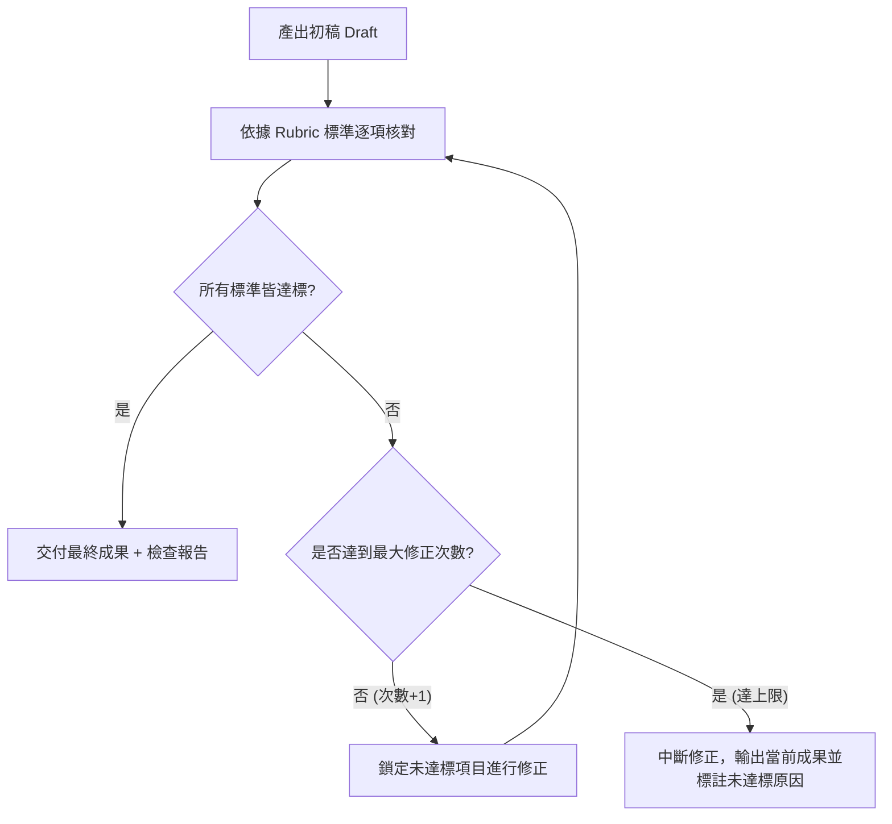

[← 上一章：03 決策邏輯](./03_決策邏輯：條件分支與情境應變.md) ｜ [返回專題總覽](./README.md) ｜ [下一章：05 停止條件 →](./05_停止條件：安全邊界與人工介入機制.md)

---

# 04｜驗證迴圈：自我檢查與有限次修正

在日常使用 AI 時，最常見的失敗模式之一就是：AI 信心滿滿地產出了一篇看似華麗、實際上卻包含嚴重事實錯誤或不合規則的答案。

如果我們只在 Prompt 結尾加上一句「請確認正確無誤」，通常毫無效果——因為 AI 不知道**「依據什麼標準檢查」**，也不知道**「如果不合格該如何重試」**。

本章將學習如何為 Prompt 導入類似程式語言中 `while` 迴圈的**「自我驗證機制（Verification Loop）」**。

---

## 核心觀念：Reflection（反思與修正）迴圈

在進階 AI 系統設計中，這被稱為 **Reflection（反思）** 機制：讓模型生成內容後，以批判視角比對檢查標準，並在發現缺失時自我迭代。



### 構建驗證迴圈的 3 大要素
1. **客觀具體的評量規準（Rubric）**：
   - ❌ 模糊標準：「請確認寫得很好、沒有錯字。」
   - ✅ 客觀標準：「檢查字數是否在 280-320 字之間」、「檢查是否包含 3 個指定關鍵字」。
2. **差異化修正（Delta Fix）**：
   要求 AI 標註「哪一條未通過、為什麼未通過、採取了什麼修正行動」。
3. **最多次數防護（Max Iterations Guard）**：
   **絕對必須指定上限（通常為 2 或 3 次）**。若無上限，AI 可能在兩個矛盾的標準之間陷入死循環，或越修越偏離原始題意。

---

## 通用工作流程模板（ROSES - Verification Loop 核心）

```markdown
# 角色與目標
你是一位［專業角色］。請協助我製作［特定任務產出物］。

## 背景資訊與規範
［輸入資料與具體規則］

## 第一階段：初稿產出
依據背景資訊，產出第一版完整內容。

## 第二階段：自我驗證標準（Rubric）
完成初稿後，請嚴格逐項審查以下標準：
- [ ] 標準 1：［具體、可量化或是非題式的檢驗標準］
- [ ] 標準 2：［結構、格式或特定必備欄位的檢驗標準］
- [ ] 標準 3：［禁止事項或邊界條件的檢驗標準］

## 迭代修正規則
- 若全部通過：直接輸出成果與檢查全數合格之標記。
- 若有任一項未通過：
  1. 具體指出不符合的標準名稱與具體行號/原因。
  2. 針對該缺陷進行局部修訂。
  3. 重新以全體標準再驗證一次。
- **次數上限限制**：自我修正最多進行 2 次。若 2 次後仍有未達標項目，請立刻停止迭代，並主動列出「未達標原因與需要人工裁決的癥結點」。

## 輸出格式
- 【最終成品內容】
- 【自我驗證紀錄表】（標註各項標準通過狀態，以及若有修正時的紀錄）
```

---

## 由淺入深實戰範例

### 範例 1（基礎・教材研發）：Python 隨堂練習題生成與範圍校驗

出題最怕超出學生程度，必須透過驗證機制把關：

```markdown
# 角色與目標
你是一位高中資訊科技教材編輯。請為初學者設計一題 Python 實作練習題。

## 主題與目標
- 主題：使用 `for` 迴圈計算 1 到 N 的總和。
- 學生程度：剛學過變數、基礎數學運算符與 `for i in range(...)`。

## 執行步驟
1. 產出題組內容：包含「題目說明」、「輸入輸出範例（各 2 組）」、「學生半成品程式（挖空 TODO）」與「教師標準解答」。
2. 進行內容品質自我審查。

## 檢驗標準清單（Rubric）
- [ ] 檢核 1：題目是否嚴格限制在 `for` 與 `range`，絕無出現 `while`、`list` 或進階內建函式（如 `sum()`）？
- [ ] 檢核 2：半成品程式的 TODO 挖空處是否清晰合理（不多不少，僅留關鍵邏輯）？
- [ ] 檢核 3：以輸入測資手動推算教師解答，產出是否 100% 吻合輸出範例？

## 迴圈修正
若有任何檢核未達標，請修正題目或程式，最多重試 2 次。

## 輸出格式
- 【練習題題目卷】（題目敘述、輸入輸出範例、半成品程式碼）
- 【教師解答與詳解】
- 【驗證核對紀錄】（列出檢核 1-3 狀態與修正歷程）
```

---

### 範例 2（進階・資料庫工程）：高效且安全的 SQL 報表查詢

資料庫查詢若有漏洞或缺乏索引，將直接影響系統效能與資安：

```markdown
# 角色與目標
你是一位資料庫資深架構師（DBA）。請根據業務需求撰寫 MySQL 查詢語法，並提供效能與資安分析。

## 業務需求
- 查詢目的：撈取「過去 30 天內，消費金額累計超過 10,000 元且未曾退貨的 VIP 會員清單」。
- 涉及資料表：`users` (id, name, email), `orders` (id, user_id, amount, status, created_at)。

## 產出與驗證標準
請先撰寫出 SQL 查詢語法，接著嚴格比對以下指標：
1. **語法正確性**：是否使用正確的 `JOIN` 與 `GROUP BY / HAVING` 聚合語法？
2. **索引友善性（SARGable）**：在 `created_at` 欄位上的日期篩選，是否避免了在欄位本體使用函式（如禁止 `WHERE DATE(created_at) > ...`）？
3. **安全注入防護**：是否有標示預編譯參數化預留位置（如 `?` 或 `:days`），而非文字拼接？

## 修正機制
若發現違反第 2 或第 3 條，請重新重構 SQL 語法，最多修正 2 次。

## 輸出格式
- 【最佳化 SQL 語法】
- 【查詢效能預估與建議索引（CREATE INDEX 建議）】
- 【SQL 審核自檢報告】（逐項說明 3 大標準符合情況）
```

---

### 範例 3（專家・多語在地化）：跨國品牌行銷文案在地化校核

多語言翻譯最容易踩雷在字數暴增破版或文化禁忌語：

```markdown
# 角色與目標
你是一位跨國消費品牌的多語在地化（Localization）總監。請將這段英文主視覺 Slogan 翻譯為「日語」與「繁體中文（台灣）」。

## 原始文案與品牌訴求
- 原始英文："Power unleashed. Pure precision for your everyday workflow."
- 品牌調性：高科技、極簡、俐落、自信。

## 自我檢驗標準（Rubric）
完成日語與繁中翻譯後，逐一執行以下檢核：
- [ ] 長度限制：日語不得超過 25 個全形字元；繁體中文不得超過 16 個中文字元（為配合手機螢幕排版）。
- [ ] 用語在地化：繁中必須使用台灣常見科技用語，嚴格禁用中國大陸用語（如：不可使用「視頻」、「內存」、「高清」）。
- [ ] 語調與標點：句尾不使用句號，維持現代設計雜誌風格的俐落短句。

## 修正迴圈
若有任一語言超過字元數或包含禁用詞，請重新挑選詞彙改寫，上限 2 次。若因字數限制無法完整表達語義，請停止並提出 2 個縮減方案供挑選。

## 輸出格式
- 【繁體中文在地化文案】（附字數計數）
- 【日語在地化文案】（附字數計數）
- 【翻譯理念與對照說明】
- 【品質核對表】
```

---

## 邁向 Skill 的先修意義

在成熟的 **AI Agent 架構**中：
- 例如 Code Review Agent、Writing Agent，背後往往都有一個獨立的 **Critic / Evaluator** 節點。
- 寫出高水準的 Skill，關鍵就在於把「評價與自我修正（Self-Correction）」寫成可執行的邏輯。
- 能精確定義驗證標準的工程師，才能訓練出穩定、不會信口開河的頂級 Agent！

---

[← 上一章：03 決策邏輯](./03_決策邏輯：條件分支與情境應變.md) ｜ [返回專題總覽](./README.md) ｜ [下一章：05 停止條件 →](./05_停止條件：安全邊界與人工介入機制.md)
