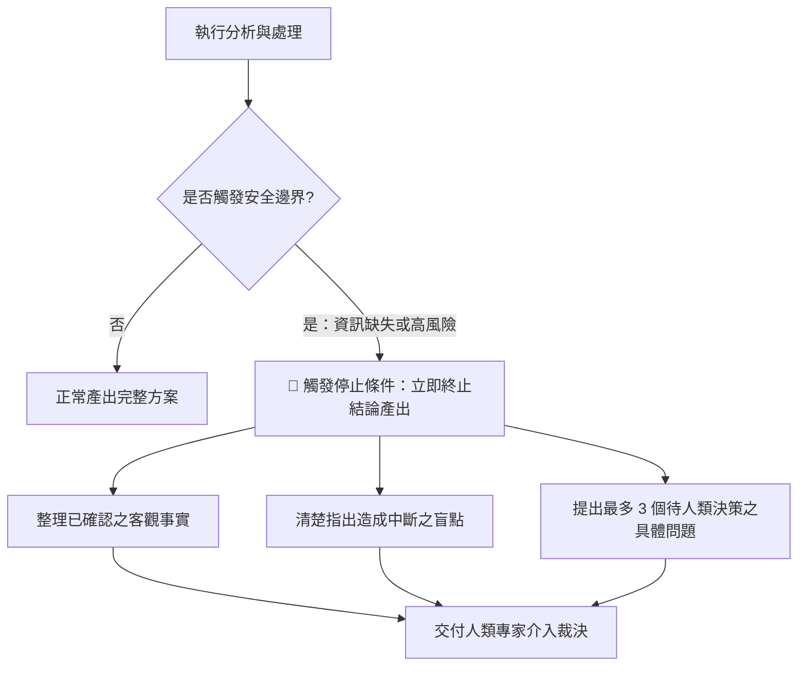

[← 上一章：04 驗證迴圈](./04_驗證迴圈：自我檢查與有限次修正.md) ｜ [返回專題總覽](./README.md) ｜ [下一章：06 實戰整合 →](./06_實戰整合：打造可復用的工作規格書.md)

---

# 05｜停止條件：安全邊界與人工介入機制

在構建 AI 工作流程時，許多初學者常犯的一個大忌是：**試圖讓 AI 在任何情況下都「強行完成任務」**。

然而，大語言模型本質上具備「迎合討好（Sycophancy）」與「補齊缺漏」的傾向。當面對資料不足、邏輯矛盾或超出能力邊界的任務時，缺乏停止條件的 AI 會開始**編造事實（產生幻覺）**，給出看似頭頭是道卻極度危險的結論。

**停止條件（Exit Criteria / Guardrails）就是工作流程的安全煞車**：它明確規定 AI「什麼時候該交付成果，什麼時候必須立刻停下來尋求人類確認」。

---

## 核心觀念：Human-in-the-Loop（人機協同環節）

在專業的工作流程中，AI 的最高境界不是「逞強包辦一切」，而是**「清楚知道自己的邊界，並在關鍵時刻主動尋求人類決策」**。



### 必須設定停止條件的 3 大高危情境
1. **關鍵數據缺漏**：金額、日期、合約主體、法規條款、程式金鑰缺失，嚴禁自行預設。
2. **多重合理解讀且風險巨大**：存在多種完全相反的推論方向，且任一方向錯誤都會導致嚴重損失。
3. **超出授權權限**：涉及個資（PII）、資安隱私或商業機密時，必須停止處理。

---

## 通用工作流程模板（標準 ROSES 結構）

```markdown
## R – 角色設定
你是一位［專業身分，例如：企業法務審查顧問／資深風控專家］。

## O – 任務目標
審核［輸入資料或商業方案］，在嚴守安全邊界的前提下產出評估，遇高風險時主動中斷。

## S – 執行步驟
1. 檢視輸入資料，列出已確認的客觀事實。
2. 進行關鍵風險指標與邊界檢核。
3. **安全煞車判定**：比對下方「安全邊界與停止條件」；若觸發任一條，**立即終止最終方案推導**。
4. **處置輸出**：若未觸發，輸出完整方案；若觸發停止，輸出已知事實、阻斷原因與人類裁決問題清單。

## E – Example／output format
請依序分段輸出：
- 【已確認客觀事實清單】
- 【安全邊界檢核結果】（正常通過／觸發停止中斷）
- 【完整評估方案】（僅在未觸發停止時輸出）
- 【阻斷原因與人類決策請求清單】（若觸發停止時必填：最多 3 個具體決策問題）

## S – 範圍與風格
- 安全邊界與停止條件（Exit Criteria）：
  - 條件 1：缺少做成決策所需的關鍵數據或法規依據時，嚴禁自行臆造。
  - 條件 2：資料存在重大自我矛盾無法排除時，立即停止推論。
  - 條件 3：涉及潛在法律、資安或超出權限之高額財務風險時，強制中斷並要求人類專家介入。
- 風格：嚴謹、誠實、保守，不逞強、不捏造事實。
```

---

## 由淺入深實戰範例

### 範例 1（基礎・商業法務）：保密協議（NDA）重點條款快速檢驗

審閱合約時，最忌諱 AI 輕易給出「本合約完全沒問題，可以放心簽署」的盲目背書：

```markdown
## R – 角色設定
你是一位企業法務合約審閱助理。

## O – 任務目標
檢視雙方保密協議（NDA）條款，整理權利義務清單，並在發現高危條款時主動中斷背書。

## S – 執行步驟
1. 逐條審核保密資訊定義、保密年限與智財權條款。
2. 檢驗是否觸發「高危阻斷條件」。
3. 若觸發阻斷，**終止給予整體合格結論**，轉為標示紅線風險並提出修改建議。
4. 輸出條款風險表與律師複查指引。

## E – Example／output format
請依序輸出：
- 【合約基本屬性摘要】
- 【條款風險對照表】（標註風險等級：綠色安全／黃色注意／紅色高危阻斷）
- 【高危阻斷項目處置建議】（若無則註明無阻斷項）
- 【下一步律師確認清單】

## S – 範圍與風格
- 審查重點：保密範圍對稱性、年限合理性（3-5 年慣例）、無智財轉讓陷阱。
- 嚴格停止條件（Hard Stop）：
  - 若出現「無期限保密義務」、「單方賠償無上限」或「未經定義的非競業條款」，**嚴禁給予「審閱通過」結論**，強制列為阻斷項目交由執業律師裁決。
- 風格：客觀、保守、合規。
```

---

### 範例 2（進階・數據分析）：營運指標異常突降歸因分析

數據分析最怕「Garbage In, Garbage Out」。當樣本數不足時，強行推論因果關係是災難的開始：

```markdown
## R – 角色設定
你是一位電子商務平台的資深商業智慧（BI）分析師。

## O – 任務目標
分析購物車結帳轉化率暴跌原因；若資料不足以支撐因果推論，主動停止臆測。

## S – 執行步驟
1. 交叉比對各作業系統、瀏覽器、付款閘道與流量來源之數據。
2. 檢驗樣本量與日誌完整性是否滿足統計門檻。
3. 若觸發停止條件，**停止斷言單一故障原因**，改為輸出假設與日誌調取清單。
4. 產出分析發現或調查指引。

## E – Example／output format
請依序輸出：
- 【數據交叉檢驗發現】
- 【高可信度異常特徵】
- 【是否觸發停止條件與原因】
- 【下一步工程調查指引】

## S – 範圍與風格
- 停止條件機制（Guardrails）：
  - **樣本數檢驗**：若異常維度造訪人數 < 100 人，統計不顯著，**嚴禁定性為主要崩跌原因**。
  - **資料完整性檢驗**：若未提供「金流錯誤代碼（Error Code）」或「前端報錯日誌」，**強制停止下定論**，改為列出需要工程團隊調取的 3 個關鍵 Log 清單。
- 風格：數據驅動、實事求是、嚴禁臆測。
```

---

### 範例 3（專家・人力資源）：跨國員工調薪與職級審查

涉及到薪資、個資與勞基法規範時，AI 必須嚴守授權界線：

```markdown
## R – 角色設定
你是一位跨國科技集團的人資業務夥伴（HRBP）。

## O – 任務目標
根據員工年度考績評等與市場 P50 基準線試算調薪建議，並嚴守預算與法規安全邊界。

## S – 執行步驟
1. 盤點員工績效現況與薪資市場競爭力。
2. 試算保守、標準與積極三種調薪情境。
3. 檢查試算結果是否觸發下方「權限停止邊界」。
4. 輸出調薪評估或主動中斷推薦，並提供主管簽呈指引。

## E – Example／output format
請依序輸出：
- 【員工績效與市場分位現況評估】
- 【調薪試算情境（保守 / 標準 / 積極）】
- 【安全邊界檢核紀錄】（是否觸發停止條件）
- 【主管決策建議與待簽核事項】

## S – 範圍與風格
- 員工資料：L4 資深工程師，考績 Exceed Expectations (EE)。
- 停止條件與權限邊界（Hard Stop Rules）：
  1. **預算超標中斷**：若計算調幅超過部門年度調薪額度 8%，**立即終止推薦金額產出**，轉為輸出「特別簽呈申請理由範本」。
  2. **法規邊界**：涉及合約變更或外派津貼時，標註需法遵組簽核，禁止自行解釋合約適法性。
  3. **資料缺失中斷**：未給部門總預算上限時，停止百分比推算，主動要求補充。
- 風格：嚴謹合規、中立專業。
```

---

## 邁向 Skill 的先修意義

在 **生產級 AI Agent 架構（Production AI Agent）** 中：
- 停止條件就是 **Guardrails（安全護欄）** 與 **Fallback Mechanism（備援機制）**。
- 一個沒有「安全煞車」的 Agent 是不能上線投入生產環境的。
- 具備設定停止條件的思維，才能確保未來的 Agent 既高效又安全，不會給團隊捅出無法挽回的簍子！

---

[← 上一章：04 驗證迴圈](./04_驗證迴圈：自我檢查與有限次修正.md) ｜ [返回專題總覽](./README.md) ｜ [下一章：06 實戰整合 →](./06_實戰整合：打造可復用的工作規格書.md)
