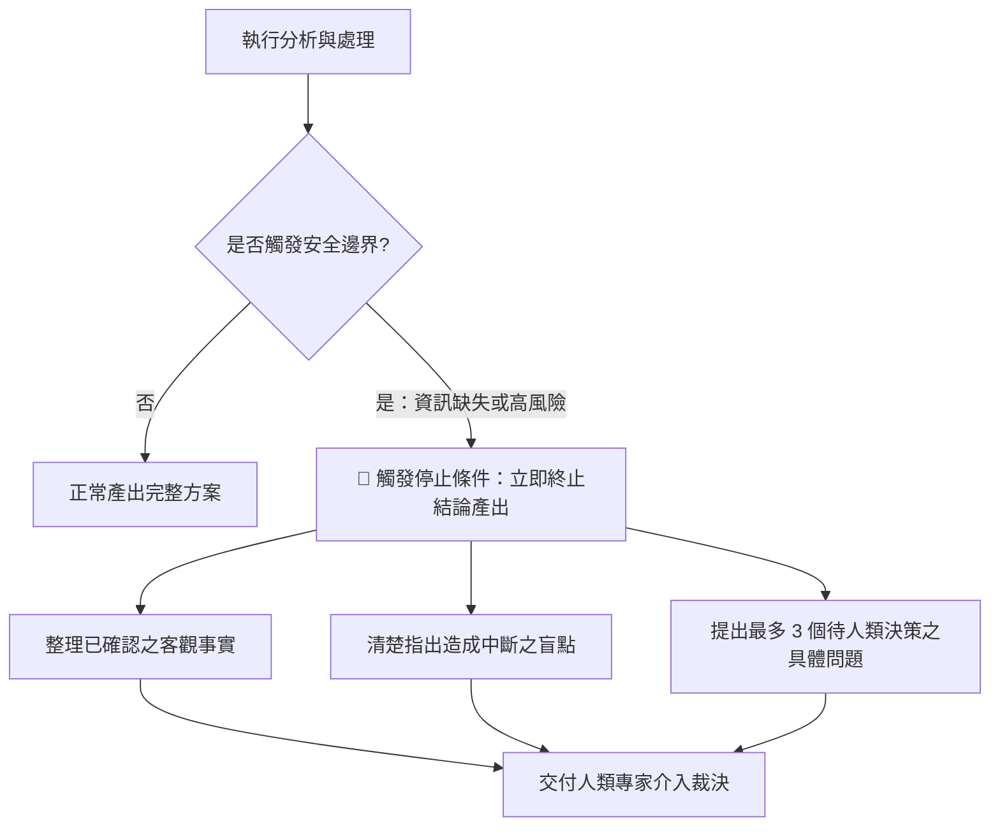

[← 上一章：04 驗證迴圈](./04_驗證迴圈：自我檢查與有限次修正.md) ｜ [返回專題總覽](./README.md) ｜ [下一章：06 實戰整合 →](./06_實戰整合：打造可復用的工作規格書.md)

---

# 05｜停止條件：安全邊界與人工介入機制

在構建 AI 工作流程時，許多初學者常犯的一個大忌是：**試圖讓 AI 在任何情況下都「強行完成任務」**。

然而，大語言模型本質上具備「迎合討好（Sycophancy）」與「補齊缺漏」的傾向。當面對資料不足、邏輯矛盾或超出能力邊界的任務時，缺乏停止條件的 AI 會開始**編造事實（產生幻覺）**，給出看似頭頭是道卻極度危險的結論。

**停止條件（Exit Criteria / Guardrails）就是工作流程的安全煞車**：它明確規定 AI「什麼時候該交付成果，什麼時候必須立刻停下來尋求人類確認」。

---

## 核心觀念：Human-in-the-Loop（人機協同環節）

在專業的工作流程中，AI 的最高境界不是「逞強包辦一切」，而是**「清楚知道自己的邊界，並在關鍵時刻主動尋求人類決策」**。



### 必須設定停止條件的 3 大高危情境
1. **關鍵數據缺漏**：金額、日期、合約主體、法規條款、程式金鑰缺失，嚴禁自行預設。
2. **多重合理解讀且風險巨大**：存在多種完全相反的推論方向，且任一方向錯誤都會導致嚴重損失。
3. **超出授權權限**：涉及個資（PII）、資安隱私或商業機密時，必須停止處理。

---

## 通用防呆停止指令句（可直接貼入 Prompt 的安全護欄）

```markdown
## 安全邊界與停止條件（Exit Criteria）
在執行本任務過程中，若觸發以下任一條件，請**立即中斷最終結論的推導**：
1. 缺少做成決策所需的關鍵量化數據或必要事實。
2. 提供的原始資料存在前後自我矛盾，且無法透過常理排除。
3. 方案可能衍生重大法律、資安、或高於［特定金額］的財務風險。

**觸發停止時的標準處置動作**：
請不要強行產出推測性結論，改為輸出：
- 【已確認客觀事實】：目前有哪些可靠資訊。
- 【中斷原因說明】：為何無法繼續往下執行。
- 【決策請求清單】：提出最多 3 個具體、精準且非此即彼的問題，請人類使用者裁定。
- 【各選項影響評估】：簡述若人類選擇 A 或選擇 B 各自的潛在後果。
```

---

## 由淺入深實戰範例

### 範例 1（基礎・商業法務）：保密協議（NDA）重點條款快速檢驗

審閱合約時，最忌諱 AI 輕易給出「本合約完全沒問題，可以放心簽署」的盲目背書：

```markdown
# 角色與目標
你是一位企業法務合約審閱助理。請檢視我所附上的雙方保密協議（NDA）條款，整理權利義務清單並標示潛在風險。

## 審閱重點
1. 保密資訊定義範圍是否合理對稱。
2. 保密年限是否過長（超過一般商業慣例 3-5 年）。
3. 是否隱含智慧財產權授權轉讓陷阱。

## 嚴格停止條件
- 若條文中出現「無期限保密義務」、「單方片面賠償無上限」或「未經定義的非競業條款」：
  - **請立刻停止給出「整體審閱通過」之結論**。
  - 將該條文列為「高風險阻斷項目（Blocker）」。
  - 清楚說明其法律風險，並給出企業標準修正建議條款（Redline Proposal），要求必須由執業律師複審。

## 輸出格式
- 【合約基本屬性摘要】
- 【條款風險對照表】（標註風險等級：綠色安全／黃色注意／紅色高危阻斷）
- 【高危阻斷項目處置建議】（若無則註明無阻斷項）
- 【下一步律師確認清單】
```

---

### 範例 2（進階・數據分析）：營運指標異常突降歸因分析

數據分析最怕「Garbage In, Garbage Out」。當樣本數不足時，強行推論因果關係是災難的開始：

```markdown
# 角色與目標
你是一位電子商務平台的資深商業智慧（BI）分析師。請分析昨日購物車結帳轉化率由 4.5% 暴跌至 1.2% 的原因。

## 背景數據
［貼上昨日各作業系統、瀏覽器、付款閘道與流量來源之細分數據］

## 執行流程與停止條件
1. 交叉比對各維度轉化率，找出跌幅最顯著的單一變數。
2. 進行異常因果歸因分析。

## 停止條件機制（Guardrails）
- **樣本數檢驗**：若某個異常維度的總造訪人數小於 100 人，統計顯著性不足，**嚴禁將其歸類為主要崩跌原因**。
- **資料完整性檢驗**：若未包含「金流閘道回傳錯誤代碼（Error Code）」或「前端 JavaScript 異常監控日誌」：
  - **停止做出具體的故障定性結論**。
  - 轉為輸出「疑似故障維度假設」與「需要工程團隊調取的 3 個系統關鍵 Log 清單」。

## 輸出格式
- 【數據交叉檢驗發現】
- 【高可信度異常特徵】
- 【是否觸發停止條件與原因】
- 【下一步工程調查指引】
```

---

### 範例 3（專家・人力資源）：跨國員工調薪與職級審查

涉及到薪資、個資與勞基法規範時，AI 必須嚴守授權界線：

```markdown
# 角色與目標
你是一位跨國科技集團的人資業務夥伴（HRBP）。請根據員工的年度績效考核評等與市場薪資調查數據，試算調薪建議。

## 員工資料
- 職級：L4 資深工程師
- 年度考績：Exceed Expectations (EE)
- 目前月薪：［貼上數據］
- 市場 P50 基準線：［貼上數據］

## 停止條件與權限邊界（Hard Stop Rules）
在產出建議時，嚴格遵守以下安全邊界：
1. **預算超標中斷**：若計算出的調幅超出部門年度調薪預算總額度 8%，禁止強制調整數值，**立即終止產出推薦金額**，並列出「特別簽呈申請理由範本」。
2. **勞基法規邊界**：若涉及外派津貼或因職級異動涉及工時合約變更，標註「需法規法遵組簽核」，禁止自行詮釋適法性。
3. **資訊不足中斷**：若未提供部門整體預算上限，不得進行百分比試算，應停下來要求補充數據。

## 輸出格式
- 【員工績效與市場分位現況評估】
- 【調薪試算情境（保守 / 標準 / 積極）】
- 【安全邊界檢核紀錄】（是否觸發停止條件）
- 【主管決策建議與待簽核事項】
```

---

## 邁向 Skill 的先修意義

在 **生產級 AI Agent 架構（Production AI Agent）** 中：
- 停止條件就是 **Guardrails（安全護欄）** 與 **Fallback Mechanism（備援機制）**。
- 一個沒有「安全煞車」的 Agent 是不能上線投入生產環境的。
- 具備設定停止條件的思維，才能確保未來的 Agent 既高效又安全，不會給團隊捅出無法挽回的簍子！

---

[← 上一章：04 驗證迴圈](./04_驗證迴圈：自我檢查與有限次修正.md) ｜ [返回專題總覽](./README.md) ｜ [下一章：06 實戰整合 →](./06_實戰整合：打造可復用的工作規格書.md)
