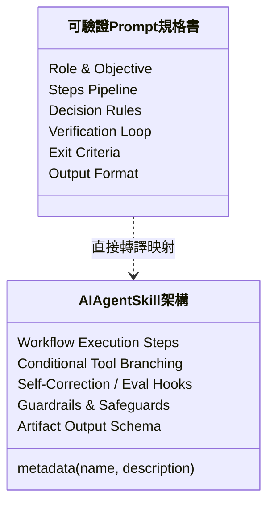

[← 上一章：05 停止條件](./05_停止條件：安全邊界與人工介入機制.md) ｜ [返回專題總覽](./README.md)

---

# 06｜實戰整合：打造可復用的工作規格書

恭喜你！學到這裡，你已經掌握了進階 AI 工作流程的四大核心積木：
1. **多步驟拆解（Steps）**：先分析、再規劃、後產出，產物可視化。
2. **決策邏輯（Decision Logic）**：條件分支 If-Else，遇到不同狀況分流處理。
3. **驗證迴圈（Verification Loop）**：依 Rubric 標準自我審核，有限次迭代修正。
4. **停止條件（Exit Criteria）**：劃定安全邊界，資料不足或風險過高時主動叫停。

本章我們將這四大要素全面整合為一套標準的 **ROSES + V 工作規格書架構**，並帶你親眼見證：**這份規格書如何一鍵轉換為未來的 AI Agent Skill！**

---

## 終極工作規格架構：ROSES + V 模板

這是一份可以直接複製並作為範本的工作規格 Prompt，適用於各類高複雜度的職場任務：

```markdown
# 角色與總體目標（Role & Objective）
你是一位［精準的角色身分］。請根據所提供的背景資訊，協助產出［高品質的具體交付成果］。

## 背景資訊與限制（Context & Constraints）
- 原始資料：［貼上資料或指示］
- 硬性限制：［字數、格式、禁用語、目標對象等］

## 執行步驟（Steps Pipeline）
1. **階段一・解析與盤點**：分析現況，列出關鍵要素、限制條件與潛在缺漏。
2. **階段二・策略與大綱**：提出至少 2 種方案或結構大綱，並指出取捨理由。
3. **階段三・深度產出**：依據最優策略，撰寫完整詳實之成果本體。
4. **階段四・品質檢驗**：依據下述標準自我驗證，必要時進行迭代修正。

## 決策邏輯與分支規則（Decision Rules）
- 若［條件 A 成立］：請採用［做法 A］。
- 若［條件 B 成立］：請採用［做法 B］。
- 若［資訊模糊／非關鍵缺漏］：請給出「保守／標準／激進」三種合理情境假設，標註假設並繼續推進。

## 自我驗證機制（Verification Loop）
完成初稿後，請針對以下標準進行核對：
- [ ] 檢核項 1：是否滿足所有硬性限制？
- [ ] 檢核項 2：邏輯是否前後一致，無矛盾之處？
- [ ] 檢核項 3：方案是否具備可落地執行的行動清單？
- **修正機制**：若有未通過項目，進行修改並重新核驗，修正上限為 2 次。

## 安全邊界與停止條件（Exit Criteria）
- 若關鍵資料遺漏，導致無法判定方案之基本可行性；
- 或方案涉及嚴重法律、資安、個資等重大風險；
- **處置動作**：立即停止產出最終方案，轉為輸出「已知事實、阻斷原因、與 3 個需要人類裁決的關鍵問題」。

## 交付格式規範（Output Format）
請依序輸出：
A. 關鍵分析與情境假設
B. 方案決策與完整成果
C. 自我驗證紀錄表（含檢核狀態）
D. 人工後續待確認清單
```

---

## 大型端到端實戰範例

### 範例 1：大型校園創新專案提案規格書

```markdown
# 角色與目標
你是一位資深校園專案企劃顧問。請協助學生團隊將初步構想，發展為一份具備可行性且可供校方評審審閱的完整專題提案書。

## 背景資訊
- 專案主題：在校園內建置「二手教科書與器材循環借閱平台」。
- 目標受眾：全校 12,000 名大專生，特別是經濟弱勢與初入學新鮮人。
- 限制預算：校內初創補助上限為新台幣 50,000 元，執行期為 4 個月。

## 執行步驟
1. 梳理學生痛點與現有二手書社團之缺失（交易詐騙、地點不便、版本錯誤）。
2. 擬定 2 種營運模式：純線上媒合制 vs 實體志工服務站。
3. 依預算限制與 4 個月時程，推薦最適方案並展開具體實施步驟。
4. 依檢驗標準自檢修正。

## 決策邏輯
- 若預算不足以開發原生 App：直接決策採用 LINE 官方帳號 + 開源 Google 表單外掛模式，嚴禁建議高成本的客製化 App 開發。
- 若涉及金流串接：首期一律規定「現場面交付款」或「以物易物點數制」，排除高風險金流法規議題。

## 驗證標準與修正迴圈
- [ ] 檢核 1：4 個月里程碑是否具備明確驗收成果？
- [ ] 檢核 2：預算分配表加總是否嚴格小於等於 50,000 元？
- [ ] 檢核 3：是否包含個資防護措施（學生學號、手機號碼之保密）？
- 修正規則：若預算超標或時程不合理，重新調整規模，最多修正 2 次。

## 停止條件
- 若校方場地借用政策或關鍵法規存在未知限制，停止斷言平台必定能成功落成，改為列出「需要與學務處課外組確認的 3 個政策問題」。

## 輸出格式
請依序輸出：
1. 專案執行摘要（Executive Summary）
2. 營運模式比較與決策說明
3. 4 個月甘特圖時程與預算分配表
4. 風險管理與法規個資因應措施
5. 提案自我檢驗合格報告
```

---

### 範例 2：RESTful API 技術規格與文件生成

```markdown
# 角色與目標
你是一位後端架構師兼 API 文件技術專家。請為電商訂單系統設計「查詢會員訂單列表」的 RESTful API 規格文件。

## 業務需求與參數
- API 路徑建議：`GET /api/v1/orders`
- 支援分頁：`page`（預設 1）、`limit`（預設 20，最大 100）
- 支援篩選：`status`（PENDING, PAID, SHIPPED, CANCELLED）

## 執行步驟
1. 定義 HTTP 請求標頭（Headers，需含 JWT Authorization）。
2. 詳列 Query 參數型態、必填性與驗證規則。
3. 撰寫 HTTP 200 成功回應的 JSON Schema 與範例。
4. 撰寫常見 HTTP 錯誤代碼（400, 401, 403, 429）之回應格式。

## 決策與安全規則
- 若使用者嘗試請求超過最大分頁限制（`limit > 100`）：API 規則必須設定為「自動截斷為 100」或「回傳 HTTP 400 驗證錯誤」，不可無上限查詢。
- 資料隱私保護：回應的訂單內容中，收件人手機與信用卡號必須加上遮罩（Masking，例如 `0912****78`）。

## 自我檢驗標準
- [ ] JSON 範例是否為合法的 JSON 格式（無多餘逗號、屬性以雙引號包覆）？
- [ ] 是否完整涵蓋 401（未授權）與 429（超過請求頻率 Rate Limit）的說明？
- [ ] 遮罩規則是否落實在範例中？
- 修正上限：若未達標，自我修正最多 2 次。

## 輸出格式
以標準 OpenAPI / Swagger 風格的 Markdown 呈現完整 API 規格文件，文末附上自檢確認清單。
```

---

## 銜接未來：從「工作規格 Prompt」到「AI Agent Skill」

這正是本章作為**「Skill 先修課程」**最迷人之處：

當你未來學習如何開發一個真正的 **AI Agent Skill**（例如在 Antigravity、Claude Projects、LangChain 或 AutoGen 中建立一個 `SKILL.md`）時，你會驚喜地發現——**兩者的架構是 100% 一對一完全映射的！**



| 我們在 Prompt 學到的要素 | 在真正 Agent Skill 裡的體現 |
|:---|:---|
| **Role & Objective** | Skill 的 Metadata、System Prompt 與 Agent 職責定義 |
| **Steps Pipeline** | Agent 的 Task Chain、Multi-turn 規劃與呼叫流程 |
| **Decision Rules** | Agent 決定何時呼叫特定 Tool / API 的條件分支邏輯 |
| **Verification Loop** | 產出檢驗（Evaluator）、自我評估反思（Reflection） |
| **Exit Criteria** | 系統防護欄（Guardrails）、人類介入審核（Human-in-the-loop） |
| **Output Format** | 結構化輸出（JSON Schema、Artifacts 產生） |

### 結語：帶著工程思維，啟程邁向 AI Agent！

只要你能寫出清晰、具備決策分支與驗證標準的工作規格，你就已經走在全世界生成式 AI 實踐者的最前沿。  
你不再是被動接受 AI 隨機回答的「對話者」，而是**能夠指揮 AI 自主運作的「工作流設計師」**！

---

[← 上一章：05 停止條件](./05_停止條件：安全邊界與人工介入機制.md) ｜ [返回專題總覽](./README.md)
