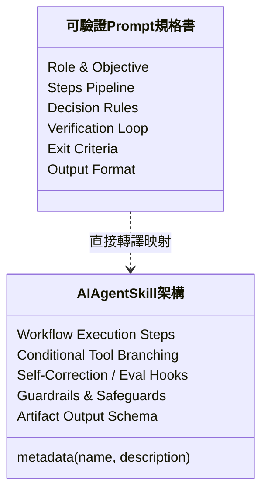

[← 上一章：05 停止條件](./05_停止條件：安全邊界與人工介入機制.md) ｜ [返回專題總覽](./README.md)

---

# 06｜實戰整合：打造可復用的工作規格書

恭喜你！學到這裡，你已經掌握了進階 AI 工作流程的四大核心積木：
1. **多步驟拆解（Steps）**：先分析、再規劃、後產出，產物可視化。
2. **決策邏輯（Decision Logic）**：條件分支 If-Else，遇到不同狀況分流處理。
3. **驗證迴圈（Verification Loop）**：依 Rubric 標準自我審核，有限次迭代修正。
4. **停止條件（Exit Criteria）**：劃定安全邊界，資料不足或風險過高時主動叫停。

本章我們將這四大要素全面整合為一套標準的 **ROSES + V 工作規格書架構**，並帶你親眼見證：**這份規格書如何一鍵轉換為未來的 AI Agent Skill！**

---

## 終極工作規格架構：標準 ROSES 整合模板

這是一份可以直接複製並作為範本的終極工作規格 Prompt，適用於各類高複雜度的職場與技術任務：

```markdown
## R – 角色設定
你是一位［精準的角色身分，例如：資深顧問／技術架構師］。

## O – 任務目標
根據背景資訊與嚴格限制，協助產出［高品質且具備可行性的具體交付成果］。

## S – 執行步驟
1. **解析與盤點**：梳理現狀，列出關鍵要素、限制條件與潛在缺漏。
2. **策略與大綱**：提出至少 2 種方案或架構大綱，並指出取捨理由。
3. **深度產出**：依據最優策略，撰寫完整詳實之成果本體。
4. **品質驗證與自檢**：對照「自我檢驗標準」逐項審核；若有未達標，自我修正（最多 2 次）。
5. **安全邊界查核**：確認是否觸發停止條件；若觸發，中斷最終結論並輸出提問清單。

## E – Example／output format
請依序分段輸出：
- 【A. 關鍵分析與情境假設】
- 【B. 方案比較與最終成果】
- 【C. 自我驗證核驗紀錄表】（含各項通過狀態）
- 【D. 人工後續待確認清單】（若觸發停止條件時列出）

## S – 範圍與風格
- 背景資訊與限制：［貼上原始資料、預算、時程、硬性限制等］。
- 決策邏輯規則：
  - 若［條件 A 成立］：請採用［做法 A］。
  - 若［條件 B 成立］：請採用［做法 B］。
  - 若資訊模糊：給出「保守／標準／激進」三種情境假設，標註假設並推進。
- 自我檢驗標準（Rubric 清單，修正上限 2 次）：
  - [ ] 檢核項 1：是否滿足所有硬性限制？
  - [ ] 檢核項 2：邏輯是否前後一致，無矛盾之處？
  - [ ] 檢核項 3：方案是否具備可落地執行的行動清單？
- 安全邊界與停止條件（Exit Criteria）：
  - 若關鍵資料遺漏導致無法評估可行性，或涉及重大法律/資安風險，**立即停止產出最終方案**，轉為輸出已知事實、阻斷原因與 3 個需要人類裁決的關鍵問題。
- 風格語調：專業嚴謹、客觀中立、繁體中文。
```

---

## 大型端到端實戰範例

### 範例 1：大型校園創新專案提案規格書

```markdown
## R – 角色設定
你是一位資深校園專案企劃顧問。

## O – 任務目標
協助學生團隊將初步構想，發展為一份具備可行性且可供校方評審審閱的完整專題提案書。

## S – 執行步驟
1. 梳理學生痛點與現有二手書交易之缺失。
2. 擬定 2 種營運模式（純線上媒合 vs 實體服務站），進行優劣分析。
3. 依預算限制推薦最適方案，並展開 4 個月具體實施甘特圖與預算表。
4. 依檢驗標準自檢修正；若預算超標重新調整（最多 2 次）。
5. 核對是否觸發停止條件，產出完整提案書。

## E – Example／output format
請依序分段輸出：
1. 專案執行摘要（Executive Summary）
2. 營運模式比較與決策說明
3. 4 個月甘特圖時程與預算分配表
4. 風險管理與法規個資因應措施
5. 提案自我檢驗合格報告（含檢核狀態與政策提問清單）

## S – 範圍與風格
- 專案背景與限制：
  - 主題：校園「二手教科書與器材循環借閱平台」；受眾為全校 12,000 名學生。
  - 預算與時程：校內補助上限新台幣 50,000 元，執行期 4 個月。
- 決策規則：
  - 預算不足以開發原生 App：直接決策採用 LINE 官方帳號 + Google 表單外掛，嚴禁建議高成本客製化開發。
  - 金流法規：首期一律規定現場面交付款或點數制，排除金流法規風險。
- 自我檢驗標準（Rubric，修正上限 2 次）：
  - [ ] 檢核 1：4 個月里程碑是否具備明確驗收成果？
  - [ ] 檢核 2：預算表加總是否嚴格 ≤ 50,000 元？
  - [ ] 檢核 3：是否包含個資防護措施（學生學號、手機保密）？
- 停止條件：
  - 若校方場地政策或法規有未知限制，停止斷言平台必能落成，列出「需與學務處確認的 3 個政策問題」。
- 風格：專業提案語氣，結構嚴整。
```

---

### 範例 2：RESTful API 技術規格與文件生成

```markdown
## R – 角色設定
你是一位後端架構師兼 API 文件技術專家。

## O – 任務目標
為電商訂單系統設計「查詢會員訂單列表」的 RESTful API 規格文件。

## S – 執行步驟
1. 定義 HTTP 請求標頭（Headers，需含 JWT Authorization）。
2. 詳列 Query 參數型態、必填性與驗證規則。
3. 撰寫 HTTP 200 成功回應的 JSON Schema 與範例資料。
4. 撰寫常見 HTTP 錯誤代碼（400, 401, 403, 429）之回應格式。
5. 針對 JSON 格式合法性、錯誤碼完整性與遮罩規則自檢修正（最多 2 次）。

## E – Example／output format
以標準 OpenAPI / Swagger 風格的 Markdown 呈現完整 API 規格文件，文末附上自檢確認清單。

## S – 範圍與風格
- 業務需求與參數：
  - API 路徑：`GET /api/v1/orders`
  - 參數支援：`page`（預設 1）、`limit`（預設 20，最大 100）、`status`（PENDING, PAID, SHIPPED, CANCELLED）。
- 決策與安全規則：
  - 分頁上限限制：若 `limit > 100`，規則必須設定為「自動截斷為 100」或「回傳 HTTP 400 錯誤」，不可無上限查詢。
  - 隱私遮罩：回應中手機與信用卡號必須加上遮罩（例如 `0912****78`）。
- 自我檢驗標準（Rubric，修正上限 2 次）：
  - [ ] JSON 範例是否為合法 JSON 格式（無多餘逗號、雙引號包覆）？
  - [ ] 是否完整涵蓋 401（未授權）與 429（Rate Limit）說明？
  - [ ] 遮罩規則是否落實在範例中？
- 風格：工程標準規格書風格，精準簡練。
```

---

## 銜接未來：從「工作規格 Prompt」到「AI Agent Skill」

這正是本章作為**「Skill 先修課程」**最迷人之處：

當你未來學習如何開發一個真正的 **AI Agent Skill**（例如在 Antigravity、Claude Projects、LangChain 或 AutoGen 中建立一個 `SKILL.md`）時，你會驚喜地發現——**兩者的架構是 100% 一對一完全映射的！**



| 我們在 Prompt 學到的要素 | 在真正 Agent Skill 裡的體現 |
|:---|:---|
| **Role & Objective** | Skill 的 Metadata、System Prompt 與 Agent 職責定義 |
| **Steps Pipeline** | Agent 的 Task Chain、Multi-turn 規劃與呼叫流程 |
| **Decision Rules** | Agent 決定何時呼叫特定 Tool / API 的條件分支邏輯 |
| **Verification Loop** | 產出檢驗（Evaluator）、自我評估反思（Reflection） |
| **Exit Criteria** | 系統防護欄（Guardrails）、人類介入審核（Human-in-the-loop） |
| **Output Format** | 結構化輸出（JSON Schema、Artifacts 產生） |

### 結語：帶著工程思維，啟程邁向 AI Agent！

只要你能寫出清晰、具備決策分支與驗證標準的工作規格，你就已經走在全世界生成式 AI 實踐者的最前沿。  
你不再是被動接受 AI 隨機回答的「對話者」，而是**能夠指揮 AI 自主運作的「工作流設計師」**！

---

[← 上一章：05 停止條件](./05_停止條件：安全邊界與人工介入機制.md) ｜ [返回專題總覽](./README.md)
