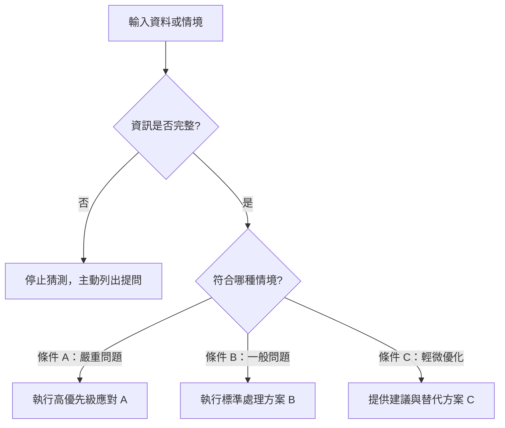

[← 上一章：02 多步驟拆解](../02_多步驟拆解_循序規劃與分階段交付/README.md) ｜ [返回專題總覽](../README.md) ｜ [下一章：04 驗證迴圈 →](../04_驗證迴圈_自我檢查與有限次修正/README.md)

---

# 03｜決策邏輯：條件分支與情境應變

> 📁 **本單元學員實作練習檔（偽資料）**：
> - [`sample_files/assignment_requirements.md`](./sample_files/assignment_requirements.md)：階梯電費計算作業規格與測資（供範例 1 作業批改對照）。
> - [`sample_files/student_homework_submissions.py`](./sample_files/student_homework_submissions.py)：包含 3 位學生實例程式碼（語法錯誤、邏輯錯誤、合格待優化）。
> - [`sample_files/support_tickets_sample.csv`](./sample_files/support_tickets_sample.csv)：5 筆真實報修工單（供範例 2 客服工單分流與 SLA 演練）。


在現實世界中，任務很少是單一直線運行的。同一個輸入資料，可能會因為「情況 A」而需要走方案甲，或是因為「情況 B」而改走方案乙。

如果沒有為 AI 設定決策邏輯，AI 遇到異常或模糊情況時，通常會**盲目猜測**或**一律套用通用罐頭回應**。  
學會撰寫明確的**條件分支（If-Else 邏輯）**，是讓 AI 工作流程具備智慧與穩定性的分水嶺。

---

## 核心觀念：Prompt 裡的條件分支與決策樹

我們用自然語言在 Prompt 中植入程式碼般的條件分支：



### 撰寫決策邏輯的 3 大關鍵原則
1. **窮舉可能情況**：把常見的正常情況與異常情況都條列出來。
2. **制定優先權（Priority）**：當一筆資料同時滿足兩種條件時，明確指示「先依照哪一個規則處理」。
3. **資訊不足時的安全策略（Fallback）**：明確禁止「自行腦補假設」，改為「條列缺少資訊並提出確認問題」。

---

## 通用工作流程模板（標準 ROSES 結構）

```markdown
## R – 角色設定
你是一位［專業身分，例如：資深審核顧問／品管專家］。

## O – 任務目標
依照既定的決策邏輯與業務規則，審核並處理［輸入的資料、請求或事件］。

## S – 執行步驟
1. **輸入辨識**：解析輸入資料，檢驗必備資訊是否齊全。
2. **條件比對**：依下方「決策判斷規則」的優先順序逐一比對。
3. **方案決策**：判定所屬情境，並產出對應的處置行動方案。
4. **邊界處理**：若資訊不足，觸發防呆保護，提出澄清問題。

## E – Example／output format
請依序分段輸出：
- 【情況診斷】：判定符合哪一條規則及其具體依據
- 【處置行動】：對應方案的詳細執行內容或回覆草稿
- 【後續追蹤】：若有缺漏或優化空間時列出待辦事項

## S – 範圍與風格
- 決策判斷規則（優先權由高至低）：
  - **高優先度（重大異常/緊急事件）**：若［條件 1 成立］，採取［方案 1，並標註高危警示］。
  - **中優先度（常規情境）**：若［條件 2 成立］，採取［方案 2］。
  - **低優先度（合格優化）**：若［條件 3 成立］，採取［優化建議 3］。
  - **例外保護規則**：若關鍵資料缺漏，**嚴禁自行捏造假設**，改為列出已知事實並提出最多 3 個澄清問題。
- 語言與語調：繁體中文，客觀嚴謹，決策理由明確。
```

---

## 由淺入深實戰範例

### 範例 1（基礎・教學）：學生 Python 作業自動批改與分流回饋

> 📄 **搭配練習檔**：
> - [`sample_files/assignment_requirements.md`](./sample_files/assignment_requirements.md)（階梯電費題目與測資）
> - [`sample_files/student_homework_submissions.py`](./sample_files/student_homework_submissions.py)（3 位學生作業程式碼）

教師批改作業時，若沒有給 AI 明確的決策分支，AI 往往直接把答案貼給學生，失去教學意義。我們示範如何用 **3 輪自然語言** 注入 If-Else 決策邏輯：

#### 🗣️ 用自然語言，3 步在 Artifacts 組裝出規格書

| 步驟 | 你的自然語言口語指令 | 注入的分支邏輯概念 | 右側 Artifacts 側邊欄的即時變化 |
|:---:|:---|:---:|:---|
| **第 1 動** | *「請參考 assignment_requirements.md，我想批改 student_homework_submissions.py 的學生作業。請在右側 Artifacts 為我建立 ROSES 規格草案。」* | **R + O（起手式）** | 側邊欄建立 `grading_spec.md` 基礎骨架 (v1)。 |
| **第 2 動** | *「請修改 S（範圍）加入嚴格 If-Else 分流規則：1. 若為 SyntaxError，指出行號給提示，嚴禁直接貼解答；2. 若為邏輯錯誤，給一組預期與實際輸出的 Test Case；3. 若正確但命名差，給重構建議；4. 若程式碼殘缺，要求補齊不腦補。」* | **If-Else 決策樹（分流處置）** | 側邊欄更新為 v2，精準包含 4 級優先權分流規則！ |
| **第 3 動** | *「請修改格式與步驟：依序輸出判定結果、關鍵診斷、引導說明，並在文末強制附上一題『反思小挑戰』引導學生自己動手改。」* | **Format & Style（引導式教學）** | 側邊欄更新為 v3（終極規格書），徹底封死直接洩漏解答的漏洞！ |

#### 🎯 側邊欄最終組裝出的完整 Prompt（可直接複製）

```markdown
## R – 角色設定
你是一位耐心且教學經驗豐富的 Python 助教。

## O – 任務目標
對照 assignment_requirements.md 與 student_homework_submissions.py，依照分流規則提供具引導性的教學回饋。

## S – 執行步驟
1. 檢驗學生程式是否能正常編譯執行。
2. 比對下方「判斷規則」，判定錯誤嚴重層級。
3. 產出對應層級的引導回饋（嚴禁直接給完整答案）。
4. 設計一題反思小挑戰，引導學生自行修正。

## E – Example／output format
請依序分段輸出：
- 判定結果：（語法錯誤／邏輯錯誤／正確待優化／資訊不足）
- 關鍵診斷：（明確指出造成問題的行號或優良之處）
- 引導說明：（說明背後觀念與思考方向）
- 下一步練習：（一題引導式小挑戰）

## S – 範圍與風格
- 判斷規則（優先權由高至低）：
  1. **語法錯誤（SyntaxError / 執行失敗）**：指出中斷行號與原因，給最小修改提示，嚴禁直接貼解答。
  2. **邏輯錯誤（結果錯誤）**：提供一組具體測試輸入（Test Case），展示預期與實際輸出的落差。
  3. **正確但待優化**：肯定學生成果，提供一項可選的程式碼重構建議（如命名或簡化判斷）。
  4. **防呆邊界**：若程式碼不完整，不可自行腦補題意，禮貌要求學生補齊缺漏。
- 風格語氣：鼓勵引導，繁體中文，避免指責性口氣。
```

---

### 範例 2（進階・營運）：客服工單自動分類與應對

> 📄 **搭配練習檔**：[`sample_files/support_tickets_sample.csv`](./sample_files/support_tickets_sample.csv)（5 筆報修工單）

面對海量進線工單，客服主管需要一套能自主判斷緊急度與分流單號的嚴密規則：

#### 🗣️ 用自然語言，3 步在 Artifacts 組裝出規格書

| 步驟 | 你的自然語言口語指令 | 注入的分支邏輯概念 | 右側 Artifacts 側邊欄的即時變化 |
|:---:|:---|:---:|:---|
| **第 1 動** | *「請參考 support_tickets_sample.csv，我想審核進線客訴並進行評級回信。請在右側建立 ROSES 規格。」* | **R + O（起手式）** | 側邊欄建立 `ticket_triage_spec.md` 基礎骨架 (v1)。 |
| **第 2 動** | *「加入分流規則：A級(金流中斷/資安)承諾2小時專人電話；B級(退款物流)提供退款證明清單；C級(操作諮詢)給步驟教學；若同時涉及A與B，強制升級為A級優先處理。」* | **Priority & Conflict（優先級與衝突處理）** | 側邊欄更新為 v2，明確劃分業務優先權與衝突降級防線。 |
| **第 3 動** | *「修改格式：輸出客訴等級、決策理由說明、正式回信草稿、後續轉派單位；語氣真誠冷靜，高度同理。」* | **Format & Style（標準化交付）** | 側邊欄更新為 v3（終極規格書）！ |

#### 🎯 側邊欄最終組裝出的完整 Prompt（可直接複製）

```markdown
## R – 角色設定
你是一位大型電商平台的資深客戶體驗（CS）專家。

## O – 任務目標
審核 support_tickets_sample.csv 中的客訴訊息，進行嚴重性評級，並產出對應等級的客製化回覆信函草稿。

## S – 執行步驟
1. 掃描客訴內容，識別核心爭議類型與用戶情緒指標。
2. 比對「分類與分流決策規則」，評定等級（A / B / C）。
3. 檢查「訂單編號」是否存在；若缺少，將索取編號設為首要行動。
4. 依等級要求撰寫正式回覆草稿，並標註內部轉派單位。

## E – Example／output format
請依序輸出：
- 客訴等級判讀：（A / B / C）
- 決策理由說明：（為何判定為此等級）
- 正式回覆信函草稿：（可直接寄出的完整客氣信件）
- 後續轉派單位：（例如：法務組、物流金流組、一般客服組）

## S – 範圍與風格
- 分類與分流規則（優先權由高至低）：
  - **等級 A：緊急法律/資安/人身風險**（個資外洩、法律訴訟、食品安全、金流全體中斷）：最高緊急處理，回覆中承諾 2 小時內專人電話致電。
  - **等級 B：退款與物流爭議**（商品毀損、延遲超過 3 天、扣款異常）：致歉並條列退款所需的 3 項證明文件，提供專屬連結。
  - **等級 C：產品使用諮詢**（規格詢問、操作教學）：直接提供簡潔步驟解答與圖文教學連結。
- 邊界衝突處理：若同時涉及 A 與 B，**強制升級為等級 A 優先處理**。
- 風格語氣：同理、真誠、冷靜、高度專業。
```

---

### 範例 3（專家・人才招募）：軟體工程師履歷自動初篩

HR 篩選技術履歷時，必須有清晰的條件門檻（Hard Criteria）與防呆驗證：

#### 🗣️ 用自然語言，3 步在 Artifacts 組裝出規格書

| 步驟 | 你的自然語言口語指令 | 注入的分支邏輯概念 | 右側 Artifacts 側邊欄的即時變化 |
|:---:|:---|:---:|:---|
| **第 1 動** | *「我想建立一份技術履歷自動初篩規格書，比對職缺條件與求職者經歷。請在右側建立 ROSES。」* | **R + O（起手式）** | 側邊欄建立 `resume_screening_spec.md` 基礎骨架 (v1)。 |
| **第 2 動** | *「加入評估決策樹：硬性門檻（3年Python+關聯資料庫）不符直接未通過；符合加分項≥2為Tier 1；若只寫『熟悉』無具體年資成果，嚴禁通過，標註『年資待釐清』並出電訪題。」* | **Decision Tree & Guardrail（決策樹與防偽防呆）** | 側邊欄更新為 v2，杜絕模糊不清的水分履歷。 |
| **第 3 動** | *「輸出初篩結論、條件符合度對照 Markdown 表格，以及 3-5 題面試官技術提問清單；風格客觀嚴謹。」* | **Format & Style（面試交付物）** | 側邊欄更新為 v3（終極規格書）！ |

#### 🎯 側邊欄最終組裝出的完整 Prompt（可直接複製）

```markdown
## R – 角色設定
你是一位科技獵頭公司的資深技術招募顧問。

## O – 任務目標
比對「職缺條件說明（JD）」與「候選人履歷」，輸出客觀初篩等級與面試指引。

## S – 執行步驟
1. **硬性門檻檢驗**：逐項核對 3 年 Python 與大型關聯式資料庫經驗。
2. **加分項檢驗**：若通過硬性門檻，進一步檢視 Docker/K8s、開源貢獻與高併發經驗。
3. **經歷真偽防呆**：檢驗是否有模糊其詞之描述。
4. **輸出等級判定**：產出初篩結論與針對性技術提問清單。

## E – Example／output format
請依序輸出：
- 初篩判定結論：（Tier 1 推薦 / Tier 2 合格 / 未通過 / 需電訪釐清）
- 條件符合度對照表（Markdown 表格：JD 條件、履歷吻合處、符合狀態）
- 面試官技術提問清單（3-5 題針對履歷亮點或缺漏的深度問題）

## S – 範圍與風格
- 評估決策樹規則：
  - **硬性門檻不符**：判定為「未通過」，說明具體不符項目，禮貌致謝。
  - **符合加分項 ≥ 2 項**：判定為「強烈推薦（Tier 1）」。
  - **符合加分項 0-1 項**：判定為「標準合格（Tier 2）」。
  - **防呆條款**：若履歷僅寫「熟悉 Python」但無具體年資或成果，嚴禁視為合格，標註「年資待釐清」並生成電訪題目。
- 風格：客觀中立、數據說話、邏輯清晰。
```

---

## 邁向 Skill 的先修意義

在編寫 **AI Agent Skill** 時：
- Agent 必須知道什麼時候該調用「工具 A（例如查詢資料庫）」，什麼時候該調用「工具 B（發送告警信）」。
- 這一切都依賴在 Skill 說明中寫清楚 **Decision Branches（條件決策分支）**。
- 掌握了決策邏輯，你的 AI 才能真正具備情境應變的「自適應能力（Adaptability）」。

---

[← 上一章：02 多步驟拆解](../02_多步驟拆解_循序規劃與分階段交付/README.md) ｜ [返回專題總覽](../README.md) ｜ [下一章：04 驗證迴圈 →](../04_驗證迴圈_自我檢查與有限次修正/README.md)
