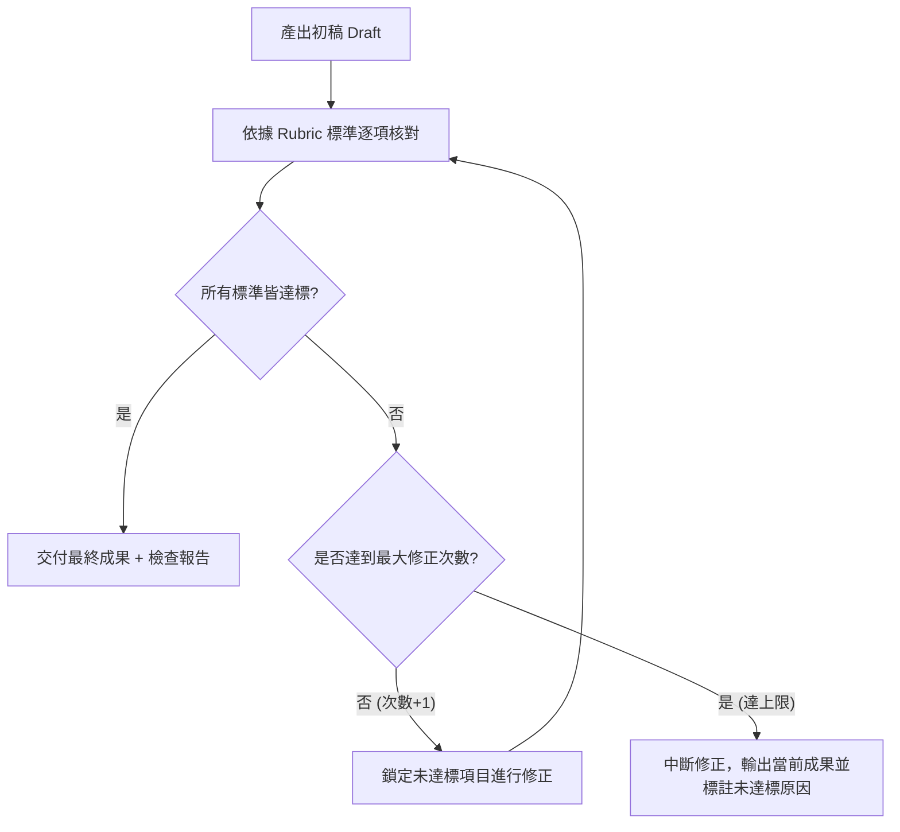

[← 上一章：03 決策邏輯](../03_決策邏輯_條件分支與情境應變/README.md) ｜ [返回專題總覽](../README.md) ｜ [下一章：05 停止條件 →](../05_停止條件_安全邊界與人工介入機制/README.md)

---

# 04｜驗證迴圈：自我檢查與有限次修正

> 📁 **本單元學員實作練習檔（偽資料）**：
> - [`sample_files/highschool_curriculum_standard.md`](./sample_files/highschool_curriculum_standard.md)：高中課綱允許語法與禁止超綱清單（供範例 1 出題 Rubric 自檢演練）。
> - [`sample_files/candidate_resume_draft.md`](./sample_files/candidate_resume_draft.md)：應屆畢業生初版履歷與職缺標準（供範例 2 STAR 原則與量化數據自檢演練）。
> - [`sample_files/locale_en_raw.json`](./sample_files/locale_en_raw.json)：含變數佔位符的英文語系檔（供範例 3 JSON 格式與佔位符完整性自檢演練）。


在日常使用 AI 時，最常見的失敗模式之一就是：AI 信心滿滿地產出了一篇看似華麗、實際上卻包含嚴重事實錯誤或不合規則的答案。

如果我們只在 Prompt 結尾加上一句「請確認正確無誤」，通常毫無效果——因為 AI 不知道**「依據什麼標準檢查」**，也不知道**「如果不合格該如何重試」**。

本章將學習如何為 Prompt 導入類似程式語言中 `while` 迴圈的**「自我驗證機制（Verification Loop）」**。

---

## 核心觀念：Reflection（反思與修正）迴圈

在進階 AI 系統設計中，這被稱為 **Reflection（反思）** 機制：讓模型生成內容後，以批判視角比對檢查標準，並在發現缺失時自我迭代。



### 構建驗證迴圈的 3 大要素
1. **客觀具體的評量規準（Rubric）**：
   - ❌ 模糊標準：「請確認寫得很好、沒有錯字。」
   - ✅ 客觀標準：「檢查字數是否在 280-320 字之間」、「檢查是否包含 3 個指定關鍵字」。
2. **差異化修正（Delta Fix）**：
   要求 AI 標註「哪一條未通過、為什麼未通過、採取了什麼修正行動」。
3. **最多次數防護（Max Iterations Guard）**：
   **絕對必須指定上限（通常為 2 或 3 次）**。若無上限，AI 可能在兩個矛盾的標準之間陷入死循環，或越修越偏離原始題意。

---

## 通用工作流程模板（標準 ROSES 結構）

```markdown
## R – 角色設定
你是一位［專業角色，例如：資深編輯／系統架構師］。

## O – 任務目標
製作［特定產出物］，並透過自我審查迴圈確保品質 100% 符合驗證標準。

## S – 執行步驟
1. **初稿撰寫**：依據背景與規範，產出第一版完整內容。
2. **依規審查**：對照「自我檢驗標準清單（Rubric）」，逐項自我檢核。
3. **迴圈修正**：
   - 若全部符合：進入下一步。
   - 若有未達標：標註缺陷項目與原因，進行局部修訂，並重新執行檢核（修正上限 2 次）。
4. **格式交付**：確認通過或達修正上限後，依規定格式輸出成果與檢驗紀錄。

## E – Example／output format
請依序分段輸出：
- 【最終成品內容】
- 【自我驗證核對紀錄表】（標註各項標準通過狀態與修正歷程）

## S – 範圍與風格
- 背景規範：［輸入資料、業務邊界與特定規則］。
- 自我檢驗標準（Rubric 清單）：
  - [ ] 標準 1：［可量化或明確是非題式的規範］
  - [ ] 標準 2：［結構、格式或必備要素規範］
  - [ ] 標準 3：［禁止事項與邊界規範］
- 修正防護：修正次數嚴格以 2 次為限，避免死循環。
- 風格語調：繁體中文，專業嚴謹，核驗客觀誠實。
```

---

## 由淺入深實戰範例

### 範例 1（基礎・教材研發）：Python 隨堂練習題生成與範圍校驗

> 📄 **搭配練習檔**：[`sample_files/highschool_curriculum_standard.md`](./sample_files/highschool_curriculum_standard.md)（高中課綱標準與禁止超綱清單）

出題最怕超出學生程度。若只說「請出簡單一點」，AI 依舊會超綱；必須導入 **While 迴圈與 Rubric 清單**：

#### 🗣️ 用自然語言，3 步在 Artifacts 組裝出規格書

| 步驟 | 你的自然語言口語指令 | 注入的自檢迴圈概念 | 右側 Artifacts 側邊欄的即時變化 |
|:---:|:---|:---:|:---|
| **第 1 動** | *「請參考 highschool_curriculum_standard.md，我想為初學者出一題 Python for 迴圈練習題。請在右側 Artifacts 為我建立 ROSES 規格草案。」* | **R + O（起手式）** | 側邊欄建立 `quiz_generator_spec.md` 基礎骨架 (v1)。 |
| **第 2 動** | *「請修改 S（步驟）：我要加入 While 迴圈自檢機制——產出題組初稿後，必須對照下方 Rubric 逐項檢查；若有超綱語法，修正後重新檢驗，修正次數上限嚴格為 2 次。」* | **While Loop & Retry Limit（驗證迴圈與上限）** | 側邊欄更新為 v2，寫明自我審核與有限次重試機制，防止死循環。 |
| **第 3 動** | *「請在 S（範圍）列出具體 Rubric：1. 禁 while/list/sum()；2. TODO 挖空處合理；3. 教師解答手算測資 100% 正確；格式輸出題目卷、解答與驗證紀錄。」* | **Rubric & Format（客觀檢驗指標）** | 側邊欄更新為 v3（終極規格書），把關標準具體量化！ |

#### 🎯 側邊欄最終組裝出的完整 Prompt（可直接複製）

```markdown
## R – 角色設定
你是一位高中資訊科技教材編輯。

## O – 任務目標
參考 highschool_curriculum_standard.md，為初學者設計一題 Python 實作練習題，確保不超出已學範圍。

## S – 執行步驟
1. 產出題組初稿：包含題目說明、輸入輸出範例（各 2 組）、學生半成品程式（挖空 TODO）與教師標準解答。
2. 對照下方「檢驗標準清單（Rubric）」進行自檢。
3. 若有未達標項目，修正題目或程式碼後重新檢驗，修正上限 2 次。
4. 輸出最終題組與驗證紀錄。

## E – Example／output format
請依序分段輸出：
- 【練習題題目卷】（題目敘述、輸入輸出範例、半成品程式碼）
- 【教師解答與詳解】
- 【驗證核對紀錄】（列出檢核 1-3 狀態與修正歷程）

## S – 範圍與風格
- 主題與程度：使用 `for` 迴圈計算 1 到 N 的總和；學生剛學過變數、基礎數學運算符與 `for i in range(...)`。
- 檢驗標準（Rubric）：
  - [ ] 檢核 1：題目是否嚴格限制在 `for` 與 `range`，絕無出現 `while`、`list` 或進階函式（如 `sum()`）？
  - [ ] 檢核 2：半成品程式的 TODO 挖空處是否清晰合理（不多不少，僅留核心邏輯）？
  - [ ] 檢核 3：以測資手動推算教師解答，產出是否 100% 吻合輸出範例？
- 修正上限：最多重試 2 次。
```

---

### 範例 2（進階・資料庫工程）：高效且安全的 SQL 報表查詢

資料庫查詢若有漏洞或缺乏索引，將直接影響系統效能與資安：

#### 🗣️ 用自然語言，3 步在 Artifacts 組裝出規格書

| 步驟 | 你的自然語言口語指令 | 注入的自檢迴圈概念 | 右側 Artifacts 側邊欄的即時變化 |
|:---:|:---|:---:|:---|
| **第 1 動** | *「我想根據業務需求撰寫 MySQL 報表查詢語法，請在右側 Artifacts 為我建立 ROSES 規格。」* | **R + O（起手式）** | 側邊欄建立 `sql_query_spec.md` 基礎骨架 (v1)。 |
| **第 2 動** | *「加入執行步驟：寫完第一版 SQL 後，必須依下方指標審核；若有索引破壞或注入風險，重構語法再驗，最多修正 2 次。」* | **Verification Loop（反思與自我修正）** | 側邊欄更新為 v2，形成自動優化迴圈。 |
| **第 3 動** | *「在範圍明確列出 3 大品質標準：1. 語法正確性；2. SARGable 索引友善（禁在欄位用函數）；3. 參數化防注入；輸出最佳化語法、索引建議與自檢報告。」* | **Rubric & Deliverables（工程規範）** | 側邊欄更新為 v3（終極規格書）！ |

#### 🎯 側邊欄最終組裝出的完整 Prompt（可直接複製）

```markdown
## R – 角色設定
你是一位資料庫資深架構師（DBA）。

## O – 任務目標
根據業務需求撰寫高效且具備防禦性的 MySQL 報表查詢語法。

## S – 執行步驟
1. 撰寫第一版 SQL 查詢語法。
2. 針對下方「SQL 品質指標」逐項審核。
3. 若發現違反索引原則或有注入風險，重構語法並重新檢視，最多修正 2 次。
4. 輸出最佳化語法、索引建議與自檢報告。

## E – Example／output format
請依序輸出：
- 【最佳化 SQL 語法】
- 【查詢效能預估與建議索引（CREATE INDEX 建議）】
- 【SQL 審核自檢報告】（逐項說明 3 大標準符合情況）

## S – 範圍與風格
- 業務需求與資料表：
  - 目的：撈取「過去 30 天內，消費金額累計超過 10,000 元且未曾退貨的 VIP 會員」。
  - 表結構：`users` (id, name, email), `orders` (id, user_id, amount, status, created_at)。
- SQL 品質檢核標準：
  1. 語法正確性：使用正確的 `JOIN` 與 `GROUP BY / HAVING` 聚合。
  2. 索引友善性（SARGable）：日期篩選嚴禁在欄位本體使用函式（如禁止 `WHERE DATE(created_at) > ...`）。
  3. 安全注入防護：必須使用參數化預留位置（如 `?` 或 `:days`），禁止文字拼接。
- 修正次數上限：最多 2 次。
```

---

### 範例 3（專家・多語在地化）：跨國品牌行銷文案在地化校核

> 📄 **搭配練習檔**：[`sample_files/locale_en_raw.json`](./sample_files/locale_en_raw.json)（英文原始字串與佔位符）

多語言翻譯最容易踩雷在字數暴增破版或文化禁用詞：

#### 🗣️ 用自然語言，3 步在 Artifacts 組裝出規格書

| 步驟 | 你的自然語言口語指令 | 注入的自檢迴圈概念 | 右側 Artifacts 側邊欄的即時變化 |
|:---:|:---|:---:|:---|
| **第 1 動** | *「請參考 locale_en_raw.json，我想把英文 Slogan 在地化翻譯為日語與台灣繁體中文。請在右側建立 ROSES。」* | **R + O（起手式）** | 側邊欄建立 `localization_spec.md` 基礎骨架 (v1)。 |
| **第 2 動** | *「加入步驟與自檢：翻譯後必須精確計算字元數，若超長或有禁用詞，最多精煉修正 2 次；若仍超長提出 2 個縮減方案供人工裁決。」* | **Character Count Loop & Fallback（長度迴圈與兜底）** | 側邊欄更新為 v2，明確約定破版防護與重試上限。 |
| **第 3 動** | *「設定 Rubric：日語 ≤ 25 字元、繁中 ≤ 16 字元（配合手機畫面）；輸出各語系文案（附字數）、理念說明與品質核對表。」* | **Rubric & Format（介面適配驗收）** | 側邊欄更新為 v3（終極規格書）！ |

#### 🎯 側邊欄最終組裝出的完整 Prompt（可直接複製）

```markdown
## R – 角色設定
你是一位跨國消費品牌的多語在地化（Localization）總監。

## O – 任務目標
參考 locale_en_raw.json，將英文主視覺 Slogan 翻譯為符合版面限制與在地文化的「日語」與「繁體中文（台灣）」。

## S – 執行步驟
1. 根據品牌調性撰寫日語與繁中初譯版本。
2. 對照下方「字數與用語檢驗標準」精確計算字元數並排查禁用詞。
3. 若超長或含禁用詞，進行精煉改寫，最多修正 2 次。
4. 若 2 次後因字數極限無法完整表達，主動提出 2 個縮減方案供人類決策。

## E – Example／output format
請依序輸出：
- 【繁體中文在地化文案】（附字數計數）
- 【日語在地化文案】（附字數計數）
- 【翻譯理念與對照說明】
- 【品質核對表】

## S – 範圍與風格
- 原始文案與調性："Power unleashed. Pure precision for your everyday workflow."；調性為高科技、極簡、自信。
- 自我檢驗標準（Rubric）：
  - [ ] 長度限制：日語 ≤ 25 全形字元；繁體中文 ≤ 16 中文字元（配合手機排版）。
  - [ ] 佔位符保留：若有變數標籤（如 `{username}`）必須 100% 完整保留不可翻譯。
  - [ ] 用語在地化：繁中必須使用台灣常見科技用語，嚴格禁用中國大陸用語（如禁用「視頻」、「內存」）。
  - [ ] 標點風格：句尾不使用句號，維持俐落現代風格。
- 修正防護：上限 2 次。
```

---

## 邁向 Skill 的先修意義

在成熟的 **AI Agent 架構**中：
- 例如 Code Review Agent、Writing Agent，背後往往都有一個獨立的 **Critic / Evaluator** 節點。
- 寫出高水準的 Skill，關鍵就在於把「評價與自我修正（Self-Correction）」寫成可執行的邏輯。
- 能精確定義驗證標準的工程師，才能訓練出穩定、不會信口開河的頂級 Agent！

---

[← 上一章：03 決策邏輯](../03_決策邏輯_條件分支與情境應變/README.md) ｜ [返回專題總覽](../README.md) ｜ [下一章：05 停止條件 →](../05_停止條件_安全邊界與人工介入機制/README.md)
