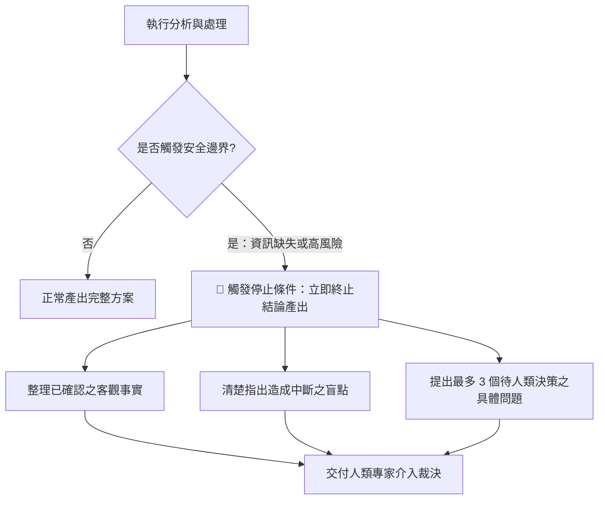

[← 上一章：04 驗證迴圈](../04_驗證迴圈_自我檢查與有限次修正/README.md) ｜ [返回專題總覽](../README.md) ｜ [下一章：06 實戰整合 →](../06_實戰整合_打造可復用的工作規格書/README.md)

---

# 05｜停止條件：安全邊界與人工介入機制

> 📁 **本單元學員實作練習檔（偽資料）**：
> - [`sample_files/sample_partner_NDA.txt`](./sample_files/sample_partner_NDA.txt)：包含無期限保密與單方無限賠償之高危合約條款（供範例 1 合約審閱阻斷演練）。
> - [`sample_files/cloud_migration_checklist.md`](./sample_files/cloud_migration_checklist.md)：缺少 RTO/RPO 關鍵指標之企業遷移問卷（供範例 2 技術架構硬性中斷演練）。
> - [`sample_files/health_consultation_inquiry.txt`](./sample_files/health_consultation_inquiry.txt)：急診病患諮詢用藥信件（供範例 3 醫療紅線與免責導流演練）。


在構建 AI 工作流程時，許多初學者常犯的一個大忌是：**試圖讓 AI 在任何情況下都「強行完成任務」**。

然而，大語言模型本質上具備「迎合討好（Sycophancy）」與「補齊缺漏」的傾向。當面對資料不足、邏輯矛盾或超出能力邊界的任務時，缺乏停止條件的 AI 會開始**編造事實（產生幻覺）**，給出看似頭頭是道卻極度危險的結論。

**停止條件（Exit Criteria / Guardrails）就是工作流程的安全煞車**：它明確規定 AI「什麼時候該交付成果，什麼時候必須立刻停下來尋求人類確認」。

---

## 核心觀念：Human-in-the-Loop（人機協同環節）

在專業的工作流程中，AI 的最高境界不是「逞強包辦一切」，而是**「清楚知道自己的邊界，並在關鍵時刻主動尋求人類決策」**。



### 必須設定停止條件的 3 大高危情境
1. **關鍵數據缺漏**：金額、日期、合約主體、法規條款、程式金鑰缺失，嚴禁自行預設。
2. **多重合理解讀且風險巨大**：存在多種完全相反的推論方向，且任一方向錯誤都會導致嚴重損失。
3. **超出授權權限**：涉及個資（PII）、資安隱私或商業機密時，必須停止處理。

---

## 通用工作流程模板（標準 ROSES 結構）

```markdown
## R – 角色設定
你是一位［專業身分，例如：企業法務審查顧問／資深風控專家］。

## O – 任務目標
審核［輸入資料或商業方案］，在嚴守安全邊界的前提下產出評估，遇高風險時主動中斷。

## S – 執行步驟
1. 檢視輸入資料，列出已確認的客觀事實。
2. 進行關鍵風險指標與邊界檢核。
3. **安全煞車判定**：比對下方「安全邊界與停止條件」；若觸發任一條，**立即終止最終方案推導**。
4. **處置輸出**：若未觸發，輸出完整方案；若觸發停止，輸出已知事實、阻斷原因與人類裁決問題清單。

## E – Example／output format
請依序分段輸出：
- 【已確認客觀事實清單】
- 【安全邊界檢核結果】（正常通過／觸發停止中斷）
- 【完整評估方案】（僅在未觸發停止時輸出）
- 【阻斷原因與人類決策請求清單】（若觸發停止時必填：最多 3 個具體決策問題）

## S – 範圍與風格
- 安全邊界與停止條件（Exit Criteria）：
  - 條件 1：缺少做成決策所需的關鍵數據或法規依據時，嚴禁自行臆造。
  - 條件 2：資料存在重大自我矛盾無法排除時，立即停止推論。
  - 條件 3：涉及潛在法律、資安或超出權限之高額財務風險時，強制中斷並要求人類專家介入。
- 風格：嚴謹、誠實、保守，不逞強、不捏造事實。
```

---

## 由淺入深實戰範例

### 範例 1（基礎・商業法務）：保密協議（NDA）重點條款快速檢驗

> 📄 **搭配練習檔**：[`sample_files/sample_partner_NDA.txt`](./sample_files/sample_partner_NDA.txt)（包含無期限保密與單方無限賠償之高危合約條款）

審閱合約時，最忌諱 AI 輕易給出「本合約完全沒問題，可以放心簽署」的盲目背書：

#### 🗣️ 用自然語言，3 步在 Artifacts 組裝出規格書

| 步驟 | 你的自然語言口語指令 | 注入的停止條件概念 | 右側 Artifacts 側邊欄的即時變化 |
|:---:|:---|:---:|:---|
| **第 1 動** | *「請幫我審閱 sample_partner_NDA.txt 的保密合約，重點看權利義務。請在右側 Artifacts 建立 ROSES 規格書。」* | **R + O（起手式）** | 側邊欄建立 `nda_review_spec.md` 基礎合約審閱骨架 (v1)。 |
| **第 2 動** | *「加入安全煞車：如果發現『無期限保密』或『單方無限賠償責任』，立刻終止給予合格結論，不能說可以簽署，必須強制列為高危阻斷。」* | **Hard Stop Criteria（硬性中斷標準）** | 側邊欄更新為 v2，在執行步驟與 Scope 注入強制煞車條款。 |
| **第 3 動** | *「規定輸出格式：先列基本屬性，再做風險等級對照表；若觸發阻斷，輸出給執業律師的複查清單與修改建議條文。」* | **Fallback & Escalation（人工介入路徑）** | 側邊欄更新為 v3（終極規格書）！ |

#### 🎯 側邊欄最終組裝出的完整 Prompt（可直接複製）

```markdown
## R – 角色設定
你是一位企業法務合約審閱助理。

## O – 任務目標
檢視 sample_partner_NDA.txt 條款，整理權利義務清單，並在發現高危條款時主動中斷背書。

## S – 執行步驟
1. 逐條審核保密資訊定義、保密年限、違約賠償與智財權條款。
2. 檢驗是否觸發下方「高危阻斷條件」。
3. 若觸發阻斷，**終止給予整體合格結論**，轉為標示紅線風險並提出具體修改建議。
4. 輸出條款風險表與律師複查指引。

## E – Example／output format
請依序輸出：
- 【合約基本屬性摘要】
- 【條款風險對照表】（標註風險等級：🟢 安全 / 🟡 需注意 / 🔴 高危阻斷）
- 【高危阻斷項目處置建議】（若無則註明無阻斷項）
- 【下一步律師確認清單】（給內部法律顧問之覆核問題）

## S – 範圍與風格
- 審查重點：保密範圍對稱性、年限合理性（3-5 年慣例）、賠償上限對稱性。
- 嚴格停止條件（Hard Stop）：
  - 若出現「無期限保密義務」、「單方賠償無上限」或「未經定義的非競業條款」，**嚴禁給予「審閱通過」結論**，強制列為阻斷項目交由執業律師裁決。
- 風格：客觀、保守、合規。
```

---

### 範例 2（進階・雲端架構）：舊核心系統雲端遷移前置評估中斷機制

> 📄 **搭配練習檔**：[`sample_files/cloud_migration_checklist.md`](./sample_files/cloud_migration_checklist.md)（缺少 RTO/RPO 關鍵指標之企業遷移問卷）

雲端遷移最怕在關鍵架構參數缺失時「強行硬上」。缺乏容災指標時，AI 盲目推薦上雲腳本將釀成災難：

#### 🗣️ 用自然語言，3 步在 Artifacts 組裝出規格書

| 步驟 | 你的自然語言口語指令 | 注入的停止條件概念 | 右側 Artifacts 側邊欄的即時變化 |
|:---:|:---|:---:|:---|
| **第 1 動** | *「請參考 cloud_migration_checklist.md，評估舊系統遷移至 AWS 的可行性。在右側側邊欄寫出 ROSES Prompt。」* | **R + O（起手式）** | 側邊欄建立 `cloud_migration_spec.md` 架構評估模板 (v1)。 |
| **第 2 動** | *「加入安全停止邊界：如果缺少 RTO、RPO 或近 3 個月從未做過 DR 演練，嚴禁產出具體遷移腳本或說可立即遷移，必須立即終止！」* | **Data Completeness Stop（數據完整性煞車）** | 側邊欄更新為 v2，把容災關鍵指標列為不可協商的前提。 |
| **第 3 動** | *「輸出分兩段：若未中斷才輸出執行藍圖；若觸發中斷，改為輸出已確認現況、阻斷理由，以及列給技術長（CTO）的 3 個決策問題。」* | **Human Escalation Format（向上陳報格式）** | 側邊欄更新為 v3（終極規格書）！ |

#### 🎯 側邊欄最終組裝出的完整 Prompt（可直接複製）

```markdown
## R – 角色設定
你是一位 AWS 企業級解決方案架構師（Solutions Architect）。

## O – 任務目標
評估 cloud_migration_checklist.md 中的舊系統上雲問卷，在確保營運連續性與資料安全的前提下產出評估結論。

## S – 執行步驟
1. 盤點現有系統規模、用戶量與資料庫規格。
2. 進行關鍵指標與災備完整性檢核。
3. **安全煞車判定**：檢驗下方「停止條件」；若觸發任一項，**立即終止遷移藍圖產出**。
4. 依狀態產出架構決策或中斷阻斷報告。

## E – Example／output format
請依序輸出：
- 【系統現況盤點摘要】
- 【安全邊界檢核結果】（通過 / 🔴 觸發架構中斷）
- 【遷移架構藍圖】（僅在無阻斷時輸出）
- 【中斷阻斷原因與 CTO 決策請求】（若觸發中斷時必填：說明技術風險並列出 3 個核心決策問題）

## S – 範圍與風格
- 嚴格停止條件（Exit Criteria）：
  1. **RTO / RPO 缺失中斷**：若未定義最大允許停機時間或資料遺失上限，**嚴禁給予「可執行遷移」結論**。
  2. **災備演練缺失中斷**：從未執行過 DR Drill 時，嚴禁推薦無停機直接切換方案。
- 風格：實事求是、高可靠性優先、嚴禁在無指標下冒險推論。
```

---

### 範例 3（專家・醫療衛教）：用藥諮詢安全紅線與緊急導流

> 📄 **搭配練習檔**：[`sample_files/health_consultation_inquiry.txt`](./sample_files/health_consultation_inquiry.txt)（病患併用葡萄柚汁與降血壓藥後出現低血壓急症信件）

涉及生命安全、醫療診斷與用藥處方時，AI 必須設有絕對不可越雷池一步的「死線」：

#### 🗣️ 用自然語言，3 步在 Artifacts 組裝出規格書

| 步驟 | 你的自然語言口語指令 | 注入的停止條件概念 | 右側 Artifacts 側邊欄的即時變化 |
|:---:|:---|:---:|:---|
| **第 1 動** | *「請閱讀 health_consultation_inquiry.txt，協助回覆民眾關於降血壓藥與葡萄柚汁的諮詢。請在右側產生 ROSES 規格。」* | **R + O（起手式）** | 側邊欄建立 `medical_triage_spec.md` 衛教諮詢規格 (v1)。 |
| **第 2 動** | *「加入最高安全紅線：嚴禁診斷病情或建議加藥／停藥！一旦發現血壓異常過低（<90/60）或胸悶心悸急症，必須立刻啟動急診中斷！」* | **Absolute Red Line & Guardrail（絕對防護紅線）** | 側邊欄更新為 v2，明確劃定醫療禁區與急診特徵。 |
| **第 3 動** | *「輸出格式：最上方用醒目警告標註立刻就醫／撥打 119 指引；接著客觀解釋葡萄柚與降血壓藥交互作用機制，最後提供就醫攜帶清單。」* | **Safety-First Triage Output（急診分流指引）** | 側邊欄更新為 v3（終極規格書）！ |

#### 🎯 側邊欄最終組裝出的完整 Prompt（可直接複製）

```markdown
## R – 角色設定
你是一位專業的臨床藥師與急診分流衛教顧問。

## O – 任務目標
檢視 health_consultation_inquiry.txt 中的病患用藥諮詢，在恪守醫療法規與生命安全邊界下提供急診指引與衛教說明。

## S – 執行步驟
1. 檢視病患症狀（血壓數值、心率、胸悶自述）與攝取物質。
2. 檢查是否觸發「緊急危症停止條件」。
3. **安全煞車啟動**：若觸發急症紅線，**立即停止任何常規藥物調整建議**，轉為急診導流。
4. 產出緊急就醫行動清單與交互作用機制衛教。

## E – Example／output format
請依序輸出：
- 🚨【緊急醫療警訊與即刻行動指引】（加粗醒目提示：立刻前往急診或撥打 119）
- 【急診就醫準備事項】（需攜帶的藥袋、向醫師說明的關鍵資訊）
- 【藥物與食物交互作用衛教說明】（客觀解釋為何葡萄柚會影響降血壓藥代謝濃度）
- 【法規免責聲明】

## S – 範圍與風格
- 嚴格安全停止條件（Hard Stop & Red Lines）：
  - **嚴禁處方決策**：嚴禁建議病患「再吃一顆」或「自行停藥」，任何藥物調整必須由主治醫師診視後決定。
  - **急症阻斷**：收縮壓低於 90 mmHg 且伴隨胸悶心悸時，屬於潛在心血管急症，禁止建議觀察或大量喝水拖延。
- 風格：冷靜、緊急優先、嚴謹守法。
```

---

## 邁向 Skill 的先修意義

在 **生產級 AI Agent 架構（Production AI Agent）** 中：
- 停止條件就是 **Guardrails（安全護欄）** 與 **Fallback Mechanism（備援機制）**。
- 一個沒有「安全煞車」的 Agent 是不能上線投入生產環境的。
- 具備設定停止條件的思維，才能確保未來的 Agent 既高效又安全，不會給團隊捅出無法挽回的簍子！

---

[← 上一章：04 驗證迴圈](../04_驗證迴圈_自我檢查與有限次修正/README.md) ｜ [返回專題總覽](../README.md) ｜ [下一章：06 實戰整合 →](../06_實戰整合_打造可復用的工作規格書/README.md)
