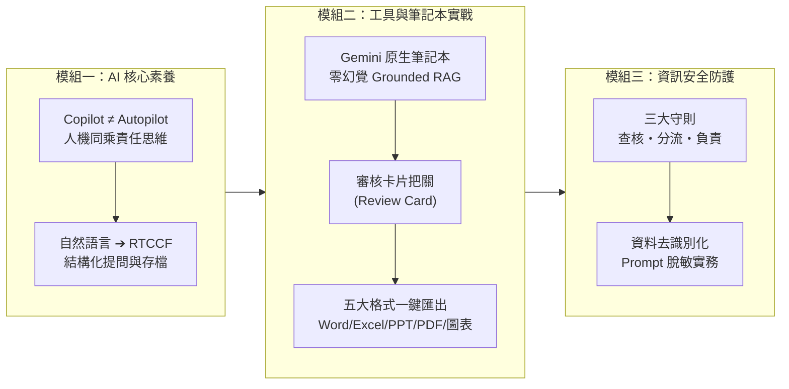

# 非技術人員生成式AI辦公室應用實務班
## 🚀 Google Gemini 原生整合筆記本（NotebookLM）辦公室高效應用與資安實戰

> **專案簡介**：本課程專為**非技術背景的辦公室同仁**量身打造，針對日常繁重的文書撰寫、資料彙整、會議紀錄整理與跨部門溝通等場景，全面採用 **Google Gemini 原生整合「筆記本」（NotebookLM 核心機制）** 單一工作平台架構。
>
> 💡 **核心優勢**：
> 1. **零門檻人機協作**：學員「不會寫 Prompt 也沒關係」，教導用日常白話輸入，由 AI 自動轉為標準 **RTCCF 格式**並提示存檔。在正式產出任何檔案前，皆通過**「審核卡片（Review Card）」**機制，由人類確認「可以了」才生成實體交付格式。
> 2. **免除付費與次數限制**：解決 ChatGPT / Claude 免費帳號在長時間實務課程中容易觸發的冷卻限制與次數中斷問題。
> 3. **單一入口、零切換負擔**：最新 Google Gemini 已於側邊欄原生內建「**筆記本**（＋ 新增筆記本）」功能，同仁無需在多個工具間切換，直接在 Gemini 內一站式完成「日常對話 ➔ 專屬知識庫檢索 ➔ 會議紀錄萃取 ➔ 資訊圖表與簡報生成 ➔ 正式公函轉化」。

---

## 📌 課程概覽

> 📥 **課綱文件下載**：[**📄 非技術人員生成式AI辦公室應用實務班_課程大綱.docx**](./非技術人員生成式AI辦公室應用實務班_課程大綱.docx)（依學員掌握度彈性推進，已通過人機協作審核卡片編譯）

| 項目 | 說明 |
| :--- | :--- |
| **課程名稱** | 非技術人員生成式AI辦公室應用實務班 |
| **培訓時程** | **模組進度制**（不設死板時間限制，完全依學員實際吸收程度與實機操作進度彈性推進） |
| **培訓人數** | 20 人（小班互動實作工作坊，確保每位同仁皆能充分練習並排除疑難） |
| **授課形式** | 實體工作坊（觀念解析 30% + 實務上機操作 50% + 課堂情境演練 20%） |
| **適合對象** | 行政總務、人資、企劃、專案管理、財務、業務助理等**非技術背景**之辦公室同仁 |
| **核心工具** | **Google Gemini**（日常對話與多模態助理）+ **Gemini 內建「筆記本」**（NotebookLM 文件與會議知識庫） |
| **先備要求** | 具備一般電腦與瀏覽器操作能力，擁有有效之 **Google 帳號**（無需任何程式語言背景） |

---

### 🎯 課程三大核心主題與人機協作思維

1. **基本素養知識（如何用得好）**：
   - 建立 **Copilot ≠ Autopilot** 與 **Human-in-the-loop** 的正確人機協作思維。
   - 掌握 **RTCCF 結構化提示詞框架**，學員輸入自然語言，AI 轉化為標準提示詞並提示存檔。
2. **基本工具使用（通用工具與原生筆記本一站式實戰）**：
   - 活用 **Google Gemini** 處理各類公文通知、專業商務信件、長文濃縮、數據表格整理與多模態圖文解析。
   - 透過 Gemini 側邊欄「**＋ 新增筆記本**」，直接在同一工作環境建立個人與部門「專屬知識庫」，一鍵匯入 PDF/規章/會議逐字稿，精準萃取會議紀錄與行動待辦，產出附帶引文標註（零幻覺）。
   - 在產生 **Word (.docx)**、**Excel (.xlsx)**、**PowerPoint (.pptx)**、**PDF (.pdf)** 與 **全自動資訊圖表** 之前，強制通過**「審核卡片（Review Card）」**，待同仁核可才輸出最終格式。
3. **基本資訊安全（安心合規使用）**：
   - 建立「**查核・分流・負責**」三大資安守則。
   - 掌握**資料去識別化（Anonymization）**實務技巧，學會機敏資訊、商業機密與個人資料之防護邊界，避免違反法規與洩密風險。

---

### 💡 預期效益

- ⏱️ **行政時間省半**：會議紀錄整理、常規公函草擬、長篇公文閱讀時間大幅縮短 50% 以上。
- 🔗 **一站式工作流**：在 Gemini 內直接點選「筆記本」檢索規章與紀錄，並就地轉換為對外公告、Email 或資訊圖表，操作流暢無斷點。
- 🎯 **回答零幻覺**：透過筆記本的 Grounded Search（資料錨定），產出有憑有據、附帶來源引用的精準摘要。
- 🛡️ **安全有保障**：落實「審核卡片」人機確認機制，加上資料脫敏原則，確保工作成果精準、合規、零風險。

---

## 🗺️ 模組化學習地圖（依學員掌握度彈性推進）

| 階段進度 | 單元主題 | 核心模組與教材導覽 |
| :--- | :--- | :--- |
| **第一階段** 核心素養建立 | **模組一：AI 核心素養與結構化提問技巧** *(一、基本素養知識：如何用得好)* | 1. **思維升級**：Copilot 協作思維與 80/20 人機責任分配 2. **常見盲點解析**：AI 為什麼會胡說八道（幻覺成因與防範） 3. **RTCCF 提示詞工程框架**（Role, Task, Context, Constraint, Format） 4. **零門檻實作**：學生自然語言 ➔ AI 產出 RTCCF ➔ 提示學生存檔的人機協作閉環 |
| **第二階段** 通用工具打底 | **模組二（上）：Gemini 通用文書與多模態實戰** *(二、基本工具使用：通用工具)* | 1. **Gemini 核心優勢**：長文本處理、多模態圖文辨識與對話管理 2. **公務文書自動化**：商務信函、正式公告、活動企劃初稿 3. **多模態圖文輔助**：照片/掃描檔圖表解析、手寫白板筆記整理 4. **實作演練**：行政流程多版本語氣轉換與表格快速生成 |
| **第三階段** 知識庫與視覺化 | **模組二（下）：Gemini 筆記本知識庫與視覺化實戰** *(二、基本工具使用：筆記本整合)* | 1. **側邊欄筆記本建立**：Grounded RAG 知識庫，附帶來源引用杜絕幻覺 2. **五大商務格式雙軌生成**：Word、Excel、PPT、PDF 與資訊圖表 3. **人機協作閘門**：生成前強制輸出「審核卡片 (Review Card)」，人眼確認後匯出 4. **【視覺黑科技】全自動資訊圖表**：10 大風格 × 3 大閱讀動線實戰 |
| **第四階段** 資安合規防護 | **模組三：企業基本資訊安全與防護守則** *(三、基本資訊安全)* | 1. **AI 時代的資安威脅**：資料外洩、模型再訓練與隱私條款剖析 2. **公務與企業實戰三大法則**：查核（Verify）、分流（Segregate）、負責（Accountability） 3. **去識別化脫敏操作實踐**：遮蔽個資、財務數字與專案關鍵名稱之技巧 4. **綜合情境演練與 Q&A** |

---

## 📚 課程單元與核心教材導覽

本課程各單元完整教學內容、指令範例與實戰練習，請直接點選下方各專題連結查閱：

### 🔹 模組一：AI 基本素養與提示詞工程（如何用得好）

- [**AI 提示詞工程指南**](../../prompt/AI提示詞工程指南/README.md)  
  深入解析 RTCCF 結構化提示詞架構（Role, Task, Context, Constraint, Format），說明 System Prompt 角色設定、少樣本範例引導（Few-shot）與結構化輸出控制技巧。
- [**提示詞不知道怎麼寫**](../../prompt/提示詞不知道怎麼寫/README.md)  
  專為新手打造的寫作指引，提供面對空白輸入框時的實戰寫作思維、常見痛點拆解與快速套用句型。
- [**AI Agent 基本概念**](../../AI_Agent基本概念/README.md)  
  建立正確的人機同乘思維（Copilot ≠ Autopilot）與 Human-in-the-loop 決策循環，掌握 80% AI 輔助與 20% 人類把關的 80/20 法則。

---

### 🔹 模組二：Google Gemini 通用工具與原生筆記本一站式實戰（基本工具使用）

> 📘 核心模組教材：[**Gemini 辦公室全能應用總覽手冊**](../../常見的AI應用/Gemini辦公室全能應用/README.md)  
> 📦 練習素材下載：[**教學範例素材與偽資料庫**](../../常見的AI應用/Gemini辦公室全能應用/範例素材與偽資料/README.md)

#### 1. 原生筆記本（NotebookLM）專屬知識庫與會議處理
- **Gemini 原生筆記本操作**：  
  直接在 Gemini 側邊欄點選「**＋ 新增筆記本**」，為部門規章、SOP 或專案手冊建立獨立知識庫，產出皆附帶可回溯的引用標註。
- [**RAG 的應用與知識庫建立**](../../常見的AI應用/RAG的應用/README.md)  
  說明 Grounded RAG（接地檢索）如何限制模型僅依據上傳來源回答，避免 AI 幻覺，並提供產品手冊與規章等測試範例素材。
- **會議紀錄與行動清單萃取**：  
  匯入語音逐字稿，自動提煉核心決議、爭點摘要與 Action Items 清單，並就地於 Gemini 對話中轉化為會議紀要通知信。

#### 2. 辦公室五大商務交付格式（支援「純 Prompt 直接產出」與「Notebook 範本資料產出」雙軌實務）

所有格式生成均落實：**自然語言輸入 ➔ 轉化為 RTCCF Prompt 並提示存檔 ➔ 輸出審核卡片 (Review Card) ➔ 使用者核可確認 ➔ 匯出實體檔案**：

- [**Word 與 PDF 文件的生成**](../../常見的AI應用/Gemini辦公室全能應用/Word與PDF文件的生成.md)  
  提供專案企劃自然語言指令；亦可上傳 [企業內部規章_差旅與加班管理規範.pdf](../../常見的AI應用/Gemini辦公室全能應用/範例素材與偽資料/企業內部規章_差旅與加班管理規範.pdf)，產出【文件架構審核卡片】，經人類確認後匯出 Word (`.docx`) 與 PDF (`.pdf`)。
- [**Excel 試算表的生成**](../../常見的AI應用/Gemini辦公室全能應用/Excel試算表的生成.md)  
  提供零碎口語需求清洗指令，或上傳 [各部門零碎採購申請與報價單據.xlsx](../../常見的AI應用/Gemini辦公室全能應用/範例素材與偽資料/各部門零碎採購申請與報價單據.xlsx) 及 [實體白板專案討論與待辦筆記.png](../../常見的AI應用/Gemini辦公室全能應用/範例素材與偽資料/實體白板專案討論與待辦筆記.png) 照片 OCR，產出【數據風控審核卡片】，確認無誤後一秒點擊綠色按鈕匯出至 Google 試算表並下載 Excel (`.xlsx`)。
- [**PowerPoint 簡報的生成**](../../常見的AI應用/Gemini辦公室全能應用/簡報的生成.md)  
  提供科技商業提案分頁指令；亦可上傳 [數位轉型專案啟動會議音訊逐字稿.docx](../../常見的AI應用/Gemini辦公室全能應用/範例素材與偽資料/數位轉型專案啟動會議音訊逐字稿.docx)，產出【簡報企劃審核卡片】，經人類核准後提煉精華大綱並套入模板匯出 PPTX (`.pptx`)。
- [**全自動資訊圖表的生成**](../../常見的AI應用/Gemini辦公室全能應用/全自動資訊圖表的生成.md)  
  提供便當盒排版法（Bento Box）設計指令；亦可上傳 [新進同仁到職七天SOP指南.md](../../常見的AI應用/Gemini辦公室全能應用/範例素材與偽資料/新進同仁到職七天SOP指南.md)，產出【視覺設計審核卡片】，經確認後於筆記本「鉛筆圖示」輸入指令切換 10 大風格 × 3 大動線一鍵渲染高畫質圖表。
- [**簡報和資訊圖表的差異**](../../常見的AI應用/Gemini辦公室全能應用/簡報和資訊圖表的差異.md)  
  深度剖析演講用簡報與單頁高密度資訊圖表在資訊密度、認知速度與受眾分層上的核心定位差異。

---

### 🔹 模組三：企業基本資訊安全與防護守則（基本資訊安全）

- [**公務員 AI 實戰 3 大法則**](../勞動局本部課程/README.md#公務員ai實戰3大法則)  
  內化公務與企業日常操作守則：
  1. **查核（Verify）**：不將 AI 產出直接當定稿，人工審閱與確認後再對外交付。
  2. **分流（Segregate）**：依機密性區分公開資料、內部一般資料與機敏個資，機密嚴禁上傳未授權雲端。
  3. **負責（Accountability）**：承辦同仁對最終內容與決策負起業務法律責任。
- **資料去識別化（Prompt 脫敏）實務**：  
  演練如何將客戶全名、身分證字號、聯絡電話、未公開預算與商業機密以代號替換，安全運用 AI 輔助處理業務。

---

## 💻 課前準備與設備需求

1. **硬體設備**：學員每人自備筆記型電腦一台（Windows 或 macOS 皆可），請自備滑鼠與電源線。
2. **軟體環境**：安裝 Google Chrome 瀏覽器（建議更新至最新版本）。
3. **帳號準備**：具備一組可正常登入的 **Google 帳號**。
4. **功能確認**：課前請連線至 [Google Gemini](https://gemini.google.com/)，確認介面左側選單中已可看到「**筆記本**」與「**＋ 新增筆記本**」功能。
