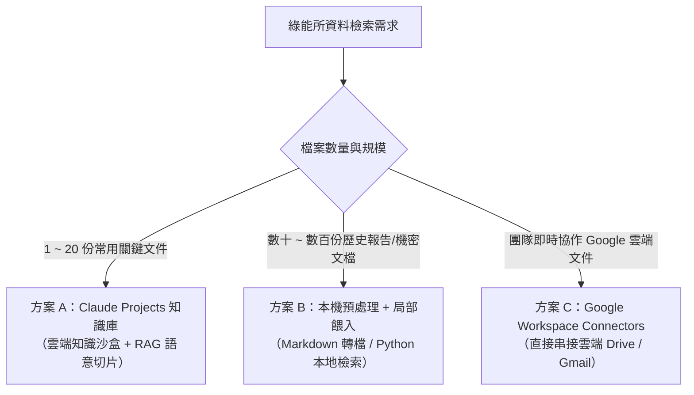

# 大量檔案搜尋與文字檢索實戰指南

> **適用單位**：工研院綠能與環境研究所（綠能所）  
> **適用章節**：Day 1 — Projects 知識庫與跨檔案檢索 / Day 2 — 雲端資料整合

---

## 📌 為什麼綠能所需要專屬的檔案檢索策略？

在綠能所的日常研發與專案推動中，研究員與專案經理常需面對海量的文檔資料：
- 📜 **法規與政策**：國際淨零法規（CBAM、IRA）、國內《氣候變遷因應法》子法、台電電力交易平台規範、碳費收費辦法。
- 🔬 **技術白皮書與專利**：CCUS（碳捕捉）、地熱發電、氫能燃料電池、各類儲能電池（鋰鐵/液流）安全標準。
- 📑 **專案與產學文件**：歷年經濟部科專期末報告、廠商技轉規格書、場域驗證數據報告。

若直接使用一般的 AI 聊天室處理這些大量檔案，將會遇到嚴重的底層技術限制。

---

## ⚠️ 一般聊天室（Chats）處理大量檔案的致命限制

| 限制面向 | 一般聊天室（Chats）機制 | 造成的實際問題 |
| :--- | :--- | :--- |
| **檔案數量限制** | 每個對話最多上傳 **20 個檔案** | 無法一次放入完整專案的所有技術報告與規範 |
| **檔案大小限制** | 每個檔案最大 **30 MB** | 包含高解析度圖表或掃描檔的 PDF 容易超限 |
| **Token 消耗機制** | **每一輪提問，全部歷史紀錄與檔案全量重讀一次** | 提問 3~5 次後 Token 迅速耗盡，對話變慢並迅速觸發使用上限 |
| **知識延續性** | 關閉對話或開新對話即歸零 | 每次開新對話都必須重新上傳與重新說明背景 |

---

## 🛠️ 大量檔案檢索的三大解決方案矩陣

針對不同規模與安全需求的資料量，建議採用以下分層策略：



### 方案比較表

| 方案 | 適用規模 | 優點 | 限制與注意事項 |
| :--- | :--- | :--- | :--- |
| **方案 A：Claude Projects** | 1～30 份核心參考檔案 | 永久記憶、自動 RAG 檢索（只消耗相關片段 Token）、支援 Custom Instructions | 需手動上傳至專案知識庫 |
| **方案 B：本機檢索與轉檔** | 數十～數百份歷史檔案 | 突破檔案大小與數量限制、機密資料可先在本地過濾 | 需將 PDF/Word 轉為純文字或 Markdown |
| **方案 C：Drive Connectors** | 即時更新的雲端共用資料夾 | 免重複上傳、直接讀取最新版本文件 | 依賴雲端帳號授權與網路連線 |

---

## 💡 實戰範例一：建立「淨零法規與儲能標準」Projects 知識庫

### 1. 建立 Project 與設定 Instructions
在 Claude 左側點選 **Projects ➔ New Project**，命名為 `綠能所_儲能與淨零法規專家`，並在 **Instructions** 設定：

```markdown
## Role
你是工研院綠能所的「儲能系統與淨零法規研究特助」，專精於比對台電法規、消防安全標準與國際儲能技術規範。

## Task & Workflow
1. 回答問題時，優先檢索 Project Knowledge 內的法規手冊、技術規範與研究報告。
2. 每次引述規範時，必須標註出處文檔名稱、章節或條文編號（例如：《儲能系統消防安全指引》第 4.2 條）。
3. 若知識庫中無相關記載，請直接說明「知識庫未包含此資訊」，切勿憑空捏造條文或數據。
4. 輸出時採用結構化條列，若涉及多個標準比對，請自動產出 Markdown 比較表格。
```

### 2. 上傳 Knowledge 建議檔案
- 《儲能系統消防安全指引.pdf》
- 《台灣電力公司輸配電設備裝置規則.pdf》
- 《氣候變遷因應法相關子法彙編.txt》

### 3. 實戰檢索 Prompt
```text
請檢索專案知識庫中的法規檔案，幫我比對：
1. 工業用戶建置『表後儲能系統』時，在『消防安全距離』與『耐火時效』上分別有哪些強制規定？
2. 請列出規定來自哪一份文件的哪一個條文，並整理成比較表格。
```

---

## 💡 實戰範例二：多份技術規格書（PDF/Word）交叉比對

當需要評估多家廠商提供的技術規格（例如 3 家鋰鐵/液流電池廠商的投標規格書）：

```markdown
## Role
你是一位綠能技術審查專家，擅長嚴格檢視與比對設備技術規格。

## Task
請讀取我提供的 3 份廠商儲能設備技術規格書（廠商A、廠商B、廠商C），產出詳細的「技術規格綜合評比表」。

## 比對重點項目
1. 電池芯類型與標稱容量（kWh / MWh）
2. 充放電循環壽命（Cycle Life @ 80% DoD）
3. 系統往返轉換效率（Round-Trip Efficiency, RTE %）
4. 安全防護與散熱機制（液冷/風冷、消防抑止系統）
5. 國際認證（UL 9540, UL 1973, IEC 62619）取得情況

## Constraint & Output Format
- 若某廠商未在文件中提及該數據，請填寫「未載明」，嚴禁推測。
- 產出 Markdown 表格，並在表格後提供 3 點客觀的技術優劣勢評析與後續詢問建議。
```

---

## 🚀 大量檔案檢索提煉的 4 大高階 Prompt 技巧

### 技巧 1：強制要求標註出處（防幻覺）
```text
請依據知識庫文件回答下列問題，並在每個論點後方以括號標註引用來源（檔案名稱 + 頁碼/章節）。若無出處請勿列入。
```

### 技巧 2：條文與規範衝突比對
```text
請比對檔案 A（舊版規範）與檔案 B（最新修訂版），列出所有實質修改的條文，並以『修改前』、『修改後』與『影響評估』三欄呈現。
```

### 技巧 3：階層式重點萃取（由廣到深）
```text
請先瀏覽這 5 份研究報告，列出每份報告探討的『核心技術主題』與『關鍵結論（各不超過 3 點）』；確認後我會指定其中兩份請你做深入數據比對。
```

### 技巧 4：長篇文檔轉純文字/Markdown 再上傳
> 💡 **小撇步**：PDF 檔若包含大量底圖或頁首頁尾，會消耗額外的 Token。在上傳至 Projects 前，若先利用工具將 PDF 轉為乾淨的 **Markdown (.md)** 或 **純文字 (.txt)**，可大幅節省 30%~50% 的 Token，並提升語意搜尋精確度！

---

## 🔗 相關教材延伸閱讀

- [Claude Projects 雲端知識沙盒建立指南](../../Claude_ai/Projects/README.md)
- [Claude Chats 檔案上傳限制與 Token 機制說明](../../Claude_ai/Chats/README.md)
- [Connectors 雲端資料串接技巧](../../Claude_ai/Connectors/README.md)
- [每日產業新聞與情報自動化蒐集實戰](./每日產業新聞情報蒐集實戰.md)
