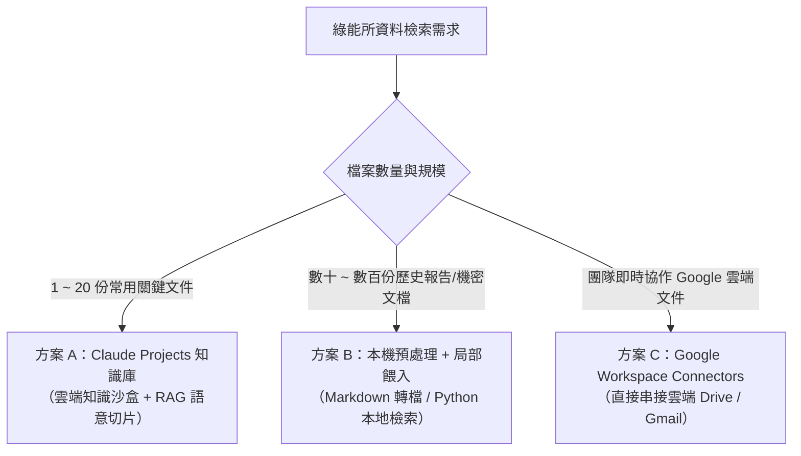

# 大量檔案搜尋與文字檢索實戰指南

> **適用單位**：工研院綠能與環境研究所（綠能所）  
> **適用章節**：Day 1 — Projects 知識庫與跨檔案檢索 / Day 2 — 雲端資料整合

---

## 📌 為什麼綠能所需要專屬的檔案檢索策略？

在綠能所的日常研發與專案推動中，研究員與專案經理常需面對海量的文檔資料：
- 📜 **法規與政策**：國際淨零法規（CBAM、IRA）、國內《氣候變遷因應法》子法、台電電力交易平台規範、碳費收費辦法。
- 🔬 **技術白皮書與專利**：CCUS（碳捕捉）、地熱發電、氫能燃料電池、各類儲能電池（鋰鐵/液流）安全標準。
- 📑 **專案與產學文件**：歷年經濟部科專期末報告、廠商技轉規格書、場域驗證數據報告。

若直接使用一般的 AI 聊天室處理這些大量檔案，將會遇到嚴重的底層技術限制。

---

## ⚠️ 一般聊天室（Chats）處理大量檔案的致命限制

| 限制面向 | 一般聊天室（Chats）機制 | 造成的實際問題 |
| :--- | :--- | :--- |
| **檔案數量限制** | 每個對話最多上傳 **20 個檔案** | 無法一次放入完整專案的所有技術報告與規範 |
| **檔案大小限制** | 每個檔案最大 **30 MB** | 包含高解析度圖表或掃描檔的 PDF 容易超限 |
| **Token 消耗機制** | **每一輪提問，全部歷史紀錄與檔案全量重讀一次** | 提問 3~5 次後 Token 迅速耗盡，對話變慢並迅速觸發使用上限 |
| **知識延續性** | 關閉對話或開新對話即歸零 | 每次開新對話都必須重新上傳與重新說明背景 |

---

## 🛠️ 大量檔案檢索的三大解決方案矩陣

針對不同規模與安全需求的資料量，建議採用以下分層策略：



### 方案比較表

| 方案 | 適用規模 | 優點 | 限制與注意事項 |
| :--- | :--- | :--- | :--- |
| **方案 A：Claude Projects** | 1～30 份核心參考檔案 | 永久記憶、自動 RAG 檢索（只消耗相關片段 Token）、支援 Custom Instructions | 需手動上傳至專案知識庫 |
| **方案 B：本機檢索與轉檔** | 數十～數百份歷史檔案 | 突破檔案大小與數量限制、機密資料可先在本地過濾 | 需將 PDF/Word 轉為純文字或 Markdown |
| **方案 C：Drive Connectors** | 即時更新的雲端共用資料夾 | 免重複上傳、直接讀取最新版本文件 | 依賴雲端帳號授權與網路連線 |

---

## 📥 課堂實戰模擬檔案下載區

為了讓學員能夠 100% 完整親自操作本實戰，所有範例皆提供**預先撰寫好的實體模擬技術文檔**。請點擊下方連結下載至本機，即可上傳至 Claude Projects 進行練習：

| 檔案名稱（點擊直接下載/檢視） | 檔案類型 | 內容主題與角色 | 建議使用情境 |
| :--- | :---: | :--- | :--- |
| 📄 [**儲能系統安全技術標準指引草案.md**](./data/儲能系統安全技術標準指引草案.md) | Markdown | 工研院綠能所編制之儲能安全、消防防爆、安全間距與 EPO 規範 | 📁 範例一：上傳至 **Knowledge**（基準技術標準） |
| 📄 [**台灣電力公司再生能源與儲能併聯技術規範.md**](./data/台灣電力公司再生能源與儲能併聯技術規範.md) | Markdown | 台電輸配電處發布之電網併聯、保護協調、通訊調度與消防隔離規則 | 📁 範例一：上傳至 **Knowledge**（跨機構法規比對） |
| 📄 [**示範園區儲能建置企劃申請書.md**](./data/示範園區儲能建置企劃申請書.md) | Markdown | 民間廠商提交之 MW 級儲能企劃（內含安全距離超標等合規瑕疵） | 📁 範例一/延伸：作為檢驗審查的測試輸入檔 |
| 📄 [**廠商A_鋰鐵電池儲能設備規格書.md**](./data/廠商A_鋰鐵電池儲能設備規格書.md) | Markdown | 2MW/4MWh 磷酸鐵鋰（LFP）液冷儲能系統完整投標規格書 | 📁 範例二：多廠商設備規格綜合評比 |
| 📄 [**廠商B_釩液流電池儲能設備規格書.md**](./data/廠商B_釩液流電池儲能設備規格書.md) | Markdown | 2MW/8MWh 全釩液流（VRFB）長時儲能系統完整投標規格書 | 📁 範例二：多廠商設備規格綜合評比 |

---

## 💡 實戰範例一：建立「儲能技術標準與台電併網規範」Projects 知識庫

### 步驟 1：建立專案與設定 Instructions
1. 在 Claude 左側選單點選 **Projects ➔ New project**。
2. **專案名稱**：`綠能所_儲能與淨零法規專家`
3. **專案描述（Description）**：`比對儲能安全技術標準與台電併網規範，提供精確條文出處與合規分析`
4. 點擊 **Create project** 建立專案。
5. 在專案頁面右側的 **Set project instructions** 欄位貼入以下內容：

```markdown
## Role
你是工研院綠能所的「儲能系統與淨零法規研究特助」，專精於比對台電法規、消防安全標準與國際儲能技術規範。

## Task & Workflow
1. 回答問題時，優先檢索 Project Knowledge 內的法規手冊、技術規範與研究報告。
2. 每次引述規範時，必須精確標註出處文檔名稱、章節或條文編號（例如：《儲能系統安全技術標準指引草案》第 2.1 條）。
3. 若知識庫中無相關記載，請直接說明「知識庫未包含此資訊」，切勿憑空捏造條文或數據。
4. 輸出時採用結構化條列；若涉及跨法規標準比對，請自動產出 Markdown 比較表格。
```

### 步驟 2：上傳專案 Knowledge 檔案
請在專案頁面的 **Project Knowledge** 區塊點選 **Add content**，上傳以下兩份下載好的檔案：
1. 📄 [**儲能系統安全技術標準指引草案.md**](./data/儲能系統安全技術標準指引草案.md)
2. 📄 [**台灣電力公司再生能源與儲能併聯技術規範.md**](./data/台灣電力公司再生能源與儲能併聯技術規範.md)

### 步驟 3：實戰檢索與跨規範比對 Prompt
在該專案內開啟新對話，輸入以下指令：

```text
請檢索專案知識庫中的兩份法規檔案，幫我深入比對：
1. 工業用戶建置『儲能系統』時，在『建築物安全間距』、『台電/高壓變電所隔離距離』、『通訊中斷保護時限』與『緊急切斷（EPO）反應時間』上，工研院技術指引草案與台電併網規範分別有何具體要求？
2. 請標明每項規定的文檔名稱與章節出處，並整理成結構化 Markdown 比較表格。
```

> 🎯 **預期檢索成果（精確引述零幻覺）**：  
> Claude 會自動檢索兩份文檔，產出清晰的跨文件法規對照表：
> - **建築物安全間距**：兩者皆要求 3.0 公尺（具 2 小時防火時效者得縮減至 1.5 公尺）。出處：《工研院指引草案》第 2.1 條、《台電規範》第 2.1 條。
> - **高壓變電所隔離距離**：兩者皆強制要求至少 15.0 公尺。
> - **通訊中斷保護時限**：《工研院指引》要求超過 3 秒即安全停機；《台電規範》要求與調度中心通訊中斷超過 5 秒自動降載至 0 kW。
> - **緊急切斷（EPO）時限**：兩者皆要求 100 毫秒（ms）內切斷主斷路器與接觸器。

---

## 💡 實戰範例二：多份技術規格書（跨設備採購）交叉評比

在設備採購或技術評估會議前，常需快速評估不同儲能技術路線（例如鋰鐵電池 vs 釩液流電池）。

### 步驟 1：準備評比檔案
點擊下載並準備好以下兩份廠商規格書（可放入 Knowledge，亦可直接在對話中作為附件上傳）：
- 📄 [**廠商A_鋰鐵電池儲能設備規格書.md**](./data/廠商A_鋰鐵電池儲能設備規格書.md)（極光能源 / LFP 液冷）
- 📄 [**廠商B_釩液流電池儲能設備規格書.md**](./data/廠商B_釩液流電池儲能設備規格書.md)（湧恆流能 / VRFB 水相液流）

### 步驟 2：執行交叉比對 Prompt
開啟對話並輸入：

```markdown
請深入讀取廠商A（鋰鐵電池）與廠商B（釩液流電池）的儲能設備技術規格書，產出專業的「綠能技術審查與設備綜合評比表」：

1. 橫向比較以下關鍵項目：
   - 額定功率與能量（MW / MWh）
   - 電池技術路線與本質安全性
   - 系統往返效率（RTE %）
   - 充放電循環壽命（Cycle Life）
   - 熱管理機制與滅火/防爆設計
   - 國際安全認證（UL 9540, UL 1973, IEC）取得狀況
2. 表格後附上綠能所審查專家的 3 點客觀技術分析（分析短時調頻 vs 長時儲能之適用場域，並點出廠商B未正式取得 UL 9540 的合規風險）。
```

> 🎯 **預期評比成果**：  
> Claude 會條理分明地列出 LFP（高效率 89.5%、高能量密度、已過 UL 9540）與 VRFB（超長壽命 20,000 次、不燃水相電解液無熱失控、但 RTE 僅 73% 且 UL 9540 審查中）的關鍵差異，讓審查會議準備時間由半天縮短為 5 分鐘！

---

## 🚀 大量檔案檢索提煉的 4 大高階 Prompt 技巧

### 技巧 1：強制要求標註出處（防幻覺）
```text
請依據知識庫文件回答下列問題，並在每個論點後方以括號標註引用來源（檔案名稱 + 頁碼/章節）。若無出處請勿列入。
```

### 技巧 2：條文與規範衝突比對
```text
請比對檔案 A（舊版規範）與檔案 B（最新修訂版），列出所有實質修改的條文，並以『修改前』、『修改後』與『影響評估』三欄呈現。
```

### 技巧 3：階層式重點萃取（由廣到深）
```text
請先瀏覽這 5 份研究報告，列出每份報告探討的『核心技術主題』與『關鍵結論（各不超過 3 點）』；確認後我會指定其中兩份請你做深入數據比對。
```

### 技巧 4：長篇文檔轉純文字/Markdown 再上傳
> 💡 **小撇步**：PDF 檔若包含大量底圖或頁首頁尾，會消耗額外的 Token。在上傳至 Projects 前，若先利用工具將 PDF 轉為乾淨的 **Markdown (.md)** 或 **純文字 (.txt)**，可大幅節省 30%~50% 的 Token，並提升語意搜尋精確度！

---

## 🔗 相關教材延伸閱讀

- [Claude Projects 雲端知識沙盒建立指南](../../Claude_ai/Projects/README.md)
- [Claude Chats 檔案上傳限制與 Token 機制說明](../../Claude_ai/Chats/README.md)
- [Connectors 雲端資料串接技巧](../../Claude_ai/Connectors/README.md)
- [每日產業新聞與情報自動化蒐集實戰](./每日產業新聞情報蒐集實戰.md)
