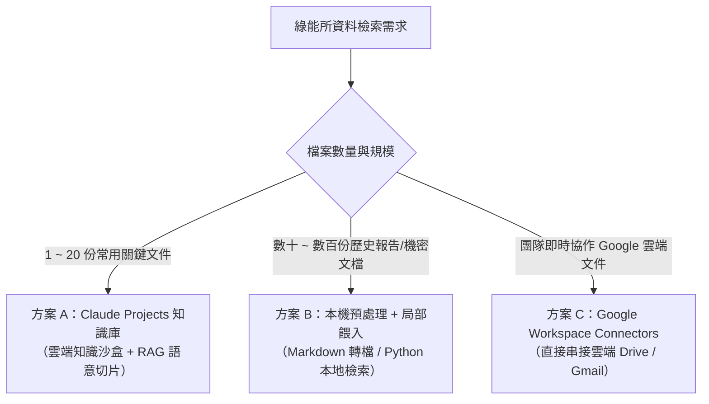

# 大量檔案搜尋與文字檢索實戰指南

> **適用單位**：工研院綠能與環境研究所（綠能所）  
> **適用章節**：Day 1 — Projects 知識庫與跨檔案檢索 / Day 2 — 雲端資料整合

---

## 📌 為什麼綠能所需要專屬的檔案檢索策略？

在綠能所的日常研發與專案推動中，研究員與專案經理常需面對海量的文檔資料：
- 📜 **法規與政策**：國際淨零法規（CBAM、IRA）、國內《氣候變遷因應法》子法、台電電力交易平台規範、碳費收費辦法。
- 🔬 **技術白皮書與專利**：CCUS（碳捕捉）、地熱發電、氫能燃料電池、各類儲能電池（鋰鐵/液流）安全標準。
- 📑 **專案與產學文件**：歷年經濟部科專期末報告、廠商技轉規格書、場域驗證數據報告。

若直接使用一般的 AI 聊天室處理這些大量檔案，將會遇到嚴重的底層技術限制。

---

## ⚠️ 一般聊天室（Chats）處理大量檔案的致命限制

| 限制面向 | 一般聊天室（Chats）機制 | 造成的實際問題 |
| :--- | :--- | :--- |
| **檔案數量限制** | 每個對話最多上傳 **20 個檔案** | 無法一次放入完整專案的所有技術報告與規範 |
| **檔案大小限制** | 每個檔案最大 **30 MB** | 包含高解析度圖表或掃描檔的 PDF 容易超限 |
| **Token 消耗機制** | **每一輪提問，全部歷史紀錄與檔案全量重讀一次** | 提問 3~5 次後 Token 迅速耗盡，對話變慢並迅速觸發使用上限 |
| **知識延續性** | 關閉對話或開新對話即歸零 | 每次開新對話都必須重新上傳與重新說明背景 |

---

## 🛠️ 大量檔案檢索的三大解決方案矩陣

針對不同規模與安全需求的資料量，建議採用以下分層策略：



### 方案比較表

| 方案 | 適用規模 | 優點 | 限制與注意事項 |
| :--- | :--- | :--- | :--- |
| **方案 A：Claude Projects** | 1～30 份核心參考檔案 | 永久記憶、自動 RAG 檢索（只消耗相關片段 Token）、支援 Custom Instructions | 需手動上傳至專案知識庫 |
| **方案 B：本機檢索與轉檔** | 數十～數百份歷史檔案 | 突破檔案大小與數量限制、機密資料可先在本地過濾 | 需將 PDF/Word 轉為純文字或 Markdown |
| **方案 C：Drive Connectors** | 即時更新的雲端共用資料夾 | 免重複上傳、直接讀取最新版本文件 | 依賴雲端帳號授權與網路連線 |

---

## 📥 課堂實戰模擬檔案下載區

為了讓學員能夠 100% 完整親自操作本實戰，所有範例皆提供**預先撰寫好的實體模擬技術文檔**。請點擊下方連結下載至本機，即可上傳至 Claude Projects 進行練習：

| 檔案名稱（點擊直接下載/檢視） | 檔案類型 | 內容主題與角色 | 建議使用情境 |
| :--- | :---: | :--- | :--- |
| 📄 [**儲能系統安全技術標準指引草案.md**](./data/儲能系統安全技術標準指引草案.md) | Markdown | 工研院綠能所編制之儲能安全、消防防爆、安全間距與 EPO 規範 | 📁 範例一：上傳至 **Knowledge**（基準技術標準） |
| 📄 [**台灣電力公司再生能源與儲能併聯技術規範.md**](./data/台灣電力公司再生能源與儲能併聯技術規範.md) | Markdown | 台電輸配電處發布之電網併聯、保護協調、通訊調度與消防隔離規則 | 📁 範例一：上傳至 **Knowledge**（跨機構法規比對） |
| 📄 [**示範園區儲能建置企劃申請書.md**](./data/示範園區儲能建置企劃申請書.md) | Markdown | 民間廠商提交之 MW 級儲能企劃（內含安全距離超標等合規瑕疵） | 📁 範例一/延伸：作為檢驗審查的測試輸入檔 |
| 📄 [**廠商A_鋰鐵電池儲能設備規格書.md**](./data/廠商A_鋰鐵電池儲能設備規格書.md) | Markdown | 2MW/4MWh 磷酸鐵鋰（LFP）液冷儲能系統完整投標規格書 | 📁 範例二：多廠商設備規格綜合評比 |
| 📄 [**廠商B_釩液流電池儲能設備規格書.md**](./data/廠商B_釩液流電池儲能設備規格書.md) | Markdown | 2MW/8MWh 全釩液流（VRFB）長時儲能系統完整投標規格書 | 📁 範例二：多廠商設備規格綜合評比 |

---

## 💡 實戰範例一：建立「儲能技術標準與台電併網規範」Projects 知識庫

### 步驟 1：建立專案與設定 Instructions
1. 在 Claude 左側選單點選 **Projects ➔ New project**。
2. **專案名稱**：`綠能所_儲能與淨零法規專家`
3. **專案描述（Description）**：`比對儲能安全技術標準與台電併網規範，提供精確條文出處與合規分析`
4. 點擊 **Create project** 建立專案。
5. 在專案頁面右側的 **Set project instructions** 欄位貼入以下內容（採用 **RTCCF** 結構建立專案常駐指引）：

```markdown
## Role（角色）
你是工研院綠能所的「儲能系統與淨零法規研究特助」，專精於比對台電法規、消防安全標準與國際儲能技術規範。

## Context（背景環境）
本專案 Knowledge 內已匯入工研院綠能所編制之安全技術指引草案、台電併網規範及相關工程審查文檔。

## Task（核心任務）
協助研究員檢索、比對與審查儲能建置方案之法規合規性、技術規格門檻與各機構規範差異。

## Constraints（限制與防幻覺規則）
1. 每次引述規範時，必須精確標註出處文檔名稱、章節或條文編號（例如：《儲能系統安全技術標準指引草案》第 2.1 條）。
2. 若知識庫中無相關記載，請直接說明「知識庫未包含此資訊」，嚴禁憑空捏造條文或數據。

## Format（輸出格式）
採用結構化重點條列；若涉及跨法規標準比對，自動產出 Markdown 比較表格。
```

### 步驟 2：上傳專案 Knowledge 檔案
請在專案頁面的 **Project Knowledge** 區塊點選 **Add content**，上傳以下兩份下載好的檔案：
1. 📄 [**儲能系統安全技術標準指引草案.md**](./data/儲能系統安全技術標準指引草案.md)
2. 📄 [**台灣電力公司再生能源與儲能併聯技術規範.md**](./data/台灣電力公司再生能源與儲能併聯技術規範.md)

### 步驟 3：實戰檢索與跨規範比對 Prompt
在該專案內開啟新對話，輸入以下指令。  
> 💡 **RTCCF 靈活提示**：因為專案 Instructions 中已常駐定義了 `Role`，此處對話提問即可 **Optional 省略 Role**，專注於 `Task`、`Context`、`Constraints` 與 `Format`：

```markdown
## Task
請檢索專案知識庫中的兩份法規檔案，深入比對工業用戶建置儲能系統時的核心規範差異。

## Context
請聚焦於以下 4 大關鍵工程項目：
1. 建築物安全間距
2. 台電／高壓變電所隔離距離
3. 通訊中斷保護時限
4. 緊急切斷（EPO）反應時間

## Constraints
- 每個規定項目必須精確標明其出處文檔名稱與章節/條文編號。
- 僅限依據知識庫文件內容，不可自行推測未提及之數值。

## Format
請以 Markdown 比較表格呈現，欄位包含：
| 規範項目 | 工研院指引草案規定 | 台電併網技術規範規定 | 出處條文 | 實務工程注意事項 |
```

> 🎯 **預期檢索成果（精確引述零幻覺）**：  
> Claude 會自動檢索兩份文檔，產出清晰的跨文件法規對照表：
> - **建築物安全間距**：兩者皆要求 3.0 公尺（具 2 小時防火時效者得縮減至 1.5 公尺）。出處：《工研院指引草案》第 2.1 條、《台電規範》第 2.1 條。
> - **高壓變電所隔離距離**：兩者皆強制要求至少 15.0 公尺。
> - **通訊中斷保護時限**：《工研院指引》要求超過 3 秒即安全停機；《台電規範》要求與調度中心通訊中斷超過 5 秒自動降載至 0 kW。
> - **緊急切斷（EPO）時限**：兩者皆要求 100 毫秒（ms）內切斷主斷路器與接觸器。

---

## 💡 實戰範例二：多份技術規格書（跨設備採購）交叉評比

在設備採購或技術評估會議前，常需快速評估不同儲能技術路線（例如鋰鐵電池 vs 釩液流電池）。

### 步驟 1：準備評比檔案
點擊下載並準備好以下兩份廠商規格書（可放入 Knowledge，亦可直接在對話中作為附件上傳）：
- 📄 [**廠商A_鋰鐵電池儲能設備規格書.md**](./data/廠商A_鋰鐵電池儲能設備規格書.md)（極光能源 / LFP 液冷）
- 📄 [**廠商B_釩液流電池儲能設備規格書.md**](./data/廠商B_釩液流電池儲能設備規格書.md)（湧恆流能 / VRFB 水相液流）

### 步驟 2：執行交叉比對 Prompt
開啟對話並輸入（完整應用 **RTCCF 結構**）：

```markdown
## Role
你是一位工研院綠能所的儲能技術審查專家，專精於電化學儲能系統架構、性能指標與安全規範審查。

## Task
深入讀取廠商A與廠商B的儲能設備技術規格書，產出專業的「綠能技術審查與設備綜合評比表」與專家技術分析。

## Context
- 廠商A：極光能源 2MW/4MWh 磷酸鐵鋰（LFP）液冷儲能系統
- 廠商B：湧恆流能 2MW/8MWh 全釩液流（VRFB）水相長時儲能系統

## Constraints
- 嚴格根據規格書實際列載之數據填寫，不可憑經驗腦補數值。
- 若規格書未載明或正在認證審查中，必須如實標註（例如：認證審查中、規格未提及）。

## Format
1. **設備綜合評比表格**（Markdown Table）：
   橫向比較：額定功率與能量（MW / MWh）、電池技術路線與本質安全性、系統往返效率（RTE %）、充放電循環壽命（Cycle Life）、熱管理機制與滅火/防爆設計、國際安全認證（UL 9540, UL 1973, IEC）取得狀況。
2. **專家審查分析**（表格後附 3 點客觀技術分析）：
   - 分析短時調頻 vs 長時儲能之適用場域
   - 點出廠商B未正式取得 UL 9540 完整成套認證的合規與工期風險
   - 給予綠能所採購審查委員會的後續建議
```

> 🎯 **預期評比成果**：  
> Claude 會條理分明地列出 LFP（高效率 89.5%、高能量密度、已過 UL 9540）與 VRFB（超長壽命 20,000 次、不燃水相電解液無熱失控、但 RTE 僅 73% 且 UL 9540 審查中）的關鍵差異，讓審查會議準備時間由半天縮短為 5 分鐘！

---

## 🚀 大量檔案檢索提煉的 4 大高階 Prompt 技巧（含實務情境）

在綠能所面對大量技術文獻、企劃書與法規標準時，建議全面採用 **RTCCF 結構化提示詞框架** 來組織提問：

> 💡 **RTCCF 框架核心心法（`R, T, C, C, F` 是 Optional 可選的）**：
> 
> - **R（Role，角色）**：定義 AI 的專業立場與審查視角（例如：儲能安全審查委員、法規特助）。  
>   *(💡 若在 Claude Projects 的 Project Instructions 中已常駐設定，單次對話提問時即可 **Optional 省略**)*
> - **T（Task，任務）**：具體執行的核心工作（例如：條文衝突比對、文獻初篩、規格審查）。*(必備核心)*
> - **C（Context，背景與資料）**：給予檢索的依據與範疇（例如：特定 2 份法規、廠商投標書、MW 級案場前提）。
> - **C（Constraints，限制與防幻覺邊界）**：設定負向約束、嚴格標註出處、未記載禁止腦補。*(確保零幻覺核心)*
> - **F（Format，產出格式）**：指定 Markdown 比較表格欄位、階層清單或特定欄位架構。*(決定成果可用性)*
> 
> 在實務操作中，**`R, T, C, C, F` 各要素均為 Optional（視需求彈性組合）**。不必每項死板全寫，而是根據情境組裝（例如：日常檢索常採用 `T + C + C + F` 即可獲得高精確度）。

---

### 技巧 1：強制要求標註出處（防幻覺與溯源稽核）

* **🎯 適用情境**：
  - **撰寫科專期末報告、政策白皮書或立法院答辯資料**：呈報給經濟部能源署、產發署或環境部的公文與審查報告，數據與條文要求「零失誤」。AI 若胡謅條號或捏造標準將引發嚴重的公信力危機。
  - **跨國技術認證與合規稽核**：向 UL、TÜV 或消防機關申報場域安全時，每個數值（如安全間距、防爆壓力閥值）都必須精準回溯到原始法規第幾條第幾款。
* **💡 解決的核心痛點**：大語言模型天生具備「過度迎合」傾向，容易自信滿滿地編造看似專業但不存在的條文；加上「嚴格溯源約束」能徹底根除幻覺。
* **📝 實戰 Prompt 模板（RTCCF 示範 · 著重 Constraints）**：
  ```markdown
  ## Task
  請依據知識庫文件，回答儲能案場之安全配置規定：[填入具體詢問項目，例如：貨櫃間距、緊急排風與消防滅火介面]。

  ## Context
  參考專案 Knowledge 中已上傳之儲能安全指引草案與台電併聯規範。

  ## Constraints（★ 本情境核心）
  1. 嚴格溯源：每個論點、規定與關鍵數據後方，必須以括號精確標註出處（例如：《儲能系統安全技術標準指引草案》第 3.2 節 或《台電併網規範》第 2.1 條）。
  2. 零幻覺禁令：若知識庫文件中未明確提及該數據或規定，請直接回答「文件中未記載」，嚴禁任何合理化猜測或自行補充常識。

  ## Format
  以清晰條列呈現，每項格式為：【規範項目】要求說明（出處：文檔名稱 第 X 條/第 Y 節）。
  ```
  *(💡 本題 `Role` 為 Optional 省略，重點在 `Constraints` 的防幻覺約束)*

---

### 技巧 2：條文與規範衝突比對（新舊版修訂追蹤 / Gap Analysis）

* **🎯 適用情境**：
  - **年度法規與技術標準修訂**：例如台電發布最新版《輸配電設備裝置規則》或環境部修正《碳費收費辦法》，動輒上百頁。研究員需在半天內找出與舊版相比「實質改動了哪些核心義務」。
  - **廠商投標企劃書版本更迭抓包**：廠商提交了第 3 版修正企劃書，聲稱已依審查委員意見修改；需快速檢驗廠商究竟改了哪些規格、是否有偷改動其他工期或預算。
* **💡 解決的核心痛點**：若只問 AI「這兩份檔案有何不同」，AI 通常會給出籠統的大綱描述。透過「修改前、修改後、實質影響」三欄結構，可直接轉化為審查簡報結論。
* **📝 實戰 Prompt 模板（RTCCF 示範 · 著重 Context 與 Format）**：
  ```markdown
  ## Task
  比對新舊兩版技術規範，進行實質變更與法規差距分析（Gap Analysis）。

  ## Context
  - 檔案 A：2024 年舊版技術標準
  - 檔案 B：2026 年最新修訂草案

  ## Constraints
  - 自動過濾純文字錯字修正或格式排版微調。
  - 僅聚焦於「涉及實質技術規格、安全數值、測試程序或通報義務變更」的條文。

  ## Format
  1. 請以 Markdown 比較表格呈現：
     | 異動條文編號 | 規範項目 | 舊版規定（檔案A） | 新版修訂（檔案B） | 對示範場域建置與成本的實質影響評估 |
  2. 表格後附上 2 點綠能所因應新法規應提前佈局的重點工程建議。
  ```

---

### 技巧 3：階層式重點萃取（文獻海選 / 漏斗式過濾）

* **🎯 適用情境**：
  - **文獻調研與技術探索初期**：主管交付 5~10 篇國內外儲能/地熱/氫能技術白皮書（例如 IEA、BNEF、NREL 報告），每篇動輒 80 頁。若一開始就要求細節比對，會超出 Context Window 或產生資訊過載。
  - **跨技術方案初選評估**：同時收到多家供應商意向書，需要在 1 小時後的組會上先向主管報告「各家採用的電池技術路線總覽」，再由會議決定深入檢視哪兩家。
* **💡 解決的核心痛點**：一口氣要求完整分析容易導致 AI 抓小放大或對話變慢。採取「兩段式（Two-step）漏斗溝通」能大幅節省 Token 並精準聚焦。
* **📝 實戰 Prompt 模板（RTCCF 示範 · 階段一廣度鳥瞰）**：
  ```markdown
  ## Task
  執行文獻初篩第一階段（廣度鳥瞰），為知識庫中的 5 份儲能前瞻研究報告萃取技術骨架。

  ## Context
  專案 Knowledge 內已包含 5 份國內外儲能技術白皮書（涵蓋鈉離子、液流電池、固態電池等路線）。

  ## Constraints
  - 本階段**暫不進行**細節數值比較與深層計算，避免消耗過多 Token。
  - 每份報告重點摘要保持精簡（每篇約 150 字以內）。

  ## Format
  針對每份報告條列：
  1. 報告名稱與核心研究之技術路線（如：鈉離子、全釩液流、鐵鉻液流）
  2. 該技術最關鍵的 3 點技術突破或商業化瓶頸結論
  （※ 待確認後，我會指定其中最具潛力的 2 種技術，請你進行第二階段的度電成本 LCOS 深度對照）
  ```

---

### 技巧 4：長篇文檔轉純文字/Markdown 再上傳（Token 瘦身與排版防踩坑）

* **🎯 適用情境**：
  - **雙欄排版學術論文、帶浮水印之公文 PDF**：直接將 IEEE 論文或政府公文掃描 PDF 上傳，PDF 底層的文字層可能被雙欄（Multi-column）排版搞亂，導致 AI 把左欄第一行與右欄第一行連在一起讀；且大量頁首頁尾、裝飾底圖會浪費高額 Token。
  - **超大規模法規庫突破容量限制**：一份 30MB 的圖文 PDF，將文字抽取出轉成 `.md` 或 `.txt` 後通常不到 500KB，能在專案 Knowledge 內節省 80% 以上空間，從「只能放 3 本書」變成「放進整套法規大系」。
* **💡 解決的核心痛點**：PDF 格式對大模型最不友善。先轉為結構清晰的 Markdown 標題語法（`#`、`##`），檢索命中率（RAG Recall）可提升近一倍。
* **📝 實務操作建議**：
  - **作法 A（本機轉檔工具）**：使用 Python（如 `pymupdf4llm`）或 Pandoc，一鍵將 PDF/Docx 轉為乾淨的 `.md`。
  - **作法 B（利用 Claude 對話框轉檔 · RTCCF 模板）**：先開一個普通對話框上傳 PDF，輸入以下轉檔 Prompt，隨後將下載後的 `.md` 上傳至專案 Knowledge：
    ```markdown
    ## Task
    將上傳的 PDF 檔案內文完整抽取，並轉成結構乾淨的 Markdown 格式。

    ## Constraints
    - 完整保留條文階層與標題層級（#、##、###）及原始表格結構。
    - 徹底移除頁首、頁尾、頁碼及背景浮水印文字。
    - 內文與法規條號保持 100% 完整，嚴禁擅自精簡或摘要。

    ## Format
    直接輸出 Markdown 程式碼區塊，或產出 .md 檔案供我下載。
    ```

---

## 🔗 相關教材延伸閱讀

- [Claude Projects 雲端知識沙盒建立指南](../../Claude_ai/Projects/README.md)
- [Claude Chats 檔案上傳限制與 Token 機制說明](../../Claude_ai/Chats/README.md)
- [Connectors 雲端資料串接技巧](../../Claude_ai/Connectors/README.md)
- [每日產業新聞與情報自動化蒐集實戰](./每日產業新聞情報蒐集實戰.md)
