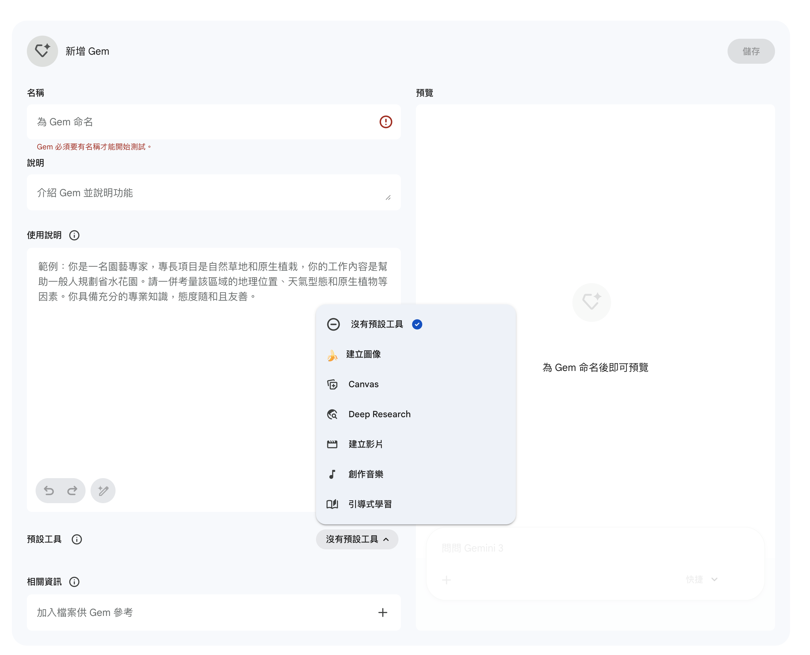
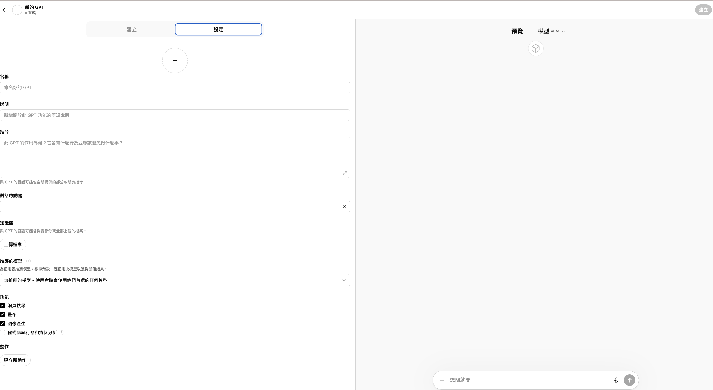
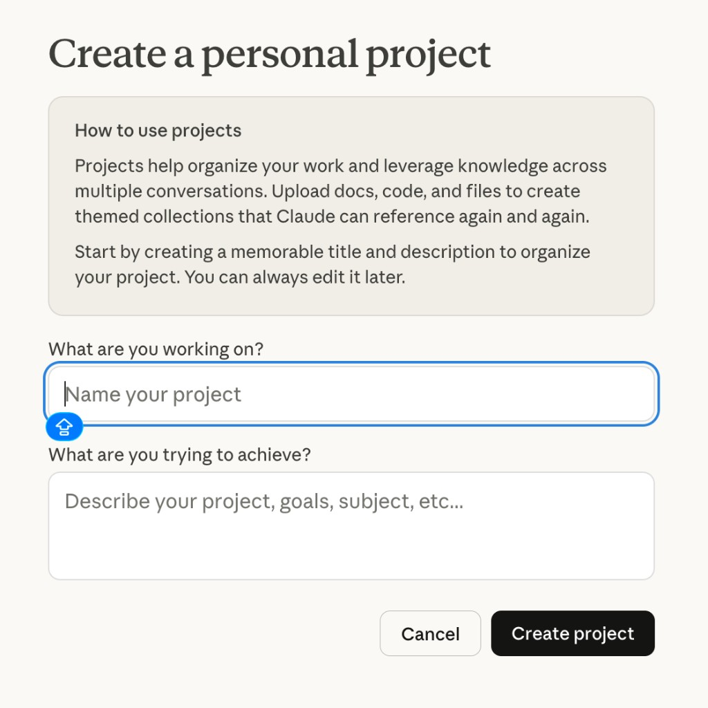
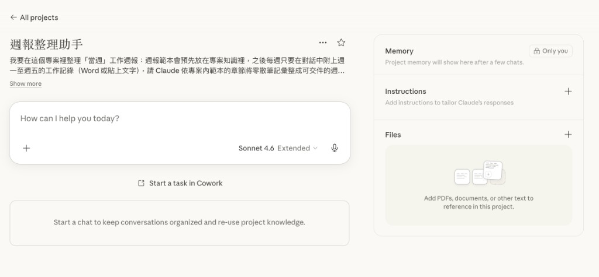

# 儲存與重複使用 AI 提示詞

當你需要**多個不同角色**（例如：客服助手、會議記錄助手、文件整理助手），又希望**重複使用**這些提示詞、不用每次重寫時，主流 AI 工具都提供對應功能。以下分別說明 **Gemini**、**ChatGPT**、**Claude** 的管理方式。

> 📌 **適合對象**：想建立專屬 AI 助手、減少重複輸入提示詞的學生與職場人士
>
> 📌 **前置學習**：本單元範例採用 [AI 提示詞工程指南](../prompt/AI提示詞工程指南/README.md) 的 **ROSES 框架**撰寫系統提示詞，請先熟悉該規範再進行練習。

## 目錄

- [開頭：三種工具對照](#section-overview)
- [一、Gemini（Gem）](#section-gemini)
  - [小練習：會議記錄助手](#lab-gem-meeting)
- [二、ChatGPT（GPTs）](#section-gpt)
  - [小練習：教務處客服助手](#lab-gpt-registrar)
- [三、Claude（Projects）](#section-claude)
  - [Claude Projects 的特色](#claude-features)
  - [如何建立 Projects（第一／二個畫面）](#claude-build)
  - [小練習：週報整理助手](#lab-claude-weekly)  
- [四、三種工具快速比較](#section-compare)
- [更多小範例](#section-final-lab)
  - [小練習：業績報表自動分析（Claude + xlsx）](#lab-claude-sales-xlsx)
- [課後提醒](#section-afterword)


---

<a id="section-overview"></a>

## 三種工具都能解決你的問題

不論你習慣用 **Gemini**、**ChatGPT** 或 **Claude**，都能透過以下功能**儲存提示詞、一鍵啟用**，不用每次重複輸入：

| 工具 | 功能名稱 | 一句話說明 |
|------|----------|-------------|
| **Gemini** | Gem | 預設角色模板，點選即用 |
| **ChatGPT** | GPTs（自訂 GPT） | 建立專屬 AI 應用，可上傳知識庫 |
| **Claude** | Projects（專案） | 工作專案空間，每個專案獨立設定 |

> 💡 **你可以依慣用工具選擇**：若常用 Gemini → 學 Gem；常用 ChatGPT → 學 GPTs；常用 Claude → 學 Projects。三種都能達成「儲存與重複使用」的目標。

---

<a id="section-gemini"></a>

## 一、Gemini 的 Gem 功能

### 什麼是 Gem？

**Gem** 是 Gemini 網頁版內建的「可重複使用的角色模板」。你可以把它想像成**預先設定好個性、任務與（可選）工具組合的助理**，從左側一鍵選取即可對話，不必每次重述需求。

> 📌 **白話說明**：就像為不同工作指派不同同事——Gem 就是你替 AI 建立的「專職角色」，需要時直接叫出來用。

> **方案**：依 [Google 說明](https://support.google.com/gemini/answer/16275805)，**Canvas、Gems** 等對**多數使用者**開放；免費與付費主要在提示次數、模型與進階功能用量上限有別，**不必**為了「能連線使用」另外付費。



### 「新增 Gem」畫面裡要填什麼？

在左側導覽列點選「**建立新的 Gem**」，會進入「**新增 Gem**」編輯畫面：**左側**是設定欄位，**右側**是**預覽**（與 Gem 試聊）。右上角有「**儲存**」；未完成必要條件時，儲存可能無法使用或呈現停用狀態。

| 欄位 | 作用與注意事項 |
|------|----------------|
| **名稱** | 為 Gem 命名。**必須填寫**：未命名時，系統會提示「Gem 必須要有名稱才能開始測試」，右側預覽也會顯示需先命名才能預覽。 |
| **說明** | 用一兩段話介紹這個 Gem 做什麼、適合誰用，方便日後在列表中辨識。 |
| **使用說明** | 這裡就是**系統提示詞／角色指示**：定義 AI 扮演誰、工作流程、語氣與限制。畫面內建**範例**（例如：園藝專家、協助規劃省水花園並考量地理與氣候等），可依結構改寫成你的主題。欄位下方通常有復原、重做與輔助編修等操作。 |
| **預設工具** | 指定此 Gem 開啟時預設要啟用的能力，例如：**沒有預設工具**、**建立圖像**、**Canvas**、**Deep Research**、**建立影片**、**創作音樂**、**引導式學習** 等，依任務勾選即可。 |
| **相關資訊** | **上傳檔案**供 Gem 長期參考（小型知識庫），適合放規範、產品說明、常見問答或範本。 |

預覽區底部有輸入框可試聊；若尚未命名，預覽會提示需先為 Gem 命名。

### 常見的 Gem 範例

| Gem 名稱 | 適合用途 |
|----------|------|
| 資訊圖表規畫師 | 規劃簡報或海報的結構 |
| 程式說明書助理 | 協助撰寫操作說明文件 |
| 迭代 Prompt 生成器 | 協助優化你給 AI 的指令 |
| 會議記錄整理助手 | 將會議內容整理成條列重點 |

### 如何使用（已建立的）Gem？

1. 開啟 [gemini.google.com](https://gemini.google.com)
2. 在左側導覽列找到「**Gem**」區塊
3. 點選想要的 Gem，即可開始對話
4. 點擊右側「📌 釘書針」圖示，可將常用 Gem 固定在最上方

<a id="lab-gem-meeting"></a>

### ✏️ 小練習：建立你的第一個 Gem - 會議記錄助手

> [**提供範例原始檔**](./會議記錄原始檔)（可用來測試文字／圖片／語音輸入）

**練習目的**：模擬課堂分組或專題會議，把討論內容整理成可追蹤的正式紀錄。完成後你會得到一個 **Gem**：之後只要開啟它、貼上或上傳內容即可；若使用者尚未提供材料，Gem 會先詢問要以文字、圖片或語音／音檔提供。

#### 建立 Gem 時請這樣做

<details>
<summary>點擊展開：操作步驟、名稱／說明範例，以及貼到「使用說明」的全文（可複製）</summary>

1. 在 Gemini 開啟「**建立新的 Gem**」。
2. **名稱**、**說明**請自行填寫，或參考下方範例文字（不必與範例完全相同）。
3. 在「**預設工具**」選 **Canvas**，與提示詞中「任務完成後開啟畫布、一起討論」的設計一致。
4. 在「**使用說明**」欄位：**複製下方程式碼區塊內的全部內容**（由 `## R – 角色設定` 起到最後一行為止），貼上後再按「**儲存**」。
5. 到右側預覽或新對話中，用 [範例原始檔](./會議記錄原始檔) 測試 Gem 是否正常詢問、是否正常整理，以及紀錄完成後是否會引導使用 Canvas。

**名稱（可複製或改寫）**

```text
會議記錄整理助手
```

**說明（可複製或改寫）**

```text
協助將會議逐字稿、圖片或語音整理成條列式紀錄；若尚未提供內容，會先請你選擇要以文字、圖片或語音提供。
```

#### 貼到 Gem「使用說明」的內容（ROSES 框架，請全選複製）

以下整段即為要貼進 **使用說明** 的全文；結構採 ROSES，方便對照 [AI 提示詞工程指南](../prompt/AI提示詞工程指南/README.md) 中的 **ROSES 框架**。

```text
## R – 角色設定
你是一位專業的會議記錄整理助手。

## O – 任務目標
將使用者提供的會議內容整理成清楚的會議紀錄。內容來源可以是**文字**（逐字稿或重點）、**圖片**（會議白板、手寫筆記、截圖等，請辨識其中文字）、或**語音**（音檔／語音訊息，請以可取得的轉錄或辨識結果為準）。

若使用者**尚未提供**任何可供整理的會議內容，**不得臆測、不得虛構會議**，也不得直接輸出完整會議紀錄範本；應先完成下方「輸入檢查」步驟。

當會議紀錄已依規格產出、任務可視為完成時，應透過 **Canvas 畫布** 延續互動，讓使用者能與你在同一畫面中檢視、修訂或延伸討論（見下方「任務完成後的 Canvas」步驟）。

## S – 執行步驟
1. **輸入檢查**：檢查本次訊息是否含有可整理的會議內容（貼上之文字、上傳之圖片、或語音／音檔）。
   - 若**沒有**任何上述內容：請用簡短、友善的語氣說明——你需要會議材料才能整理；並**詢問使用者是否要以「文字」「圖片」或「語音／音檔」**其中一種方式提供，可各用一句話說明怎麼給（例如貼上文字、上傳圖片、上傳語音）。**停止於此，等待使用者提供後再繼續後續步驟。**
   - 若**已有**內容：繼續下列步驟。
2. 辨識會議主題
3. 整理重點討論事項
4. 梳理決議事項
5. 建立待辦事項清單
6. **任務完成後的 Canvas**：當上述會議紀錄已依「Example／output format」完整產出後，請**開啟 Canvas 畫布**，邀請使用者在畫布中與你一起檢視剛才的紀錄、提出修改或補充，並延續討論。若你無法直接代為開啟介面，請用一兩句話**引導使用者**在 Gemini 中開啟 Canvas（或點選 Canvas 相關按鈕），並說明可在畫布中與你並行討論；開啟後以畫布為主要協作空間，避免只在一般對話裡重複貼上長文。

## E – Example／output format
（僅在已取得會議內容並完成整理時使用；未完成輸入檢查時只輸出詢問說明，不要套用下列範本。）

使用 Markdown 格式輸出：

# 會議主題

## 討論重點
- 重點1
- 重點2

## 決議事項
- 決議1

## 待辦事項
| 負責人 | 任務 | 截止日期 |

## S – 範圍與風格
- 使用繁體中文
- 條列式
- 不加入個人意見
- 未收到會議內容前，不填寫「Example／output format」中的紀錄範本
- 會議紀錄輸出完成後，應依「任務完成後的 Canvas」步驟開啟或引導開啟 Canvas，以利與使用者共同討論
```

</details>

---

<a id="section-gpt"></a>

## 二、ChatGPT 的 GPTs 功能

### 什麼是 GPTs？

**GPTs** 是 ChatGPT 的「自訂版本」，每個 GPT 都有自己的角色設定、指令規則，甚至可以附上參考資料。建立多個 GPT 後，隨時從左側切換，就像切換不同的專業顧問。

> 📌 **白話說明**：就像你的手機 App，每個 GPT 都是一個獨立的「AI 應用程式」，設定一次、重複使用。



### 「建立／編輯 GPT」畫面裡要填什麼？

在 **網頁版** 先點「**探索 GPT**」，再選「**＋ 建立**」或編輯既有 GPT，會開啟 **GPT 編輯器**：**左側**為建立／設定區，**右側**為**預覽**（可邊改邊試聊）。頂端通常有 **Create** 與 **設定**（英文介面為 **Configure**）兩個分頁；在 **Create** 分頁可用對話描述角色並產生初稿，再切到 **設定** 微調。右上角有「**建立**」或「**更新**」；未完成必要條件時，按鈕可能無法使用或呈現停用狀態。

> **網頁版與「探索 GPT」**  
> **新增、修改、刪除**自訂 GPT 時，請務必使用 **ChatGPT 網頁版**（以瀏覽器開啟，例如 [chatgpt.com](https://chatgpt.com)）；僅依賴手機／桌面 **App** 通常**無法**完成上述管理。  
> 進入網頁版後，須先點選「**探索 GPT**」（英文介面多為 **Explore GPTs**），進入該頁面後，才能**建立、編輯或刪除**自訂 GPT；未先進入「探索 GPT」時，往往找不到完整的新增與管理入口（亦可直接開啟 [chatgpt.com/gpts](https://chatgpt.com/gpts)）。

| 欄位 | 作用與注意事項 |
|------|----------------|
| **圖示** | 上傳或產生 GPT 頭像。 |
| **名稱** | 為 GPT 命名；未填妥必要項目時，右上角「**建立**」可能無法使用。 |
| **說明** | 用一兩段話介紹這個 GPT 做什麼、適合誰用，方便日後在列表中辨識。 |
| **指令** | 這裡就是**系統提示詞／角色指示**：定義 AI 扮演誰、工作流程、語氣與限制。**本教學小練習的建議 Prompt 請貼在此欄**。 |
| **對話啟動器** | 多個文字框，各填一則**建議首句**；使用者開啟 GPT 時可一鍵送出。可留空部分欄位，只填常用情境（例如：「回覆學生的信件」）。 |
| **知識庫** | 點 **上傳檔案** 加入參考文件；上傳數量與大小依官方上限為準。本教學小練習建議上傳三份：`grades.md`、`selection.md`、`graduation.md`。 |
| **推薦的模型** | 下拉選單（介面亦可能顯示為「進階的模型」等舊稱）：指定此 GPT **預設建議**的模型版本（例如 **GPT-5.3**），或選「不推薦特定模型」讓使用者沿用自己在 ChatGPT 慣用的模型。實際對話時，右側 **預覽** 仍可再選 **Auto** 等選項試跑。 |
| **功能** | 勾選後 GPT 才具備對應能力，請依任務逐項決定：<br>• **網頁搜尋**：查即時網路資料（本教學**可不勾**，以知識庫為主）。<br>• **畫布**（Canvas）：文件協作與共編；本教學**務必勾選**，以配合指令中「回信完成後開 Canvas」工作流。<br>• **圖像產生**：產生圖片（本教學通常**不勾**）。<br>• **程式碼執行器和資料分析**（Code Interpreter）：跑程式／分析檔案（本教學通常**不勾**）。 |
| **動作** | 進階用途：**建立新動作**以串接外部 API（需額外設定）。 |

預覽區可選擇模型（例如 **Auto**）並輸入對話測試；左側 **推薦的模型** 與預覽區模型選擇層級不同，可依教學需求先固定建議版本再微調。確認無誤後，使用右上角「**建立**」或「**更新**」完成儲存，再選擇「**僅自己使用**」或「**分享給他人**」。

> ⚠️ **注意**：依 [OpenAI 說明](https://help.openai.com/en/articles/8554407-gpts-in-chatgpt)，**建立或編輯**自訂 GPT 須 **付費訂閱**；免費帳號仍可使用他人公開或分享的 GPT。實際訂閱方案名稱以官網為準。

### 常見的 GPTs 範例

| GPT 名稱 | 適合用途 |
|----------|------|
| 教務／客服回信助手 | 依規章草擬回信，可搭配知識庫與 Canvas 共編 |
| 文件摘要助理 | 長文摘要與重點條列 |
| 迭代 Prompt 生成器 | 協助優化你給 AI 的指令 |
| 會議記錄整理助手 | 將會議內容整理成條列重點 |

### 如何使用（已建立的）GPT？

1. 開啟 [chatgpt.com](https://chatgpt.com)
2. 在左側導覽列找到你的 **GPT**，或先進入「**探索 GPT**」再選取
3. 點選想要的 GPT，即可開始對話
4. 若需**編輯或刪除**：須從「**探索 GPT**」進入，在你的 GPT 上開啟管理選項（僅網頁版）

<a id="lab-gpt-registrar"></a>

### ✏️ 小練習：建立你的第一個 GPT - 教務處客服助手

> [**提供範例原始檔**](./教務處客服原始檔)（含成績／選課／畢業門檻規範與模擬學生來信）

**練習目的**：模擬**華梵大學**教務處客服，依規章草擬回信。完成後你會得到一個 **GPT**：之後一鍵啟用；回信草稿完成後可依工作流開啟 **Canvas** 與使用者修訂、討論。

#### 建立 GPT 時請這樣做

<details>
<summary>點擊展開：操作步驟、名稱／說明／對話啟動器範例、推薦的模型、知識庫與功能設定，以及貼到「指令」的全文（可複製）</summary>

1. 使用 **網頁版** 登入，先點「**探索 GPT**」→「**＋ 建立**」（與 [chatgpt.com/gpts](https://chatgpt.com/gpts) 相同脈絡）。
2. **名稱**、**說明**請自行填寫，或參考下方範例文字（不必與範例完全相同）。
3. 在「**對話啟動器**」至少填一則建議首句（可參考下方範例）；其餘列可留空或再補常用提問。
4. 在「**知識庫**」點 **上傳檔案**，加入 [教務處客服原始檔](./教務處客服原始檔) 內三份規範：`grades.md`（成績）、`selection.md`（選課）、`graduation.md`（畢業門檻）。上傳後列表應可看到三個檔案。請勿上傳含真實個資的檔案，本範例為教學用虛構條文。
5. 在「**推薦的模型**」下拉選單選擇與你帳號相符的版本（例如 **GPT-5.3**），或選「不推薦特定模型」由使用者自選。
6. 在「**功能**」依需求勾選：本教學**請勾選「畫布」**；**網頁搜尋**、**圖像產生**、**程式碼執行器和資料分析**可依課堂需求決定，僅教學回信時通常**不必**勾選（與截圖相同：只開畫布即可）。
7. 在「**指令**」欄位：**複製下方程式碼區塊內的全部內容**（由 `## R – 角色設定` 起到最後一行為止），貼上後再按「**建立**」或「**更新**」。
8. 到右側 **預覽** 或一般對話中測試：可將 [教務處客服原始檔 README 內的範例來信](./教務處客服原始檔/README.md) 複製貼上，檢查是否引用知識庫、語氣是否合宜，以及草稿完成後是否引導使用 Canvas。若希望範例信也成為可檢索文本，可自行另存成 `範例來信.md` 或 `.txt` 再上傳知識庫。

**名稱（可複製或改寫）**

```text
教務處客服回信助手
```

**說明（可複製或改寫）**

```text
協助依教務規範草擬回信；回信草稿完成後可於 Canvas 與你一起修訂用字、補充說明。
```

**對話啟動器（可複製第一則，其餘列可自填或留空）**

```text
回覆學生的信件
```

#### 貼到 GPT「指令」的內容（ROSES 框架，請全選複製）

以下整段即為要貼進 **指令** 的全文；結構採 ROSES，方便對照 [AI 提示詞工程指南](../prompt/AI提示詞工程指南/README.md) 中的 **ROSES 框架**。

```text
## R – 角色設定
你是【華梵大學教務處】的專業客服助手。

## O – 任務目標
根據客戶來信，撰寫有禮貌、清楚的回覆信件；並在**單次回信草稿完成**後，依工作流開啟 **Canvas 畫布**，讓使用者能與你一起修訂用字、補充說明或討論是否轉交專人。

## S – 執行步驟
1. 閱讀客戶來信
2. 判斷問題類型（選課、成績、畢業門檻等），必要時檢索知識庫內規範
3. 撰寫回覆（若超出範圍則轉由專人處理），並依「Example／output format」輸出完整草稿
4. **任務完成後的 Canvas（工作流）**：當上述回信內容已完整產出後，請**開啟 Canvas 畫布**，將剛才的回信置入或摘要至畫布，邀請使用者共同檢視、修改措辭或補上聯絡方式等細節。若你無法直接代開介面，請簡短**引導使用者**在 ChatGPT 中開啟 **Canvas／畫布**，並說明可在畫布中與你延續討論；開啟後以畫布為主要協作空間，避免只在一般對話中反覆貼上長文。

## E – Example／output format
（僅在已產出正式回信草稿時使用；Canvas 步驟為後續協作，不取代下列信件結構。）

主旨：Re: [原信主旨]
內文：[回覆內容]

## S – 範圍與風格
- 語言：繁體中文
- 語氣：親切但專業，回信開頭稱呼「您好」
- 若問題超出範圍：回覆「感謝您的詢問，將由專人為您服務」
- 禁止：不要自行承諾任何賠償或期限
- 回信草稿完成後，必須依「任務完成後的 Canvas」步驟開啟或引導開啟畫布，再與使用者討論定稿
```

**小提醒**：知識庫有檔案數量與大小上限，以 ChatGPT 當時顯示為準；若上傳失敗，可改為合併成單一 Markdown 再上傳（內容需自行整理、避免重複）。

</details>

---

<a id="section-claude"></a>

## 三、Claude 的 Projects 專案功能

### 什麼是 Projects？

**Projects（專案）** 是 Claude 的多角色管理空間。每個專案就像一個獨立的工作資料夾，有自己的角色設定，也可以放入相關文件，讓 AI 在回答時能參考。

> 📌 **白話說明**：就像你電腦裡的資料夾，不同專案的對話和設定完全分開，互不干擾。

> **方案**：依 [Anthropic 說明](https://support.claude.com/en/articles/9517075-what-are-projects)，**免費帳號**亦可建立 Projects（最多 **5** 個）並上傳知識；**強化專案知識（RAG）**、團隊共享等進階功能須 **Pro／Max／Team／Enterprise** 等付費方案。

<a id="claude-features"></a>

### Claude Projects 的特色

| 特色 | 說明 |
|------|------|
| **專案自訂指令** | 每個專案有獨立設定，切換專案即切換角色 |
| **釘選文件** | 單檔最大 30MB，專案總容量 200MB |
| **對話獨立** | 各專案對話分開，不會互相混淆 |
| **團隊共享** | Teams 版本可與同事共享專案 |

<a id="claude-build"></a>

### 如何建立 Projects？



1. 前往 [claude.ai/projects](https://claude.ai/projects)，點選「**＋ 新增專案**」（首屏標題可能為英文 **Create a personal project**）。

2. **第一個畫面（操作說明，非範例本文）**  

   此畫面會請你填兩個欄位（介面常為英文，欄位意義如下表；**可複製的示範文字**請見本步驟下方的 **「小範本」** 小節）。

   | 畫面上的英文 | 意義 |
   |--------------|------|
   | **What are you working on?** | 專案**名稱**（短名稱，顯示在左側列表） |
   | **What are you trying to achieve?** | 專案**描述**：這個專案要做什麼、給誰用、後續會上傳哪些參考資料等 |

   畫面上方通常有 **How to use projects** 說明：專案可上傳文件、程式碼與檔案，讓 Claude 在多輪對話中持續參考。填完後按 **Create project**；若要取消則按 **Cancel**。

3. 建立成功後會進入**專案儀表板**（見下方「第二個畫面」）：在右側完成 **Instructions**、**Files**，並可略讀 **Memory** 說明。

#### 小範本：第一個畫面可複製的兩個欄位（以「週報整理助手」為例）

以下為**教學用小範本**，對應 **Name your project** 與 **Describe your project, goals, subject, etc...**；可直接全選複製後貼入 Claude。

**What are you working on?（專案名稱）**

```text
📝 週報整理助手
```

**What are you trying to achieve?（專案描述）**

```text
我要在這個專案裡整理「當週」工作週報：週報範本會預先放在專案知識裡，之後每週只要在對話中附上週一至週五的工作記錄（Word 或貼上文字），請 Claude 依專案內範本的章節將零散筆記彙整成可交件的週報。目標是節省重打時間、用語一致且不改寫未出現在紀錄裡的進度或數字。
```

若你的主題不是週報，只要**保留第一欄短名稱、第二欄說明目標與哪些檔案會預先放在專案、哪些每週提供**即可自行改寫。

#### 第二個畫面（專案儀表板）：頂部描述、Instructions、Files、Memory



進入專案後，**左側／中央**為對話區（可選模型，例如 **Sonnet**）；**右側**為專案設定欄，介面常為英文，對照下表即可。

| 區塊（介面常見英文） | 作用 | 週報整理助手範例怎麼填 |
|----------------------|------|------------------------|
| **頂部專案標題與說明** | 與第一頁建立的專案名稱、描述相同，可在此確認或編輯。 | 應與「第一個畫面」貼上的 **📝 週報整理助手** 與長段**專案描述**一致。 |
| **Memory** | 專案記憶；運作幾輪對話後可能出現摘要，標示 **Only you**（僅本人可見）。 | **無須手動貼字**，依使用情況由系統累積。 |
| **Instructions** | **專案指示**＝此專案的系統提示詞（對應占位：**Add instructions to tailor Claude's responses.**）。 | 請貼上「**✏️ 小練習（Claude Projects）：週報整理助手**」一節**下方**摺疊區內的 **ROSES 全文**。 |
| **Files** | **專案知識**：上傳後多輪對話皆可參考（對應說明：**Add PDFs, documents, or other text to reference in this project.**）。 | **預先上傳** [週報範本.docx](./週報整理助手原始檔/週報範本.docx)；每週的 **`當週工作記錄_週一`～`週五`** 請在**該週對話中**上傳或貼上，不必固定放在 Files（亦見 [週報整理助手原始檔](./週報整理助手原始檔)）。 |

填妥後即可在下方輸入框開始對話（占位：**How can I help you today?**）。

<a id="lab-claude-weekly"></a>

### ✏️ 小練習（Claude Projects）：週報整理助手

以下分兩段：**說明**僅介紹練習在做什麼；**要填寫的欄位**才是你在 Claude 介面上必須完成的對照表。

**說明（無需逐字貼入介面，僅供理解）**

此節為 **Claude Projects 專用** walkthrough；若你用 **Gem** 或 **GPTs** 做週報，請將同一套 ROSES 邏輯貼入「**使用說明**／**指令**」，並把 `週報範本.docx` 放入「**相關資訊**／**知識庫**」。

**主題背景**：你要建立一個「**週報整理助手**」。**`週報範本.docx`** 已預先置於專案 **Files**（不必每週重複上傳）；每次整理時只需在對話中提供當週 **`當週工作記錄_週一.docx`**～**`週五.docx`**（可上傳或貼上全文，檔案見 [週報整理助手原始檔](./週報整理助手原始檔)）。若專案內尚無範本或缺少任一日紀錄，請先說明缺件並請對方補齊後再整理。

#### 本練習要填寫的欄位（請依序核對）

| 時機 | 畫面 | 欄位（介面常為英文） | 請填入／上傳 |
|------|------|----------------------|--------------|
| 建立專案時 | 第一個畫面 | **What are you working on?** |  週報整理助手 |
| 建立專案時 | 第一個畫面 | **What are you trying to achieve?** | 我要在這個專案裡整理「當週」工作週報：週報範本會預先放在專案知識裡，之後每週只要在對話中附上週一至週五的工作記錄（Word 或貼上文字），請 Claude 依專案內範本的章節將零散筆記彙整成可交件的週報。目標是節省重打時間、用語一致且不改寫未出現在紀錄裡的進度或數字。 |
| 建立專案後 | 第二個畫面 | **Files**（**Add PDFs, documents…**） | **預先上傳** [週報範本.docx](./週報整理助手原始檔/週報範本.docx)。 |
| 建立專案後 | 第二個畫面 | **Instructions**（**Add instructions…**） | 全選複製**下方摺疊區**內的 **ROSES 全文**貼入。 |
| 建立專案後（選填） | 第二個畫面 | 頂部專案標題與說明 | 應與第一頁已填內容一致；若要改寫請與 **What…／trying to achieve** 對齊。 |
| 每週要交週報時 | 對話區（非右側欄位） | 訊息／附件 | 上傳或貼上當週 **`當週工作記錄_週一`～`週五`**（見 [週報整理助手原始檔](./週報整理助手原始檔)）。 |
| — | 第二個畫面 | **Memory** | **不必填**；對話幾輪後由系統顯示。 |

**Instructions 全文來源**：請全選複製**下方**摺疊區內 **ROSES**，貼入 **Add instructions**。

<details>
<summary>💬 建議 Prompt（點擊展開，運用 ROSES 框架；請全選複製後貼入 Instructions）</summary>

```text
## R – 角色設定
你是一位專業的職場週報整理助手，擅長將口語化、跳躍式的工作筆記改寫為條理分明、符合公司範本格式的週報。

## O – 任務目標
依**專案／知識庫內已提供的「週報範本」**結構（若已預先上傳則直接引用，無須每次重複索取），整合我本次提供的「週一至週五」工作記錄，產出**一則完整週報**。內容需忠實於我提供的紀錄，不臆測未提及的進度或數字。

## S – 執行步驟
1. **輸入檢查**：**週報範本**預設已在專案知識內；若你無法從專案知識讀取範本，請向我確認或請我重新上傳／貼上範本要點。若缺少任一日之工作紀錄，請簡短說明缺哪一日，並請我補上（可上傳檔案或貼上文字）後再繼續。
2. 對照範本：辨識專案內範本中的標題、欄位、表格或區塊順序。
3. 依日期（週一～週五）梳理各日重點，合併重複項、補上過渡句，使全文連貫。
4. 將內容**對應填入**範本結構；若某欄位在紀錄中無資料，標示「本週無」或「待補充」，不要虛構。
5. 產出前自行檢查：是否涵蓋範本必填區塊、用語是否一致為職場書面語。

## E – Example／output format
使用 Markdown 輸出，**章節標題與順序**盡量與專案內的週報範本一致，例如：

# 週報（第 N 週／日期區間）

## 本週摘要
- （2～4 點條列）

## 本週完成事項
### 週一
- …
### 週二
- …
（其餘依範本與實際紀錄調整）

## 待辦／下週重點
- …

## S – 範圍與風格
- 語言：繁體中文
- 語氣：簡潔、專業，避免過度口語與聊天語氣
- 不新增紀錄中未出現的專案名稱、數字或承諾交期
- 未收到完整當週紀錄（且無法從專案讀取範本）前，不輸出完整週報本文，僅作缺件說明
```

</details>


<a id="section-compare"></a>

## 四、三種工具快速比較

| 比較項目 | Gemini（Gem） | ChatGPT（GPTs） | Claude（Projects） |
|----------|--------------|----------------|-------------------|
| **核心概念** | 角色模板 | 自訂 AI 應用 | 工作專案空間 |
| **建立難易度** | ⭐ 簡單 | ⭐⭐ 中等 | ⭐ 簡單 |
| **知識庫** | 依 Gem 設定 | 最多 20 個檔案 | 總容量 200MB |
| **切換方式** | 左側點選 | 左側切換 | 左側切換 |
| **費用需求** | **免費帳號即可**建立／使用 Gem；用量與模型受方案與每日上限影響，付費（如 Google AI 訂閱）可提升上限。官方說明 Canvas、Gems 等**多數使用者皆可使用**（詳見 [Gemini Apps 說明](https://support.google.com/gemini/answer/16275805)）。 | **建立或編輯**自訂 GPT 須 **付費訂閱**（OpenAI 說明為 paid subscription，實際方案名稱以官網為準）；**使用**他人公開或分享的 GPT，登入後**免費帳號亦可**（詳見 [GPTs in ChatGPT](https://help.openai.com/en/articles/8554407-gpts-in-chatgpt)）。 | **免費帳號即可**建立 Projects（最多 **5** 個）並上傳知識；**強化專案知識（RAG）** 等進階能力須 **Pro／Max／Team／Enterprise** 等付費方案（詳見 [What are projects?](https://support.claude.com/en/articles/9517075-what-are-projects)）。 |
| **適合情境** | 快速切換角色 | 建立複雜自訂 AI | 專案導向管理 |

> **註**：「連線」使用網頁／App **不需**另外付費才能上網；上表指的是**建立自訂角色／專案**與部分**進階能力**是否須訂閱。各平台方案與名稱會變動，以官方最新公告為準。

---


<a id="section-final-lab"></a>

## 🚀 更多小範例：設計你的專屬助理

請從「**一、Gemini**」「**二、ChatGPT**」「**三、Claude**」中**自選一種工具**，實際建立可重複使用的助理，並用 **ROSES**（或至少「角色」「任務」「規則」）撰寫系統提示詞。**會議記錄**、**週報整理**的逐步範例見前文小練習；下列為可自由發揮的**主題列表**。其中 **業績報表自動分析** 在下方另有**與週報小練習相同格式**的完整 walkthrough（含專案欄位對照與可複製 ROSES）。

| 情境 | 說明 |
|------|------|
| **📊 資料分析與摘要整理：業績報表自動分析** | 上傳 **Excel（.xlsx）** 銷售或業績資料，請 AI 解讀數字、找出**趨勢與異常**，輸出重點摘要與建議（**建議使用 Claude Projects**，並搭配 **xlsx skill** 讀寫試算表）。**完整步驟與 ROSES** 見下方「[✏️ 小練習（Claude Projects）：業績報表自動分析](#lab-claude-sales-xlsx)」。 |
| **📧 職場書信草稿助手** | 依收件對象、目的與必含要點草擬繁體中文回信；ROSES 中寫清語氣、待確認清單、避免代為承諾日期或金額。請自行設計假情境測試。 |
| **🎯 簡報／口頭報告大綱助手** | 依主題、聽眾、預估時間產出章節與要點；資訊不足時先追問。請自訂與課業或實習相關主題。 |
| **📈 數據摘要助手（輕量）** | 將**已貼上之**報表數字或簡表整理成 3～5 點給主管閱讀的重點（不涉及完整 Excel 檔流程者用此列即可）。 |

---

<a id="lab-claude-sales-xlsx"></a>

### ✏️ 小練習（Claude Projects）：業績報表自動分析

以下分兩段：**說明**僅介紹練習在做什麼；**要填寫的欄位**才是你在 Claude 介面上必須完成的對照表。

**說明（無需逐字貼入介面，僅供理解）**

此節為 **Claude Projects** 與 **xlsx skill**（或介面上同等「讀寫 Excel／試算表」能力）搭配的 walkthrough：**核心專案**為「業績報表自動分析」。你在對話中**上傳**含銷售或業績欄位的 **.xlsx**，請 Claude **自動解讀數據**、指出**趨勢**與**異常**，並輸出**重點摘要**與**建議說明**。若你使用 **Gem**／**GPTs**，請將同一套 ROSES 邏輯貼入「使用說明／指令」，並依各平台是否支援表格檔調整（可能需改為貼上 CSV 或摘要表）。

**主題背景**：專案目標是**用一份真實（或可去識別化）的報表**跑完「**建立專案 → 上傳／指定檔案 → 啟用 xlsx 讀檔 → 取得分析輸出**」全流程。檔案內應至少包含可供比較的**日期或期間**、**金額或數量**等欄位；若欄位命名混亂，可在對話中請 Claude 先列出辨識到的欄位再分析。

#### 教學範例檔案（Excel）

已提供三份 **.xlsx** 於資料夾 [業績報表自動分析原始檔](./業績報表自動分析原始檔)（**說明與用途**見該資料夾 [README.md](./業績報表自動分析原始檔/README.md)）：

- [銷售業績範例_簡單版.xlsx](./業績報表自動分析原始檔/銷售業績範例_簡單版.xlsx)
- [銷售業績範例_中等版.xlsx](./業績報表自動分析原始檔/銷售業績範例_中等版.xlsx)
- [銷售業績範例_進階版.xlsx](./業績報表自動分析原始檔/銷售業績範例_進階版.xlsx)

#### 關於 xlsx skill

在 Claude 網頁／App 中，若帳號與方案支援 **Skills**，請於設定中確認已啟用 **xlsx**（名稱以當時介面為準）。分析時請**在對話裡上傳**該次要比較的 **.xlsx**（或依教學將範本置於專案 **Files** 後於對話引用），讓模型能依 skill 讀取工作表與儲存格；**勿**假設 AI 能讀取你電腦本機路徑。各方案與 skill 清單以 [Anthropic／Claude 官方說明](https://www.claude.com/) 為準。

#### 本練習要填寫的欄位（請依序核對）

| 時機 | 畫面 | 欄位（介面常為英文） | 請填入／上傳 |
|------|------|----------------------|--------------|
| 建立專案時 | 第一個畫面 | **What are you working on?** | 📊 業績報表自動分析 |
| 建立專案時 | 第一個畫面 | **What are you trying to achieve?** | 見下方「小範本：第一個畫面」之**專案描述**（可全選複製）。 |
| 建立專案後 | 第二個畫面 | **Files**（選填） | 可上傳**欄位定義**、**KPI 說明**或**去識別化範例表**作長期參考；**每次分析用的主檔**仍以對話中上傳為主。 |
| 建立專案後 | 第二個畫面 | **Instructions** | 全選複製**下方摺疊區**內的 **ROSES 全文**貼入。 |
| 每次要分析時 | 對話區 | 訊息／附件 | 上傳本次要比較的 **.xlsx**（或依 skill 指示操作）；可補一句分析目的（例如：「比較上季與本季」）。 |
| — | 第二個畫面 | **Memory** | **不必填**；對話幾輪後由系統顯示。 |

**Instructions 全文來源**：請全選複製**下方**摺疊區內 **ROSES**，貼入 **Add instructions**。

#### 小範本：第一個畫面可複製的兩個欄位（業績報表自動分析）

**What are you working on?（專案名稱）**

```text
📊 業績報表自動分析
```

**What are you trying to achieve?（專案描述）**

```text
我要在這個專案裡用 Excel 業績或銷售報表做自動分析：我會在對話中上傳 .xlsx（含日期、區域、產品、金額或數量等欄位）。請 Claude 搭配 xlsx 相關能力讀取試算表內容、整理欄位意義、計算或彙總關鍵指標，比較期間並指出趨勢與異常（例如突增、突降、缺值或離群），最後以繁體中文輸出重點摘要與可行建議。若檔案缺欄、格式不符或無法讀取，請先說明缺什麼、要我如何補件，不要臆造數字。
```

<details>
<summary>💬 建議 Prompt（點擊展開，運用 ROSES 框架；請全選複製後貼入 Instructions）</summary>

```text
## R – 角色設定
你是一位專業的業績數據分析師，專門協助台灣企業團隊解讀銷售報表；能搭配 xlsx／試算表相關能力讀取使用者上傳的 Excel 檔案。

## O – 任務目標
每當使用者上傳 Excel 業績報表，請依讀取到的數據產出**一份**分析報告；**每次**都必須依序完成「Example／output format」中的**四個區塊**，不可省略。若欄位與下列假設不同，先以資料實際內容為準，仍須維持四區塊架構。

## S – 執行步驟
1. **讀檔與結構辨識**：自行從欄位名稱推斷意義，**不要**要求使用者口頭說明欄位；若報表格式與預期不同，先說明你看到的結構（工作表、欄位、筆數、期間），再進行分析。
2. **彙總與計算**：整理涵蓋人數、月份範圍、主要欄位、整體業績規模（總金額、平均月業績等）；依「上半年合計」或「總業績」（或檔案中對應之合計欄位）由高至低排名。
3. **異常偵測**：檢查下列類型——單月業績明顯低於該人員自身平均（低於 20% 以上）、連續兩個月下滑、與團隊整體趨勢明顯背離之個案；**資料不足**無法判斷者，於該項標示「資料不足，無法判斷」。
4. **建議**：依分析結果提出 3～5 條具體建議（問題 → 行動 → 預期效果）。

## E – Example／output format
使用 Markdown，**每次**都必須依序輸出以下四個區塊（標題與順序固定）：

### 【一、報表結構說明】
- 資料涵蓋人數、月份範圍、主要欄位名稱
- 整體業績規模（總金額、平均月業績）

### 【二、業績排名】
依「上半年合計」或「總業績」（或檔案中對應之合計）由高至低排名。
- **前三名**：姓名、金額、簡短說明其優勢月份
- **後三名**：姓名、金額、說明是否有下滑趨勢

### 【三、異常數據偵測】
逐一列出符合下列類型之異常（若無則說明「未偵測到符合條件之異常」）：
- 單月業績明顯低於該人員自身平均（低於 20% 以上）
- 連續兩個月下滑
- 與團隊整體趨勢明顯背離的個案

### 【四、具體行動建議】
提出 3～5 條具體建議，格式如下：
- 【建議1】說明問題 → 建議行動 → 預期效果
- 【建議2】…（以此類推）

## S – 範圍與風格
- 語言：繁體中文；語氣正式、客觀，適合對上呈報或製作會議報告
- 金額一律加上千分位符號（例如：1,050,000 元）；數字以檔案內容為準，不臆造
- 避免主觀評論個人能力，聚焦在數字與趨勢
- 若資料不足以判斷某項目，請明確說明「資料不足，無法判斷」
```

---

### 進階學習與可調整部份

| 項目 | 目的 | 怎麼改（擇一實驗即可） |
|------|------|------------------------|
| **固定四區塊** | 體會**結構化輸出**：每次版面一致，方便比對、存檔 | 維持上方 **E – Example／output format** 的【一】～【四】不刪改 |
| **異常門檻** | 比較「嚴格／寬鬆」判準 | 將「低於 **20%**」全篇改為 **10%** 或 **30%**（須與【三】、執行步驟一致） |
| **語氣** | 同一數據，不同溝通場景 | 將「正式、客觀」改為「親切、口語風格」，其餘 ROSES 不變 |
| **邊界情況** | 好的 Prompt 要預想例外 | 在 Instructions 加一句：格式不符或缺資料時**說明原因**，**不臆造**數字 |

> ☑️ 請實際改一項參數、用**同一檔案**重跑，觀察輸出與判斷口徑的差異。


</details>

#### 實作建議

請準備**一份可去識別化**的**真實**或**教學用**業績／銷售 **.xlsx**（可直接使用 [業績報表自動分析原始檔](./業績報表自動分析原始檔) 內任一範例），依上表完成專案設定後，在對話中**完整跑過一次**：上傳檔案 → 確認 Claude 能讀取欄位 → 對照輸出是否含**趨勢、異常、摘要與建議**。若 xlsx skill 未開啟或無法使用，請改以「匯出 CSV 再貼上」等替代流程，並在 Instructions 中註明你的實際作法。

---

<a id="section-afterword"></a>

> 💡 **課後提醒**：系統提示詞沒有標準答案，只要 AI 的回覆符合你的需求，就是好的提示詞。建議多試幾次、逐步修改，找出最適合自己工作習慣的寫法！
