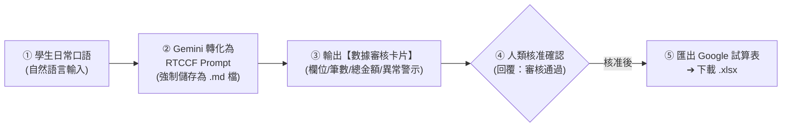

# Excel (.xlsx) 試算表的雙軌生成指南
## 🚀 Google Gemini × 原生筆記本（NotebookLM）非結構化數據清洗與試算表一秒匯出

> **本篇重點**：非技術人員與初學者「不需要會寫複雜的 Prompt」！只要說日常大白話，透過人機協作機制，讓 Gemini 自動轉化為標準 **RTCCF 格式**並**強制儲存為 Markdown 檔案 (`.md`)**。在正式產出試算表前，強制通過**「數據風控審核卡片」**讓人眼快速核對金額與欄位，確認無誤後再一鍵匯出為 **Microsoft Excel 檔 (.xlsx)**。

---

## 🧭 人機協作四步標準工作流（Human-in-the-Loop）

為確保辦公室財務與行政數據的 100% 精確度，避免 AI 運算幻覺，所有 Excel 生成範例均遵循以下標準四步閉環：



---

## 🧭 雙軌生成模式選擇指南

| 模式 | 適用時機 | 工作流核心 | 匯出方式 |
| :--- | :--- | :--- | :--- |
| **軌道一：直接使用 Prompt** | 口頭交代需求、通訊軟體零碎採購留言、手寫白板照片 OCR | 自然語言輸入 ➔ 轉 RTCCF 存為 `.md` ➔ 審核卡片確認 ➔ 生成表格 | 表格右上角綠色按鈕「**匯出至 Google 試算表**」➔ 下載 `.xlsx` |
| **軌道二：以 Notebook 資料為範本** | 多部門跨月份單據清單、大量報價單比對、非結構化長篇會議紀錄 | 上傳單據檔案至筆記本 ➔ 跨來源提取 ➔ 審核卡片核對 ➔ 轉出表格 | 筆記本萃取表格 ➔ 轉至 Gemini 匯出試算表 ➔ 下載 `.xlsx` |

---

## 🛠️ 軌道一：直接使用 Prompt 產出 Excel 試算表

### 步驟 1：學生輸入自然語言（零碎雜項採購整理）

學生不需要懂得寫專業指令，只需在 [Google Gemini](https://gemini.google.com/) 輸入日常大白話：

```text
幫我把下面這段各部門同事在 LINE 裡面七嘴八舌講的採購東西整理成可以算錢的 Excel 表格。有部門、誰要買、買什麼、買多少、大概多少錢跟總共多少，最後要算出總金額，如果有寫哪一天要也要列出來。請先幫我把需求轉成專業的 RTCCF Prompt 讓我儲存為 Markdown (.md) 檔案，然後給我審核卡片確認數據無誤後再產出表格：

「業務部王大明想要買兩台微軟滑鼠，一台大概 850 元，下週三前要；行銷處小美說辦公室咖啡豆快沒了，要補 5 包耶加雪菲（每包約 420 元）跟 3 盒濾紙（每盒 120 元），越快越好；人資部陳主任說新人訓要印講義 30 本，每本影印費 85 元，預計 11 月 5 日請款。」
```

---

### 步驟 2：Gemini 自動轉化為 RTCCF 格式 Prompt

Gemini 會立即產出標準 RTCCF 提示詞，並提醒學生複製儲存：

> 💾 **【人機協作第一步：請學生將此 RTCCF Prompt 強制儲存為 Markdown 檔案 (`.md`)】**  
> *（⚠️ 切勿存為 Word 或一般記事本，唯有 `.md` 能在 Gemini 與人機協作中完整保留欄位約束與數值防錯規則）*

```markdown
## Role（角色）
你是一位資深行政總務與財務採購助理，精通非結構化商業數據清洗與標準試算表建模。

## Task（任務）
將各部門同仁口頭提報之非結構化採購訊息，清洗為標準採購審核資料庫，計算每筆小計與預估總採購金額，並生成可一鍵匯出至 Google 試算表與 Excel (.xlsx) 的表格。

## Context（背景與原始資料）
「業務部王大明想要買兩台微軟滑鼠，一台大概 850 元，下週三前要；行銷處小美說辦公室咖啡豆快沒了，要補 5 包耶加雪菲（每包約 420 元）跟 3 盒濾紙（每盒 120 元），越快越好；人資部陳主任說新人訓要印講義 30 本，每本影印費 85 元，預計 11 月 5 日請款。」

## Constraint（限制與規範）
1. 標準欄位架構：
   | 申請部門 | 申請人 | 採購品項規格 | 數量 | 預估單價 (NTD) | 預估小計 (NTD) | 需求日期/急迫度 | 優先等級 | 備註/預算科目 |
2. 數值規範：
   - 預估小計必須精確計算（數量 × 單價）。
   - 數值欄位純填整數阿拉伯數字，不可加逗號、幣別符號或「元」等文字，確保 Excel 公式可直接計算。
3. 統計列：表格底部必須包含「全體採購預估總計」。
4. 人機協作閘門：在正式產出完整資料表格前，必須先生成【數據風控審核卡片】，由人類審核確認後才生成可匯出之表格。

## Format（輸出格式）
第一階段輸出「數據風控審核卡片」，待使用者回覆「確認無誤」後，第二階段輸出 Markdown 表格並啟動 Google 試算表匯出按鈕。
```

---

### 步驟 3：AI 產出【數據風控審核卡片】（未確認前不產出最終表格）

在產出 Excel 表格前，AI 必須主動呈現審核卡片：

```markdown
📋【數據風控審核卡片 (Review Card)】—— 請使用者確認

【資料來源摘要】
• 原始來源：部門通訊軟體雜亂文字
• 識別部門：業務部、行銷處、人資部
• 採購品項筆數：4 筆（滑鼠、咖啡豆、濾紙、講義）

【核心財務數值預檢】
• 滑鼠：2 台 × 850 = 1,700 元
• 咖啡豆：5 包 × 420 = 2,100 元
• 濾紙：3 盒 × 120 = 360 元
• 講義印製：30 本 × 85 = 2,550 元
• 預估總採購金額：NT$ 6,710 元整

【數據異常與注意事項】
⚠️ 行銷處「越快越好」未附明確日期，預設為「高急迫度 / 本週內」。
⚠️ 業務部「下週三前要」需於備註註記採購前置天數。

👉 請檢視上述金額與品項。若確認無誤，請回覆：【審核通過，請生成試算表表格】；若有品項或價格異動，請直接回覆修正指令。
```

---

### 步驟 4：使用者確認 ➔ 生成表格並一鍵匯出 Excel (.xlsx)

使用者只要在對話框回覆：
> **「審核通過，請生成試算表表格」**

Gemini 隨即產出最終結構化表格：

| 申請部門 | 申請人 | 採購品項規格 | 數量 | 預估單價 | 預估小計 | 需求日期/急迫度 | 優先等級 | 備註/預算科目 |
| :--- | :--- | :--- | :--- | :--- | :--- | :--- | :--- | :--- |
| 業務部 | 王大明 | 微軟滑鼠 | 2 | 850 | 1700 | 下週三前 | 一般 | 耗材費用 |
| 行銷處 | 小美 | 耶加雪菲咖啡豆 | 5 | 420 | 2100 | 越快越好 | 緊急 | 職工福利 |
| 行銷處 | 小美 | 咖啡濾紙 | 3 | 120 | 360 | 越快越好 | 緊急 | 職工福利 |
| 人資部 | 陳主任 | 新人訓講義印製 | 30 | 85 | 2550 | 11月5日請款 | 一般 | 培訓費用 |
| **總計** | - | - | **37** | - | **6710** | - | - | - |

#### 📥 一鍵匯出為 Excel (.xlsx) 步驟：
1. 表格生成後，右上角會浮現綠色圖示：**「匯出至 Google 試算表」**。
2. 點擊後，系統會在 2 秒內於 Google 雲端硬碟建立試算表並自動開啟新分頁。
3. 在 Google 試算表中，點選上方選單 **「檔案」➔「下載」➔「Microsoft Excel (.xlsx)」**，即可獲得格式標準之實體 Excel 檔！

---

### 📸 進階實戰：會議白板照片 OCR 一鍵轉試算表
- 練習素材：[**實體白板專案討論與待辦筆記.png**](./範例素材與偽資料/實體白板專案討論與待辦筆記.png)
- 操作方式：點選「**＋ 上傳圖片**」選取該白板照片，輸入自然語言：
  > 「*請看這張白板照片，把上面寫的專案代辦事項整理成 Excel 表格。包含項目、狀態、待辦內容、負責人、預估完成日。先給我轉成 RTCCF 存為 .md 檔案，並給我審核卡片，我說 OK 後再出表格。*」
- Gemini 即時辨識手寫筆跡，經過審核卡片人眼確認後，一秒轉出 Excel！

---

## 📊 軌道二：以 Notebook 資料為範本產出 Excel 試算表

當需要處理多個部門提報的長篇多檔案單據、或是跨來源比對報價時，使用原生筆記本（NotebookLM）建立知識庫。

### 步驟 1：上傳教學偽資料
- 練習素材：[**各部門零碎採購申請與報價單據.xlsx**](./範例素材與偽資料/各部門零碎採購申請與報價單據.xlsx)（亦可搭配 [CSV 檔](./範例素材與偽資料/各部門採購需求原始清單.csv) 或 [純文字檔](./範例素材與偽資料/各部門零碎採購申請與報價單據.txt)）
- 操作方式：在筆記本介面點擊「新增來源」，將上述檔案拖曳上傳。

---

### 步驟 2：學生在筆記本輸入自然語言

```text
請根據我剛剛上傳的這份採購單據資料，幫我把裡面所有分散的採購需求洗乾淨，做成一張可以匯出 Excel 的審核清單。算清楚每項的小計跟全部加起來的總預算。先幫我轉成 RTCCF 儲存為 Markdown (.md) 檔案，然後給我審核卡片，確認沒問題才生出表格。
```

---

### 步驟 3：產出 RTCCF Prompt（強制儲存為 .md 檔案）

> 💾 **【人機協作第一步：請學生將此 RTCCF Prompt 儲存為 `.md` 檔案備用】**

```markdown
## Role
資深財務審計分析師。

## Task
以筆記本內的《各部門2026年Q2辦公耗材與IT設備採購申請彙整清單》為依據，全面提取所有採購項目，建立零死角的財務預算審核表。

## Context
來源為 Notebook 內已上傳之採購單據與對話紀錄。

## Constraint
1. 嚴格依據筆記本內容提取，嚴禁虛構數值。
2. 數值欄位（單價、數量、小計）必須全為純數字。
3. 產出前必須提供【數據風控審核卡片】，列出數據總筆數、預估總預算與異常品項。
4. 經人類回覆「確認無誤」後才產出完整 Markdown 表格。

## Format
審核卡片 ➔ 人機確認 ➔ 匯出用 Markdown 表格。
```

---

### 步驟 4：【數據審核卡片】➔ 使用者確認 ➔ 匯出 Excel

筆記本產出審核卡片：
```markdown
📋【筆記本數據萃取審核卡片】
• 涵蓋來源：2026年Q2採購申請彙整清單
• 提取項目數：共 8 筆部門提報（涵蓋 IT 人體工學椅、雙螢幕支架、多功能事務機等）
• 估算總金額：NT$ 98,400 元
• 風險提醒：資訊部提報之伺服器備用硬碟單價標示為「美金」，已暫以匯率 32 換算為台幣，請確認是否符合公司核銷規定。

👉 若數據無誤，請回覆【審核通過】，將立即產出完整試算表。
```

使用者回覆「**審核通過**」後：
1. 複製生成的 Markdown 表格。
2. 貼至 Gemini 主介面輸入：「*請轉為可匯出試算表格式*」。
3. 點擊「**匯出至 Google 試算表**」，隨後「**下載 ➔ Microsoft Excel (.xlsx)**」！

---

## 💡 試算表避坑與風控技巧（Pro Tips）

1. **純數值要求**：在審核卡片階段特別留意金額欄位是否含有 `NT$`、`$`、`,` 或「元」。保持純數字，下載為 Excel 時才能直接以 `=SUM()` 自動加總。
2. **日期標準化**：統一要求 `YYYY-MM-DD` 格式，避免在 Excel 中排序時出現跨年份混亂。
3. **小數點處理**：外幣換算或含有稅額項目，在 Prompt 指定「四捨五入取至整數」，避免試算表欄位出現無限循環小數。
