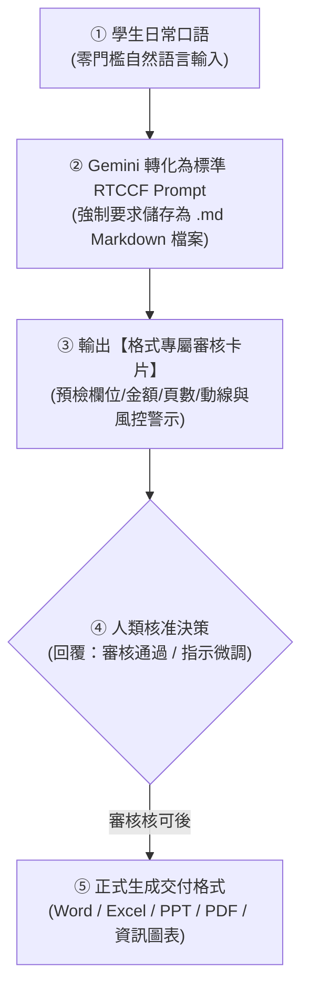
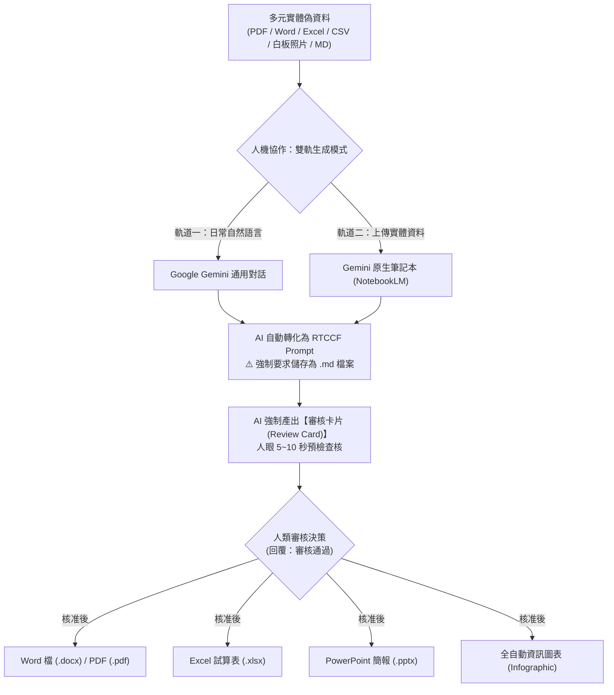

# Gemini 辦公室全能應用：五大商務交付格式生成手冊
## 🚀 Google Gemini × 原生筆記本（NotebookLM）人機協作雙軌生成實戰

> **本模組簡介**：本專題專為現代職場與辦公室非技術人員量身設計，全面以 **Google Gemini** 與 **Gemini 原生筆記本（NotebookLM）** 為雙核心。
> 
> 針對初學者「不會寫 Prompt、擔心 AI 產出不可控、格式無法直接交付」的三大痛點，本教學全面導入 **人機協作（Human-in-the-Loop）四步閉環機制**：
> 1. **零門檻自然語言輸入**：學員只需輸入日常口語，AI 自動轉化為專業 **RTCCF 格式**。
> 2. **強制儲存為 Markdown (.md) 檔案**：**核心守則——必須儲存為 `.md` 檔案**！Markdown 是 LLM 原生語意結構語言，唯有儲存為 `.md` 才能無損保留角色、表格、階層與約束，達到真正的人機協同與重複調用。
> 3. **強制「審核卡片（Review Card）」機制**：在產生任何實體檔案前，AI 必須先產出審核卡片供人類快速核對，**待使用者確認「可以了 / 審核通過」才正式生成**。
> 4. **實體交付格式匯出**：無縫產出 **Word (.docx)**、**Excel (.xlsx)**、**PowerPoint (.pptx)**、**PDF (.pdf)** 以及 **全自動資訊圖表（Infographic）**！

---

## 📌 關鍵核心原則：為什麼人機協作與 Gemini 對話「一定要儲存為 Markdown (.md) 檔案」？

在與 Gemini 或任何大語言模型進行深度人機協作時，**「將 Prompt 與溝通成果儲存為 Markdown 檔案 (`.md`)」是不可妥協的最佳實踐**，原因如下：

| 評估面向 | 儲存為 Markdown (`.md`) | 存為一般記事本 (`.txt`) | 存為 Word (`.docx`) |
| :--- | :--- | :--- | :--- |
| **語意結構保真度** | 🟢 **100% 原生解析**：保留 `#` 標題、`| 表格 |`、代碼區塊與縮排層級，AI 精準理解角色任務與邊界條件。 | 🟡 **結構模糊**：僅有平鋪文字，複雜的表格、參數對齊容易錯位，AI 易漏看約束。 | 🔴 **格式污染**：夾帶大量的二進位與 XML 富文本標籤，複製到對話框時常引發格式錯亂與雜訊。 |
| **NotebookLM 相容性** | 🟢 **完美語意切分 (Semantic Chunking)**：NotebookLM 依據 Markdown 標題進行精準檢索定位，達到**零幻覺 Grounded 輸出**。 | 🟡 段落切分較生硬，跨段落檢索容易斷層。 | 🟡 檔案體積大，上傳與解析耗時較久。 |
| **人機協作與版本控管** | 🟢 **最佳數位資產**：支援 Git、VS Code、Obsidian、GitHub，團隊可多人協作、審核修訂與永久複用。 | 🔴 缺乏結構化，難以建立大型企業級 Prompt 資產庫。 | 🔴 難以進行純文字 diff 版本比較與自動化調用。 |

> 💡 **操作原則**：每次 Gemini 將你的口語需求改寫為 RTCCF 格式後，**請第一時間複製並在本地或專案中新增 `.md` 檔案（例如：`採購單據清洗_Prompt.md`）儲存**。

---

## 🧭 人機協作四步標準工作流（Human-in-the-Loop）



---

## 🧭 雙軌生成工作流（Dual-Track Workflow）

每一個專案與格式，皆提供兩種操作模式，並附上**可一鍵複製的自然語言 Prompt** 與**多元實體教學偽資料**：

```
【軌道一：直接使用 Prompt 生成】
在 Google Gemini 對話框輸入自然語言 ➔ 轉化為 RTCCF 並儲存為 .md 檔案 ➔ 通過「審核卡片」核可 ➔ 一秒點擊「匯出至 Google Docs / Sheets」➔ 下載 Word / Excel / PPT / PDF

【軌道二：以 Notebook 資料為範本生成】
下載專案隨附的「實體偽資料檔案」上傳至筆記本 ➔ 輸入自然語言 ➔ 轉化為 RTCCF 並儲存為 .md 檔案 ➔ 通過「審核卡片」核對 ➔ 一鍵生成零幻覺報告、試算表、投影片與全自動資訊圖表
```

---

## 📂 核心生成格式與教學手冊速查

| 交付格式 | 核心教學手冊 | 審核卡片機制 (Review Card) | 軌道一：自然語言 ➔ Prompt 實戰 | 軌道二：以 Notebook 資料為範本 |
| :--- | :--- | :--- | :--- | :--- |
| 📄 **Word 檔**<br>(`.docx`) | [**Word與PDF文件的生成.md**](./Word與PDF文件的生成.md) | **文件架構審核卡片**<br>（章節/字數/合規警示） | 自然語言提企劃 ➔ 轉 RTCCF 存為 `.md` ➔ 審核確認 ➔ 匯出 Google Docs ➔ 下載 `.docx` | 上傳 [差旅管理規範.pdf](./範例素材與偽資料/企業內部規章_差旅與加班管理規範.pdf) ➔ 審核確認 ➔ 下載 `.docx` |
| 📊 **Excel 檔**<br>(`.xlsx`) | [**Excel試算表的生成.md**](./Excel試算表的生成.md) | **數據風控審核卡片**<br>（欄位/筆數/總金額/異常） | 自然語言丟單據 ➔ 轉 RTCCF 存為 `.md` ➔ 審核確認 ➔ 綠色按鈕匯出試算表 ➔ 下載 `.xlsx` | 上傳 [採購單據.xlsx](./範例素材與偽資料/各部門零碎採購申請與報價單據.xlsx) ➔ 審核確認 ➔ 下載 `.xlsx` |
| 📑 **PowerPoint**<br>(`.pptx`) | [**簡報的生成.md**](./簡報的生成.md) | **簡報企劃審核卡片**<br>（頁數/分頁核心/風格配色） | 自然語言發想 ➔ 轉 RTCCF 存為 `.md` ➔ 審核確認 ➔ 搭配 Gamma / PPT 模版匯出 `.pptx` | 上傳 [會議逐字稿.docx](./範例素材與偽資料/數位轉型專案啟動會議音訊逐字稿.docx) ➔ 審核確認 ➔ 套用 [PPT 模版](./簡報完成檔案/ptt簡報模版.pptx) |
| 📕 **PDF 檔**<br>(`.pdf`) | [**Word與PDF文件的生成.md**](./Word與PDF文件的生成.md) | **文件完整性審核卡片**<br>（版面/章節確認） | 企劃內容匯出 Google Docs ➔ 審核確認 ➔ 點選「下載為 PDF」 | 筆記本產出研究指南 ➔ 審核確認 ➔ 另存為標準排版之 `.pdf` |
| 🎨 **資訊圖表**<br>(`Infographic`) | [**全自動資訊圖表的生成.md**](./全自動資訊圖表的生成.md) | **視覺設計審核卡片**<br>（動線/風格/4大模組區塊） | 輸入口語宣傳需求 ➔ 轉 RTCCF 存為 `.md` ➔ 審核確認 ➔ 產出便當盒 Bento Box 規格書 | 上傳 [新人到職SOP.md](./範例素材與偽資料/新進同仁到職七天SOP指南.md) ➔ 審核確認 ➔ 鉛筆指令實體生成 |
| 💡 **定位解析** | [**簡報和資訊圖表的差異.md**](./簡報和資訊圖表的差異.md) | — | 深入解析口頭演講投影片與單頁視覺資訊圖表之溝通本質與設計差異 | — |

---

## 📦 專屬實體多類型偽資料庫（供課堂與自學直接下載）

為方便學員體驗真實企業辦公場景，本專案提供 **PDF、DOCX、XLSX、CSV、PNG (手寫白板)、MD 與 TXT 等 7 種實體格式**，皆可直接拖曳上傳至筆記本或 Gemini 進行多模態辨識：

👉 [**查看完整範例素材與偽資料庫總覽**](./範例素材與偽資料/README.md)

1. 📕 **PDF 規章**：[**企業內部規章_差旅與加班管理規範.pdf**](./範例素材與偽資料/企業內部規章_差旅與加班管理規範.pdf)
2. 📄 **Word 逐字稿**：[**數位轉型專案啟動會議音訊逐字稿.docx**](./範例素材與偽資料/數位轉型專案啟動會議音訊逐字稿.docx)
3. 📊 **Excel 單據**：[**各部門零碎採購申請與報價單據.xlsx**](./範例素材與偽資料/各部門零碎採購申請與報價單據.xlsx)
4. 📈 **CSV 數據表**：[**各部門採購需求原始清單.csv**](./範例素材與偽資料/各部門採購需求原始清單.csv)
5. 🖼️ **PNG 手寫白板**：[**實體白板專案討論與待辦筆記.png**](./範例素材與偽資料/實體白板專案討論與待辦筆記.png)（支援視覺多模態 OCR）
6. 📝 **Markdown 指南**：[**新進同仁到職七天SOP指南.md**](./範例素材與偽資料/新進同仁到職七天SOP指南.md)
7. 📄 **純文字備用檔**：提供對應之 `.txt` 檔案方便快速複製。

---

## 💡 Gemini 與 NotebookLM 協同工作流全景圖


