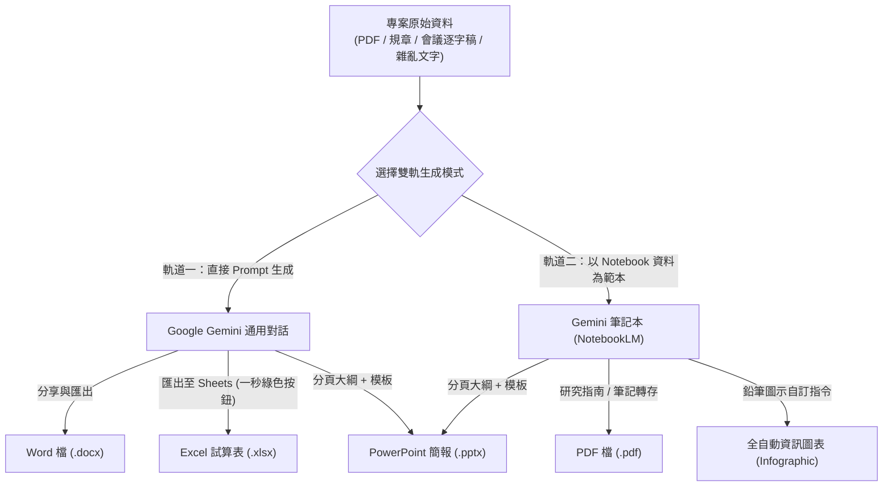

# Gemini 辦公室全能應用：五大商務交付格式生成手冊
## 🚀 Google Gemini × 原生筆記本（NotebookLM）雙軌生成實戰

> **本模組簡介**：本專題專為現代職場與辦公室非技術人員量身設計，全面以 **Google Gemini** 與 **Gemini 原生筆記本（NotebookLM）** 為雙核心。
> 解決傳統「AI 產出無法直接用於工作交付」的困境，提供 **雙軌學習與操作工作流**，直接產出 **Word (.docx)**、**Excel (.xlsx)**、**PowerPoint (.pptx)**、**PDF (.pdf)** 以及 **全自動資訊圖表（Infographic）** 五大職場必備交付格式！

---

## 🧭 雙軌生成工作流（Dual-Track Workflow）

每一個專案與格式，皆提供兩種操作模式，並附上**可一鍵複製的標準 Prompt** 與**實體教學偽資料**：

```
【軌道一：直接使用 Prompt 生成】
在 Google Gemini 對話框輸入結構化 Prompt（自帶情境與非結構化文字）➔ 一秒點擊「匯出至 Google Docs / Sheets」➔ 下載 Word / Excel / PPT

【軌道二：以 Notebook 資料為範本生成】
下載專案隨附的「實體偽資料檔案」上傳至筆記本 ➔ 輸入 Grounded 萃取與清洗 Prompt ➔ 一鍵生成零幻覺報告、試算表、投影片與資訊圖表
```

---

## 📂 核心生成格式與教學手冊速查

| 交付格式 | 核心教學手冊 | 軌道一：純 Prompt 實戰 | 軌道二：以 Notebook 資料為範本 |
| :--- | :--- | :--- | :--- |
| 📄 **Word 檔**<br>(`.docx`) | [**Word與PDF文件的生成.md**](./Word與PDF文件的生成.md) | 輸入專案企劃 Prompt ➔ 匯出 Google 文件 ➔ 下載 `.docx` | 上傳 [企業內部規章_差旅與加班管理規範.txt](./範例素材與偽資料/企業內部規章_差旅與加班管理規範.txt) ➔ 萃取報銷指南 ➔ 下載 `.docx` |
| 📊 **Excel 檔**<br>(`.xlsx`) | [**Excel試算表的生成.md**](./Excel試算表的生成.md) | 輸入零碎需求 Prompt ➔ 點擊綠色「匯出至試算表」➔ 下載 `.xlsx` | 上傳 [各部門零碎採購申請與報價單據.txt](./範例素材與偽資料/各部門零碎採購申請與報價單據.txt) ➔ 結構化清洗 ➔ 下載 `.xlsx` |
| 📑 **PowerPoint**<br>(`.pptx`) | [**簡報的生成.md**](./簡報的生成.md) | 輸入 8 頁科技大綱 Prompt ➔ 搭配 Gamma / PPT 模板下載 `.pptx` | 上傳 [數位轉型專案啟動會議音訊逐字稿.txt](./範例素材與偽資料/數位轉型專案啟動會議音訊逐字稿.txt) ➔ 提煉 6 頁精華大綱 ➔ 套用模板 |
| 📕 **PDF 檔**<br>(`.pdf`) | [**Word與PDF文件的生成.md**](./Word與PDF文件的生成.md) | 企劃內容匯出 Google 文件 ➔ 點選「下載為 PDF」 | 筆記本產出研究指南 ➔ 另存為排版工整之 `.pdf` |
| 🎨 **資訊圖表**<br>(`Infographic`) | [**全自動資訊圖表的生成.md**](./全自動資訊圖表的生成.md) | 輸入便當盒排版法 Bento Box 版面規劃 Prompt | 上傳 [新進同仁到職七天SOP指南.txt](./範例素材與偽資料/新進同仁到職七天SOP指南.txt) ➔ 鉛筆指令切換 10 大風格 × 3 大動線 |
| 💡 **定位解析** | [**簡報和資訊圖表的差異.md**](./簡報和資訊圖表的差異.md) | 深入理解口頭演講簡報與單頁資訊圖表之溝通本質與設計差異 | — |

---

## 📦 專屬實體偽資料庫（供課堂與自學直接下載）

為方便同仁與學員上機實作，所有練習所需的非結構化數據、公司規章、會議錄音稿皆已集中於下方目錄：
- 👉 [**查看完整範例素材與偽資料庫目錄**](./範例素材與偽資料/README.md)
  - [企業內部規章_差旅與加班管理規範.txt](./範例素材與偽資料/企業內部規章_差旅與加班管理規範.txt)
  - [各部門零碎採購申請與報價單據.txt](./範例素材與偽資料/各部門零碎採購申請與報價單據.txt)
  - [數位轉型專案啟動會議音訊逐字稿.txt](./範例素材與偽資料/數位轉型專案啟動會議音訊逐字稿.txt)
  - [新進同仁到職七天SOP指南.txt](./範例素材與偽資料/新進同仁到職七天SOP指南.txt)

---

## 💡 Gemini 與 NotebookLM 協同工作流全景


