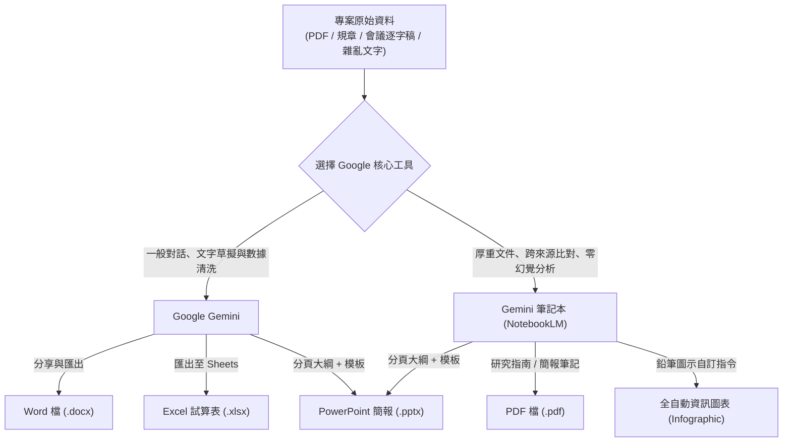

# 辦公室五大文件、試算表、簡報與資訊圖表生成模組
## 🚀 Google Gemini × NotebookLM 全方位商務交付實戰手冊

> **本模組簡介**：本專題專為現代職場與辦公室非技術人員打造，全面聚焦以 **Google Gemini** 與 **Gemini 原生筆記本（NotebookLM）** 為雙核心。
> 徹底打破「AI 只能在對話框聊天」的侷限，實現從非結構化想法與龐大企業來源中，直接一鍵自動生成 **Word (.docx)**、**Excel (.xlsx)**、**PowerPoint (.pptx)**、**PDF (.pdf)** 以及 **全自動資訊圖表（Infographic）** 五大職場必備交付格式！

---

## 🧭 五大職場產出格式快速導覽

| 產出格式 | 核心應用場景 | 推薦工具與流程 | 專題深入指南 |
| :--- | :--- | :--- | :--- |
| 📄 **Word 檔** (`.docx`) | 專案企劃書、標準作業程序 (SOP)、正式公務函文、合約草案 | **Gemini** 結構化 Prompt ➔ 一鍵「匯出至 Google 文件」➔ 下載為 `.docx` | [👉 閱讀：Word 與 PDF 文件的生成](./Word與PDF文件的生成.md) |
| 📊 **Excel 檔** (`.xlsx`) | 採購需求統整、多部門進度追蹤、報價對比矩陣、數據清洗 | **Gemini** 格式化提取 ➔ 點擊「匯出至 Google 試算表」➔ 下載為 `.xlsx` | [👉 閱讀：Excel 試算表的生成](./Excel試算表的生成.md) |
| 📑 **PowerPoint** (`.pptx`) | 科技專案提案、主管業務彙報、年度成果展示、數位轉型計畫 | **Gemini / NotebookLM** 萃取分頁大綱 ➔ 搭配 PPT 模板或 Gamma 下載為 `.pptx` | [👉 閱讀：PowerPoint 簡報的生成](./簡報的生成.md) |
| 📕 **PDF 檔** (`.pdf`) | 正式研究報告、跨法規比較分析、會議紀要定稿 | **NotebookLM** 產出研究指南與簡報筆記 ➔ 另存為排版工整之 `.pdf` | [👉 閱讀：Word 與 PDF 文件的生成](./Word與PDF文件的生成.md) |
| 🎨 **資訊圖表** (`Infographic`) | 新人培訓流程圖解、方案優缺點對比、社群與跨部門懶人包 | **NotebookLM** 資訊圖表功能 ➔ 善用「鉛筆指令」自訂 10 大風格 × 3 大動線 | [👉 閱讀：全自動資訊圖表的生成](./全自動資訊圖表的生成.md) |

---

## 📚 模組核心文件清單

1. [**Word 與 PDF 文件的生成**](./Word與PDF文件的生成.md)  
   詳細說明如何透過 Gemini 長文本能力與 NotebookLM 研究指南，產出具備目錄階層的正式公文與 PDF 報告。
2. [**Excel 試算表的生成**](./Excel試算表的生成.md)  
   非結構化雜亂文字、口頭回報與報價照片，一鍵轉為試算表並產出 `.xlsx` 檔案之實戰。
3. [**PowerPoint 簡報的生成**](./簡報的生成.md)  
   遵循「先大綱 ➔ 風格配色 ➔ 產出 .pptx」黃金方程式，從來源文件一鍵成型。
4. [**全自動資訊圖表的生成**](./全自動資訊圖表的生成.md)  
   掌握 NotebookLM 最新視覺化黑科技：10 大視覺風格（便當盒法、專業風、教學風等）與 3 大閱讀動線（垂直、Z 型、蛇形）。
5. [**簡報和資訊圖表的差異**](./簡報和資訊圖表的差異.md)  
   釐清口頭演講簡報（講者為核心）與獨立資訊圖表（自明性高密度傳播）之根本溝通定位。

---

## 💡 Gemini 與 NotebookLM 協同工作流全景

