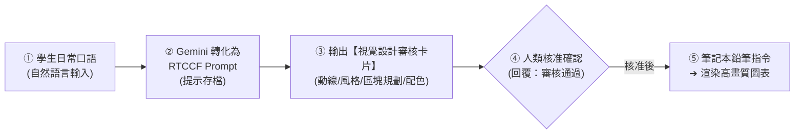

# 全自動資訊圖表 (Infographic) 的雙軌生成指南
## 🚀 Google Gemini × 原生筆記本（NotebookLM）10 大視覺風格 × 3 大閱讀動線全攻略

> **本篇重點**：非技術人員與初學者「完全不必具備設計底子或複雜的 Prompt 技能」！只要說出想要宣傳的白話內容，透過人機協作機制，讓 Gemini 自動轉化為標準 **RTCCF 格式**並**提示存檔**。在正式產出視覺圖表前，強制通過**「視覺設計審核卡片」**讓人眼快速核對動線佈局、模組內容與風格配色，待使用者說「可以了」才啟動 NotebookLM 鉛筆指令或渲染產出高質感的 **商務資訊圖表（Infographic）**。

---

## 🧭 人機協作四步標準工作流（Human-in-the-Loop）

為確保資訊圖表排版不混亂、重點不偏離，所有圖表生成均落實人機協作四步閉環：



---

## 🧭 雙軌生成模式選擇指南

| 模式 | 適用時機 | 工作流核心 | 產出型態 |
| :--- | :--- | :--- | :--- |
| **軌道一：直接使用 Prompt** | 從文字構思版面佈局、設計跨部門宣傳懶人包草案 | 自然語言輸入 ➔ 轉 RTCCF 存檔 ➔ 審核卡片確認 ➔ 產出規格書 | 資訊圖表版面規格書、各區塊文案與排版指南 |
| **軌道二：以 Notebook 資料為範本** | 上傳內部 SOP 或規章，由 AI 一鍵渲染實體視覺圖表 | 上傳文件至筆記本 ➔ 提煉流程 ➔ 審核卡片核對 ➔ 鉛筆指令生成 | 直接生成具備豐富配色與排版的實體高畫質圖表檔 |

---

## 🛠️ 軌道一：直接使用 Prompt 規劃資訊圖表架構

### 步驟 1：學生輸入自然語言（日常口語）

學生不需要學會寫提示詞，直接在 [Google Gemini](https://gemini.google.com/) 輸入日常大白話：

```text
我想做一張一頁式的資訊圖表宣傳單，主題是「傳統公務辦公 vs. Gemini AI 協作賦能」的對比，版面想要像便當盒那樣一格一格的方塊感（Bento Box）。裡面要講行政省下多少時間、工作步驟從 5 步縮短到 2 步、可以產出 Word/Excel/PPT/PDF，還有公司很在乎的資安防護守則。請先幫我把需求轉成專業的 RTCCF 提示詞讓我存檔，然後給我審核卡片確認版面與文案，我確認 OK 後再給我完整設計規格：
```

---

### 步驟 2：Gemini 自動轉化為 RTCCF 格式 Prompt

Gemini 立即產出結構化 RTCCF 提示詞，並提醒學生存檔：

> 💾 **【人機協作第一步：請學生將此 RTCCF Prompt 複製並存檔為 `.md` 或筆記】**

```markdown
## Role（角色）
你是一位獲獎無數的資深資訊設計師（Information Designer），精通視覺動線心理學與便當盒排版法（Bento Box Grid System）。

## Task（任務）
規劃一張「傳統公務辦公 vs. Gemini AI 協作賦能」一頁式資訊圖表架構規格書，轉化複雜數據為高吸睛度視覺懶人包。

## Context（背景）
作為跨部門宣傳推廣的視覺懶人包，讀者停留時間僅 15~30 秒，必須在單一畫面上清晰對比導入效益。

## Constraint（限制與規範）
1. 版面格局：便當盒網格佈局（4 大模組方格）。
2. 閱讀動線：Z 型動線（左上 ➔ 右上 ➔ 左下 ➔ 右下）。
3. 模組內容：
   - 模組 1（核心數據指標）：量化行政工時與產出速度節省比例（大數字）。
   - 模組 2（工作流對照）：傳統 5 步驟 vs AI 一站式 2 步驟。
   - 模組 3（能力矩陣）：Word、Excel、PPT、PDF、資訊圖表五大輸出成果展示。
   - 模組 4（安全防線）：資安三原則徽章（查核、分流、負責）。
4. 附上各區塊 25 字以內極簡文案、Icon 建議與 HEX 色票。
5. 人機協作閘門：正式展開各區塊設計前，必須先輸出【資訊圖表設計審核卡片】，由使用者核准後再行輸出。

## Format（輸出格式）
第一階段：視覺設計審核卡片 ➔ 人類審核 ➔ 第二階段：完整版面設計規劃書。
```

---

### 步驟 3：AI 產出【視覺設計審核卡片】（未審核前不展開細節）

在生成完整設計規格前，AI 主動呈現審核卡片：

```markdown
📋【資訊圖表視覺設計審核卡片 (Review Card)】—— 請使用者確認

【圖表規格概要】
• 圖表主題：傳統公務辦公 vs. Gemini AI 協作賦能
• 排版風格：便當盒排版法 (Bento Box Grid)
• 閱讀動線：Z 型動線（由左至右、由上至下流暢閱讀）
• 推薦色票：高對比科技冷色（深藍底 `#0F172A` + 數據螢光綠 `#10B981` + 重點琥珀黃 `#F59E0B`）

【4 大模組方塊預覽】
┌────────────────────────┬────────────────────────┐
│ 模組 1：大數據量化成效 │ 模組 2：工作流程縮減   │
│ • 節省 70% 行政工時    │ • 傳統 5 步 ➔ AI 2 步  │
├────────────────────────┼────────────────────────┤
│ 模組 3：五大格式全覆蓋 │ 模組 4：資安三大信任防線│
│ • Word/Excel/PPT/PDF   │ • 查核、分流、責任確認 │
└────────────────────────┴────────────────────────┘

👉 請確認此版面格局與內容模組是否符合您的需求。若確認可以，請回覆：【審核通過，請展開設計規格】，或回覆修改指示。
```

---

### 步驟 4：使用者確認 ➔ 產出完整設計規劃書

使用者回覆：
> **「審核通過，請展開設計規格」**

Gemini 隨即展開各區塊詳細視覺排版指令、精準文案與圖示規格，可直接交由設計師排版或作為投影片封面。

---

## 🎨 軌道二：以 Notebook 資料為範本產出全自動資訊圖表

Google 原生筆記本（NotebookLM）支援資訊圖表（Infographic）自動繪製！具備 **10 種視覺風格** 與 **3 種閱讀動線**，可創造出 30 種專業圖表變化。

### 步驟 1：下載並上傳教學偽資料
- 練習素材：[**新進同仁到職七天SOP指南.md**](./範例素材與偽資料/新進同仁到職七天SOP指南.md)（亦可搭配 [純文字檔](./範例素材與偽資料/新進同仁到職七天SOP指南.txt)）
- 操作方式：在筆記本介面點選「新增來源」，將上述檔案上傳。

---

### 步驟 2：學生在筆記本輸入自然語言

```text
請根據這份新進同仁 SOP 指南，幫我做一張給新人看的一頁式流程圖表。請先給我 RTCCF 提示詞存檔，並提供審核卡片讓我核對動線跟風格，我說可以了再給我鉛筆指令去生成實體圖表。
```

---

### 步驟 3：產出 RTCCF Prompt（提示存檔）

> 💾 **【人機協作第一步：請學生將此 RTCCF Prompt 存檔備用】**

```markdown
## Role
企業內部教育培訓視覺設計顧問。

## Task
以筆記本內的《新進同仁到職七天SOP指南》為唯一事實基礎，設計一張新人指引資訊圖表。

## Context
針對到職第一天的新進同仁，將多頁長篇規章濃縮為一張易讀、溫馨、步驟清楚的單張圖表。

## Constraint
1. 嚴格對應原文的 6 大步驟與負責窗口。
2. 評估最合適的動線（蛇形流程 S-Curve）與風格（教學風 Explanatory）。
3. 產出前必須輸出【圖表動線與風格審核卡片】，由使用者核准後再提供鉛筆指令。

## Format
審核卡片 ➔ 使用者確認 ➔ NotebookLM 鉛筆生成指令。
```

---

### 步驟 4：【審核卡片】➔ 使用者確認 ➔ 鉛筆指令實體生成

筆記本產出審核卡片：
```markdown
📋【新人 SOP 資訊圖表審核卡片】
• 來源基礎：新進同仁到職七天SOP指南 (共 6 大流程階段)
• 推薦動線：蛇形流程動線 (S-Curve) —— 最適合 5 步以上連續流程，由左至右蜿蜒前進
• 推薦風格：教學風格 (Explanatory) —— 線條簡潔，圖標親切明快
• 包含核心步驟：
  Step 1. 報到與身分確認 (HR)
  Step 2. IT 帳號與設備領取 (資訊部)
  Step 3. 部門導師介紹與環境熟悉 (部門主管)
  Step 4. 規章考核與公文系統上線 (人資部)
  Step 5. 第一週業務任務交辦 (導師)
  Step 6. 第七天回饋訪談與考核 (HR & 主管)

👉 請確認動線與流程是否合適。若確認無誤，請回覆【審核通過，請提供鉛筆指令】。
```

使用者回覆「**審核通過**」後，系統給出最終筆記本鉛筆指令：

#### ✏️ 筆記本鉛筆一鍵生成指令（直接貼入 NotebookLM 鉛筆圖示）：
```text
請使用「教學風格 (Explanatory)」，搭配「蛇形動線 (S-Curve)」，將上傳的新進同仁到職 6 大步驟製作為直式資訊圖表，清楚標示每個階段的任務里程碑與負責窗口。
```

點擊生成後，NotebookLM 將於數秒內自動渲染出一張精美且色彩協調的高畫質資訊圖表！

---

## 📐 10 大視覺風格與 3 大閱讀動線速查表

### 3 大閱讀動線：
1. **垂直線性動線 (Vertical)**：由上往下延伸，適合列表類內容、單向 SOP 拆解。
2. **Z 型動線 (Z-Pattern)**：左上 ➔ 右上 ➔ 左下 ➔ 右下，適合方案對比與四象限分析。
3. **蛇形流程動線 (S-Curve)**：蛇行蜿蜒前進，適合超過 5 步以上的長條型步驟與時間軸。


### 10 大視覺風格：

| 風格名稱 | 核心視覺特色 | 最合適場景 |
| :--- | :--- | :--- |
| **便當盒法 (Bento Box)** | 模組化方格、規整分類 | 功能清單、產品規格與成效對比 |
| **專業風 (Professional)** | 冷色調、乾淨網格、高對比 | 商務會議、正式年度報告 |
| **教學風 (Explanatory)** | 簡約線條、流程導向 | 員工培訓手冊、SOP 流程圖解 |
| **社論風 (Editorial)** | 雜誌排版感、文字圖表交錯 | 專案觀點評論、趨勢專題 |
| **積木風 (Blocks)** | 幾何方塊、模組化立體視覺 | 系統架構、組織圖、專案階段 |
| **手繪風 (Hand-drawn)** | 不規則線條、類筆觸感 | 創意發想、具溫度的品牌故事 |
| **可愛風 / 黏土風 / 動漫風 / 科學風** | 依情境與目標受眾親和力靈活切換 | 活動海報、生活指南、科普宣導 |