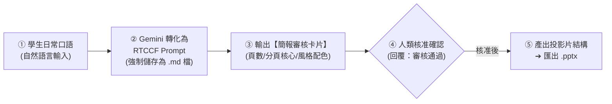

# PowerPoint (.pptx) 簡報的雙軌生成指南
## 🚀 Google Gemini × 原生筆記本（NotebookLM）商業簡報大綱萃取與 PPTX 實戰

> **本篇重點**：學生完全不需要具備複雜的 Prompt 技能！只要用日常對話告訴 Gemini「想對誰報告什麼」，透過人機協作機制自動轉化為標準 **RTCCF 格式**並**強制儲存為 Markdown 檔案 (`.md`)**。在正式產出簡報與投影片之前，強制通過**「簡報企劃審核卡片」**讓人眼快速核定分頁架構、核心論點與風格配色，待使用者說「可以了」才生成最終格式並匯出為 **Microsoft PowerPoint 簡報檔 (.pptx)**。

---

## 🧭 人機協作四步標準工作流（Human-in-the-Loop）

為避免簡報論點發散、投影片文字過多或排版跑版，所有簡報製作均落實人機協作四步閉環：



---

## 🧭 雙軌生成模式選擇指南

| 模式 | 適用時機 | 工作流核心 | 匯出方式 |
| :--- | :--- | :--- | :--- |
| **軌道一：直接使用 Prompt** | 全新商務提案、主管業務彙報、從無到有的概念發想 | 自然語言發想 ➔ 轉 RTCCF 存為 `.md` ➔ 審核卡片確認 ➔ 生成大綱 | 大綱貼入 Gamma / PPT 模板匯出 `.pptx` |
| **軌道二：以 Notebook 資料為範本** | 會議錄音逐字稿轉投影片、專案結案總結、長篇研報精華萃取 | 上傳逐字稿至筆記本 ➔ 提煉分頁核心 ➔ 審核卡片核對 ➔ 產出投影片 | 筆記本萃取大綱 ➔ 套用 [PPT 模版](./簡報完成檔案/ptt簡報模版.pptx) 下載 `.pptx` |

---

## 🛠️ 軌道一：直接使用 Prompt 產出科技商務簡報

### 步驟 1：學生輸入自然語言（日常口語）

學生不需要學會寫提示詞，直接在 [Google Gemini](https://gemini.google.com/) 輸入日常大白話：

```text
我想做一份跟公司大主管報告的簡報，大概 8 頁就好。主題是我們公司今年要導入 Google Gemini 辦公室應用的好處，風格要有科技感但簡約專業，不要太多字，每頁最多 3 個重點。請先幫我把需求轉成專業的 RTCCF 提示詞讓我儲存為 Markdown (.md) 檔案，然後給我審核卡片，確認簡報架構與配色沒問題後，再產出每頁詳細投影片內容：
```

---

### 步驟 2：Gemini 自動轉化為 RTCCF 格式 Prompt

Gemini 立即產出專業 RTCCF 指令，並提醒學生存檔：

> 💾 **【人機協作第一步：請學生將此 RTCCF Prompt 複製並強制儲存為 Markdown 檔案 (`.md`)】**  
> *（⚠️ 切勿存為 Word 或一般筆記，唯有 `.md` 能在人機協作中保全簡報頁數約束、色票代碼與結構分頁規範）*

```markdown
## Role（角色）
你是一位曾任職於頂尖科技顧問公司的高階商務簡報架構師與視覺設計總監。

## Task（任務）
規劃一份共 8 頁的「2026 企業導入生成式 AI 辦公室應用效益與推動方案」商業簡報企劃，兼顧高層決策者關注的 ROI、資安防線與落地節奏。

## Context（背景）
報告對象為企業總經理與各部門高階主管，時間僅有 10 分鐘，必須強調精簡、有感、高說服力。

## Constraint（限制與規範）
1. 頁數嚴格限制為 8 頁。
2. 視覺原則：一頁一重點（One Slide, One Idea），每頁條列不超過 3 點，每點不超過 25 字。
3. 附上商務科技色票（主色、強調色、背景色 HEX 色碼）。
4. 為每頁標註【視覺排版建議】與【演講者 30 秒講稿提示】。
5. 人機協作閘門：正式生成各頁詳細內文前，必須先輸出【簡報企劃審核卡片】，由使用者核准後再行輸出。

## Format（輸出格式）
第一階段：簡報企劃審核卡片 ➔ 人類審核 ➔ 第二階段：完整 8 頁投影片內容與演講備忘錄。
```

---

### 步驟 3：AI 產出【簡報企劃審核卡片】（未審核前不生成完整簡報）

在生成每一頁詳細內文前，AI 主動呈現審核卡片：

```markdown
📋【簡報企劃審核卡片 (Review Card)】—— 請使用者確認

【簡報基本規格】
• 報告主題：2026 企業導入生成式 AI 辦公室應用效益與推動方案
• 目標受眾：企業董事會與高階主管（決策導向）
• 總頁數：8 頁（預計 10 分鐘報告）
• 視覺配色：科技沉穩海軍藍（主色 `#1E2761`）+ 冰峰藍（輔色 `#CADCFC`）+ 活力青綠（強調色 `#00FFD0`）

【8 頁架構快速巡檢】
1. P1 封面：企業轉型新動能（主題、主講人、日期）
2. P2 痛點剖析：跨部門行政流程的三大時間黑洞
3. P3 解決方案：Google Gemini × 內部知識庫雙軌架構
4. P4 效益實證：公務文書/試算表/簡報五大輸出全自動化
5. P5 信任與風控：零幻覺 Grounded RAG 與機敏資料去識別化守則
6. P6 投資回報率：導入前後工時節省與 ROI 試算
7. P7 落地時程：三階段全員培訓與推動時程表
8. P8 結論行動：決策裁示與啟動專案委員會

👉 請檢視上述架構與配色是否符合您的預期。若確認可以，請回覆：【審核通過，請產出完整投影片】，或回覆修改指示。
```

---

### 步驟 4：使用者確認 ➔ 生成投影片大綱 ➔ 匯出 PowerPoint (.pptx)

使用者只要回覆：
> **「審核通過，請產出完整投影片」**

Gemini 隨即依核准的架構產出 8 頁精緻簡報內容（包含版面排版指令、3 點核心內容、演講者備忘錄）。

#### 📥 一鍵匯出為 PowerPoint (.pptx) 步驟：
1. **方式 A（套用現成模板）**：
   - 下載本教學隨附模板：[**簡報完成檔案/ptt簡報模版.pptx**](./簡報完成檔案/ptt簡報模版.pptx)。
   - 將 Gemini 產出的各頁標題與 3 點內容複製貼入模板對應頁面，即可完成大師級簡報。
2. **方式 B（AI 全自動一秒轉 PPTX）**：
   - 複製大綱文字，開啟 [Gamma App](https://gamma.app/)。
   - 選擇「文字產生簡報」，貼入文字後點擊生成。
   - 在右上角點選 **「匯出」➔「匯出為 PowerPoint (.pptx)」**，即可獲得完成版實體投影片！

---

## 📑 軌道二：以 Notebook 資料為範本產出 PPTX 簡報

當手上有一份長達數千字的會議錄音逐字稿、專案結案報告，需要向主管進行快速報告時，使用筆記本去蕪存菁。

### 步驟 1：上傳教學偽資料
- 練習素材：[**數位轉型專案啟動會議音訊逐字稿.docx**](./範例素材與偽資料/數位轉型專案啟動會議音訊逐字稿.docx)（亦可搭配 [純文字檔](./範例素材與偽資料/數位轉型專案啟動會議音訊逐字稿.txt)）
- 操作方式：在筆記本點選「新增來源」，將上述檔案拖曳上傳。

---

### 步驟 2：學生在筆記本輸入自然語言

```text
幫我把這份數位轉型會議逐字稿做成一份給老闆報告的精華簡報大綱，大概 6 頁。把總經理講的話、各部門要什麼、資安怎麼管、什麼時候上課跟最後結論寫出來。先幫我轉成 RTCCF 儲存為 Markdown (.md) 檔案，然後給我審核卡片確認過後再出詳細內容。
```

---

### 步驟 3：產出 RTCCF Prompt（強制儲存為 .md 檔案）

> 💾 **【人機協作第一步：請學生將此 RTCCF Prompt 儲存為 `.md` 檔案備用】**

```markdown
## Role
企業內部高階管理幕僚兼簡報總監。

## Task
以筆記本上傳之《星雲數位 2026 智慧辦公室啟動會議逐字稿》為單一事實來源，提煉出 6 頁高階管理決策簡報大綱。

## Context
針對跨部門利害關係人，將長達數千字之會議錄音萃取為直擊核心的投影片。

## Constraint
1. 嚴格依據會議逐字稿事實，不加油添醋。
2. 共 6 頁，每頁提煉 3 項核心決策點。
3. 產出前必須輸出【簡報審核卡片】，待使用者回覆「可以了」才展開各頁細節。

## Format
簡報審核卡片 ➔ 使用者確認 ➔ 6 頁投影片內容。
```

---

### 步驟 4：【審核卡片】➔ 使用者確認 ➔ 套用模版完成 PPTX

筆記本產出審核卡片：
```markdown
📋【逐字稿簡報審核卡片】
• 來源檔案：數位轉型專案啟動會議音訊逐字稿
• 預計頁數：6 頁
• 頁面規劃：
  P1. 會議背景與轉型宗旨（總經理致詞要點）
  P2. 四大部門核心需求盤點（行政、人資、財務、業務）
  P3. 工具選型優勢（Gemini 免費版多模態實戰效益）
  P4. 資訊安全與合規三大防線（查核、分流、去識別化）
  P5. 教育訓練推展時程（5月中旬兩梯次工作坊）
  P6. 會議三大決議與行動交辦

👉 請確認分頁安排是否符合報告重點。若確認無誤，請回覆【審核通過】，將為您展開各頁完整內容。
```

使用者回覆「**審核通過**」後，筆記本產出精確文字，直接填入 [**ptt簡報模版.pptx**](./簡報完成檔案/ptt簡報模版.pptx) 完成製作！

---

## 🎨 科技商務配色與設計規範

- **深邃科技風**：主色深藍 `#1E2761`、強調色冰藍 `#CADCFC` 或青綠 `#00FFD0`。
- **閱讀黃金法則**：**一頁一重點（One Slide, One Idea）**，切忌將長段落文字直接複製到簡報上。
- **排版技巧**：文字盡量採用「**粗體關鍵字** + 簡要短語」，讓台下主管在 3 秒內抓住核心論點。
