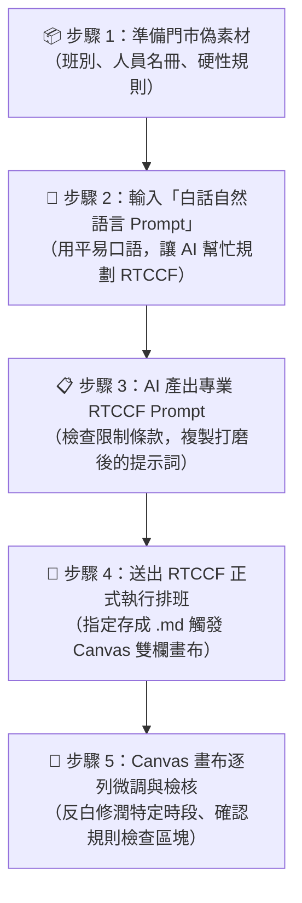

# 範例 01 ｜ 門市人力排班與規則檢核教學實戰

> 🟢 **適用代理平台**：ChatGPT Agent（推薦模式：對話 Chat / Canvas 雙欄畫布）  
> 🎯 **教學核心目標**：帶領學生掌握職場實務中最省力的「人機協商工作流」——**從零散的門市素材與「白話自然語言 Prompt」，讓 AI 自行轉換出高規格的「RTCCF 提示詞」，最後正式產出 Markdown 班表並在 Canvas 畫布進行精修！**

---

## 🧐 為什麼排班不能直接讓 AI「隨便排」？

在門市（餐飲、手搖飲、超商）排班時，新手常直接下指令：「*請幫我把這 6 個人排下週早中晚班，謝謝！*」  
結果往往慘不忍睹：
- 咖啡師被排到沒證照的時段，現場無法出單
- 有人連上晚班又接隔天早班（花班違規）
- 累計工時嚴重超出勞基法上限
- **AI 為了把表格填滿，甚至會自作聰明「硬排違規班表」！**

因此，聰明的工作者會透過**「標準化 RTCCF 提示詞」**約束 AI 的輸出行為。但學生往往覺得手寫 RTCCF 很麻煩——**這堂課的精髓，就是教學生「先讓 AI 幫你寫 RTCCF」！**

---

## 🧭 人機協商排班工作流程圖



---

## 📦 步驟 1：準備門市實戰「偽素材」（星辰咖啡站前店）

我們為課堂演練設計了一組高度逼真的模擬門市資料，完整內容收錄於同目錄下的 [門市排班偽素材.md](./門市排班偽素材.md)（含 [素材檢核表.md](./素材檢核表.md)）：

<details open>
<summary><b>📋 點擊展開：星辰咖啡（站前門市）排班偽素材重點摘要</b></summary>

- **營業時間**：週一至週日 07:00 ~ 23:00（排下週 7 天）。
- **班別定義**：
  - 早班（07:00 - 15:00，8小時）
  - 中班（11:00 - 19:00，8小時，尖峰交疊）
  - 晚班（15:00 - 23:00，8小時）
- **人員名冊與限制（6 人）**：
  - `員工 A`（全職資深）：週一至五可、早班優先、☕ 具備咖啡師證照、每週上限 40h
  - `員工 B`（全職正職）：週二至六可、輪班皆可、無證照、每週上限 40h
  - `員工 C`（全職副店）：週三至日可、輪班皆可、☕ 具備咖啡師證照、每週上限 40h
  - `員工 D`（工讀兼職）：僅週一/三/五/日可、晚班優先、無證照、每週上限 24h
  - `員工 E`（工讀兼職）：僅週末（週六/日）可、早或中班、☕ 具備咖啡師證照、每週上限 16h
  - `員工 F`（工讀兼職）：僅週二/四/六可、晚班優先、無證照、每週上限 20h
- **五大硬性營運規則**：
  1. 每班至少 2 人在勤，且每班至少 1 人有咖啡師證照。
  2. 嚴禁花班（不可連續排晚班接隔日早班，休息時間需 ≥ 11 小時）。
  3. 嚴禁超過每人每週最高工時上限。
  4. 全職員工每週至少排休 2 天。
  5. ★ **停損防呆機制**：嚴禁為了排滿而違規；人力不足時，在規則檢查區塊直接回報「人力缺口」。

</details>

---

## 💬 步驟 2：輸入「白話自然語言 Prompt」（讓 AI 產出 RTCCF）

在 ChatGPT 的對話（Chat）模式中，**學生完全不需要硬背 RTCCF 的英文框架**，直接用日常溝通的白話口吻輸入以下提示詞：

提示詞檔案：[`1-1_白話自然語言發想提示詞.txt`](./1-1_白話自然語言發想提示詞.txt)

```text
我是連鎖咖啡店的門市店長，我手上有一份下週的排班資料（包含 6 位同仁的可排班時段、證照、工時上限，以及早中晚三班的硬性規定）。

請幫我產出一份專業的 RTCCF (Role, Task, Context, Constraint, Format) 提示詞範本。
產出的 RTCCF Prompt 必須包含以下要求：
1. 讓接收提示詞的 AI 扮演專業的連鎖門市排班排程經理。
2. Context 和 Constraint 要把我手上的這批門市班別定義、人員清單與硬性排班規則完整收錄進去。
3. Format 明確要求：必須儲存為結構清晰的 Markdown 檔案（.md，可供下載），以便我稍後在 ChatGPT 右側 Canvas 雙欄畫布中逐列微調，並且必須在最後附上「規則檢查與人力缺口檢核區塊」。

以下是我手上的門市排班素材：
（直接將「門市排班偽素材.md」的內容貼在下方）
```

---

## 📋 步驟 3：AI 產出之標準 RTCCF 提示詞範本

送出上述白話需求後，ChatGPT 會自動將凌亂的門市資訊重構為結構嚴謹的專業 RTCCF Prompt：

提示詞檔案：[`1-2_AI產出之RTCCF排班提示詞.txt`](./1-2_AI產出之RTCCF排班提示詞.txt)

```markdown
## Role
你是一位具備 15 年連鎖餐飲與零售門市營運經驗的資深排程經理（Scheduling Manager），精通勞基法出勤工時規範、門市技能矩陣配置與人工作業排程防呆最佳實踐。

## Task
請依據提供的門市班別、員工名冊限制與營運規則，排定下週（週一至週日，共 7 天）的最佳門市人員排班表，並提供每人總工時結算與逐條規則合規性檢核報告。

## Context
【門市背景】
星辰咖啡（站前門市），每日營業時段為 07:00 ~ 23:00。

【班別定義】（每日共三班，每班工時 8 小時）：
- 早班：07:00 - 15:00
- 中班：11:00 - 19:00（跨尖峰支援）
- 晚班：15:00 - 23:00

【員工名冊與限制】（共 6 名同仁）：
- 員工 A（全職資深）：週一至週五可排、早班優先、具備專業咖啡師證照、每週上限 40 小時
- 員工 B（全職正職）：週二至週六可排、輪班皆可、無咖啡師證照、每週上限 40 小時
- 員工 C（全職副店）：週三至週日可排、輪班皆可、具備專業咖啡師證照、每週上限 40 小時
- 員工 D（工讀兼職）：僅週一/三/五/日可排、晚班優先、無咖啡師證照、每週上限 24 小時
- 員工 E（工讀兼職）：僅週末（週六/日）可排、早班或中班、具備專業咖啡師證照、每週上限 16 小時
- 員工 F（工讀兼職）：僅週二/四/六可排、晚班優先、無咖啡師證照、每週上限 20 小時

## Constraint
1. 【最低在勤與證照】：每個班別（早/中/晚）至少需有 2 名人員在勤，且每班至少有 1 人具備咖啡師證照。
2. 【嚴禁花班】：嚴禁同一人連續排「晚班後接隔日早班」（班次間隔必須大於等於 11 小時）。
3. 【工時防線】：嚴格禁止任何員工每週總工時超過其個人上限。
4. 【例休規範】：全職員工每週必須至少排休 2 天；兼職同仁工時依可用天數調配。
5. 【★ 絕對防呆停損機制】：嚴禁為了強行排滿班表而擅自違反上述任何一條規則。若在特定班別面臨人力無法滿足的情況，請在規則檢查中直接明確標註「人力缺口（何日、何班、缺少什麼證照或人數）」，切勿虛構違規排程。

## Format
請務必將輸出結果儲存為結構清晰、可供下載的 Markdown 檔案（.md，以便我們後續在右側 Canvas 雙欄畫布中進行逐列排程打磨與人機協同修改），全文以繁體中文輸出，並嚴格依照以下三大部分排版：
1. 【七天排班總表】：以 Markdown 表格呈現，包含欄位：日期（星期）、早班人員（含咖啡師標記）、中班人員、晚班人員、當日出勤總人數。
2. 【個人週工時結算表】：列出 6 位同仁的本週累計工時與工時上限比對（例如：員工 A：40h / 40h）。
3. 【★ 規則合規與人力缺口檢核區塊】：逐條檢核上述 5 項規則是否 100% 符合；如有無法排滿之班別，明確指出人力缺口。
```

---

## 🎨 步驟 4：送出 RTCCF 並在 Canvas 雙欄畫布協同打磨

學生只要**複製步驟 3 產出的完整 RTCCF Prompt**，在 ChatGPT（或切換至 Work 模式）送出：

1. **🚀 即時效果**：
   - 由於提示詞中指定了「儲存為 Markdown 檔案（.md）」，ChatGPT 桌面端右側會**自動彈出 Canvas 獨立畫布**！
   - 畫布中即時呈現完整的【七天排班總表】、清晰的【工時結算表】與【合規檢核區塊】。
2. **✍️ 人機協同微調示範**：
   - **情境**：檢核區塊發現「週日中班因全職例休而缺少 1 位咖啡師」。
   - **操作**：學生不需要重跑整張班表，直接用滑鼠在右側 Canvas 畫布中反白圈選【週日排班】欄位，下達微調指令：
     > *「員工 E 週日可配合提早支援中班，請將員工 E 調至週日中班，並重新檢算員工 E 的工時。」*
   - **成效**：右側 Canvas 畫布僅精準替換該儲存格與工時，其餘排班毫無變動、絕不洗版！

---

## 🎓 課堂教學核心總結（給學生帶得走的心法）

1. **先白話發想，再請 AI 立綱**：面對複雜業務規則，先用自然語言跟 AI 溝通規格，由 AI 幫你轉成精密的 RTCCF。
2. **必加「防呆停損」條款**：排班與資源分配任務，務必加上「允許 AI 說做不到（回報人力缺口）」的指令，避免模型產生假性滿足幻覺。
3. **Markdown 是畫布與存檔的敲門磚**：指令內指定存成 Markdown 檔，即可自動啟用雙欄 Canvas 畫布，享受「指哪改哪」的無損協作體驗！

---

[← 返回實戰範例庫總覽](../README.md) ｜ [前往 ChatGPT Canvas 雙欄畫布詳解](../../../chatGPT/03_Canvas/README.md)
