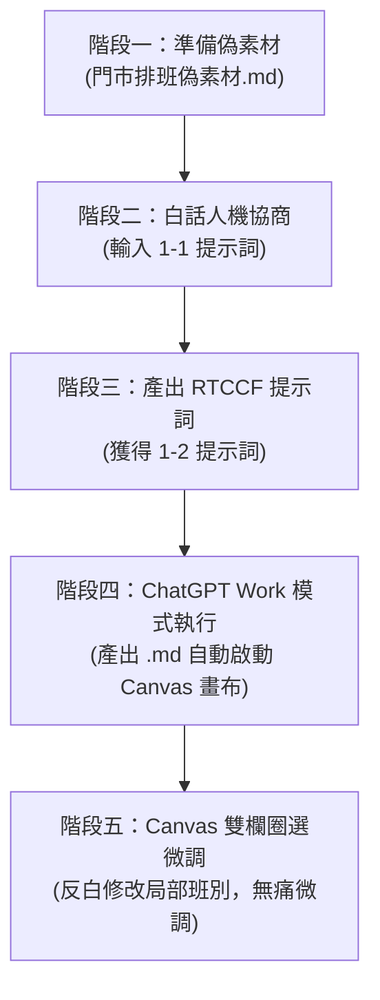

# 實戰範例 01：便利超商門市人力排班與規則檢核

> 🟢 **採用代理平台**：ChatGPT Agent 平台  
> 🛠️ **建議執行模式**：**Work 模式**（當 AI 儲存檔案為 `.md` 時，系統將自動開啟 **Canvas 雙欄互動畫布**，方便即時檢核與圈選微調）

---

## 🎯 案例情境與教學目標

在台灣，連鎖便利商店（如 7-ELEVEN、全家等）是標準的 **24 小時三班制** 營運環境。門市店長在每週排班時，面臨高度複雜的雙重挑戰：
1. **台灣《勞動基準法》硬性規範**：
   * **輪班間隔 11 小時**：絕對嚴禁「晚班接早班」（前一天 23:00 下班，隔天 07:00 上班，中間僅休息 8 小時，違法重罰）。
   * **一例一休**：每 7 天必須有 1 天例假與 1 天休息日，不得連續工作超過 6 天。
   * **工時上限**：兼職人員每週打工時數上限管控。
2. **超商門市現實營運痛點**：
   * **24 小時守護與大夜防開天窗**：大夜班必須由具備獨立當班資格的正職留守；當專職大夜排休時，店長或幹部必須無縫接替。
   * **尖峰雙人制**：早晨捷運通勤早餐咖啡尖峰、晚間下班人潮與網購包裹取貨巔峰，皆需雙人當值，否則現場直接癱瘓。
   * **兼職課表限制**：大學生工讀生平日白天有課或補習，只能排晚班或週末。

本單元的**核心教學目標**，是帶領學生體驗**「人機協商三部曲」**：
* ❌ **傳統痛點**：不要讓學生手刻複雜生硬的提示詞。
* ✅ **高效人機協商**：
  1. 學生拿出門市需求與偽素材。
  2. 用**「一般白話自然語言」**請 AI 幫忙架構出專業的 **RTCCF 提示詞**。
  3. 將 RTCCF 提示詞投入 ChatGPT，產出儲存為 `.md` 檔案觸發 **Canvas 雙欄畫布**，進行直覺的「反白圈選微調」。

---

## 📂 教學模組與素材清單

本資料夾內已備妥完整教學檔案，學生可依序使用：

| 檔案名稱 | 類型 | 說明 |
| :--- | :--- | :--- |
| [`門市排班偽素材.md`](./門市排班偽素材.md) | 偽素材 | 「便利超商 捷運站前門市」6 位員工、三班制、法規限制與出勤限制之真實假資料。 |
| [`1-1_白話自然語言發想提示詞.txt`](./1-1_白話自然語言發想提示詞.txt) | 提示詞 (輸入) | 學生第一步發送給 AI 的白話指令，請 AI 將素材轉化為 RTCCF 框架。 |
| [`1-2_AI產出之RTCCF排班提示詞.txt`](./1-2_AI產出之RTCCF排班提示詞.txt) | 提示詞 (成果) | AI 協商產出的標準 RTCCF 排班提示詞，可直接於 ChatGPT 執行。 |
| [`素材檢核表.md`](./素材檢核表.md) | 參考清單 | 檢驗門市素材是否備妥（工時、輪班間隔、兼職限制等關鍵項）。 |

---

## 🚀 完整四階段教學工作流（Step-by-Step）

### 階段一：準備偽素材
打開 [`門市排班偽素材.md`](./門市排班偽素材.md)，這是模擬台北某捷運站出口 24 小時超商一週（10/12～10/18）的真實數據：
* 6 名員工：A 店長、B 副店長、C 專職大夜、D 大三工讀生、E 大四工讀生、F 假日兼職。
* 三大班別：早班 D (07-15)、晚班 E (15-23)、大夜班 N (23-07)。

---

### 階段二：白話人機協商（自然語言 ➔ RTCCF）
請學生在任何 AI 對話框（如 ChatGPT 免費版、GPT-4o 或 Claude）輸入 [`1-1_白話自然語言發想提示詞.txt`](./1-1_白話自然語言發想提示詞.txt) 的內容，並附上偽素材。

> **學生輸入的白話範例：**
> *「我是超商捷運門市店長，我們店是三班制 24 小時營業。常常因為勞基法輪班必須隔 11 小時、不能晚班接早班、大夜週五請假不能開天窗等一堆規定排到頭昏眼花。這是我店裡的資料（附上偽素材），請扮演 AI 提示詞專家，幫我用 RTCCF 框架設計一份專業排班提示詞，並指定產出為 Markdown 檔案，方便我在 Canvas 畫布微調。」*

---

### 階段三：獲取專業 RTCCF 排班提示詞
AI 將會迅速整理出結構完整的 RTCCF 提示詞（如 [`1-2_AI產出之RTCCF排班提示詞.txt`](./1-2_AI產出之RTCCF排班提示詞.txt)）：
* **[Role]**：連鎖便利商店資深營運店長與排班專家。
* **[Task]**：排定一週 24 小時門市輪值班表並執行合規檢核。
* **[Context]**：超商三班制、通勤尖峰與現有人力名單。
* **[Constraint]**：嚴守 11 小時輪班間隔（嚴禁花班/晚接早）、大夜防開天窗、早晚尖峰雙人制、一例一休、工時上限。
* **[Format]**：儲存為 `超商門市一週排班與檢核表.md`，啟動 Canvas 雙欄畫布。

---

### 階段四：在 ChatGPT Work 模式執行排班
1. 開啟 ChatGPT，切換至 **Work 模式**。
2. 複製步驟三產出的 RTCCF 提示詞貼入並送出。
3. **體驗亮點**：
   * AI 將會生成一張完整的「門市一週排班矩陣總表」。
   * AI 會附上「勞基法合規檢核報告」，針對每一位員工核對是否符合「11 小時休息間隔」、「每 7 天連上不超過 6 天」等法規。
   * 因為在提示詞中明確指定了「儲存為 Markdown 檔案（.md）」，ChatGPT 畫面**右側會立即滑出獨立的 Canvas 雙欄編輯畫布**！

---

### 階段五：Canvas 畫布實戰微調（教學核心體驗）

當右側 Canvas 畫布展開後，老師可引導學生進行**「局部圈選微調」**，不必整篇重打：

1. **情境模擬：週日突發代班微調**：
   * 在右側畫布中，找到週日（10/18）的排班表格。
   * 學生用滑鼠直接**圈選反白**「週日晚班的員工名單」。
   * 點選跳出的浮動對話框（或直接在左側下指令）：  
     *「工讀生 D 週日臨時想跟學校出遊，請將週日晚班調整為由假日兼職 F 與副店長 B 搭配，並重新檢核 F 的每週總工時是否違規。」*
2. **即時局部修正**：
   * ChatGPT 會直接在右側畫布上**只替換該儲存格並重新計算週日人數**，左側對話框則迅速確認 F 的累計工時為 16 小時（剛好符合上限）。
   * 學生能深刻體會到：**Canvas 雙欄微調徹底解決了傳統對話「改一個字就要重印整篇 2000 字表格」的巨大痛點！**
