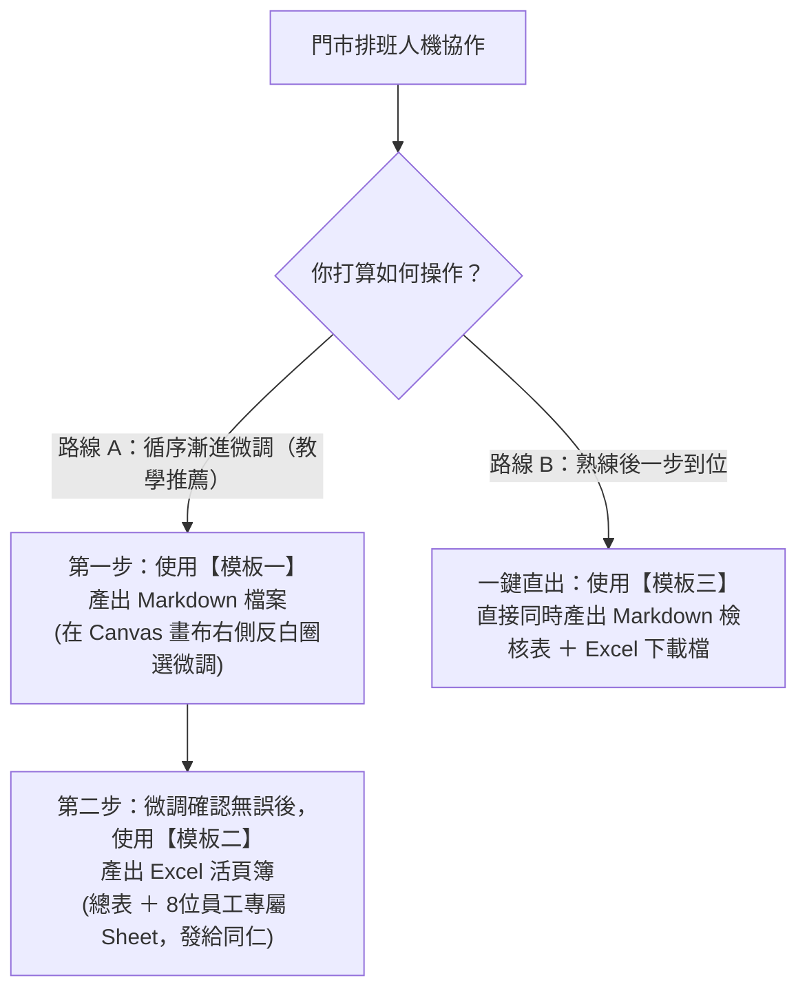

# 🏪 門市排班標準輸出格式規範模板（含 Placeholder 佔位符）

> 💡 **核心概念**：在企業落地應用中，最忌諱 AI 每次產出的欄位名稱、順序或表格結構不一致。  
> 本檔案定義了標準的 **Placeholder（佔位符，如 `{{變數名稱}}`）**，用來「框定」AI 的輸出規格，確保未來無論哪家門市、哪一週排班，輸出的格式皆 **100% 絕對一致**。

---

## 🧭 一張圖搞懂：為什麼有這 3 個模板？我該如何使用？

排班在真實職場中分為**「預覽微調」**與**「正式發布」**兩個關鍵階段，因此模板設計了對應的使用情境：



### 📋 三個模板定位與選擇對照表

| 模板編號與名稱 | 適用教學階段 | 為什麼需要它？（使用目的） | 如何使用？（操作方式） | AI 預期產出物 |
| :--- | :---: | :--- | :--- | :--- |
| **【模板一】<br>Markdown 畫布微調模板** | **階段四～五**<br>(排班與微調) | 排班剛出爐時常有突發調班，需要先在螢幕右側 **Canvas 畫布** 上反白圈選微調，此時**不要直接產 Excel**（因為在 Excel 裡改字無法享受 AI 畫布微調的便利）。 | 將模板貼給 AI，約束 AI 輸出的 Markdown 表格與法規檢核結構。 | 產出 `.md` 檔案，畫面右側自動滑出 Canvas 雙欄畫布。 |
| **【模板二】<br>Excel 多工作表發布模板** | **階段六**<br>(正式發布) | 當 Canvas 畫布上的班表**已經確認定案**，店長需要正式發布給全店。員工用手機看大總表容易看錯，因此需要產生「總表 ＋ 每位員工獨立 Sheet（含日期）」的試算表。 | 在確認班表後貼入對話框，指示 AI 透過 Python 產出 `.xlsx`。 | 產出可下載的 `.xlsx` 檔案（包含 1 張總表 ＋ 8 張員工專屬 Sheet）。 |
| **【模板三】<br>一鍵直出雙成果模板** | **進階快速通道**<br>(一步到位) | 熟練店長不需要在畫布上慢慢看，想要在同一個指令中，一次性同時取得「Markdown 檢核表」與「Excel 下載連結」。 | 排班時直接附在 Prompt 後方一次送出。 | 同時產出 Markdown 檢核報告與 Excel 檔案下載連結。 |

---

## 📋 模板一：Markdown 畫布微調模板（階段四～五專用）

> 🎯 **使用時機**：執行 **階段四（生成排班）** 與 **階段五（Canvas 微調）** 時使用。  
> 📌 **操作方式**：點擊右上角複製後貼給 AI，要求 AI 產出的 Markdown 檔案必須嚴格填入此骨架，方便在右側 Canvas 畫布中圈選反白修改。

```markdown
【請嚴格套用以下 Markdown 格式輸出門市排班表，不得擅自刪減或更動欄位名稱】：

# 🏪 超商門市一週排班與檢核表（{{門市名稱}} 24H）

> 📅 **排班週期**：{{排班開始日期}}（週一）～ {{排班結束日期}}（週日）  
> 🏢 **門市型態**：24 小時全年無休超商（{{門市特色，如：捷運站前門市}}）  
> 👥 **人力編制**：共 {{總人數}} 人（正職 {{正職人數}} 人、兼職 {{兼職人數}} 人）  
> 📌 **本週排班目標**：全週營運平穩達標，全週缺額精準控制在 {{目標缺額人次}} 人次以內。

---

## 📋 一、門市一週排班矩陣總表

* 班別代號說明：
  * **D (早班)**：{{早班時段，如 07:00 – 15:00}}（8小時）
  * **E (晚班)**：{{晚班時段，如 15:00 – 23:00}}（8小時）
  * **N (大夜班)**：{{大夜時段，如 23:00 – 07:00}}（8小時）
  * **休**：例假 / 休息日 / 特休 / 課務免出勤

| 員工代號 | 職稱 / 身分 | {{週一日期}} (一) | {{週二日期}} (二) | {{週三日期}} (三) | {{週四日期}} (四) | {{週五日期}} (五) | {{週六日期}} (六) | {{週日日期}} (日) | 本週工時 | 出勤天數 |
| :--- | :--- | :---: | :---: | :---: | :---: | :---: | :---: | :---: | :---: | :---: |
| **{{員工1代號}}** | {{職稱}} | {{班別}} | {{班別}} | {{班別}} | {{班別}} | {{班別}} | {{班別}} | {{班別}} | {{總工時}} H | {{出勤天數}} 天 |
| **{{員工2代號}}** | {{職稱}} | {{班別}} | {{班別}} | {{班別}} | {{班別}} | {{班別}} | {{班別}} | {{班別}} | {{總工時}} H | {{出勤天數}} 天 |
| ... | ... | ... | ... | ... | ... | ... | ... | ... | ... | ... |

---

## 📊 二、每日各時段當值人數與缺額分析表

門市需求標竿：
* 早班 (D)：平日一～五至少 {{平日早班需求人數}} 人；週末六、日維持 {{週末早班需求人數}} 人
* 晚班 (E)：每日固定至少 {{晚班需求人數}} 人（網購取件、下班尖峰）
* 大夜 (N)：每日固定 {{大夜需求人數}} 人（具大夜資格正職）

| 日期 | 早班 (D) 當值名單 | 晚班 (E) 當值名單 | 大夜 (N) 當值名單 | 當日總人數 | 人力狀態檢核 | 缺額備註與調整建議 |
| :--- | :--- | :--- | :--- | :---: | :---: | :--- |
| **{{週一日期}} (一)** | {{早班名單}} ({{人數}}人) | {{晚班名單}} ({{人數}}人) | {{大夜名單}} ({{人數}}人) | {{總人數}} 人 | {{✅ 完美達標 / ⚠️ 缺額標示}} | {{備註說明}} |
| **{{週二日期}} (二)** | {{早班名單}} ({{人數}}人) | {{晚班名單}} ({{人數}}人) | {{大夜名單}} ({{人數}}人) | {{總人數}} 人 | {{✅ 完美達標 / ⚠️ 缺額標示}} | {{備註說明}} |
| **{{週三日期}} (三)** | {{早班名單}} ({{人數}}人) | {{晚班名單}} ({{人數}}人) | {{大夜名單}} ({{人數}}人) | {{總人數}} 人 | {{✅ 完美達標 / ⚠️ 缺額標示}} | {{備註說明}} |
| **{{週四日期}} (四)** | {{早班名單}} ({{人數}}人) | {{晚班名單}} ({{人數}}人) | {{大夜名單}} ({{人數}}人) | {{總人數}} 人 | {{✅ 完美達標 / ⚠️ 缺額標示}} | {{備註說明}} |
| **{{週五日期}} (五)** | {{早班名單}} ({{人數}}人) | {{晚班名單}} ({{人數}}人) | {{大夜名單}} ({{人數}}人) | {{總人數}} 人 | {{✅ 完美達標 / ⚠️ 缺額標示}} | {{備註說明}} |
| **{{週六日期}} (六)** | {{早班名單}} ({{人數}}人) | {{晚班名單}} ({{人數}}人) | {{大夜名單}} ({{人數}}人) | {{總人數}} 人 | {{✅ 完美達標 / ⚠️ 缺額標示}} | {{備註說明}} |
| **{{週日日期}} (日)** | {{早班名單}} ({{人數}}人) | {{晚班名單}} ({{人數}}人) | {{大夜名單}} ({{人數}}人) | {{總人數}} 人 | {{✅ 完美達標 / ⚠️ 缺額標示}} | {{備註說明}} |

---

## ⏱️ 三、個人累計工時與出勤天數統計表

| 員工代號 | 身份類別 | 法定/契約工時上限 | 本週排班工時 | 出勤天數 | 連續出勤上限 | 本週最長連續上班天數 | 工時與休假狀態 |
| :--- | :--- | :---: | :---: | :---: | :---: | :---: | :---: |
| **{{員工代號}}** | {{身份}} | {{上限}} 小時 | {{累計}} 小時 | {{天數}} 天 | ≤ 6 天 | {{最長連續}} 天 | {{✅ 完全合規 / ⚠️ 違規警告}} |

---

## ⚖️ 四、勞動基準法與超商營運規則檢核報告

1. **輪班間隔 11 小時檢核（嚴禁晚接早 / 花班）**：
   * {{逐一檢核員工名單之換班間隔，註明下班至上班相隔時數}}
   * **結論**：{{零違規 / 違規處說明}}
2. **24 小時大夜守護防開天窗檢核**：
   * {{大夜值班正職名單、專職大夜排休時之幹部代班確認}}
   * **結論**：{{大夜絕不開天窗說明}}
3. **一例一休與連續工作天數檢核**：
   * {{每位員工 7 天內休假天數確認，連續上班天數未超過 6 天}}
4. **尖峰雙人制與缺額分析**：
   * {{平日早班與每日晚班雙人當值確認，若有缺額條列缺口日期與調整建議}}
```

---

## 📋 模板二：Excel 多工作表發布模板（階段六專用）

> 🎯 **使用時機**：在 Canvas 畫布上**微調確認無誤後**，進入 **階段六（正式發布）** 時使用。  
> 📌 **操作方式**：點擊右上角複製後貼給 AI，指示 AI 透過後台 Python（openpyxl）環境生成具備「門市排班總表」與「8 位員工專屬 Sheet（含日期）」的 Excel 活頁簿檔案供下載發布。

```markdown
【請嚴格遵守下列 Excel 活頁簿（.xlsx）架構與欄位規範，使用 Python openpyxl 生成檔案】：

檔案名稱：{{門市名稱}}_排班發布表_{{排班開始日期}}-{{排班結束日期}}.xlsx

一、工作表清單（多 Sheet 架構）
1. 第一個工作表名稱：門市排班總表
2. 後續工作表名稱（依員工代號與職稱命名，每人獨立 1 個 Sheet）：
   - {{員工1代號}}_{{職稱}}
   - {{員工2代號}}_{{職稱}}
   - ...（共 {{N}} 位員工）

二、第一個工作表【門市排班總表】欄位與格式
- 標題列：
  | 員工姓名與代號 | 職稱 / 身分 | {{週一日期}}(週一) | {{週二日期}}(週二) | {{週三日期}}(週三) | {{週四日期}}(週四) | {{週五日期}}(週五) | {{週六日期}}(週六) | {{週日日期}}(週日) | 本週累計工時 | 本週出勤天數 |
- 資料列：列出每位同仁 7 天出勤班別（D、E、N、休），工時與天數欄位使用 Excel 公式（如 =COUNTIF(...)、=SUM(...)）加總。
- 統計與驗證列（表尾）：
  * 早班 (D) 當值人數（需 {{平日早班人數}} 人）
  * 晚班 (E) 當值人數（需 {{晚班人數}} 人）
  * 大夜 (N) 當值人數（需 {{大夜人數}} 人）
  * 缺額檢核狀態（標記：達標 或 ⚠️ 缺額）

三、每位員工之獨立專屬工作表【{{員工代號}}_{{職稱}}】欄位規範
每個專屬 Sheet 必須有清楚的 7 天出勤明細，每一橫列代表一天，必備以下 7 大標準欄位（必須包含日期欄位）：

| 欄位序號 | 欄位名稱 | 內容填寫規格範例 |
| :---: | :--- | :--- |
| 1 | **日期** | {{YYYY/MM/DD}}（例如：2026/10/12） |
| 2 | **星期** | 週一、週二、週三、週四、週五、週六、週日 |
| 3 | **班別代碼** | D / E / N / 休 |
| 4 | **班別名稱** | 早班 / 晚班 / 大夜班 / 例休 / 特休 |
| 5 | **出勤起訖時段** | 07:00 – 15:00 / 15:00 – 23:00 / 23:00 – 07:00 / 免出勤 |
| 6 | **當日工時** | 8 小時 / 0 小時 |
| 7 | **當班工作重點與營運注意事項** | 填入該班別主要工作（如：捷運通勤早餐咖啡尖峰、日配鮮食進貨驗收、全店大清潔消毒、店主管例會排休等） |

- 工作表表尾（第 8 列）：
  * 包含【本週合計】加總列：使用 SUM 公式加總「本週總工時（小時）」與 COUNTIF 公式統計「本週出勤天數（天）」，並備註法定工時上限與合規狀態。

四、視覺設計與排版樣式（Styling Rules）
1. 表頭格式：底色深海軍藍 (#1F4E79) 或 超商深綠 (#1E5631)，文字白色粗體，置中對齊。
2. 班別底色醒目標記：
   - 早班 (D)：淺藍色底 (#D9E1F2)
   - 晚班 (E)：淺橘色底 (#FCE4D6)
   - 大夜 (N)：深灰色底 (#595959)，文字白色粗體
   - 例假 / 特休 (休)：柔和淺綠底 (#E2EFDA)
   - 缺額警示：淺紅底深紅字 (#F8CBAD)
3. 儲存格對齊與框線：文字水平垂直置中，全部套用細框線（Thin Borders）。
4. 欄寬自適應：程式必須自動調整欄寬（Auto-fit Columns），避免文字被截斷或出現 ###。
```

---

## 📋 模板三：一鍵直出雙成果模板（進階老手專用）

> 🎯 **使用時機**：當你已經熟悉排班流程，且門市人力穩定、**不需要在 Canvas 畫布上逐步微調**時使用。  
> 📌 **操作方式**：將此指令直接加在排班提示詞的末尾，一次性要求 AI 同時輸出 Markdown 檢核表與 Excel 下載連結。

```markdown
請依據上述的門市人力資料與出勤條件，嚴格依照以下兩項規範一次性產出完整成果：

1. 【線上檢核表】：先產出名為 `超商門市一週排班與檢核表_{{排班開始日期}}-{{排班結束日期}}.md` 的 Markdown 檔案，結構必須 100% 依循上方【模板一】之格式（含門市排班總表、每日人數分析表、個人工時統計表與四大法規檢核報告）。
2. 【員工發布檔】：同時利用 Python（openpyxl）直接生成一份名為 `超商門市_排班發布表_{{排班開始日期}}-{{排班結束日期}}.xlsx` 的 Excel 活頁簿檔案，結構必須 100% 依循上方【模板二】之格式（Sheet 1 為門市總表，Sheet 2～9 為每位員工各 1 個專屬 Sheet，且每個 Sheet 均具備「日期」、「星期」、「班別代碼」、「出勤時間」、「工作重點」等 7 大欄位與表尾公式加總），並提供直接下載連結。
```
