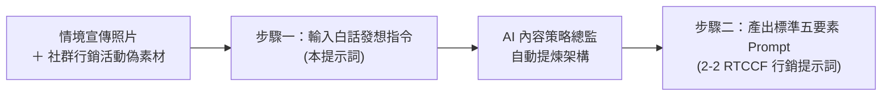

# 步驟一：白話自然語言發想提示詞（人機協作）

> 💡 **教學目標**：打破「多平台文案必須一字一句痛苦手寫」的傳統束縛！本步驟引導學員扮演「日日好日咖啡社群行銷企劃」，用最直覺的**日常白話自然語言**，向 AI 描述宣傳情境照片、新產品核心賣點與品牌調性，請 AI 擔任內容策略總監，自動提煉架構出標準的 **RTCCF 多通路提示詞框架**。  
> 🛠️ **適用平台**：ChatGPT 任何對話視窗、Claude 或 Gemini。

---

## 🎯 階段流程圖



---

## 📋 提示詞複製專區

請點擊下方區塊右上角複製內容貼入 AI 對話框，並將 [`社群行銷活動偽素材.md`](./社群行銷活動偽素材.md) 的內容貼在指定位置：

<details open>
<summary><b>📋 點擊展開／一鍵複製：白話發想提示詞指令</b></summary>

```text
我是「日日好日咖啡」的社群行銷企劃。我們下週要推出秋季限定新品「焦糖焙香燕麥拿鐵」，今天攝影師剛把拍攝好的宣傳情境照交給我（照片是一杯在木桌上的拉花陶杯拿鐵，旁邊放著焙茶茶葉木匙，光線很溫暖生活感）。

我現在非常頭痛，因為老闆要我在今天之內，一次把所有宣傳通路的內容全生出來，包括：
1. IG 貼文（要生活感、口語、有 Hashtag）
2. FB 貼文（要故事化、走心、帶出研發辛酸與換季情感）
3. 官網文章標題（要 3 個不同切角，好挑選）
4. 短影音 Reels/Shorts 分鏡腳本（要 15 秒快節奏版跟 30 秒完整說明版，含畫面運鏡與口播詞）
5. 社群封面圖文案（不能超過 12 個字，要吸睛）

我每次自己切換平台格式都寫得千篇一律，而且我們品牌嚴格禁止像「全台最強」、「秒殺必喝」這種誇大俗氣的詞，必須維持像好朋友說話的溫暖質感。

這是我手邊的產品與品牌偽素材：
--------------------------------------------------
[請在此處完整貼入「社群行銷活動偽素材.md」的全部文字內容]
--------------------------------------------------

我想請你扮演「資深社群內容策略師兼 AI 提示詞專家」。請依據上述的素材與痛點，幫我設計一份結構嚴密、符合「RTCCF 提示詞框架」（Role 角色、Task 任務、Context 背景脈絡、Constraint 限制條件、Format 格式規範）的完整提示詞。

這份 RTCCF 提示詞是要給 ChatGPT 執行的，要求它產出結構清晰的 Markdown 檔案（檔名：秋季新品_焦糖焙香燕麥拿鐵_社群全格式素材包.md），以便我在 Canvas 雙欄畫布上針對不同平台的文案直接進行反白微調！

請直接產出該份標準 RTCCF 提示詞內容即可，不要有多餘的廢話。
```
</details>

---

## 💡 教師課堂引導要點

1. **為什麼不直接寫多平台貼文？**  
   若直接請 AI 寫文，AI 往往會給出風格混雜、各平台調性相同的平庸文字。先請 AI 設計 **RTCCF 提示詞**，能確保在「角色層次」、「受眾心理」與「品牌禁用詞邊界」上預先設下防線。
2. **產出銜接**：  
   AI 回應產出的提示詞，即為 [`2-2_AI產出之RTCCF行銷提示詞.md`](./2-2_AI產出之RTCCF行銷提示詞.md)，可直接進入下一階段執行多格式產出。
