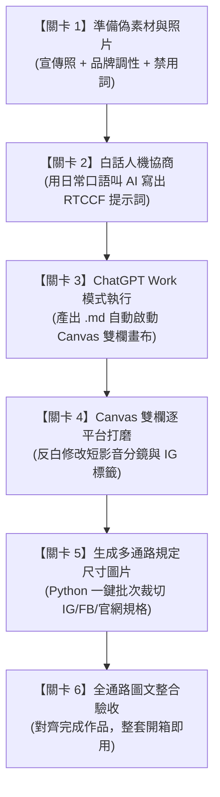

# 實戰範例 02：社群行銷素材多格式整合產出

> 🟢 **採用代理平台**：ChatGPT Agent 平台  
> 🛠️ **建議執行模式**：**Work 模式**（當 AI 儲存檔案為 `.md` 時，系統將自動開啟 **Canvas 雙欄互動畫布**，學員可針對單一平台文案或短影音腳本局部反白微調，完全不影響其他已完成的通路內容）

---

## 🏆 最終完成作品

> 📥 **全套完成作品線上檢視與下載**：  
> * 📝 **跨通路文案整合包**：👉 [**`秋季新品_焦糖焙香燕麥拿鐵_社群全格式素材包.md`**](./秋季新品_焦糖焙香燕麥拿鐵_社群全格式素材包.md)  
> * 🖼️ **各大平台官方規定尺寸圖片**：  
>   * 📱 **Instagram 貼文**（1:1 正方形・1080×1080）：👉 [**`新品上市宣傳圖_IG貼文_1080x1080.jpg`**](./新品上市宣傳圖_IG貼文_1080x1080.jpg)  
>   * 📱 **Instagram / FB 限動 & Reels**（9:16 直式滿版・1080×1920）：👉 [**`新品上市宣傳圖_IG限動Reels_1080x1920.jpg`**](./新品上市宣傳圖_IG限動Reels_1080x1920.jpg)  
>   * 💻 **Facebook 橫向貼文**（1.91:1 橫式・1200×630）：👉 [**`新品上市宣傳圖_FB貼文_1200x630.jpg`**](./新品上市宣傳圖_FB貼文_1200x630.jpg)  
>   * 🌐 **官方網站文章封面 / Hero Banner**（16:9 寬螢幕・1920×1080）：👉 [**`新品上市宣傳圖_官網Banner_1920x1080.jpg`**](./新品上市宣傳圖_官網Banner_1920x1080.jpg)  
> 
> *（這是本單元經過「白話發想 ➔ RTCCF 人機協商 ➔ Canvas 雙欄畫布微調 ➔ Python 自動化圖片尺寸適配」後全自動產出的圖文一體化行銷落地成果）*

---

## 🎯 案例情境與核心學習價值

當品牌行銷企劃收到新產品的宣傳情境照片後，面臨最大的雙重困境是：
1. **文案格式破碎**：同一套素材，要花好幾倍的時間改編成 IG（生活感）、FB（故事走心）、官網（SEO 標題）與短影音（黃金 3 秒分鏡），且極易踩到廉價誇大的行銷禁用詞（如「全台最強」、「秒殺必喝」）。
2. **圖片尺寸各異**：攝影師只給了一張 1:1 的宣傳原照，但在 IG 貼文、IG 限動 Reels、FB 貼文與官網橫幅中，各大平台規定的長寬比例完全不同。若手動用 Photoshop 裁切 4 次既耗時又容易失真破版。

> 💡 **本單元核心精神**：  
> 拒絕重複手刻文案與手動拉參考線裁圖！我們將帶領學生體驗**「單一視覺素材 ➔ 白話發想 ➔ RTCCF 文案產出 ➔ Canvas 畫布微調 ➔ Python 一鍵生成全平台規定尺寸圖片」**的現代化全自動行銷閉環。

---

## 🧭 5 分鐘通關地圖（SOP 流程總覽）



---

## 🚀 學生手把手實戰操作手冊（6 步通關）

---

### 🟢 關卡 1：準備偽素材與宣傳照片

* 📌 **操作動作**：閱讀並複製秋季新品行銷企劃資料，並檢視宣傳照片。這是模擬台灣生活風格咖啡品牌「日日好日咖啡（Daily Roast Coffee）」的真實企劃素材。
* 📂 **對應檔案**：[`社群行銷活動偽素材.md`](./社群行銷活動偽素材.md) ｜ 📷 實體照片：[`新品上市宣傳圖.jpg`](./新品上市宣傳圖.jpg)

<details open>
<summary><b>📋 點擊展開／一鍵複製：社群行銷活動偽素材（品牌設定、新品 USP 與 Few-Shot 範本）</b></summary>

```markdown
【日日好日咖啡 秋季新品行銷活動偽素材】

一、宣傳主視覺照片描述
- 主體：特製日式手作陶杯盛裝熱拿鐵，奶泡綿密，有精緻鬱金香拉花。
- 陪襯物：淺色天然橡木桌面、一把盛裝深焙焙茶葉（Hojicha）的木匙。
- 氛圍：溫暖柔和的早晨窗光，日系極簡生活微光感。

二、品牌基本設定與調性
- 品牌名稱：日日好日咖啡（Daily Roast Coffee）
- 品牌定位：城市裡的日常微光，專注自烘精品豆與植物奶特調的質感咖啡店。
- 目標受眾：25-40 歲上班族、文青族群、乳糖不耐症者、重視生活質感的都市人。
- 品牌語氣：溫暖親切、像懂咖啡的好朋友在說話，不居高臨下、不賣弄艱深術語。
- 行銷禁用詞（嚴禁出現）：全台最強、地表最好喝、秒殺搶購、保證有效、必喝神作、打趴星巴克、超越大品牌。

三、本次新品核心資訊
- 品名：秋季限定・焦糖焙香燕麥拿鐵（Hot / Iced）
- 核心賣點：
  1. 靜岡深焙煎茶慢火翻炒，萃取炭焙茶香，低咖啡因不澀口。
  2. 搭配 OATLY 咖啡師燕麥奶，65°C 精準奶溫，乳糖不耐友善，口感如絲絨。
  3. 主廚手工熬煮蔗糖焦糖露，點綴焦香微甜，尾韻溫潤。
- 優惠活動：10/15～10/25 新品享「第二杯 79 折」；自備環保杯再折 5 元。
- 販售門市：全台 8 間直營門市同步供應。

四、歷史高成效貼文風格參考（Few-Shot 學習）
- IG 風格：短文字、生活情緒投射、排版空行乾淨、精選 6-8 個生活感 Hashtag。
- FB 風格：故事化長文敘事、研發幕後挫折、換季氣候細節、真誠對話感。
```
</details>

* 🔍 **成果檢查點**：
  * [ ] 看到宣傳照片的視覺重點（陶杯、拉花、焙茶木匙、晨光）。
  * [ ] 記住三大賣點（靜岡深焙茶香、OATLY 燕麥奶 65 度、手工焦糖露）。
  * [ ] 牢記 **嚴格禁用詞**（不可出現「全台最強」、「秒殺必喝」等）。

---

### 🟢 關卡 2：白話人機協商（叫 AI 幫你寫出專業 RTCCF 提示詞）

* 📌 **操作動作**：打開任何 AI 對話框（如 ChatGPT 免費版、GPT-4o、Claude 或 Gemini），將下方的「白話發想指令」連同「偽素材」一起貼入送出。
* 📂 **對應檔案**：[`2-1_白話自然語言發想提示詞.md`](./2-1_白話自然語言發想提示詞.md)

<details open>
<summary><b>📋 點擊展開／一鍵複製：白話發想提示詞指令</b></summary>

```text
我是「日日好日咖啡」的社群行銷企劃。我們下週要推出秋季限定新品「焦糖焙香燕麥拿鐵」，今天攝影師剛把拍攝好的宣傳情境照交給我（照片是一杯在木桌上的拉花陶杯拿鐵，旁邊放著焙茶茶葉木匙，光線很溫暖生活感）。

我現在非常頭痛，因為老闆要我在今天之內，一次把所有宣傳通路的內容全生出來，包括：
1. IG 貼文（要生活感、口語、有 Hashtag）
2. FB 貼文（要故事化、走心、帶出研發辛酸與換季情感）
3. 官網文章標題（要 3 個不同切角，好挑選）
4. 短影音 Reels/Shorts 分鏡腳本（需符合 Google Flow / Veo 影片規格：精準支援 4 秒 / 6 秒 / 8 秒模組化單鏡頭規格，包含 4s 痛點吸睛版、6s 職人敘事版與 8s 電影感長鏡頭版，含 I2V/T2V/Extend 模式、中文畫面運鏡、口播詞、字卡與 Google Flow 專用英文提示詞 Prompt）
5. 社群封面圖文案（不能超過 12 個字，要吸睛）

我每次自己切換平台格式都寫得千篇一律，而且我們品牌嚴格禁止像「全台最強」、「秒殺必喝」這種誇大俗氣的詞，必須維持像好朋友說話的溫暖質感。

這是我手邊的產品與品牌偽素材：
--------------------------------------------------
[請在此處貼入關卡 1 複製的偽素材內容]
--------------------------------------------------

我想請你扮演「資深社群內容策略師兼 AI 提示詞專家」。請依據上述的素材與痛點，幫我設計一份結構嚴密、符合「RTCCF 提示詞框架」（Role 角色、Task 任務、Context 背景脈絡、Constraint 限制條件、Format 格式規範）的完整提示詞。

這份 RTCCF 提示詞是要給 ChatGPT 執行的，要求它產出結構清晰的 Markdown 檔案（檔名：秋季新品_焦糖焙香燕麥拿鐵_社群全格式素材包.md），以便我在 Canvas 雙欄畫布上針對不同平台的文案直接進行反白微調！

請直接產出該份標準 RTCCF 提示詞內容即可，不要有多餘的廢話。
```
</details>

* 🔍 **成果檢查點**：
  * [ ] AI 回應產出一份包含 `[Role]`、`[Task]`、`[Context]`、`[Constraint]`、`[Format]` 的結構化提示詞。
  * [ ] 產出的提示詞結構與本資料夾中的 [`2-2_AI產出之RTCCF行銷提示詞.md`](./2-2_AI產出之RTCCF行銷提示詞.md) 完全呼應。

---

### 🟢 關卡 3：ChatGPT Work 模式多格式產出（喚醒 Canvas 雙欄畫布）

* 📌 **操作動作**：
  1. 開啟 **ChatGPT** 對話視窗。
  2. 確認右上角切換至 **Work 模式**。
  3. 複製下方標準 RTCCF 行銷提示詞，直接貼入對話框發送！
* 📂 **對應檔案**：[`2-2_AI產出之RTCCF行銷提示詞.md`](./2-2_AI產出之RTCCF行銷提示詞.md)

<details open>
<summary><b>📋 點擊展開／一鍵複製：標準 RTCCF 行銷提示詞（直接貼入 ChatGPT）</b></summary>

```markdown
## Role

你是一位精通跨通路社群內容策略的「資深生活風格品牌行銷總監」與「短影音分鏡企劃師」。你擅長根據品牌調性（Brand Tone of Voice），將單一產品核心賣點無縫轉換為符合 IG、Facebook、官網及短影音（Reels / Shorts）受眾心理的多格式內容包。

## Task

請依據提供的「日日好日咖啡（Daily Roast Coffee）」秋季新品素材，一次產出全套多格式社群行銷內容包，包含：
1. Instagram 沉浸生活感貼文（繁體中文，含精選 Hashtag）
2. Facebook 故事化走心長貼文（情感共鳴、研發幕後敘事、門市優惠）
3. 官網部落格/最新消息標題 3 組（吸睛型、SEO 搜尋關鍵字型、生活共鳴型）
4. 短影音直式分鏡腳本 3 版（嚴格符合 Google Flow / Veo 規範之 4 秒 / 6 秒 / 8 秒單鏡規格：16 秒快節奏版採 4 鏡頭 × 4s，24 秒職人敘事版採 4 鏡頭 × 6s，24 秒電影長鏡頭版採 3 鏡頭 × 8s，含 I2V/T2V/Extend 模式、中文畫面運鏡、口播詞、字卡與 Google Flow 專用英文提示詞 Prompt）
5. 社群封面圖文案建議（2 組，每組不超過 12 字）

## Context

品牌背景與本次新品核心：
- 品牌定位：日日好日咖啡，城市裡的日常微光，親切溫暖、略帶文青生活感。
- 目標受眾：25-40 歲上班族、乳糖不耐族群、重視生活質感的都市人。
- 宣傳主視覺：日式手作陶杯盛裝的細緻拉花拿鐵，旁附焙茶茶葉木匙與溫暖晨光。
- 新品賣點：秋季限定・焦糖焙香燕麥拿鐵（靜岡深焙煎茶原葉翻炒、OATLY 咖啡師燕麥奶、手工熬煮微甜焦糖露）。
- 優惠活動：10/15～10/25 來店享新品「第二杯 79 折」，自備環保杯再折 5 元。
- 請深度參考偽素材中的「歷史高成效貼文」，確保掌握微光走心的句構節奏。

## Constraints

1. 嚴格遵守品牌禁用詞：絕對不可出現任何誇大或粗俗字眼（如：全台最強、地表最好喝、秒殺搶購、必喝神作、打趴星巴克、超越大品牌）。
2. 拒絕機器人公版罐頭感：避免千篇一律的宣傳叫賣，各平台必須具備該通路的專屬閱讀節奏（IG 著重畫面感與情緒價值；FB 著重真實研發故事；短影音注重前 3 秒黃金鉤子 Hook）。
3. 短影音分鏡嚴格符合 Google Flow / Veo 影片生成規格：
   - 長寬比設定為 9:16 直式滿版（支援 Instagram Reels 與 YouTube Shorts）。
   - 單鏡頭時長嚴格採用 Google Flow 標準單段時長（4 秒 / 6 秒 / 8 秒模組化），不可出現隨意不相容秒數。
   - 包含三套獨立腳本：4 秒模組（16s = 4s × 4）、6 秒模組（24s = 6s × 4）以及 8 秒長鏡頭模組（24s = 8s × 3）。
   - 首鏡頭（Shot 1）設定為 Image-to-Video (I2V)，以前述生成之 9:16 直式宣傳圖為首幀；後續鏡頭設定為 T2V 或 Extend。
   - 表格欄位必須包含：鏡頭 (Shot)、時長、生成模式 (I2V/T2V/Extend)、畫面構圖與運鏡描述、旁白口播詞 (Voiceover)、音效與字卡 (Text / Audio)、Google Flow 專用英文提示詞 (Prompt)。

## Format

請直接將產出內容儲存為 Markdown 檔案（檔名：`秋季新品_焦糖焙香燕麥拿鐵_社群全格式素材包.md`），以啟動雙欄畫布（Canvas），方便進行逐通路內容微調。
檔案內容排版請依序分為五大區塊：
- 區塊一：【Instagram 視覺生活感貼文】
- 區塊二：【Facebook 品牌故事長貼文】
- 區塊三：【官網文章主題切角與標題庫】
- 區塊四：【短影音 Reels / Shorts 直式分鏡腳本庫（Google Flow / Veo 4s / 6s / 8s 規範版）】
- 區塊五：【主視覺封面短標題建議】
```
</details>

* 🔍 **成果檢查點（關鍵體驗！）**：
  * [ ] ChatGPT 執行後，畫面**右側是否自動滑出 Canvas 雙欄畫布**？
  * [ ] 畫布頂部是否顯示檔名 `秋季新品_焦糖焙香燕麥拿鐵_社群全格式素材包.md`？
  * [ ] 內容是否整齊分為 5 大區塊，且完全避開了「全台最強」等禁用詞？

---

### 🟢 關卡 4：Canvas 畫布實戰打磨（體驗逐平台局部修訂）

* 📌 **操作動作**：在右側展開的 Canvas 畫布中進行**「逐平台反白圈選微調」**。

#### 🖥️ Canvas 雙欄畫布微調示範

| 💬 左側：對話視窗（輸入微調指令） | 🎬 右側：Canvas 互動編輯畫布（點選儲存格反白微調） |
| :--- | :--- |
| **輸入局部微調要求**：<br>「請將 16 秒短影音的 **Shot 1 英文 Prompt** 加入柔和金黃晨光與慢動作推進運鏡，秒數維持 4 秒。」 | **分鏡腳本庫（Google Flow 規範版）**：<br>• `Shot 1 (4s, I2V)`：<mark>**【反白圈選英文 Prompt 儲存格】**</mark><br>• `Shot 2 (4s, T2V)`：微距平移...<br>• `Shot 3 (4s, T2V)`：中景過肩... |

#### 體驗練習 A：微調 Google Flow 短影音首鏡頭（Shot 1 Hook）
1. 在右側畫布中找到「短影音分鏡腳本庫（16 秒 Google Flow 版）」。
2. 用滑鼠**反白圈選** Shot 1 的「Google Flow 專用英文提示詞 (Prompt)」儲存格。
3. 在跳出的浮動文字框中輸入：
   ```text
   請將 Shot 1 的英文 Prompt 微調，強化秋日晨光斜射質感與極致微距慢速運鏡，保持 4 秒 I2V 規範。
   ```
4. **觀察**：畫布只替換該儲存格的英文提示詞，其他中文分鏡與文案完全不受影響！

#### 體驗練習 B：替換 Instagram Hashtag 標籤
1. 在右側畫布中找到「區塊一：Instagram 貼文」結尾的 `#標籤`。
2. 用滑鼠**反白圈選**所有 Hashtag。
3. 輸入微調指令：
   ```text
   請加入 3 個針對「上班族外帶情境」與「乳糖不耐友善」的專屬 Hashtag。
   ```
4. **成果**：AI 即時為你補上 `#上班族日常小確幸`、`#乳糖不耐友善拿鐵` 等實戰標籤！

---

### 🟢 關卡 5：生成各大平台規定尺寸圖片（Python 一鍵適配）

* 📌 **操作動作**：在微調完成文案後，行銷企劃需要將攝影師提供的 1:1 照片轉換成符合 **Instagram、Facebook、官網** 官方規定的圖片尺寸。
  1. 在同一個 ChatGPT 對話框中點選「📎 附加檔案」，上傳原圖 [`新品上市宣傳圖.jpg`](./新品上市宣傳圖.jpg)。
  2. 複製貼入下方圖片自動適配指令！
* 📂 **對應檔案**：[`2-3_生成多通路社群圖片尺寸提示詞.md`](./2-3_生成多通路社群圖片尺寸提示詞.md)

<details open>
<summary><b>📋 點擊展開／一鍵複製：多通路社群圖片尺寸自動適配提示詞（直接貼入 ChatGPT）</b></summary>

```markdown
## Role
你是一位精通跨通路社群視覺設計與 Python 影像自動化處理（Pillow / OpenCV）的專家。

## Task
我已經上傳了一張新產品的宣傳情境原圖（`新品上市宣傳圖.jpg`）。請撰寫並執行 Python 程式碼，將此來源照片自動進行高品質重採樣與智慧構圖適配，一次性生成符合 Instagram、Facebook、官網 3 大通路官方標準規格的 4 款圖片，並在回覆中提供各圖片的直接下載連結：

1. **Instagram 貼文專用圖（1:1 正方形）**：
   - 檔名：`新品上市宣傳圖_IG貼文_1080x1080.jpg`（1080 × 1080 px）
2. **Facebook 橫向貼文 / 連結分享專用圖（1.91:1 橫式）**：
   - 檔名：`新品上市宣傳圖_FB貼文_1200x630.jpg`（1200 × 630 px，置中偏主體智慧裁切）
3. **官方網站文章封面 / Hero Banner（16:9 寬螢幕）**：
   - 檔名：`新品上市宣傳圖_官網Banner_1920x1080.jpg`（1920 × 1080 px）
4. **Instagram 限動 / Reels / Shorts 滿版專用圖（9:16 直式）**：
   - 檔名：`新品上市宣傳圖_IG限動Reels_1080x1920.jpg`（1080 × 1920 px，9:16 直式滿版自然構圖，完整呈現陶杯拉花與晨光氛圍）

請直接執行程式碼產出上述 4 張圖片，並提供下載連結！
```
</details>

* 🔍 **成果檢查點**：
  * [ ] ChatGPT 自動調用 Python（Pillow）進行裁切與延伸處理。
  * [ ] 回覆中提供 4 張圖片的直接下載連結，且解析度精確符合各大社群規範！

---

### 🟢 關卡 6：全通路圖文整合驗收（對齊完成作品）

* 📌 **操作動作**：將產出的全套文案與 4 張不同規格圖片對齊發布！
* 🔍 **最終驗收檢查點**：
  * [ ] 產出的 5 大區塊文案是否兼顧了「生活感」、「研發故事」與「短影音分鏡表格」？
  * [ ] 4 張圖片是否均具備正確長寬比（1:1、9:16、1.91:1、16:9），且主體不變形？
  * [ ] 與本資料夾頂部的 🏆 完成作品（文案素材包 ＋ 4 張規定尺寸圖片）進行比對驗收，恭喜你成功掌握現代 AI 全通路圖文行銷工作流！

---

## 📂 完整教學模組與素材工具包清單

本資料夾內已備妥完整教學檔案，學生可依序對照使用：

| 檔案名稱 | 類型 | 說明 |
| :--- | :---: | :--- |
| 🏆 [**`秋季新品_焦糖焙香燕麥拿鐵_社群全格式素材包.md`**](./秋季新品_焦糖焙香燕麥拿鐵_社群全格式素材包.md) | **完成作品** | **最終文案成果檔**：包含 IG、FB、官網標題、符合 Google Flow (4s/6s/8s) 規範之短影音分鏡表（16s/24s/24s）與封面短標。 |
| 📱 [**`新品上市宣傳圖_IG貼文_1080x1080.jpg`**](./新品上市宣傳圖_IG貼文_1080x1080.jpg) | **規格圖片** | **Instagram 貼文規範**：1:1 正方形（1080 × 1080 px）。 |
| 📱 [**`新品上市宣傳圖_IG限動Reels_1080x1920.jpg`**](./新品上市宣傳圖_IG限動Reels_1080x1920.jpg) | **規格圖片** | **IG 限動 / Reels / Shorts 規範**：9:16 直式滿版（1080 × 1920 px，含背景高斯模糊與拉花主體）。 |
| 💻 [**`新品上市宣傳圖_FB貼文_1200x630.jpg`**](./新品上市宣傳圖_FB貼文_1200x630.jpg) | **規格圖片** | **Facebook 貼文規範**：1.91:1 橫式（1200 × 630 px，黃金焦點智慧裁切）。 |
| 🌐 [**`新品上市宣傳圖_官網Banner_1920x1080.jpg`**](./新品上市宣傳圖_官網Banner_1920x1080.jpg) | **規格圖片** | **官方網站規範**：16:9 寬螢幕 Hero Banner / 專欄封面（1920 × 1080 px）。 |
| 📷 [`新品上市宣傳圖.jpg`](./新品上市宣傳圖.jpg) | 原始素材 | 攝影師交付的原始情境照片（1024 × 1024 px）。 |
| [`社群行銷活動偽素材.md`](./社群行銷活動偽素材.md) | 偽素材 | 「日日好日咖啡」秋季限定新品之完整品牌調性、核心 USP 與歷史高成效範本。 |
| [`2-1_白話自然語言發想提示詞.md`](./2-1_白話自然語言發想提示詞.md) | 提示詞 (輸入) | 學生關卡 2 使用的白話指令，請 AI 將素材轉化為 RTCCF 框架。 |
| [`2-2_AI產出之RTCCF行銷提示詞.md`](./2-2_AI產出之RTCCF行銷提示詞.md) | 提示詞 (成果) | AI 協商產出的標準 RTCCF 多格式產出提示詞，可於關卡 3 直接執行。 |
| [`2-3_生成多通路社群圖片尺寸提示詞.md`](./2-3_生成多通路社群圖片尺寸提示詞.md) | 提示詞 (圖片) | 學生關卡 5 使用之提示詞，指示 AI 以 Python 自動產出各大平台尺寸圖片。 |

---

## 💡 教師引導要點與進階關鍵心法

### 1. Few-Shot 範例學習的威力（小樣本提味）
在 [`社群行銷活動偽素材.md`](./社群行銷活動偽素材.md) 中，我們提供了 2 篇過去最受歡迎的歷史貼文。**給 AI 2 篇範例，勝過寫 200 字形容詞！** AI 會自動分析範例中的斷句節奏、語氣溫度與空行習慣，產出的貼文自然就具備「品牌原生感」，徹底擺脫機器人語氣。

### 2. 品牌禁用詞的邊界守護（Constraint 的重要性）
初學者常以為只要說「寫得溫暖一點」即可，但 AI 往往還是會不自覺蹦出「限時秒殺」、「最好喝的咖啡」。在 RTCCF 提示詞中明確寫出 `Constraint: 嚴禁使用全台最強、地表最好喝、打趴星巴克`，是企業行銷能安心使用 AI 生成內容的關鍵防火牆。

### 3. AI 影像多尺寸適配的工業化價值
過去多通路圖片裁切是視覺設計師的機械性體力活。結合 Python 影像處理能力，AI 能在幾秒內依據 Instagram（1:1、9:16）、Facebook（1.91:1）與官網（16:9）的官方規範，完成智慧居中、無損採樣與背景氛圍延伸，讓一人行銷團隊也能擁有大型代理商等級的產出效率！

### 4. Google Flow / Veo 短影音生成的模組化工法（4s / 6s / 8s 規格）
Google Flow（Veo 影像模型）在生成短影音時，擁有嚴格的原生段落規格（**4 秒 / 6 秒 / 8 秒**）：
- **精準相容 4s / 6s / 8s 規格**：傳統影音腳本常寫「0-3 秒」、「3-7 秒」，但 AI 生成工具無法精確裁切此類隨意秒數。本工作流將 Reels / Shorts 嚴格模組化為：
  - **4 秒模組（16s = 4s × 4）**：節奏明快，直擊換季痛點，最適合 IG Reels 演算法快速滑動與導購。
  - **6 秒模組（24s = 6s × 4）**：節奏適中，適合 YouTube Shorts 展現完整手作工藝與產品細節。
  - **8 秒模組（24s = 8s × 3）**：利用 Google Flow 8 秒長鏡頭的超平穩運鏡優勢，打造日系電影感慢生活沉浸氛圍。
- **I2V 首幀鎖定（保持 100% 視覺一致性）**：第一鏡頭（Shot 1）直接以上一步生成的 9:16 直式宣傳圖 [`新品上市宣傳圖_IG限動Reels_1080x1920.jpg`](./新品上市宣傳圖_IG限動Reels_1080x1920.jpg) 作為首幀參考圖（Image-to-Video），能 100% 鎖定陶杯拉花與木桌晨光，杜絕 AI 隨機生成的物件變形問題。
- **Extend 鏡頭接續與專業英文 Prompt**：後續鏡頭可利用 Google Flow 的 Extend 延伸功能接續生成；Veo 對英文影視運鏡術語（如 `push-in` 緩慢推進、`macro shot` 微距注奶、`slow motion` 慢動作、`shallow depth of field` 淺景深）反應最精準，直接複製腳本庫中的英文 Prompt 即可無痛出片！

---

[← 返回實戰範例庫總覽](../README.md) ｜ [前往實戰範例 01：門市人力排班與規則檢核](../01_門市人力排班與規則檢核/README.md) ｜ [前往實戰範例 03：跨平台成效數據交叉分析](../03_跨平台成效數據交叉分析/README.md)
