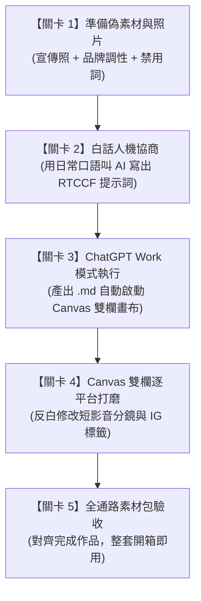

# 實戰範例 02：社群行銷素材多格式整合產出

> 🟢 **採用代理平台**：ChatGPT Agent 平台  
> 🛠️ **建議執行模式**：**Work 模式**（當 AI 儲存檔案為 `.md` 時，系統將自動開啟 **Canvas 雙欄互動畫布**，學員可針對單一平台文案或短影音腳本局部反白微調，完全不影響其他已完成的通路內容）

---

## 🏆 最終完成作品展示（實作成果搶先看）

> 📥 **完成品直接開啟與檢視**：  
> 👉 [**`秋季新品_焦糖焙香燕麥拿鐵_社群全格式素材包.md`**](./秋季新品_焦糖焙香燕麥拿鐵_社群全格式素材包.md)  
> *（這是本單元經過「白話自然語言 ➔ RTCCF 人機協商 ➔ Canvas 雙欄畫布微調」後全自動生成的跨通路社群整合行銷內容包）*

為了讓學生在開始學習前就能**清楚掌握最終完成目標**，本專案最終產出為包含 **5 大核心通路區塊** 的專業行銷企劃 Markdown 檔案：
1. **區塊一【Instagram 視覺生活感貼文】**：融入晨光陶杯畫面感、排版 Emoji 與精選生活微光 Hashtag。
2. **區塊二【Facebook 品牌故事長貼文】**：帶出 2 個月研發辛酸、65 度燕麥奶溫度堅持、換季情感共鳴與門市折扣。
3. **區塊三【官網文章主題切角與標題庫】**：吸睛型、SEO 搜尋關鍵字型、生活共鳴型各 3 組，滿足不同推播情境。
4. **區塊四【短影音 Reels/Shorts 直式分鏡腳本庫】**：15 秒快節奏痛點版 ＋ 30 秒手作與品飲說明版（秒數、運鏡、口播詞、BGM 表格化）。
5. **區塊五【主視覺封面短標題建議】**：嚴守 12 字以內之吸睛微光金句，便於製作輪播圖首圖。

---

### 📱 完成作品外觀預覽 1：【Instagram 視覺生活感貼文】
*搭配情境宣傳照片，呈現溫暖無印的生活微光感，非機器人叫賣罐頭文：*

> 早晨推開門的那一瞬間，你感覺到秋天了嗎？🍂☁️  
> 
> 這幾天風裡多了幾分涼意，最適合用雙手捧著一只溫潤陶杯，  
> 看著細緻綿密的奶泡慢慢化開，聞著慢火焙茶翻炒後的淡淡焦香。  
> 
> 今年秋天，我們把靜岡深焙煎茶原葉、香醇的 OATLY 燕麥奶，  
> 與吧檯手工慢火熬煮的微甜焦糖露融在一起。  
> 沒有牛乳的負擔，只有停留在舌尖、溫潤又溫柔的穀物茶香。  
> 
> 今天忙碌的間隙，給自己一杯咖啡的時間，  
> 讓秋天的第一口微光，溫暖你剛剛好的日常。☕️✨  
> 
> -  
> 📍 秋季限定｜焦糖焙香燕麥拿鐵（Hot / Iced）  
> 🗓 10/15（四）- 10/25（日）門市限定體驗：享新品「第二杯 79 折」  
> 
> `#日日好日咖啡 #秋季限定 #焦糖焙香燕麥拿鐵 #燕麥奶拿鐵 #植物奶生活 #靜岡焙茶 #台北咖啡廳 #生活微光`

---

### 🎬 完成作品外觀預覽 2：【短影音 Reels/Shorts 分鏡表（15s 快節奏版）】
*清楚劃分運鏡、口播與音效，剪輯師或企劃拿著就能直接開拍：*

| 秒數 | 鏡頭運鏡與畫面描述 | 旁白口播詞 (Voiceover) | 音效與文字字卡 (On-Screen Text) |
| :---: | :--- | :--- | :--- |
| **0-3s<br>(Hook)** | **【特寫俯拍】**<br>鏡頭快速推向日式陶杯，奶泡上的精緻羽毛拉花在晨光下微微晃動。 | 起風的早晨，是不是很想喝一杯熱熱的溫柔？ | **【字卡】**：秋天的第一口溫柔🍂<br>*音效：清脆的木鈴風鈴聲* |
| **3-7s** | **【特寫】**<br>木匙將深焙煎茶葉緩緩灑下，畫面切換至燕麥奶以 65 度蒸氣綿密打發。 | 靜岡深焙煎茶的炭焙香，遇上絲絨般的燕麥奶。 | **【字卡】**：靜岡煎茶原葉 × OATLY 燕麥奶<br>*音效：滋滋蒸氣聲與木匙碰撞輕響* |
| **7-11s** | **【中景】**<br>店員雙手將溫熱陶杯端給客人，客人握住陶杯露出一抹放鬆笑容。 | 沒有乳糖負擔，只有恰到好處的微甜焦糖露。 | **【字卡】**：手工蔗糖焦糖露｜低咖啡因不澀口 |
| **11-15s<br>(CTA)** | **【定格特寫】**<br>陶杯拿鐵置於木桌中央，陽光灑入，帶出店名與優惠。 | 日日好日秋季限定，10/15 起，第二杯 79 折。 | **【字卡】**：10/15 溫暖上市・第二杯 79 折<br>*音效：溫暖舒緩的鋼琴收尾音* |

---

### ✨ 完成作品核心亮點（學生學完能做到的事）
* 🎯 **跨通路受眾精準分流**：同一款新品素材，能根據 IG、FB、官網、短影音的受眾心理，產出專屬節奏的文案，告別千篇一律的無聊複製。
* 🛡️ **品牌禁用詞邊界守護**：100% 排除「全台最強」、「秒殺必喝」等廉價俗氣詞，嚴守文青微光的生活風格語氣。
* 📐 **專業分鏡工業化落地**：短影音分鏡不再是鬆散文字，而是具備秒數、運鏡、口播與字卡設計的標準工業化表格。

---

## 🎯 案例情境與核心學習價值

當品牌行銷企劃收到新產品的宣傳情境照片後，面臨最大的困境通常是：**「同一套素材，要花好幾倍的時間改編成各個不同社群平台的專屬格式」**。如果直接複製貼上，各平台的讀者一眼就會看出敷衍與罐頭感：
* **Instagram**：需要強烈生活感、畫面代入感、短文字與精選 Hashtag。
* **Facebook**：需要溫暖走心、幕後研發艱辛的故事化長文敘事。
* **官網 / 部落格**：需要符合 SEO 關鍵字與品牌形象的精確標題。
* **短影音（Reels / TikTok / Shorts）**：需要抓住前 3 秒注意力（Hook）的分鏡表、運鏡指令與旁白節奏。
* **品牌風格守護**：絕對不能踩到「全台最強」、「秒殺必喝」等廉價俗氣的行銷禁用詞。

> 💡 **本單元核心精神**：  
> 拒絕一字一句痛苦刻文案！我們將帶領學生體驗**「單一視覺素材 ➔ 白話發想 ➔ RTCCF 架構 ➔ Canvas 雙欄畫布逐通路反白打磨」**的現代化內容策劃閉環。

---

## 🧭 5 分鐘通關地圖（SOP 流程總覽）



---

## 🚀 學生手把手實戰操作手冊（5 步通關）

---

### 🟢 關卡 1：準備偽素材與宣傳照片

* 📌 **操作動作**：閱讀並複製秋季新品行銷企劃資料，並檢視宣傳照片。這是模擬台灣生活風格咖啡品牌「日日好日咖啡（Daily Roast Coffee）」的真實企劃素材。
* 📂 **對應檔案**：[`社群行銷活動偽素材.md`](./社群行銷活動偽素材.md) ｜ 📷 實體照片：[`新品上市宣傳圖.jpg`](./新品上市宣傳圖.jpg)

<details open>
<summary><b>📋 點擊展開／一鍵複製：社群行銷活動偽素材（品牌設定、新品 USP 與 Few-Shot 範本）</b></summary>

```markdown
【日日好日咖啡 秋季新品行銷活動偽素材】

一、宣傳主視覺照片描述
- 主體：特製日式手作陶杯盛裝熱拿鐵，奶泡綿密，有精緻鬱金香拉花。
- 陪襯物：淺色天然橡木桌面、一把盛裝深焙焙茶葉（Hojicha）的木匙。
- 氛圍：溫暖柔和的早晨窗光，日系極簡生活微光感。

二、品牌基本設定與調性
- 品牌名稱：日日好日咖啡（Daily Roast Coffee）
- 品牌定位：城市裡的日常微光，專注自烘精品豆與植物奶特調的質感咖啡店。
- 目標受眾：25-40 歲上班族、文青族群、乳糖不耐症者、重視生活質感的都市人。
- 品牌語氣：溫暖親切、像懂咖啡的好朋友在說話，不居高臨下、不賣弄艱深術語。
- 行銷禁用詞（嚴禁出現）：全台最強、地表最好喝、秒殺搶購、保證有效、必喝神作、打趴星巴克、超越大品牌。

三、本次新品核心資訊
- 品名：秋季限定・焦糖焙香燕麥拿鐵（Hot / Iced）
- 核心賣點：
  1. 靜岡深焙煎茶慢火翻炒，萃取炭焙茶香，低咖啡因不澀口。
  2. 搭配 OATLY 咖啡師燕麥奶，65°C 精準奶溫，乳糖不耐友善，口感如絲絨。
  3. 主廚手工熬煮蔗糖焦糖露，點綴焦香微甜，尾韻溫潤。
- 優惠活動：10/15～10/25 新品享「第二杯 79 折」；自備環保杯再折 5 元。
- 販售門市：全台 8 間直營門市同步供應。

四、歷史高成效貼文風格參考（Few-Shot 學習）
- IG 風格：短文字、生活情緒投射、排版空行乾淨、精選 6-8 個生活感 Hashtag。
- FB 風格：故事化長文敘事、研發幕後挫折、換季氣候細節、真誠對話感。
```
</details>

* 🔍 **成果檢查點**：
  * [ ] 看到宣傳照片的視覺重點（陶杯、拉花、焙茶木匙、晨光）。
  * [ ] 記住三大賣點（靜岡深焙茶香、OATLY 燕麥奶 65 度、手工焦糖露）。
  * [ ] 牢記 **嚴格禁用詞**（不可出現「全台最強」、「秒殺必喝」等）。

---

### 🟢 關卡 2：白話人機協商（叫 AI 幫你寫出專業 RTCCF 提示詞）

* 📌 **操作動作**：打開任何 AI 對話框（如 ChatGPT 免費版、GPT-4o、Claude 或 Gemini），將下方的「白話發想指令」連同「偽素材」一起貼入送出。
* 📂 **對應檔案**：[`2-1_白話自然語言發想提示詞.md`](./2-1_白話自然語言發想提示詞.md)

<details open>
<summary><b>📋 點擊展開／一鍵複製：白話發想提示詞指令</b></summary>

```text
我是「日日好日咖啡」的社群行銷企劃。我們下週要推出秋季限定新品「焦糖焙香燕麥拿鐵」，今天攝影師剛把拍攝好的宣傳情境照交給我（照片是一杯在木桌上的拉花陶杯拿鐵，旁邊放著焙茶茶葉木匙，光線很溫暖生活感）。

我現在非常頭痛，因為老闆要我在今天之內，一次把所有宣傳通路的內容全生出來，包括：
1. IG 貼文（要生活感、口語、有 Hashtag）
2. FB 貼文（要故事化、走心、帶出研發辛酸與換季情感）
3. 官網文章標題（要 3 個不同切角，好挑選）
4. 短影音 Reels/Shorts 分鏡腳本（要 15 秒快節奏版跟 30 秒完整說明版，含畫面運鏡與口播詞）
5. 社群封面圖文案（不能超過 12 個字，要吸睛）

我每次自己切換平台格式都寫得千篇一律，而且我們品牌嚴格禁止像「全台最強」、「秒殺必喝」這種誇大俗氣的詞，必須維持像好朋友說話的溫暖質感。

這是我手邊的產品與品牌偽素材：
--------------------------------------------------
[請在此處貼入關卡 1 複製的偽素材內容]
--------------------------------------------------

我想請你扮演「資深社群內容策略師兼 AI 提示詞專家」。請依據上述的素材與痛點，幫我設計一份結構嚴密、符合「RTCCF 提示詞框架」（Role 角色、Task 任務、Context 背景脈絡、Constraint 限制條件、Format 格式規範）的完整提示詞。

這份 RTCCF 提示詞是要給 ChatGPT 執行的，要求它產出結構清晰的 Markdown 檔案（檔名：秋季新品_焦糖焙香燕麥拿鐵_社群全格式素材包.md），以便我在 Canvas 雙欄畫布上針對不同平台的文案直接進行反白微調！

請直接產出該份標準 RTCCF 提示詞內容即可，不要有多餘的廢話。
```
</details>

* 🔍 **成果檢查點**：
  * [ ] AI 回應產出一份包含 `[Role]`、`[Task]`、`[Context]`、`[Constraint]`、`[Format]` 的結構化提示詞。
  * [ ] 產出的提示詞結構與本資料夾中的 [`2-2_AI產出之RTCCF行銷提示詞.md`](./2-2_AI產出之RTCCF行銷提示詞.md) 完全呼應。
* 💡 **小撇步**：課堂上若想直接實測產出，學生可直接進入關卡 3，複製現成的標準 RTCCF 提示詞！

---

### 🟢 關卡 3：ChatGPT Work 模式多格式產出（喚醒 Canvas 雙欄畫布）

* 📌 **操作動作**：
  1. 開啟 **ChatGPT** 對話視窗。
  2. 確認右上角切換至 **Work 模式**。
  3. 複製下方標準 RTCCF 行銷提示詞，直接貼入對話框發送！
* 📂 **對應檔案**：[`2-2_AI產出之RTCCF行銷提示詞.md`](./2-2_AI產出之RTCCF行銷提示詞.md)

<details open>
<summary><b>📋 點擊展開／一鍵複製：標準 RTCCF 行銷提示詞（直接貼入 ChatGPT）</b></summary>

```markdown
## Role

你是一位精通跨通路社群內容策略的「資深生活風格品牌行銷總監」與「短影音分鏡企劃師」。你擅長根據品牌調性（Brand Tone of Voice），將單一產品核心賣點無縫轉換為符合 IG、Facebook、官網及短影音（Reels / Shorts）受眾心理的多格式內容包。

## Task

請依據提供的「日日好日咖啡（Daily Roast Coffee）」秋季新品素材，一次產出全套多格式社群行銷內容包，包含：
1. Instagram 沉浸生活感貼文（繁體中文，含精選 Hashtag）
2. Facebook 故事化走心長貼文（情感共鳴、研發幕後敘事、門市優惠）
3. 官網部落格/最新消息標題 3 組（吸睛型、SEO 搜尋關鍵字型、生活共鳴型）
4. 短影音直式分鏡腳本 2 版（15 秒快節奏痛點版、30 秒手作與品飲說明版，含畫面/運鏡/口播/音效）
5. 社群封面圖文案建議（2 組，每組不超過 12 字）

## Context

品牌背景與本次新品核心：
- 品牌定位：日日好日咖啡，城市裡的日常微光，親切溫暖、略帶文青生活感。
- 目標受眾：25-40 歲上班族、乳糖不耐族群、重視生活質感的都市人。
- 宣傳主視覺：日式手作陶杯盛裝的細緻拉花拿鐵，旁附焙茶茶葉木匙與溫暖晨光。
- 新品賣點：秋季限定・焦糖焙香燕麥拿鐵（靜岡深焙煎茶原葉翻炒、OATLY 咖啡師燕麥奶、手工熬煮微甜焦糖露）。
- 優惠活動：10/15～10/25 來店享新品「第二杯 79 折」，自備環保杯再折 5 元。
- 請深度參考偽素材中的「歷史高成效貼文」，確保掌握微光走心的句構節奏。

## Constraints

1. 嚴格遵守品牌禁用詞：絕對不可出現任何誇大或粗俗字眼（如：全台最強、地表最好喝、秒殺搶購、必喝神作、打趴星巴克、超越大品牌）。
2. 拒絕機器人公版罐頭感：避免千篇一律的宣傳叫賣，各平台必須具備該通路的專屬閱讀節奏（IG 著重畫面感與情緒價值；FB 著重真實研發故事；短影音注重前 3 秒黃金鉤子 Hook）。
3. 腳本格式化：短影音分鏡必須以清楚的表格呈現（欄位包含：秒數、鏡頭畫面描述、口播/旁白文案、背景音效/BGM 建議）。

## Format

請直接將產出內容儲存為 Markdown 檔案（檔名：`秋季新品_焦糖焙香燕麥拿鐵_社群全格式素材包.md`），以啟動雙欄畫布（Canvas），方便進行逐通路內容微調。
檔案內容排版請依序分為五大區塊：
- 區塊一：【Instagram 視覺生活感貼文】
- 區塊二：【Facebook 品牌故事長貼文】
- 區塊三：【官網文章主題切角與標題庫】
- 區塊四：【短影音 Reels/Shorts 分鏡腳本庫（15s / 30s）】
- 區塊五：【主視覺封面短標題建議】
```
</details>

* 🔍 **成果檢查點（關鍵體驗！）**：
  * [ ] ChatGPT 執行後，畫面**右側是否自動滑出 Canvas 雙欄畫布**？
  * [ ] 畫布頂部是否顯示檔名 `秋季新品_焦糖焙香燕麥拿鐵_社群全格式素材包.md`？
  * [ ] 內容是否整齊分為 5 大區塊，且完全避開了「全台最強」等禁用詞？

---

### 🟢 關卡 4：Canvas 畫布實戰打磨（體驗逐平台局部修訂）

* 📌 **操作動作**：在右側展開的 Canvas 畫布中進行**「逐平台反白圈選微調」**。

```text
               【Canvas 雙欄畫布微調示範】
 ┌───────────────────────────┬──────────────────────────────────────────┐
 │ 左側：對話視窗            │ 右側：Canvas 互動編輯畫布                │
 │                           │                                          │
 │ 💬 輸入微調指令：         │ 🎬 區塊四：短影音分鏡腳本庫              │
 │ 「將 15 秒短影音的前 3 秒 │ | 秒數 | 運鏡畫面 | 口播詞 | 字卡 |      │
 │  畫面改成由咖啡師雙手捧著 │ |------|----------|--------|------|      │
 │  溫熱陶杯的特寫，口播詞改 │ | 0-3s |【反白】  |【圈選】| ...  |      │
 │  成『秋天的第一口溫柔』。」│ | 3-7s | 特寫...  | ...    | ...  |      │
 │                           │                                          │
 └───────────────────────────┴──────────────────────────────────────────┘
```

#### 體驗練習 A：微調短影音 15 秒開頭黃金 3 秒（Hook）
1. 在右側畫布中找到「短影音分鏡表（15 秒版）」。
2. 用滑鼠**反白圈選**前 3 秒的「運鏡畫面與口播詞」列。
3. 在跳出的浮動文字框中輸入：
   ```text
   將前 3 秒畫面改成由咖啡師雙手捧著溫熱陶杯的特寫，杯口有熱氣白煙，口播詞改成「秋天的第一口溫柔，你嚐過了嗎？」，秒數保持 3 秒。
   ```
4. **觀察**：畫布只替換該儲存格，其他 IG、FB 文案完全不受影響！

#### 體驗練習 B：替換 Instagram Hashtag 標籤
1. 在右側畫布中找到「區塊一：Instagram 貼文」結尾的 `#標籤`。
2. 用滑鼠**反白圈選**所有 Hashtag。
3. 輸入微調指令：
   ```text
   請加入 3 個針對「上班族外帶情境」與「乳糖不耐友善」的專屬 Hashtag。
   ```
4. **成果**：AI 即時為你補上 `#上班族日常小確幸`、`#乳糖不耐友善拿鐵` 等實戰標籤！

---

### 🟢 關卡 5：全通路素材包驗收（對齊完成作品）

* 📌 **操作動作**：在 Canvas 畫布微調完成後，點擊畫布右上角的「複製」或「下載 Markdown 檔案」，完成整套素材落地！
* 🔍 **最終驗收檢查點**：
  * [ ] 產出的 5 大區塊文案是否兼顧了「生活感」、「研發故事」與「短影音畫面指示」？
  * [ ] 檢視內容是否有踩到誇大禁用詞？
  * [ ] 與本資料夾頂部的 🏆 [**`秋季新品_焦糖焙香燕麥拿鐵_社群全格式素材包.md`**](./秋季新品_焦糖焙香燕麥拿鐵_社群全格式素材包.md) 進行比對驗收，恭喜你成功掌握 AI 社群行銷多通路自動化工作流！

---

## 📂 完整教學模組與素材工具包清單

本資料夾內已備妥完整教學檔案，學生可依序對照使用：

| 檔案名稱 | 類型 | 說明 |
| :--- | :---: | :--- |
| 🏆 [**`秋季新品_焦糖焙香燕麥拿鐵_社群全格式素材包.md`**](./秋季新品_焦糖焙香燕麥拿鐵_社群全格式素材包.md) | **完成作品** | **最終成果檔**：包含 IG、FB、官網標題、短影音 15s/30s 分鏡表與封面短標之完整素材包。 |
| [`社群行銷活動偽素材.md`](./社群行銷活動偽素材.md) | 偽素材 | 「日日好日咖啡」秋季限定新品之完整品牌調性、核心 USP、宣傳照片描述與高成效範本。 |
| 📷 [`新品上市宣傳圖.jpg`](./新品上市宣傳圖.jpg) | 實體素材 | 供行銷企劃演練的真實情境宣傳照片（手作陶杯拿鐵、木匙焙茶葉、溫暖晨光）。 |
| [`2-1_白話自然語言發想提示詞.md`](./2-1_白話自然語言發想提示詞.md) | 提示詞 (輸入) | 學生關卡 2 使用的白話指令，請 AI 將素材轉化為 RTCCF 框架。 |
| [`2-2_AI產出之RTCCF行銷提示詞.md`](./2-2_AI產出之RTCCF行銷提示詞.md) | 提示詞 (成果) | AI 協商產出的標準 RTCCF 多格式產出提示詞，可於關卡 3 直接執行。 |

---

## 💡 教師引導要點與進階關鍵心法

### 1. Few-Shot 範例學習的威力（小樣本提味）
在 [`社群行銷活動偽素材.md`](./社群行銷活動偽素材.md) 中，我們提供了 2 篇過去最受歡迎的歷史貼文。**給 AI 2 篇範例，勝過寫 200 字形容詞！** AI 會自動分析範例中的斷句節奏、語氣溫度與空行習慣，產出的貼文自然就具備「品牌原生感」，徹底擺脫機器人語氣。

### 2. 品牌禁用詞的邊界守護（Constraint 的重要性）
初學者常以為只要說「寫得溫暖一點」即可，但 AI 往往還是會不自覺蹦出「限時秒殺」、「最好喝的咖啡」。在 RTCCF 提示詞中明確寫出 `Constraint: 嚴禁使用全台最強、地表最好喝、打趴星巴克`，是企業行銷能安心使用 AI 生成內容的關鍵防火牆。

### 3. Canvas 雙欄畫布的「逐平台局部修改」降維打擊
行銷主管退件時，通常只會說「IG 文案很好，但短影音秒數太長」。如果用傳統對話框，重新生成時往往連滿意的 IG 文案也被隨機洗掉。**Canvas 讓文案像 Google Docs 一樣支援儲存格局部編輯**，只反白需要改的短影音，其他內容穩如泰山！

---

[← 返回實戰範例庫總覽](../README.md) ｜ [前往實戰範例 01：門市人力排班與規則檢核](../01_門市人力排班與規則檢核/README.md) ｜ [前往實戰範例 03：跨平台成效數據交叉分析](../03_跨平台成效數據交叉分析/README.md)
