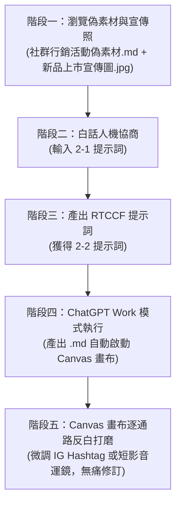

# 實戰範例 02：社群行銷素材多格式整合產出

> 🟢 **採用代理平台**：ChatGPT Agent 平台  
> 🛠️ **建議執行模式**：**Work 模式**（產出儲存為 `.md` 檔案時，畫面右側自動啟動 **Canvas 雙欄互動畫布**，讓學員可針對單一平台文案或腳本反白微調，完全不影響其他已完成內容）

---

## 🎯 案例情境與教學目標

當品牌行銷企劃收到新產品的宣傳情境照片後，面臨最大的困境通常是：**「同一套素材，要花好幾倍的時間改編成各個不同社群平台的專屬格式」**。
如果直接複製貼上，各平台的讀者一眼就會看出敷衍與罐頭感：
* **Instagram**：需要強烈生活感、畫面代入感、短文字與精選 Hashtag。
* **Facebook**：需要溫暖走心、幕後研發艱辛的故事化長文敘事。
* **官網 / 部落格**：需要符合 SEO 關鍵字與品牌形象的精確標題。
* **短影音（Reels / TikTok / Shorts）**：需要抓住前 3 秒注意力（Hook）的分鏡表、運鏡指令與旁白節奏。
* **品牌風格守護**：絕對不能踩到「全台最強」、「秒殺必喝」等廉價俗氣的行銷禁用詞。

本單元的**核心教學目標**，是帶領學生掌握**「單一素材 ➔ 多通路內容包」**的標準人機協商工作流：
1. **素材輸入**：提供真實感十足的產品宣傳照、品牌調性、禁用詞與 2 篇過去最受歡迎的貼文風格範例（Few-Shot Learning）。
2. **人機協商**：學生使用**「白話發想指令」**請 AI 架構出專業的 **RTCCF 提示詞**。
3. **Canvas 局部打磨**：在 ChatGPT 中執行後，在右側 Canvas 畫布上進行「逐通路局部反白微調」（例如單獨調整短影音腳本的秒數，而 FB 文案不受干擾）。

---

## 📂 教學模組與素材清單

本資料夾內已備妥完整教學檔案，學生可依序使用：

| 檔案名稱 | 類型 | 說明 |
| :--- | :--- | :--- |
| [`社群行銷活動偽素材.md`](./社群行銷活動偽素材.md) | 偽素材 | 「日日好日咖啡」秋季限定新品（焙香燕麥拿鐵）之完整品牌設定、核心賣點、**實體照片**與高成效範本。 |
| [`新品上市宣傳圖.jpg`](./新品上市宣傳圖.jpg) | 實體素材 | 供行銷企劃演練的真實情境宣傳照片（手作陶杯拿鐵、木匙焙茶、溫暖晨光）。 |
| [`2-1_白話自然語言發想提示詞.txt`](./2-1_白話自然語言發想提示詞.txt) | 提示詞 (輸入) | 學生第一步發送給 AI 的白話指令，請 AI 將零散行銷素材轉化為 RTCCF 框架。 |
| [`2-2_AI產出之RTCCF行銷提示詞.txt`](./2-2_AI產出之RTCCF行銷提示詞.txt) | 提示詞 (成果) | AI 協商產出的標準 RTCCF 多格式產出提示詞，可直接於 ChatGPT 執行。 |

---

## 🚀 完整四階段教學工作流（Step-by-Step）

### 階段一：準備偽素材與宣傳照片
打開 [`社群行銷活動偽素材.md`](./社群行銷活動偽素材.md)：
* **視覺照片**：內嵌 [`新品上市宣傳圖.jpg`](./新品上市宣傳圖.jpg)，呈現精緻的手作陶杯拉花與焙茶茶葉。
* **品牌定位**：日日好日咖啡，親切溫暖生活微光感。
* **新品賣點**：焦糖焙香燕麥拿鐵（靜岡深焙煎茶、OATLY 燕麥奶、手工蔗糖露）。
* **風格借鏡**：提供 2 篇過去點讚轉發最高的歷史貼文，供 AI 模仿敘事語調。

---

### 階段二：白話人機協商（自然語言 ➔ RTCCF）
請學生在任何 AI 對話框輸入 [`2-1_白話自然語言發想提示詞.txt`](./2-1_白話自然語言發想提示詞.txt) 的內容，並附上偽素材。

> **學生輸入的白話範例：**
> *「我是咖啡店行銷企劃，我們下週要推秋季新品焙香燕麥拿鐵，照片跟賣點都在這裡（附上偽素材）。老闆要我今天內產出 IG、FB、官網文章標題、15秒與30秒短影音腳本。我們品牌不能用『全台最強』這種俗氣詞，要有生活質感。請扮演 AI 提示詞專家，幫我用 RTCCF 框架設計一份專業多格式產出提示詞，並指定儲存為 Markdown 檔案，方便我在 Canvas 畫布微調。」*

---

### 階段三：獲取專業 RTCCF 行銷提示詞
AI 將會迅速提煉出高階結構化提示詞（如 [`2-2_AI產出之RTCCF行銷提示詞.txt`](./2-2_AI產出之RTCCF行銷提示詞.txt)）：
* **[Role]**：生活風格品牌行銷總監兼短影音分鏡企劃師。
* **[Task]**：一次產出 IG 貼文、FB 故事文、官網 3 組標題、15s/30s 短影音分鏡表、封面圖文案。
* **[Context]**：日日好日咖啡品牌調性、宣傳照片視覺元素、新品賣點與折扣活動。
* **[Constraint]**：嚴格避開禁用詞、拒絕機器人罐頭感、短影音分鏡表格化（秒數/畫面/口播/BGM）。
* **[Format]**：儲存為 `秋季新品_焦糖焙香燕麥拿鐵_社群全格式素材包.md`，啟動 Canvas 雙欄畫布。

---

### 階段四：在 ChatGPT Work 模式執行產出
1. 開啟 ChatGPT，切換至 **Work 模式**。
2. 貼入步驟三產出的 RTCCF 提示詞並執行。
3. **體驗亮點**：
   * AI 將會一次產出高質感的 5 大區塊行銷內容包。
   * 右側視窗將會**自動彈出 Canvas 雙欄互動畫布**！

---

### 階段五：Canvas 畫布實戰打磨（教學核心體驗）

當右側 Canvas 畫布展開後，老師可引導學生體驗**「逐平台局部修改」**的神奇之處：

1. **情境 A：微調短影音 15 秒開頭秒數**：
   * 在右側畫布中，找到「短影音分鏡表」。
   * 滑鼠反白前 3 秒的畫面：「鏡頭俯拍木匙茶葉」。
   * 在浮動指令框輸入：*「改成由咖啡師雙手捧著溫熱陶杯的特寫，口播詞改成『秋天的第一口溫柔』，秒數縮短為 2 秒。」*
   * ChatGPT 會**直接在畫布上的表格替換該列**，其他 IG、FB 文案完全不動！
2. **情境 B：替換 IG Hashtag 標籤**：
   * 反白 IG 貼文下方的 6 個 Hashtag。
   * 輸入：*「加入針對乳糖不耐症、上班族外帶情境的 3 個標籤。」*
   * 畫布直接即時更新。

---

[← 返回實戰範例庫總覽](../README.md) ｜ [前往範例 01：門市排班檢核](../01_門市人力排班與規則檢核/README.md)
