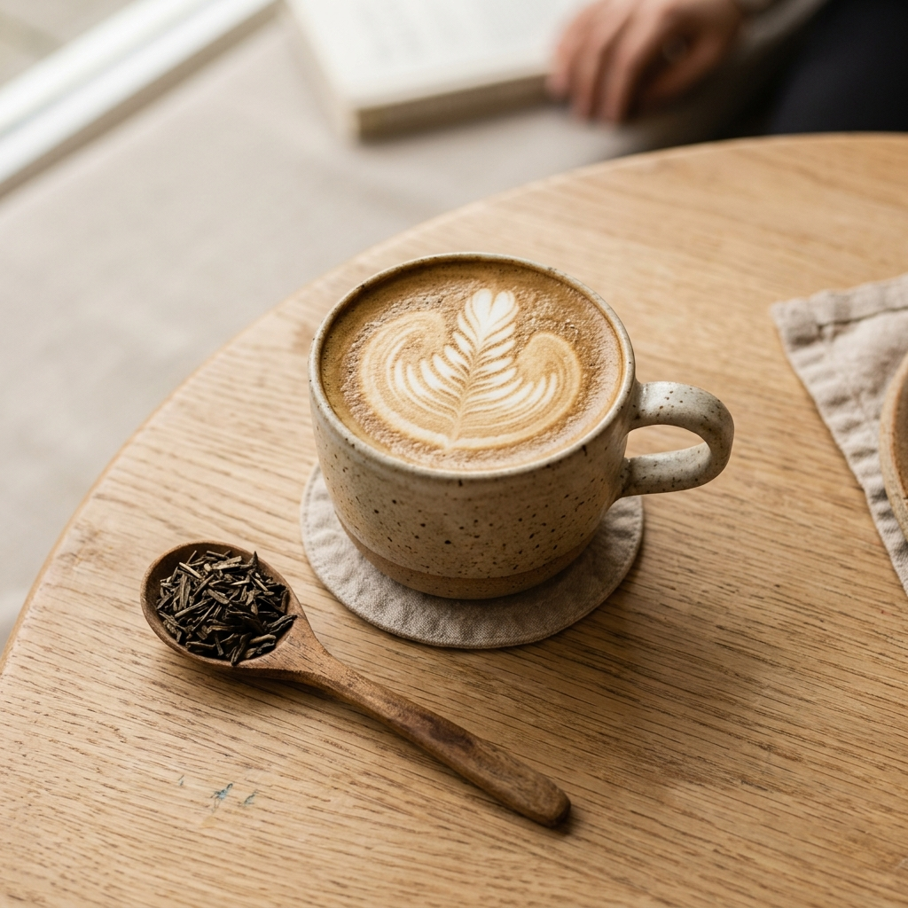

# 📸 社群行銷活動偽素材（新品上市：秋季焙香燕麥拿鐵）

> 本素材專為教學設計，模擬台灣獨立連鎖咖啡品牌「日日好日咖啡（Daily Roast Coffee）」秋季新品上市的真實企劃情境。學生可直接複製下方資料、參考實體照片，貼入 AI 對話框進行人機協商演練。

---

## 📷 本次活動實體拍攝素材（宣傳照片）



* **照片畫面描述**：
  * 主體：特製日式手作陶杯中盛裝著帶有細緻拉花（鬱金香羽毛）的熱拿鐵，奶泡醇厚。
  * 陪襯物：淺色天然橡木咖啡桌旁，置放一把木匙，盛裝著散發焦香的深焙焙茶原葉（Hojicha）。
  * 氛圍：柔和乾淨的早晨窗光，溫暖極簡無印風格。

---

## 品牌基本設定與調性（Brand Identity）

* **品牌名稱**：日日好日咖啡（Daily Roast Coffee）
* **品牌定位**：城市裡的日常微光，專注自烘精品豆與植物奶特調的質感咖啡店。
* **目標受眾 (TA)**：25～40 歲上班族、文青族群、乳糖不耐症者、追求生活儀式感的都市人。
* **品牌語氣 (Tone of Voice)**：
  * 溫暖親切、帶點生活微光感。
  * 像懂咖啡的好朋友在說話，不說艱深術語，不居高臨下。
* **行銷禁用詞清單（嚴格禁止出現）**：
  * ❌ 浮誇吸睛詞：`全台最強`、`地表最好喝`、`秒殺搶購`、`保證有效`、`必喝神作`
  * ❌ 競品與商業對立詞：`打趴星巴克`、`超越大品牌`、`廉價咖啡`

---

## 本次上市活動核心資訊（Product & Campaign）

* **新品品名**：**秋季限定・焦糖焙香燕麥拿鐵**（Hot / Iced）
* **核心賣點 (USP)**：
  1. **茶香與奶香的平衡**：嚴選靜岡深焙煎茶葉慢火翻炒，萃取出濃郁焙火茶香，低咖啡因不澀口。
  2. **雙重穀物香**：搭配 OATLY 咖啡師燕麥奶，乳糖不耐友善，綿密口感宛如絲絨。
  3. **微甜手工焦糖露**：主廚手工熬煮蔗糖，點綴淡淡炭焙焦香，尾韻甘甜溫潤。
* **定價與早鳥活動**：
  * 定價：M 杯 NT$140 / L 杯 NT$160
  * 早鳥體驗：**10/15（週四）～ 10/25（週日）**，來店點購限定新品享**「第二杯 79 折」**；出示環保杯再折 5 元。
* **販售門市**：全台 8 間直營門市同步供應。

---

## 歷史高成效貼文參考（Few-Shot 範例學習）

*請讓 AI 學習以下過往點讚與轉發最高的貼文風格與排版結構：*

### 【參考範例 A：IG 爆款微光生活感貼文】
```text
下過雨的週二午後，你需要一杯熱熱的溫柔。☕️🌧️

常常有客人推開門問我們：「今天有沒有不太甜、喝起來很暖的咖啡？」
有的。深焙豆滴落的堅果香氣，遇上打發得綿綿的燕麥奶，握在手心裡剛剛好的溫度。

給今天也很努力的你，給自己 10 分鐘的喘息時間吧。

🔖 今日特調：堅果燕麥歐蕾
#日日好日咖啡 #台北咖啡廳 #燕麥奶咖啡 #生活微光 #外帶咖啡 #日常片刻
```

### 【參考範例 B：FB 故事化走心長文】
```text
【有些溫暖，是慢慢熬出來的】

這幾天早晚出門，吹在臉上的風開始有了涼意。
每到換季，吧檯團隊總是在試飲區圍成一圈，反覆調整烘焙秒數與奶溫。

「茶感再重一點，入口時的香氣才會停在舌尖。」
「燕麥奶的打發溫度不能超過 65 度，才能保留最純粹的穀物甜感。」

我們花了整整兩個月，在 20 種茶葉與穀物奶之間尋找平衡。我們不追求驚天動地的震撼，只希望在你走進店裡、雙手握住陶杯的那一秒，能由衷感到：「啊，秋天真的來了。」

這週四，邀請你帶上最想分享溫暖的那個人，一起來嚐嚐這份秋天的第一道香氣。

📍 10/15 起全門市溫暖上市。
```
